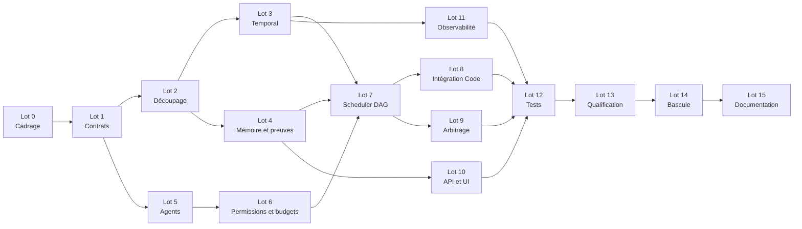

# Plan de bascule vers l'architecture multi-agent hiérarchique

> Plan d'exécution pour faire évoluer le pipeline IA déterministe actuel vers l'architecture décrite dans
> [`docs/cible-architecture-multi-agent-hierarchique.md`](docs/cible-architecture-multi-agent-hierarchique.md).
>
> Cible technologique recommandée : Spring Boot et Java pour le control plane, Temporal Java SDK pour le
> workflow durable, Spring AI/LiteLLM pour l'exécution des agents, MCP pour les capacités techniques gouvernées,
> PostgreSQL pour les projections métier et Evidence MCP pour les artefacts vérifiables.

## 1. Résultat attendu

À l'issue de la bascule :

- un `WorkflowCoordinator` durable possède le cycle de vie global et reste le seul acteur autorisé à déclencher
  des opérations à effet ;
- un `SupervisorAgent` décompose les demandes éligibles en un DAG de délégations typées et bornées ;
- les périmètres Architecture, Code, Tests et Sécurité disposent d'agents et sous-agents spécialisés ;
- l'`IndependentReviewerAgent` est lancé directement par le workflow racine et reste indépendant du Supervisor ;
- chaque délégation possède un scope, un budget, des dépendances, un contrat de sortie, des critères de succès et
  des preuves attendues ;
- les agents échangent par la mémoire de tâche et des artefacts versionnés, jamais par conversation libre faisant
  autorité ;
- les travaux Code parallèles utilisent des worktrees isolés et ne sont autorisés que sur des scopes disjoints ;
- les tests, analyses qualité, scans sécurité, décisions de politique et livraison restent déterministes ;
- le pipeline actuel demeure disponible comme baseline et chemin de rollback jusqu'à qualification complète.

### Indicateurs de succès

- [ ] `100 %` des délégations possèdent `task_id`, `run_id`, `delegation_id`, `parent_run_id`, `source_commit`, rôle, scope et budget.
- [ ] `100 %` des sorties d'agents sont validées par un JSON Schema ou par un format d'artefact strict avant utilisation.
- [ ] `0` action à effet n'est accessible à un agent LLM, y compris Supervisor et Independent Reviewer.
- [ ] `0` agent Code parallèle ne partage un worktree mutable avec un autre agent.
- [ ] `100 %` des décisions finales référencent les preuves et digests ayant servi à la décision.
- [ ] `100 %` des approbations humaines portent sur le patch consolidé et son manifeste final.
- [ ] Une reprise après redémarrage conserve le DAG, les délégations, les attentes humaines et les résultats terminaux.
- [ ] Une annulation de tâche se propage à toutes les délégations et exécutions sandbox actives.
- [ ] Le mode hiérarchique respecte les seuils A/B de qualité, sécurité, coût et latence définis avant son activation.
- [ ] Le retour au pipeline déterministe ne contourne aucun gate et ne perd aucune preuve.

## 2. Fondations déjà disponibles

- [x] Pipeline ticket vers plan, patch, tests, qualité, sécurité, revue, approbation et draft PR.
- [x] Rôles Planner, Developer, Patch Repair, Tester et Reviewer exécutés via LiteLLM.
- [x] Boucle d'outils agentique bornée en tours, délai, tokens, coût, fan-out et appels répétés.
- [x] Serveur `repository-context-mcp` et outils de lecture bornés.
- [x] Serveur `sandbox-execution-mcp` et profils immuables de validation, tests, qualité et sécurité.
- [x] Serveurs `assurance-mcp`, `scm-delivery-mcp` et `evidence-mcp`.
- [x] Matrice de permissions deny-by-default et effets réservés au rôle `workflow`.
- [x] Kill switch global, par serveur, outil et rôle.
- [x] Approbation humaine obligatoire avant livraison SCM.
- [x] Campagne A/B de référence et activation agentique fail-closed après verdict `REJECTED`.

## 3. Principes non négociables

- [ ] Conserver les gates déterministes hors du contrôle des modèles.
- [ ] Interdire au Supervisor de s'attribuer des outils, rôles, budgets ou scopes supplémentaires.
- [ ] Interdire les appels directs Agent vers Docker, GKE, Gitea, SonarQube, registres, stockage ou secrets.
- [ ] Conserver `workflow` comme seule identité autorisée pour `sandbox.*`, `assurance.*`, stockage de preuve et `scm.*` à effet.
- [ ] Traiter ticket, dépôt, résultats MCP, sorties d'agents et preuves brutes comme des données non fiables.
- [ ] Échouer fermé sur contrat invalide, preuve absente, digest divergent, rôle inconnu ou gate indéterminé.
- [ ] Séparer les faits vérifiés, les décisions déterministes et les opinions produites par les modèles.
- [ ] Conserver l'Independent Reviewer en dehors de la chaîne d'autorité du Supervisor.
- [ ] N'activer le multi-agent que lorsqu'il apporte de la valeur ; conserver un chemin court pour les tâches simples.
- [ ] Ne supprimer le pipeline actuel qu'après qualification, canary, rollback testé et période d'observation réussie.

## 4. Lot 0 — Cadrage, décisions et baseline

### Décisions d'architecture

- [x] **MAH-001** — Rédiger l'ADR actant Spring Boot comme control plane et Temporal comme moteur de workflow durable. _(ADR : `docs/adr/ADR-MAH-001-workflow-coordinator-temporal.md`.)_
- [x] **MAH-002** — Décider du mode Temporal local : serveur de développement dans Compose ou environnement partagé dédié. _(Décision : Compose avec PostgreSQL dédié ; ADR `docs/adr/ADR-MAH-002-temporal-local-compose.md`.)_
- [x] **MAH-003** — Décider de la topologie cible Temporal : Cloud, self-managed ou service interne opéré par la plateforme. _(Décision : Temporal Cloud par défaut, GKE pour le profil souverain ; ADR `docs/adr/ADR-MAH-003-temporal-target-topology.md`.)_
- [x] **MAH-004** — Définir la frontière entre état Temporal, projection métier PostgreSQL et artefacts Evidence MCP. _(ADR : `docs/adr/ADR-MAH-004-state-and-evidence-ownership.md`.)_
- [x] **MAH-005** — Définir les modes `PIPELINE`, `HIERARCHICAL_SHADOW`, `HIERARCHICAL_CANARY` et `HIERARCHICAL_ACTIVE`. _(ADR : `docs/adr/ADR-MAH-005-execution-modes.md`.)_
- [x] **MAH-006** — Définir le catalogue officiel des agents, sous-agents, propriétaires et niveaux d'autonomie. _(Catalogue : `resources/agents/catalog-v1.yaml` ; documentation : `docs/agents/CATALOGUE-AGENTS-V1.md`.)_
- [x] **MAH-007** — Décider si Planner devient `SupervisorAgent`, `ArchitectureAgent`, ou reste un rôle de compatibilité. _(Décision : Planner reste réservé au mode `PIPELINE` ; ADR `docs/adr/ADR-MAH-007-planner-role-transition.md`.)_
- [x] **MAH-008** — Définir la règle de routage entre chemin court mono-agent et chemin hiérarchique multi-agent. _(ADR : `docs/adr/ADR-MAH-008-routing-short-or-hierarchical.md` ; politique : `resources/multiagents/policies/routing-policy-v1.yaml`.)_
- [x] **MAH-009** — Définir les classes de risque autorisées par mode et les cas imposant une décision humaine préalable. _(ADR : `docs/adr/ADR-MAH-009-risk-and-human-gates.md` ; politique : `resources/multiagents/policies/risk-policy-v1.yaml`.)_
- [ ] **MAH-010** — Faire valider architecture, permissions, données et modèle de menace par les responsables produit et sécurité.

### Baseline et critères de passage

- [x] **MAH-011** — Figer une version reproductible du pipeline actuel, des prompts, modèles, images et politiques. _(Manifeste : `resources/multiagents/baselines/pipeline-v1.yaml` ; vérification : `scripts/verify-pipeline-baseline.rb`.)_
- [x] **MAH-012** — Rejouer la suite de référence et enregistrer qualité, tests, réparations, tokens, coût, durée et incidents. _(Campagne appariée du 2026-09-02 : `docs/mcp/MCP-180-rapport-campagne-20260902.md` ; agrégat : `resources/multiagents/baselines/pipeline-v1-metrics.json`.)_
- [x] **MAH-013** — Corriger ou documenter toute métrique de coût fournisseur absente avant une nouvelle comparaison. _(Écart et règle fail-closed : `docs/multiagents/COST-TELEMETRY-V1.md` ; politique : `resources/multiagents/policies/evaluation-data-policy-v1.yaml`.)_
- [x] **MAH-014** — Définir les seuils bloquants par métrique et le nombre minimal de cas appariés. _(Politique : `resources/multiagents/policies/qualification-thresholds-v1.yaml` ; synthèse : `docs/multiagents/QUALIFICATION-THRESHOLDS-V1.md`.)_
- [x] **MAH-015** — Ajouter des cas multi-domaines qui justifient réellement Architecture, Code, Tests et Sécurité. _(12 cas sur Maven, Gradle et npm : `resources/multiagents/evaluations/multi-domain-cases-v1.json`.)_
- [x] **MAH-016** — Ajouter des cas simples devant obligatoirement emprunter le chemin court. _(8 cas R0/R1 mono-module : `resources/multiagents/evaluations/short-path-cases-v1.json`.)_
- [x] **MAH-017** — Ajouter des cas adversariaux : injection, délégation excessive, conflit de scopes et preuve falsifiée. _(8 cas négatifs : `resources/multiagents/evaluations/adversarial-cases-v1.json`.)_
- [x] **MAH-018** — Définir la procédure de rollback et les conditions imposant une désactivation immédiate. _(Runbook : `docs/runbooks/ROLLBACK-MULTI-AGENTS.md` ; politique : `resources/multiagents/policies/rollback-policy-v1.yaml`.)_

### Gate du lot 0

- [ ] ADR approuvés, baseline reproductible, seuils A/B mesurables et responsabilités explicites.

## 5. Lot 1 — Contrats de délégation et de résultat

### Contrats communs

- [x] **MAH-020** — Créer `delegation-plan-v1.schema.json` pour le DAG proposé par le Supervisor. _(`resources/multiagents/schemas/delegation-plan-v1.schema.json`.)_
- [x] **MAH-021** — Créer `specialist-task-v1.schema.json` pour la mission remise à un agent ou sous-agent. _(`resources/multiagents/schemas/specialist-task-v1.schema.json`.)_
- [x] **MAH-022** — Créer `specialist-result-v1.schema.json` pour le résultat commun et ses références de preuves. _(`resources/multiagents/schemas/specialist-result-v1.schema.json`.)_
- [x] **MAH-023** — Créer `agent-run-event-v1.schema.json` pour les transitions, consommations et raisons d'arrêt. _(`resources/multiagents/schemas/agent-run-event-v1.schema.json`.)_
- [x] **MAH-024** — Créer `contradiction-v1.schema.json` pour les conclusions incompatibles et leur arbitrage. _(`resources/multiagents/schemas/contradiction-v1.schema.json`.)_
- [x] **MAH-025** — Créer `supervisor-decision-v1.schema.json` pour consolidation, replanification ou escalade. _(`resources/multiagents/schemas/supervisor-decision-v1.schema.json`.)_
- [x] **MAH-026** — Créer `human-decision-request-v1.schema.json` pour une question matérialisant plusieurs choix à impact. _(`resources/multiagents/schemas/human-decision-request-v1.schema.json`.)_

### Contrats par périmètre

- [x] **MAH-027** — Créer `architecture-assessment-v1.schema.json`. _(`resources/multiagents/schemas/architecture-assessment-v1.schema.json`.)_
- [x] **MAH-028** — Créer `code-task-v1.schema.json` et y borner les fichiers ou modules autorisés. _(`resources/multiagents/schemas/code-task-v1.schema.json`.)_
- [x] **MAH-029** — Créer `patch-proposal-v1.schema.json` avec commit source, digest, fichiers touchés et artefact de diff. _(`resources/multiagents/schemas/patch-proposal-v1.schema.json`.)_
- [x] **MAH-030** — Créer `integration-result-v1.schema.json` avec ordre d'application et conflits détectés. _(`resources/multiagents/schemas/integration-result-v1.schema.json`.)_
- [x] **MAH-031** — Créer `test-strategy-v1.schema.json` et `test-assessment-v1.schema.json`. _(`resources/multiagents/schemas/test-strategy-v1.schema.json` et `test-assessment-v1.schema.json`.)_
- [x] **MAH-032** — Créer `security-assessment-v1.schema.json` et réutiliser les findings normalisés existants. _(`resources/multiagents/schemas/security-assessment-v1.schema.json`, référence `vulnerability-result-v1`.)_
- [x] **MAH-033** — Versionner le contrat de sortie de l'Independent Reviewer et y référencer le manifeste final. _(`resources/multiagents/schemas/independent-review-v1.schema.json`.)_

### Validation et compatibilité

- [x] **MAH-034** — Ajouter tous les contrats au catalogue MCP et au mécanisme de validation côté hôte. _(Catalogue `resources/multiagents/schemas/contract-catalog-v1.json` et `MultiAgentContractValidator`.)_
- [x] **MAH-035** — Refuser les champs supplémentaires, identifiants absents, rôles inconnus et références hors tâche. _(`MultiAgentContractValidator` lie chaque document au contexte tâche/tentative et à ses références autorisées.)_
- [x] **MAH-036** — Valider que les dépendances forment un DAG sans cycle, nœud orphelin ou référence inconnue. _(`DelegationPlanValidator` et tests de cycle, orphelin, auto-référence et doublon.)_
- [x] **MAH-037** — Vérifier que chaque délégation dispose de critères de succès et d'une condition d'arrêt exécutable. _(`DelegationPlanValidator` impose critères non vides et conditions d'arrêt allow-listées.)_
- [x] **MAH-038** — Définir la politique de compatibilité N/N-1 et les migrations additives des schémas. _(Politique : `resources/multiagents/policies/contract-compatibility-policy-v1.yaml`.)_
- [x] **MAH-039** — Ajouter fixtures golden, tests négatifs, fuzzing et limites de taille pour chaque contrat. _(15 fixtures dans `resources/multiagents/fixtures/golden-contracts-v1.json` et couverture exhaustive dans `MultiAgentContractValidatorTest`.)_

### Gate du lot 1

- [x] Tous les échanges inter-agents sont représentables par des contrats fermés, versionnés et testés. _(Preuves : `docs/multiagents/GATE-LOT-1-CONTRATS.md`.)_

## 6. Lot 2 — Découpage du monolithe d'orchestration

### Ports et composants

- [x] **MAH-040** — Introduire un port `WorkflowCoordinator` indépendant de Temporal. _(`apps/orchestrator/.../workflow/WorkflowCoordinator.java`, sans type Temporal.)_
- [x] **MAH-041** — Extraire le pipeline actuel de `TaskService` dans `DeterministicWorkflowCoordinator`. _(Le coordinateur implémente le port et possède désormais l'exécution asynchrone complète.)_
- [x] **MAH-042** — Réduire `TaskService` à la création, consultation et commande des tâches. _(Boundary test : aucune dépendance sandbox, assurance, SCM ou outils d'agents.)_
- [x] **MAH-043** — Introduire `AgentRuntime` pour exécuter un rôle avec prompt, contrat, outils et budget explicites. _(Entrée immutable, outils filtrés par l'hôte et sortie validée par contrat.)_
- [x] **MAH-044** — Introduire `AgentCatalog` pour charger les manifestes de rôles versionnés. _(Catalogue YAML embarqué, parsing sûr et références parent/enfant validées.)_
- [x] **MAH-045** — Introduire `DelegationValidator` pour rôle, scope, budget, dépendances et profondeur. _(Validation hôte du catalogue, hiérarchie, scopes, DAG, profondeur, fan-out et budgets cumulés.)_
- [x] **MAH-046** — Introduire `PatchIntegrator` comme service déterministe distinct des agents. _(Normalisation, validation et application contrôlée d'un artefact immuable vérifié par digest.)_
- [x] **MAH-047** — Introduire `TaskMemory` comme port, sans coupler les agents au stockage choisi. _(Port de persistance neutre et adaptateur local concurrent remplaçable.)_
- [x] **MAH-048** — Introduire un port `EvidenceRepository` devant le client Evidence MCP. _(API typée indépendante de MCP pour dépôt, manifeste, résumé et lecture auditée.)_
- [x] **MAH-049** — Préserver les API REST existantes pendant le refactoring. _(Test de compatibilité des routes, statuts HTTP et champs JSON documentés en architecture 02.)_

### Séparation des effets

- [x] **MAH-050** — Inventorier tous les appels à effet encore présents dans l'orchestrateur. _(Inventaire des déclencheurs, ports, adaptateurs et frontières cibles documenté.)_
- [x] **MAH-051** — Vérifier que seul le coordinateur appelle validation/application, tests, scans, assurance et SCM. _(Test d'architecture sur les propriétaires des appels à effet ; patch borné par `PatchIntegrator`.)_
- [x] **MAH-052** — Interdire à `AgentRuntime` d'injecter un client sandbox, assurance ou SCM dans une boucle LLM. _(Refus explicite des outils à effet et test de frontière sur les dépendances injectées.)_
- [x] **MAH-053** — Ajouter un test d'architecture interdisant une dépendance Agent vers un adaptateur à effet. _(Règle automatique couvrant toutes les classes Agent présentes et futures du package service.)_
- [x] **MAH-054** — Maintenir la compatibilité du pipeline et comparer ses sorties avant/après extraction. _(Contrat de sortie figé sur v1.1.0-mcp et test du pipeline extrait avec dépendances simulées.)_

### Gate du lot 2

- [x] Le pipeline actuel fonctionne via le nouveau port sans changement de comportement ni régression de sécurité. _(Preuves : `docs/multiagents/GATE-LOT-2-DECOUPLAGE.md`.)_

## 7. Lot 3 — Workflow durable avec Temporal

### Infrastructure locale

- [x] **MAH-060** — Ajouter Temporal Server et sa persistance à l'environnement Docker Compose local. _(Serveur 1.31.2 et PostgreSQL dédié persistant sur réseau interne.)_
- [x] **MAH-061** — Ajouter Temporal UI sur un port de diagnostic non exposé comme point d'entrée métier. _(UI 2.53.0 liée à `127.0.0.1:8233`, absente du reverse proxy produit.)_
- [ ] **MAH-062** — Ajouter le Temporal Java SDK et épingler sa version dans le build de l'orchestrateur.
- [ ] **MAH-063** — Configurer namespace, certificats ou authentification, task queues et règles de rétention.
- [ ] **MAH-064** — Ajouter readiness, métriques, dashboards et limites de ressources des services Temporal.

### Modèle de workflow

- [ ] **MAH-065** — Créer `SoftwareFactoryWorkflow` comme workflow racine d'une tâche.
- [ ] **MAH-066** — Créer un Child Workflow générique de délégation ou des workflows typés par périmètre.
- [ ] **MAH-067** — Mapper les appels LLM, MCP et stockage vers des Activities idempotentes.
- [ ] **MAH-068** — Définir timeouts et Retry Policies distincts pour lecture, LLM, sandbox, assurance et SCM.
- [ ] **MAH-069** — Utiliser des identifiants déterministes pour les workflows, délégations et Activities à effet.
- [ ] **MAH-070** — Implémenter le Signal d'approbation humaine lié au manifeste soumis.
- [ ] **MAH-071** — Implémenter les Signals d'annulation et de décision humaine complémentaire.
- [ ] **MAH-072** — Implémenter les Queries de statut, DAG, budgets, preuves et effets en attente.
- [ ] **MAH-073** — Garantir que le code Workflow ne réalise aucun I/O, appel réseau, horloge système ou aléa direct.
- [ ] **MAH-074** — Définir la politique de versionnement des workflows lors des déploiements applicatifs.
- [ ] **MAH-075** — Borner l'historique et prévoir `Continue-As-New` pour les tâches ou boucles longues.

### Reprise et résilience

- [ ] **MAH-076** — Tester redémarrage d'un worker pendant une délégation LLM.
- [ ] **MAH-077** — Tester redémarrage pendant un job sandbox et reprise par `execution_id`.
- [ ] **MAH-078** — Tester une attente d'approbation sur plusieurs jours puis reprise.
- [ ] **MAH-079** — Tester timeout, retry, doublon, réponse tardive et indisponibilité d'une task queue.
- [ ] **MAH-080** — Tester l'annulation en cascade des Child Workflows et jobs sandbox.

### Gate du lot 3

- [ ] Une tâche complète survit aux redémarrages et conserve une chronologie déterministe et consultable.

## 8. Lot 4 — Mémoire de tâche et preuves partagées

### Modèle de données

- [ ] **MAH-090** — Modéliser `tasks`, `workflow_runs`, `delegations`, `agent_runs`, `decisions` et `approvals`.
- [ ] **MAH-091** — Modéliser `artifacts`, `evidence_refs`, `contradictions`, `budget_usage` et `tool_invocations`.
- [ ] **MAH-092** — Lier chaque enregistrement au commit source et à la tentative de workflow.
- [ ] **MAH-093** — Séparer données vérifiées, données non fiables, conclusions d'agents et décisions de politique.
- [ ] **MAH-094** — Ajouter verrouillage optimiste et transitions atomiques pour les mises à jour concurrentes.
- [ ] **MAH-095** — Définir rétention, purge, chiffrement et classification par type d'artefact.

### Intégration Evidence MCP

- [ ] **MAH-096** — Brancher `evidence-mcp` dans la configuration et le registre client de l'orchestrateur.
- [ ] **MAH-097** — Stocker plans, évaluations, patches, résultats d'intégration et reviews par `evidence.store`.
- [ ] **MAH-098** — Créer le manifeste final avec `evidence.create_manifest` avant l'approbation humaine.
- [ ] **MAH-099** — Réserver `evidence.read` au Reviewer, au workflow et aux usages humains audités.
- [ ] **MAH-100** — Fournir aux autres agents des résumés ou extraits bornés, jamais les preuves brutes par défaut.
- [ ] **MAH-101** — Vérifier URI, digest, tâche, tentative, classification et statut à chaque lecture.
- [ ] **MAH-102** — Bloquer consolidation et livraison si une preuve requise est absente, partielle ou altérée.

### Projection et API

- [ ] **MAH-103** — Construire une projection PostgreSQL pour les lectures UI sans dupliquer les contenus sensibles.
- [ ] **MAH-104** — Reconstituer la projection depuis l'historique Temporal et Evidence MCP après perte contrôlée.
- [ ] **MAH-105** — Migrer les tâches en mémoire vers le nouveau modèle sans casser les tâches déjà terminées.

### Gate du lot 4

- [ ] Toutes les décisions peuvent être reproduites depuis l'état durable, les contrats et les preuves vérifiées.

## 9. Lot 5 — Catalogue hiérarchique d'agents

### Supervisor

- [ ] **MAH-110** — Créer le manifeste et le prompt `supervisor`.
- [ ] **MAH-111** — Limiter Supervisor à décomposition, sélection de rôles, consolidation et proposition de replan.
- [ ] **MAH-112** — Lui interdire tout outil à effet et toute création de rôle non catalogué.
- [ ] **MAH-113** — Valider son DAG avant d'exécuter la première délégation.
- [ ] **MAH-114** — Exiger citations, hypothèses, risques, budget proposé et critères de succès.

### Architecture

- [ ] **MAH-115** — Créer `architecture-agent`, `impact-analysis` et `dependencies-contracts`.
- [ ] **MAH-116** — Limiter leurs outils aux lectures `context.*` nécessaires.
- [ ] **MAH-117** — Produire scopes de code, contraintes, impacts API/données et décisions humaines.
- [ ] **MAH-118** — Interdire à ce périmètre de générer ou d'appliquer un patch.

### Code

- [ ] **MAH-119** — Créer `code-agent` comme coordinateur logique des délégations Developer.
- [ ] **MAH-120** — Faire évoluer Developer pour accepter un scope et un contrat de patch explicites.
- [ ] **MAH-121** — Faire évoluer Patch Repair pour une délégation, un worktree et une tentative précis.
- [ ] **MAH-122** — Empêcher Developer et Patch Repair d'appeler directement `sandbox.*`.
- [ ] **MAH-123** — Refuser tout fichier touché hors scope avant validation sandbox.

### Tests

- [ ] **MAH-124** — Séparer `test-design` de `test-evidence`.
- [ ] **MAH-125** — Faire produire à Test Design une stratégie liée aux critères d'acceptation.
- [ ] **MAH-126** — Faire analyser à Test Evidence uniquement des résultats fournis ou référencés par le workflow.
- [ ] **MAH-127** — Interdire toute déclaration `PASSED` sans preuve déterministe complète.

### Sécurité

- [ ] **MAH-128** — Créer `security-agent`, `threat-model` et `security-findings`.
- [ ] **MAH-129** — Limiter Threat Model aux lectures de contexte et dépendances.
- [ ] **MAH-130** — Fournir à Security Findings les findings normalisés et références de preuves nécessaires.
- [ ] **MAH-131** — Interdire à Security Agent d'accepter un risque ou de déclasser un finding sans politique explicite.

### Revue indépendante

- [ ] **MAH-132** — Renommer et formaliser le rôle existant en `independent-reviewer`.
- [ ] **MAH-133** — Le lancer depuis le workflow racine, jamais comme sous-agent du Supervisor.
- [ ] **MAH-134** — Lui fournir le patch consolidé, le manifeste final et les contradictions résolues ou ouvertes.
- [ ] **MAH-135** — Vérifier qu'il ne peut ni replanifier, ni modifier, ni livrer le changement.

### Gate du lot 5

- [ ] Chaque rôle possède un propriétaire, un prompt, un contrat, des outils, des budgets et des tests dédiés.

## 10. Lot 6 — Permissions, budgets et limites hiérarchiques

- [ ] **MAH-140** — Étendre la matrice deny-by-default aux nouveaux rôles et sous-agents.
- [ ] **MAH-141** — Définir les outils `context.*` minimaux par rôle plutôt qu'un accès global en lecture.
- [ ] **MAH-142** — Définir quels rôles peuvent obtenir `evidence.get_summary` et `evidence.read`.
- [ ] **MAH-143** — Conserver tous les outils à effet exclusivement au rôle `workflow`.
- [ ] **MAH-144** — Ajouter limites maximales de profondeur et de fan-out du DAG.
- [ ] **MAH-145** — Ajouter budgets par agent, délégation, périmètre et tâche complète.
- [ ] **MAH-146** — Ajouter quotas cumulés de tokens d'entrée, sortie, coût, tours et appels MCP.
- [ ] **MAH-147** — Ajouter concurrence globale, par tâche, par rôle et par serveur MCP.
- [ ] **MAH-148** — Interdire à une délégation enfant d'augmenter le budget reçu de son parent.
- [ ] **MAH-149** — Réserver une part du budget au Reviewer et aux gates finaux.
- [ ] **MAH-150** — Définir une condition d'arrêt stable pour budget épuisé, deadline ou absence de progression.
- [ ] **MAH-151** — Étendre le kill switch aux rôles hiérarchiques et aux modes shadow/canary/active.
- [ ] **MAH-152** — Tester exhaustivement que chaque rôle refuse les outils des autres périmètres.

### Gate du lot 6

- [ ] Aucun agent ne peut élargir son autorité, son scope, son budget ou la profondeur de délégation.

## 11. Lot 7 — Scheduler de DAG et routage

- [ ] **MAH-160** — Implémenter `DelegationScheduler` au-dessus des Child Workflows Temporal.
- [ ] **MAH-161** — Vérifier acyclicité, dépendances satisfaites et unicité des identifiants avant exécution.
- [ ] **MAH-162** — Refuser les DAG dépassant profondeur, fan-out, coût prévisionnel ou durée maximale.
- [ ] **MAH-163** — Exécuter en parallèle uniquement les nœuds indépendants et autorisés par les quotas.
- [ ] **MAH-164** — Garantir un ordre déterministe pour les nœuds de même priorité lors de la consolidation.
- [ ] **MAH-165** — Propager échec, timeout, annulation et résultat indéterminé aux dépendants.
- [ ] **MAH-166** — Permettre au Supervisor un nombre borné de replans avec justification et nouveau digest du DAG.
- [ ] **MAH-167** — Détecter absence de progression, cycles de replan et délégations répétées.
- [ ] **MAH-168** — Implémenter le chemin court pour changement simple, mono-module et faible risque.
- [ ] **MAH-169** — Implémenter le chemin complet pour changement multi-domaines ou à forte incertitude.
- [ ] **MAH-170** — Enregistrer la raison de routage et permettre son évaluation a posteriori.

### Gate du lot 7

- [ ] Le même DAG validé produit une séquence de coordination reproductible sous les mêmes événements externes.

## 12. Lot 8 — Worktrees, patches parallèles et intégration

- [ ] **MAH-180** — Créer un worktree ou snapshot isolé par délégation Code.
- [ ] **MAH-181** — Épingler chaque worktree au même commit source vérifié.
- [ ] **MAH-182** — Définir les scopes par fichiers, répertoires ou modules avec règles de chevauchement.
- [ ] **MAH-183** — Refuser le parallélisme si les scopes ne peuvent pas être prouvés disjoints.
- [ ] **MAH-184** — Faire retourner un artefact de patch et son digest, jamais une mutation du workspace d'intégration.
- [ ] **MAH-185** — Valider le format, les chemins, la taille et le scope de chaque patch proposé.
- [ ] **MAH-186** — Détecter fichiers communs, hunks incompatibles, renommages et suppressions contradictoires.
- [ ] **MAH-187** — Définir un ordre d'intégration déterministe dérivé du DAG.
- [ ] **MAH-188** — Appliquer les patches uniquement via le workflow et le profil sandbox prévu.
- [ ] **MAH-189** — Relancer `git diff --check`, tests et scans sur le patch consolidé, pas uniquement sur les patches unitaires.
- [ ] **MAH-190** — Autoriser Patch Repair uniquement sur le conflit ou patch invalide ciblé.
- [ ] **MAH-191** — Borner réparations et intégrations ; escalader au-delà du seuil.
- [ ] **MAH-192** — Nettoyer worktrees et données temporaires après succès, échec, timeout et annulation.
- [ ] **MAH-193** — Tester deux patches disjoints, deux patches en conflit et une collision détectée avant exécution.

### Gate du lot 8

- [ ] Aucun agent parallèle ne modifie l'espace d'intégration et aucun conflit n'est résolu silencieusement.

## 13. Lot 9 — Consolidation, contradictions et décisions

- [ ] **MAH-200** — Formaliser l'ordre d'autorité : gate déterministe, politique, preuve, consensus spécialisé, Supervisor.
- [ ] **MAH-201** — Détecter les contradictions entre Architecture, Code, Tests et Sécurité.
- [ ] **MAH-202** — Classifier contradiction factuelle, scope incompatible, risque, test manquant ou recommandation divergente.
- [ ] **MAH-203** — Résoudre automatiquement uniquement les contradictions couvertes par une règle déterministe.
- [ ] **MAH-204** — Déclencher une délégation ciblée lorsque de nouvelles preuves peuvent résoudre la contradiction.
- [ ] **MAH-205** — Escalader à l'humain lorsqu'un choix produit, architecture, sécurité ou données reste ouvert.
- [ ] **MAH-206** — Empêcher le Supervisor d'annuler un échec de tests, qualité, sécurité ou politique.
- [ ] **MAH-207** — Enregistrer chaque arbitrage avec entrées, règle, décision, auteur et preuves.
- [ ] **MAH-208** — Produire une synthèse finale stable contenant décisions, risques résiduels et points humains.
- [ ] **MAH-209** — Faire exécuter l'Independent Reviewer après consolidation et avant création de l'effet en attente.
- [ ] **MAH-210** — Bloquer l'approbation si une contradiction requise reste ouverte ou si le manifeste a changé.

### Gate du lot 9

- [ ] Toute divergence est résolue par une règle traçable ou présentée explicitement à un humain.

## 14. Lot 10 — API, interface et expérience opérateur

### API

- [ ] **MAH-220** — Étendre la vue de tâche avec mode, workflow run, version du DAG et budget global.
- [ ] **MAH-221** — Exposer les délégations, rôles, dépendances, statuts et raisons d'arrêt.
- [ ] **MAH-222** — Exposer les artefacts uniquement par métadonnées et URI autorisées.
- [ ] **MAH-223** — Exposer contradictions, décisions et points nécessitant une action humaine.
- [ ] **MAH-224** — Ajouter endpoints ou commandes pour annuler, répondre à une décision et approuver.
- [ ] **MAH-225** — Garantir compatibilité API pour les consommateurs du pipeline actuel.

### Interface

- [ ] **MAH-226** — Remplacer ou compléter le stepper linéaire par une vue DAG parent/enfant.
- [ ] **MAH-227** — Distinguer visuellement Architecture, Code, Tests, Sécurité et Revue indépendante.
- [ ] **MAH-228** — Afficher état, durée, tours, tokens, coût et outils utilisés par délégation.
- [ ] **MAH-229** — Afficher scopes Code, fichiers touchés et collisions éventuelles.
- [ ] **MAH-230** — Afficher les preuves, leur statut et les digests sans contenu sensible par défaut.
- [ ] **MAH-231** — Présenter les contradictions et alternatives avant toute décision humaine.
- [ ] **MAH-232** — Lier l'approbation au manifeste final et invalider l'écran si celui-ci change.
- [ ] **MAH-233** — Ajouter les actions annuler, relancer un nœud autorisé et basculer vers le chemin de repli.

### Gate du lot 10

- [ ] Un opérateur peut expliquer la trajectoire complète, les coûts, les preuves et les décisions d'une tâche.

## 15. Lot 11 — Observabilité, audit et exploitation

- [ ] **MAH-240** — Propager `trace_id`, `task_id`, `run_id`, `delegation_id` et `agent_run_id` de bout en bout.
- [ ] **MAH-241** — Créer un span pour workflow, Child Workflow, Activity, appel LLM et appel MCP.
- [ ] **MAH-242** — Désactiver la collecte du contenu des prompts, résultats et preuves par défaut.
- [ ] **MAH-243** — Mesurer tokens, coût, durée, tours, fan-out et profondeur par rôle.
- [ ] **MAH-244** — Mesurer temps d'attente des task queues et taux de saturation par périmètre.
- [ ] **MAH-245** — Mesurer taux de succès, retries, réparations, replans, contradictions et escalades.
- [ ] **MAH-246** — Corréler jobs sandbox, digests, verdicts assurance et livraison SCM.
- [ ] **MAH-247** — Journaliser autorisations, refus, approbations et changements de mode de manière inviolable.
- [ ] **MAH-248** — Créer dashboards global, Supervisor, agents, Temporal, MCP et sandbox.
- [ ] **MAH-249** — Définir alertes sur boucle, budget, coût, backlog, heartbeat, erreur de contrat et preuve altérée.
- [ ] **MAH-250** — Écrire runbooks pour saturation, agent défaillant, Temporal indisponible, MCP compromis et rollback.

### Gate du lot 11

- [ ] Chaque tâche est traçable de l'intention à la PR sans exposer de secret ou contenu sensible.

## 16. Lot 12 — Tests fonctionnels, sécurité et résilience

### Tests unitaires et de contrats

- [ ] **MAH-260** — Tester validation du DAG, cycles, profondeur, fan-out, scopes et budgets.
- [ ] **MAH-261** — Tester tous les contrats d'agents avec sorties valides, invalides et surdimensionnées.
- [ ] **MAH-262** — Tester routage chemin court versus hiérarchique.
- [ ] **MAH-263** — Tester règles d'arbitrage et impossibilité de contourner une gate.
- [ ] **MAH-264** — Tester déterminisme du code Workflow Temporal.

### Tests d'intégration

- [ ] **MAH-265** — Exécuter le workflow complet avec MCP simulés puis MCP réels.
- [ ] **MAH-266** — Tester parallélisme Architecture, Tests et Sécurité.
- [ ] **MAH-267** — Tester agents Code parallèles sur scopes disjoints.
- [ ] **MAH-268** — Tester conflit de patches, réparation ciblée et escalade.
- [ ] **MAH-269** — Tester approbation, refus, expiration et changement de manifeste.
- [ ] **MAH-270** — Tester création idempotente d'une seule draft PR malgré retry ou redémarrage.

### Tests de sécurité

- [ ] **MAH-271** — Injecter des instructions malveillantes dans ticket, code, plan, résultats et preuves.
- [ ] **MAH-272** — Vérifier qu'un sous-agent ne peut modifier rôle, parent, scope, budget ou outils.
- [ ] **MAH-273** — Vérifier isolement cross-task et cross-worktree.
- [ ] **MAH-274** — Vérifier refus des outils à effet pour tous les agents et sous-agents.
- [ ] **MAH-275** — Vérifier absence de secrets dans prompts, résultats, traces, erreurs et artefacts.
- [ ] **MAH-276** — Simuler un Supervisor compromis, un spécialiste compromis et un serveur MCP compromis.
- [ ] **MAH-277** — Tester kill switch pendant une tâche et annulation des travaux enfants.

### Tests de résilience et charge

- [ ] **MAH-278** — Tuer et redémarrer workers, orchestrateur, Temporal et serveurs MCP à chaque phase critique.
- [ ] **MAH-279** — Tester latence, partition réseau, réponse tardive, doublon et saturation des queues.
- [ ] **MAH-280** — Tester la capacité maximale et vérifier la backpressure plutôt qu'un fan-out incontrôlé.
- [ ] **MAH-281** — Vérifier nettoyage, rétention et reprise des preuves après tous les états terminaux.

### Gate du lot 12

- [ ] Les tests fonctionnels, de sécurité, résilience et charge sont reproductibles et sans contournement de gate.

## 17. Lot 13 — Évaluations et qualification

- [ ] **MAH-290** — Ajouter une variante `hierarchical-shadow` au collecteur A/B existant.
- [ ] **MAH-291** — Comparer pipeline, agentique simple et hiérarchique sur les mêmes commits et tickets.
- [ ] **MAH-292** — Mesurer précision du routage et pertinence des spécialistes sélectionnés.
- [ ] **MAH-293** — Mesurer qualité des scopes, collisions évitées et contradictions détectées.
- [ ] **MAH-294** — Mesurer succès au premier patch, réparations, tests, review et acceptation humaine.
- [ ] **MAH-295** — Mesurer tokens, coût complet, durée, compute sandbox et temps humain.
- [ ] **MAH-296** — Mesurer sécurité : outils refusés, injections, dépassements, preuves invalides et effets tentés.
- [ ] **MAH-297** — Inclure un nombre représentatif de tâches simples, multi-domaines et adversariales.
- [ ] **MAH-298** — Rejeter la qualification si le chemin hiérarchique est utilisé inutilement sur les tâches simples.
- [ ] **MAH-299** — Exiger une télémétrie de coût exploitable avant verdict.
- [ ] **MAH-300** — Faire approuver le rapport de qualification par Produit, Architecture, Sécurité et Exploitation.
- [ ] **MAH-301** — Maintenir tous les rôles hiérarchiques désactivés si le verdict n'est pas `QUALIFIED`.

### Gate du lot 13

- [ ] Verdict `QUALIFIED`, aucune régression de sécurité et bénéfice mesurable sur les cas multi-domaines.

## 18. Lot 14 — Bascule progressive

### Phase A — Shadow

- [ ] **MAH-310** — Déployer `HIERARCHICAL_SHADOW` sans que ses décisions n'influencent le pipeline.
- [ ] **MAH-311** — Comparer DAG, analyses, coût et durée au résultat de référence.
- [ ] **MAH-312** — Corriger contrats, routage, budgets et prompts jusqu'aux seuils convenus.

### Phase B — Canary en lecture seule

- [ ] **MAH-313** — Autoriser Supervisor, Architecture, Test Design et Threat Model sur un périmètre canary.
- [ ] **MAH-314** — Conserver un seul Developer et toutes les actions déterministes du pipeline.
- [ ] **MAH-315** — Vérifier pendant la fenêtre convenue qualité, coûts, saturation et incidents.

### Phase C — Consolidation active

- [ ] **MAH-316** — Utiliser les sorties spécialisées pour construire le plan consolidé.
- [ ] **MAH-317** — Activer Test Evidence, Security Findings et Independent Reviewer sur le canary.
- [ ] **MAH-318** — Conserver l'approbation humaine obligatoire et un rollback immédiat vers `PIPELINE`.

### Phase D — Code parallèle borné

- [ ] **MAH-319** — Autoriser deux Developer au maximum sur scopes prouvés disjoints.
- [ ] **MAH-320** — Étendre progressivement concurrence et types de dépôts après observation réussie.
- [ ] **MAH-321** — Désactiver automatiquement le parallélisme lors d'une collision ou dérive de coût.

### Phase E — Généralisation

- [ ] **MAH-322** — Étendre par dépôt, équipe et classe de risque, jamais par activation globale immédiate.
- [ ] **MAH-323** — Réévaluer les seuils après chaque changement de modèle, prompt, outil ou politique.
- [ ] **MAH-324** — Conserver `PIPELINE` comme mode de secours durant la période de stabilisation.
- [ ] **MAH-325** — Retirer le chemin historique seulement après rollback testé et accord d'exploitation.

### Gate du lot 14

- [ ] Bascule générale approuvée, SLO tenus sur la fenêtre d'observation et rollback démontré.

## 19. Lot 15 — Documentation et modèle opératoire

- [ ] **MAH-330** — Mettre à jour README, architecture du proto, workflow et diagrammes.
- [ ] **MAH-331** — Documenter rôles, sous-agents, permissions, contrats et propriétaires.
- [ ] **MAH-332** — Documenter comment ajouter, modifier, évaluer, promouvoir et retirer un agent.
- [ ] **MAH-333** — Documenter le versionnement des workflows Temporal et les déploiements sûrs.
- [ ] **MAH-334** — Documenter Task Memory, Evidence MCP, rétention, restauration et audit.
- [ ] **MAH-335** — Documenter routage, replans, contradictions et décisions humaines.
- [ ] **MAH-336** — Documenter procédures de canary, kill switch, rollback et reprise après incident.
- [ ] **MAH-337** — Former Produit, Architecture, Sécurité, Développement et Exploitation à leurs responsabilités.
- [ ] **MAH-338** — Archiver les documents devenus obsolètes en conservant leur historique Git.

## 20. Dépendances entre lots

Les lots 3, 4, 5 et une partie du lot 11 peuvent avancer en parallèle après stabilisation des contrats et des
ports du lot 2. Les lots 8 et 9 ne doivent pas être activés avant validation du scheduler et des permissions.

## 21. Ordre conseillé des premières itérations

### Itération 1 — Préparer sans changer le comportement

- [ ] Terminer les lots 0 et 1.
- [ ] Extraire `WorkflowCoordinator`, `AgentRuntime`, `AgentCatalog` et `TaskMemory`.
- [ ] Faire passer le pipeline existant par ces ports.
- [ ] Prouver la parité fonctionnelle et conserver le mode `PIPELINE` par défaut.

### Itération 2 — Durabilité et observation

- [ ] Introduire Temporal et la projection de tâche.
- [ ] Brancher Evidence MCP et produire le manifeste final.
- [ ] Exécuter le pipeline déterministe comme workflow Temporal.
- [ ] Tester reprise, approbation longue et annulation avant tout nouvel agent.

### Itération 3 — Hiérarchie en shadow

- [ ] Ajouter Supervisor et Architecture avec contrats stricts.
- [ ] Ajouter Test Design et Threat Model en lecture seule.
- [ ] Produire et afficher le DAG sans modifier la décision du pipeline.
- [ ] Lancer une première campagne comparative et ajuster le routage.

### Itération 4 — Consolidation active

- [ ] Utiliser les contraintes spécialisées dans le plan donné au Developer unique.
- [ ] Ajouter Test Evidence, Security Findings et Independent Reviewer.
- [ ] Activer contradictions, replan borné et escalade humaine.
- [ ] Qualifier ce mode avant d'introduire le Code parallèle.

### Itération 5 — Code parallèle et canary

- [ ] Ajouter worktrees, scopes et Patch Integrator.
- [ ] Autoriser deux Developer sur cas multi-modules disjoints.
- [ ] Exécuter le canary sur dépôts et classes de risque explicitement autorisés.
- [ ] Généraliser uniquement après atteinte des SLO et validation du rollback.

## 22. Définition de terminé globale

- [ ] Le pipeline n'est plus codé comme une unique méthode séquentielle monolithique.
- [ ] Le workflow durable reprend automatiquement après panne sans répéter un effet non idempotent.
- [ ] Supervisor décompose, délègue et consolide via des contrats validés.
- [ ] Architecture, Code, Tests et Sécurité disposent de rôles, sous-agents et permissions minimales.
- [ ] Independent Reviewer est exécuté par le workflow racine après consolidation.
- [ ] Les travaux parallèles respectent scopes, worktrees, budgets et limites de concurrence.
- [ ] Aucun modèle ne peut lancer directement sandbox, assurance, stockage à effet ou livraison SCM.
- [ ] Toute décision et approbation est liée au commit, au patch, au manifeste et aux preuves finales.
- [ ] L'interface rend visibles DAG, rôles, décisions, coûts, preuves et actions humaines attendues.
- [ ] Les tests de contrat, sécurité, résilience, charge et E2E sont automatisés.
- [ ] La campagne A/B obtient `QUALIFIED` sans régression de sécurité.
- [ ] Le canary et le rollback ont été exécutés avec succès en conditions représentatives.
- [ ] Les runbooks, responsabilités, SLO, alertes et procédures d'incident sont approuvés.
