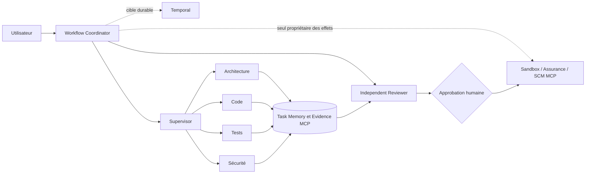
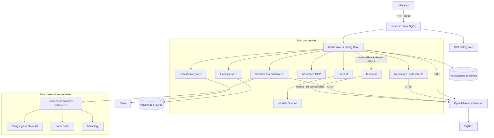
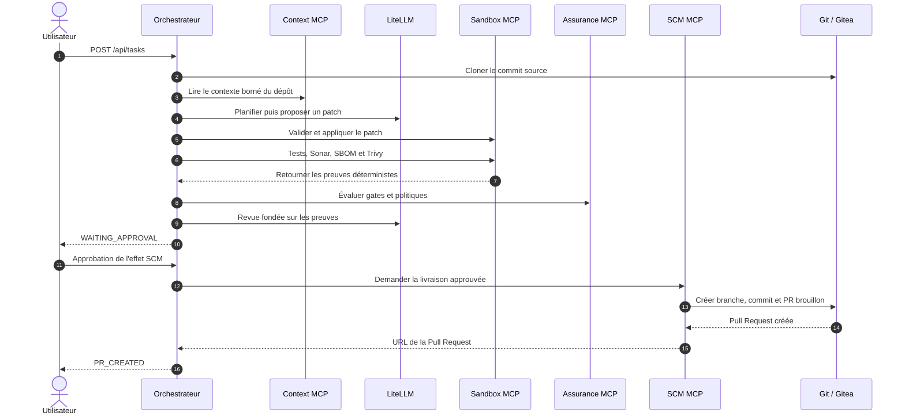
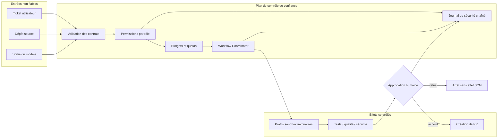

# AI Software Factory

Prototype local d'usine logicielle agentique, exécuté avec Docker Compose. La version 1.2.0 introduit une
architecture **multi-agent hiérarchique gouvernée** tout en conservant le pipeline déterministe 1.1.0 comme
baseline et chemin de repli.

Le mode `PIPELINE` reste le mode opérationnel de référence tant que la qualification et les approbations de
bascule ne sont pas acquises. L'activation des modes `HIERARCHICAL_SHADOW`, `HIERARCHICAL_CANARY` et
`HIERARCHICAL_ACTIVE` est protégée de façon fail-closed par politique et par rôle.

Le chemin court historique reste :

`requirement -> plan -> patch -> validation du diff -> réparation si besoin -> sandbox -> tests -> SonarQube -> SBOM Syft -> scan Trivy -> review IA -> approbation humaine -> pull request Gitea`

## Objectifs fonctionnels et périmètre

L'usine transforme un besoin fonctionnel en une **proposition de changement vérifiée et traçable**. Elle automatise
la préparation d'une Pull Request, mais ne fusionne ni ne déploie le code en production.

| Objectif | Réponse apportée | Résultat observable |
|---|---|---|
| Accélérer un changement applicatif | Planification et génération de patch assistées par LLM | Plan, diff et branche de travail |
| Réduire le risque de régression | Validation Git, tests, quality gate et revue indépendante | Preuves liées à la tâche et au commit source |
| Contrôler la supply chain | SBOM CycloneDX et scan Trivy des vulnérabilités et secrets | Rapports Syft/Trivy bloquants |
| Garder l'humain responsable | Effet SCM suspendu jusqu'à une approbation explicite | Pull Request brouillon après approbation |
| Rendre l'agentique gouvernable | Rôles, contrats JSON, budgets, permissions et kill switch | Décisions auditables et refus fail-closed |
| Comparer avant de basculer | Pipeline 1.1.0 conservé comme baseline des modes hiérarchiques | Mesures de qualité, coût et latence appariées |

Le périmètre actuel couvre les dépôts Maven, Gradle et npm. La fusion de PR, le déploiement, la gestion de
production et la remédiation automatique d'un finding de sécurité restent hors périmètre.

## Organisation du dépôt

| Répertoire | Contenu |
|---|---|
| `apps/` | Applications exécutables : orchestrateur, serveurs MCP et interface web |
| `resources/` | Ressources métier versionnées : prompts, profils d'agents et modèle de ticket |
| `infrastructure/` | Compose, proxy, LiteLLM, sandbox et observabilité |
| `examples/` | Dépôts d'exemple utilisés pour les démonstrations |
| `scripts/` | Automatisation du bootstrap et de la démonstration |

Les commandes `make` restent lancées depuis la racine ; elles utilisent `infrastructure/compose.yaml`.

## Vue d'ensemble

La stack actuelle contient :

| Fonction | Composant |
|---|---|
| Point d'entrée HTTP | `reverse-proxy` Nginx (port 8080) |
| Interface de saisie & suivi | `factory-web` (SPA HTML/JS/CSS servie par Nginx) |
| Orchestration | Spring Boot 4.1 / Spring AI 2.0 / Java 25 (`orchestrator`) |
| Workflow | Coordinateur déterministe actif ; workflows Temporal implémentés mais désactivés par défaut |
| Hiérarchie en qualification | Supervisor, agents Architecture, Code, Tests, Sécurité et Independent Reviewer |
| Mémoire de tâche | Adaptateur en mémoire actif ; schémas PostgreSQL et projections Temporal préparés pour la cible durable |
| Contexte MCP | Serveur MCP stateless en lecture seule (`repository-context-mcp`) |
| Exécution MCP | Contrôleur de jobs à profils immuables (`sandbox-execution-mcp`) |
| Passerelle LLM | LiteLLM (port 4000 interne) |
| Modèle cloud | OpenAI via LiteLLM (`gpt-5.6-luna` configurable) |
| SCM / PR | Gitea + PostgreSQL 16 |
| Sandbox d'exécution | Conteneurs Docker éphémères (`ai-factory-sandbox:local`) |
| Build et tests | Maven / Gradle / npm selon le dépôt |
| Miroir d'artefacts | JFrog Artifactory OSS (dépôt Maven virtuel) |
| Qualité de code | SonarQube Community + PostgreSQL 16 |
| SBOM | Syft (CycloneDX JSON) |
| Scan sécurité | Trivy (vulnérabilités & secrets) |
| Observabilité | OpenTelemetry/OTLP + Collector 0.160 + SigNoz 0.135 (métriques, traces et logs) |

### Architecture multi-agent 1.2.0



Dans le chemin hiérarchique, le Supervisor propose un DAG borné ; l'hôte valide rôles, scopes, dépendances,
budgets et contrats. Les agents n'appellent jamais directement un outil à effet. Le `WorkflowCoordinator` reste
seul autorisé à appliquer un patch, lancer les gates, écrire les preuves faisant autorité et livrer une Pull Request.

Les agents représentés ici ne sont pas des conteneurs Docker dédiés : `Supervisor`, spécialistes et
`Independent Reviewer` sont des rôles chargés dans la JVM du service `orchestrator`. Compose sépare les capacités
MCP, pas chaque agent. Une extraction en runtimes autonomes n'est proposée que pour la cible distribuée/GCP et par
frontière de sécurité ou de montée en charge, comme détaillé dans la [rétrodocumentation](docs/overview/current-state.md#35-pertinence-de-modules-dagents-autonomes).

### Architecture technique locale



Les cinq serveurs MCP séparent les capacités par nature : lecture du dépôt, exécution, évaluation, preuves et
livraison SCM. Les endpoints MCP ne sont pas publiés sur l'hôte. Le réseau Compose est lui-même segmenté entre
le trafic applicatif (`factory`), MCP (`mcp-internal`), workflow (`workflow-internal`) et les deux niveaux d'accès
des sandboxes (`sandbox-egress` et `sandbox-quality`).

> **État du prototype.** `DeterministicWorkflowCoordinator` et `InMemoryTaskMemory` sont les adaptateurs actifs de
> la configuration locale. Les workflows Temporal, les migrations SQL et les projections sont présents dans le
> code afin de préparer la cible durable, mais `AI_FACTORY_TEMPORAL_ENABLED=false` par défaut et aucun adaptateur
> PostgreSQL de `TaskMemory` n'est câblé dans la stack Compose actuelle.

### Repères dans l'implémentation

| Responsabilité | Point d'entrée principal |
|---|---|
| API de tâches et commandes opérateur | [`TaskController`](apps/orchestrator/src/main/java/com/example/aifactory/controller/TaskController.java) |
| Admission et mémoire des tâches | [`TaskService`](apps/orchestrator/src/main/java/com/example/aifactory/service/TaskService.java), [`InMemoryTaskMemory`](apps/orchestrator/src/main/java/com/example/aifactory/service/InMemoryTaskMemory.java) |
| Pipeline de référence | [`DeterministicWorkflowCoordinator`](apps/orchestrator/src/main/java/com/example/aifactory/service/DeterministicWorkflowCoordinator.java) |
| Runtime et permissions des agents | [`AgentRuntime`](apps/orchestrator/src/main/java/com/example/aifactory/service/AgentRuntime.java), [`ToolPermissionMatrix`](apps/orchestrator/src/main/java/com/example/aifactory/service/ToolPermissionMatrix.java) |
| Workflow durable cible | [`SoftwareFactoryWorkflowImpl`](apps/orchestrator/src/main/java/com/example/aifactory/workflow/temporal/SoftwareFactoryWorkflowImpl.java) |
| Contexte dépôt | [`McpRepositoryContextService`](apps/orchestrator/src/main/java/com/example/aifactory/service/McpRepositoryContextService.java) |
| Exécution isolée | [`McpSandboxService`](apps/orchestrator/src/main/java/com/example/aifactory/service/McpSandboxService.java), [`SandboxJobService`](apps/mcp/sandbox-execution-server/src/main/java/com/example/aifactory/sandbox/service/SandboxJobService.java) |
| Profils et limites sandbox | [`SandboxProfiles`](apps/mcp/sandbox-execution-server/src/main/java/com/example/aifactory/sandbox/service/SandboxProfiles.java), [`ComposeSandboxRuntime`](apps/mcp/sandbox-execution-server/src/main/java/com/example/aifactory/sandbox/service/ComposeSandboxRuntime.java), [`GkeSandboxRuntime`](apps/mcp/sandbox-execution-server/src/main/java/com/example/aifactory/sandbox/service/GkeSandboxRuntime.java) |
| Preuves et approbation durable | [`McpEvidenceRepository`](apps/orchestrator/src/main/java/com/example/aifactory/workflow/McpEvidenceRepository.java), [`EvidenceApprovalGate`](apps/orchestrator/src/main/java/com/example/aifactory/workflow/EvidenceApprovalGate.java) |
| Livraison Gitea | [`ScmDeliveryGateway`](apps/orchestrator/src/main/java/com/example/aifactory/service/ScmDeliveryGateway.java) |
| Configuration locale | [`compose.yaml`](infrastructure/compose.yaml), [`application.yml`](apps/orchestrator/src/main/resources/application.yml), [`.env.example`](.env.example) |

## Ce que fait réellement le prototype

Deux chemins sont représentés dans l'implémentation :

- le mode `PIPELINE`, utilisé par l'API publique dans la configuration actuelle, exécute le flux séquentiel
  compatible 1.1.0 décrit ci-dessous ;
- les composants hiérarchiques implémentent le routage, le DAG de délégations typées, les spécialistes et
  l'Independent Reviewer, mais restent un chemin de qualification qui n'est pas généralisé au flux de création
  de tâche local.

Une activation hiérarchique non qualifiée, un rôle non promu ou une télémétrie comparative incomplète est
refusé. Le pipeline de référence est alors conservé sans contourner les gates.

1. L'utilisateur soumet un ticket depuis l'interface web (`factory-web`) ou via l'API REST `POST /api/tasks`.
2. L'orchestrateur attribue une référence unique (`AF-0001`, etc.) et clone le dépôt cible de manière asynchrone.
3. Le service de contexte extrait la structure et le contenu du projet.
4. L'agent `Planner` produit une feuille de route (`.ai-plan.md`).
5. L'agent `Developer` génère un patch `unified diff`.
6. Le patch est normalisé (`UnifiedDiffNormalizer`), puis validé avec `git apply --check` dans une sandbox sans réseau.
7. En cas d'échec de validation du diff, l'agent `PatchRepair` tente une réparation complète en analysant les fichiers sources faisant autorité.
8. Le patch est appliqué en sandbox, puis `git diff --check` et `git diff --stat` sont contrôlés.
9. Les tests unitaires/d'intégration s'exécutent dans la sandbox (via Artifactory pour Maven). L'agent `Tester` analyse les journaux de test avec un contrat JSON validé.
10. L'analyse de qualité SonarQube est déclenchée ; son quality gate est bloquant. En l'absence de jeton ou pour un type de projet non encore pris en charge, le run échoue au lieu de considérer le contrôle comme réussi.
11. Syft génère un SBOM CycloneDX (`.ai-factory/sbom.cdx.json`) et Trivy scanne les vulnérabilités/secrets (`.ai-factory/trivy.txt`) ; une détection HIGH ou CRITICAL est bloquante.
12. L'agent `Reviewer` synthétise les preuves dans `.ai-review.md` avec un contrat JSON validé. Un rejet ou un finding `blocker` bloque le run.
13. La tâche passe au statut `WAITING_APPROVAL`.
14. Après approbation humaine (`POST /api/tasks/{id}/approve`), l'orchestrateur bascule sur une branche `ai-factory/<taskId>`, exclut les artefacts de travail IA (`git reset`), committe, pousse vers Gitea et ouvre une Pull Request.



## Pré-requis

- Docker Desktop ou Docker Engine avec Compose v2
- `make`, `curl`, `git`, `bash`
- JDK 25 et Maven 3.6.3+ pour compiler ou tester les modules Java hors Docker (les images Docker embarquent déjà Temurin 25)
- Python 3 (pour les scripts de bootstrap)
- `jq` recommandé pour manipuler les réponses API
- Environ 16 Go de RAM recommandés pour la stack complète

## Démarrage rapide

```bash
make init
make up
make bootstrap
```

URLs principales :

- Interface Web & API publique : `http://localhost:8080`
- Gitea : `http://localhost:3000` (dépôts de démonstration : `customer-api`, `inventory-gradle`, `checkout-node`)
- Orchestrateur direct (diagnostic & Actuator) : `http://localhost:8088`
- SonarQube : `http://localhost:9000`
- Artifactory : `http://localhost:8082` (utilisateur `admin`, mot de passe `password`)
- SigNoz : `http://localhost:3301` (compte initial généré par `make init`)

Le script `make bootstrap` initialise les comptes Gitea `aiadmin` et `reviewer`, pousse les trois dépôts de référence Maven, Gradle et Node depuis `examples/`, et génère automatiquement les jetons `GITEA_TOKEN` et `SONAR_TOKEN` dans le fichier `.env`.

## Utilisation

### Depuis l'interface web

L'interface `factory-web` est servie par le reverse proxy Nginx. Les appels API vers `/api/` sont redirigés de manière transparente vers l'orchestrateur.

L'interface permet de :

- rédiger un ticket structuré (résumé, objectif métier, périmètre, comportement actuel/attendu, critères d'acceptation) ;
- utiliser le bouton de pré-remplissage de démo ("Préremplir le modèle") ;
- utiliser le modèle cloud configuré derrière LiteLLM ;
- suivre la progression en temps réel (stepper, logs, progression) ;
- consulter l'historique complet des exécutions (vue "Exécutions") ;
- ouvrir le menu "Documentation" puis "Workflow" pour afficher le diagramme du pipeline ;
- inspecter la proposition (plan, patch, logs de tests, SonarQube, Trivy, revue IA) ;
- approuver la tâche et déclencher la PR.

### Depuis l'API

Créer une tâche :

```bash
curl -s -X POST http://localhost:8080/api/tasks \
  -H 'Content-Type: application/json' \
  -d '{
    "repositoryUrl":"http://gitea:3000/aiadmin/customer-api.git",
    "baseBranch":"main",
    "requirement":"Add GET /customers/{id}. Return HTTP 404 when the customer does not exist. Add automated tests.",
    "llmMode":"CLOUD"
  }'
```

Consulter une tâche :

```bash
curl -s http://localhost:8080/api/tasks/<TASK_ID>
```

Lister les tâches :

```bash
curl -s http://localhost:8080/api/tasks
```

Approuver une tâche :

```bash
curl -s -X POST http://localhost:8080/api/tasks/<TASK_ID>/approve
```

Vérifier les capacités de l'usine :

```bash
curl -s http://localhost:8080/api/capabilities
```

## États de tâche

Les 14 statuts du cycle de vie d'une tâche sont :

1. `QUEUED` : Tâche enregistrée en mémoire.
2. `CLONING` : Clonage du dépôt Git.
3. `PLANNING` : Analyse du besoin et génération de la feuille de route par l'agent Planner.
4. `GENERATING_PATCH` : Génération du patch par l'agent Developer.
5. `APPLYING_PATCH` : Validation (`git apply --check`), réparation si nécessaire, et application du diff dans la sandbox.
6. `TESTING` : Exécution des tests automatisés dans la sandbox et analyse par l'agent Tester.
7. `QUALITY_SCANNING` : Analyse de qualité de code SonarQube.
8. `SECURITY_SCANNING` : Génération du SBOM CycloneDX (Syft) et scan vulnérabilités/secrets (Trivy).
9. `REVIEWING` : Synthèse globale des preuves déterministes par l'agent Reviewer.
10. `WAITING_APPROVAL` : En attente de l'approbation humaine.
11. `APPROVED` : Validation humaine enregistrée.
12. `PR_CREATED` : Branche créée, commit effectué, push réalisé et Pull Request ouverte sur Gitea.
13. `CANCELLED` : Annulation explicite de la tâche par un opérateur.
14. `FAILED` : Échec rencontré à l'une des étapes (diff invalide non réparable, erreur de build, etc.).

## Modèle LLM

Tous les appels passent par LiteLLM vers le modèle cloud `factory-code-cloud` (`gpt-5.6-luna` par défaut).

## Contexte dépôt via MCP

Le serveur MCP de contexte fournit cinq outils en lecture seule : `context.list_tree`, `context.search_code`,
`context.read_file`, `context.get_repository_rules` et `context.get_dependencies`. Ce dernier lit uniquement les
dépendances directes déclarées dans `pom.xml`, `build.gradle(.kts)` ou `package.json`, sans lancer de build ni
télécharger de dépendance. Le serveur vérifie que chaque demande cible le workspace
d'une tâche et son commit Git immuable, borne les résultats, exclut les chemins sensibles et refuse les sorties
de workspace par traversal ou lien symbolique.

Après validation de MCP-057, le contexte dépôt est exclusivement fourni par MCP :

```bash
AI_FACTORY_MCP_ENABLED=true
AI_FACTORY_MCP_REPOSITORY_CONTEXT_MODE=MCP_ACTIVE
AI_FACTORY_MCP_REPOSITORY_CONTEXT_ACTIVE_ROLES=planner,developer,patch-repair
```

Les anciennes valeurs `DIRECT` et `MCP_SHADOW` sont conservées dans l'énumération de configuration pour détecter
explicitement une configuration obsolète, mais elles sont refusées lors d'une collecte. Une erreur MCP bloque la
contextualisation sans fallback. Le endpoint MCP reste privé au réseau Compose et n'est pas publié
sur un port hôte. L'authentification du transport fait partie du chantier de durcissement avant toute exposition.

## Exécution sandbox via MCP

Dans la configuration Compose, les validations de patch, tests, analyses SonarQube, SBOM et scans Trivy passent
par `sandbox-execution-mcp`. L'orchestrateur ne monte plus le socket Docker et ne reçoit plus les secrets SonarQube
ou Artifactory nécessaires aux jobs. Les commandes et contraintes sont définies par cinq profils serveur immuables ;
les appels MCP ne peuvent fournir ni shell, ni image, ni réseau, ni volume, ni variable d'environnement.
Les valeurs d'environnement configurées côté serveur doivent être monolignes (CR/LF/NUL refusés). Elles sont
injectées uniquement dans le runner correspondant au profil. Les noms de fichiers et le contenu du patch sont
uniquement lus par Git : les métacaractères shell qu'ils contiennent ne sont pas évalués.

```bash
AI_FACTORY_MCP_CLIENT_ENABLED=true
AI_FACTORY_MCP_SANDBOX_ENABLED=true
AI_FACTORY_MCP_SANDBOX_MODE=MCP_ACTIVE
AI_FACTORY_MCP_SANDBOX_ACTIVE_OPERATIONS=validate_patch,apply_patch,run_tests,run_quality,run_security
```

Le chemin Docker historique de l'orchestrateur a été supprimé. Une opération absente de la liste, un serveur MCP
désactivé ou un ancien mode `DIRECT`/`MCP_SHADOW` échoue fermé, sans réintroduire la socket ou les secrets.

Le mode local utilise quatre runners Compose statiques, séparés selon leurs droits workspace et réseau. Ils sont
non-root, read-only, sans capabilities, sans port hôte et n'acceptent que des identifiants de profils signés par un
jeton local. Aucun composant applicatif ne contrôle le daemon Docker. La cible partagée utilise le contrôleur de Jobs
GKE avec RBAC, Pod Security, gVisor, quotas et NetworkPolicies dédiés.

Les états bornés et déjà redacted des jobs sont écrits atomiquement dans le volume dédié `sandbox-job-state`.
Après un redémarrage, les résultats terminaux et les clés d'idempotence sont restaurés ; toute exécution qui était
encore active devient `FAILED / INDETERMINATE`, et les processus orphelins annoncés par les runners sont annulés.
Les états terminaux expirent depuis leur `completed_at` après `AI_FACTORY_SANDBOX_JOB_RETENTION` (`P7D` par défaut,
valeur autorisée de 1 minute à 365 jours). La purge du snapshot, du handle et de sa clé d'idempotence s'effectue au
démarrage, avant les opérations MCP et périodiquement ; une nouvelle soumission après expiration reçoit donc un
nouvel `execution_id`. Les exécutions actives ne sont jamais supprimées par cette rétention.
L'admission est bornée par `AI_FACTORY_SANDBOX_MAX_CONCURRENT_JOBS` exécutions simultanées,
`AI_FACTORY_SANDBOX_MAX_QUEUED_JOBS` jobs en attente et `AI_FACTORY_SANDBOX_MAX_ACTIVE_JOBS_PER_TASK` jobs actifs
pour une même tâche. Une soumission idempotente retrouve toujours son job existant ; une nouvelle soumission hors
quota est refusée immédiatement, sans snapshot orphelin. Les jauges `ai_factory_sandbox_jobs_running` et
`ai_factory_sandbox_jobs_queued`, le timer `ai_factory_sandbox_job_queue_duration` et le compteur de rejets par
raison exposent la pression du contrôleur.
Pendant `ACCEPTED` et `RUNNING`, `heartbeat_at` est rafraîchi et persisté toutes les
`AI_FACTORY_SANDBOX_HEARTBEAT_INTERVAL` (`PT15S` par défaut) ; l'orchestrateur refuse un heartbeat absent, invalide
ou plus ancien que son timeout de polling. `sandbox.get_execution` retourne les logs déjà redacted par pages de
4 096 caractères par défaut, jusqu'à 16 384 via `output_limit`, avec `next_output_cursor`, la taille totale retenue
et `output_truncated` lorsque la borne globale a supprimé le début du flux. Le client reconstruit les pages avec une
limite locale et refuse les curseurs incohérents. Chaque résultat expose aussi `evidence_status` (`NONE`, `PARTIAL`
ou `COMPLETE`) et le SHA-256 `output_digest` calculé après redaction sur l'intégralité de la sortie retenue. Une
sortie tronquée ou interrompue par timeout est persistée comme preuve `PARTIAL` avec un verdict `INDETERMINATE` ;
elle reste consultable mais ne peut pas valider le workflow. L'orchestrateur recalcule le digest après pagination et
refuse toute preuve partielle, absente ou altérée.

Le test d'intégration opt-in suivant demande un daemon Docker local et l'image `ai-factory-sandbox:local`. Il crée
un conteneur et un volume aux noms aléatoires, vérifie les limites réellement acceptées par Docker, puis les supprime
systématiquement :

```bash
make test-sandbox-runtime
```

Le mode cloud n'est accessible que si `AI_FACTORY_CLOUD_ENABLED=true` dans `.env`.

Variables de configuration principales :

```bash
OPENAI_MODEL=gpt-5.6-luna
AI_FACTORY_CLOUD_ENABLED=true
LITELLM_MASTER_KEY=local-dev-litellm-key
MAVEN_MIRROR_URL=
AI_FACTORY_SANDBOX_MAVEN_MIRROR_URL=https://repo.maven.apache.org/maven2
NPM_REGISTRY_URL=https://registry.npmjs.org/
NPM_REGISTRY_HOST=registry.npmjs.org
```

`MAVEN_MIRROR_URL` est le miroir optionnel utilisé lors de la construction des images. Les profils sandbox exigent
en revanche des endpoints explicites : Maven Central et le registre npm public sont proposés dans `.env.example`.
En environnement d'entreprise, remplacez-les par les endpoints autorisés ; le `settings.xml` et le jeton
Artifactory ne sont chargés que lorsqu'un miroir Maven authentifié est configuré.

Pour utiliser le mode cloud, placez votre clé OpenAI dans le fichier `.vault` :
```bash
VAULT_OPENAI_API_KEY=sk-...
```
Ce fichier est exclu du contrôle de version Git, créé avec des permissions locales restrictives et chargé au
runtime par LiteLLM. Il s'agit d'un mécanisme de développement local, pas d'un coffre de secrets de production.

Si un proxy d'entreprise intercepte le trafic HTTPS et présente un certificat interne, LiteLLM ajoute au démarrage la chaîne présentée par `api.openai.com:443` à son bundle de confiance. Pour employer un autre endpoint, configurez dans `.env` :
```bash
OPENAI_CA_CERT_HOST=api.openai.com:443
```
Cette étape n'est exécutée que lorsqu'une clé OpenAI est configurée et la vérification TLS reste active.
Les certificats d'interception historiques qui n'ont pas d'Authority Key Identifier restent compatibles avec Python 3.13 ; la chaîne, la signature et le nom d'hôte restent vérifiés.

## Sécurité et frontières de confiance

Le dépôt, le ticket, les sorties LLM et les logs de build sont traités comme des données non fiables. Ils peuvent
contenir du code malveillant, des secrets ou des instructions de prompt injection ; ils ne deviennent jamais une
autorité de décision simplement parce qu'un agent les a produits.



### Règles appliquées

| Domaine | Règle |
|---|---|
| Autorité | Le rôle vient de l'identité du workflow, jamais de la réponse du modèle. La matrice d'outils est deny-by-default. |
| Effets | Les agents spécialistes n'ont accès qu'au contexte et aux preuves ; seul le workflow peut appliquer, tester, scanner, écrire les preuves ou créer une PR. |
| Contrats | Les sorties d'agents sont validées contre des schémas versionnés et bornées à 1 MiB. Un contrat invalide est refusé. |
| MCP | Nom/version du serveur, protocole, audience, outil et taille de réponse sont contrôlés. Une indisponibilité ne déclenche pas de fallback direct. |
| Sandbox | Aucun appelant ne fournit de commande, image, volume, réseau ou variable d'environnement ; il choisit seulement une opération allow-listée. |
| Conteneurs | `--cap-drop ALL`, `no-new-privileges`, 2 CPU, 2 Gio et 512 PID ; validation et application du patch sans réseau. |
| Réseau | Les sorties externes des tests et scans passent par un proxy Squid limité aux registries nécessaires ; SonarQube n'est accessible qu'au profil qualité. |
| Secrets | `.env` et `.vault` ne sont pas versionnés. Les secrets de build utilisent BuildKit ; ceux des jobs sandbox restent côté serveur MCP et sont injectés par fichier temporaire `0600`. |
| Preuves | Logs redacted, pagination bornée, digest SHA-256 recalculé côté orchestrateur ; une preuve absente, partielle, tronquée ou incohérente ne valide pas un gate. |
| Livraison | Une approbation humaine précède toujours l'effet SCM. La passerelle signe ensuite une preuve à durée limitée liée au commit source, au patch et aux preuves ; le chemin durable sait en plus imposer l'approbation d'un manifeste immuable. |
| Arrêt d'urgence | Le code du kill switch peut interdire un serveur, un outil, un rôle ou un mode ; son fichier de contrôle n'est toutefois pas monté par le Compose courant. |

Le journal d'audit de sécurité est chaîné en mémoire avec HMAC-SHA-256 afin de rendre les altérations détectables
pendant la vie du processus. Cette propriété ne remplace toutefois ni la persistance, ni un stockage WORM, ni
l'export vers un SIEM dans une cible de production.

### Risques résiduels du déploiement local

- les runners Compose sont persistants et offrent une isolation plus faible que gVisor ou une microVM ; ils restent réservés au développement local ;
- les transports MCP sont confinés aux réseaux Compose mais ne disposent pas encore d'une authentification forte ;
- l'API publique n'implémente pas encore SSO, RBAC, séparation multi-tenant ni rate limiting par utilisateur ;
- le pipeline de référence utilise encore l'approbation simple ; l'endpoint d'approbation lié à un manifeste est
  présent mais appartient au chemin durable non généralisé ;
- `.vault` est un fichier local et les mots de passe par défaut des services de développement ne conviennent pas à
  une exposition réseau ;
- les volumes Docker assurent la persistance locale, pas la sauvegarde, le chiffrement géré ou un plan de reprise.

La stack doit donc rester liée à la boucle locale ou à un environnement de démonstration isolé.

## Quotas, budgets et timeouts

Toutes les valeurs ci-dessous sont des **plafonds par défaut versionnés**. Leur dépassement provoque un refus ou un
résultat indéterminé ; il n'augmente jamais silencieusement la capacité demandée.

### Gouvernance agentique

| Niveau | Plafond par défaut |
|---|---|
| DAG de délégation | profondeur 2, fan-out 4, chemin critique 2 700 s |
| Une délégation | 6 tours, 12 000 tokens, 12 000 000 micro-unités de coût, 900 s, 24 appels outil |
| Une tâche | 60 tours, 80 000 tokens planifiés, 80 000 000 micro-unités de coût, 208 appels outil |
| Usage réel cumulé | 120 000 tokens d'entrée, 40 000 de sortie, 80 000 000 micro-unités de coût, 60 tours, 208 appels MCP |
| Réserve de finalisation | 10 000 tokens d'entrée, 5 000 de sortie, 10 000 000 micro-unités de coût, 6 tours, 32 appels MCP |

Chaque rôle et chaque périmètre Architecture/Code/Tests/Sécurité possède en plus un plafond inférieur ou égal à
ces limites. La politique faisant foi est
[`resources/multiagents/policies/hierarchical-budget-policy-v1.yaml`](resources/multiagents/policies/hierarchical-budget-policy-v1.yaml).

### MCP et contexte dépôt

| Ressource | Valeur par défaut | Variable principale |
|---|---:|---|
| Réponse MCP | 65 536 octets | `AI_FACTORY_MCP_MAX_RESPONSE_BYTES` |
| Appels MCP simultanés | 32 globaux, 16/serveur, 4/tâche, 8/rôle | `AI_FACTORY_MCP_MAX_INFLIGHT_*` |
| Timeout d'une requête MCP | 20 s | `AI_FACTORY_MCP_REQUEST_TIMEOUT` |
| Tentatives lecture / effet | 3 / 2, avec backoff et jitter | `AI_FACTORY_MCP_*_RETRY_MAX_ATTEMPTS` |
| Fichier lu par Context MCP | 1 MiB | `AI_FACTORY_CONTEXT_MAX_FILE_BYTES` |
| Recherche / arbre du dépôt | 1 000 fichiers / 1 000 entrées | `AI_FACTORY_CONTEXT_MAX_SEARCH_FILES`, `AI_FACTORY_CONTEXT_MAX_TREE_ENTRIES` |
| Capacité déclarée d'une task queue | 4 workers | `AI_FACTORY_TASK_QUEUE_WORKER_CAPACITY` |

### Jobs sandbox

| Ressource | Valeur par défaut | Variable ou politique |
|---|---:|---|
| Jobs exécutés / en attente | 2 / 32 | `AI_FACTORY_SANDBOX_MAX_CONCURRENT_JOBS`, `AI_FACTORY_SANDBOX_MAX_QUEUED_JOBS` |
| Jobs actifs par tâche | 2 | `AI_FACTORY_SANDBOX_MAX_ACTIVE_JOBS_PER_TASK` |
| États de jobs conservés | 500 pendant 7 jours | `AI_FACTORY_SANDBOX_MAX_JOBS`, `AI_FACTORY_SANDBOX_JOB_RETENTION` |
| Sortie conservée / patch accepté | 65 536 caractères / 1 MiB | `AI_FACTORY_SANDBOX_MAX_OUTPUT_CHARS`, `AI_FACTORY_SANDBOX_MAX_PATCH_BYTES` |
| Ressources d'un conteneur | 2 CPU, 2 Gio, 512 PID | profil serveur immuable |
| Validation / application d'un patch | 3 min / 3 min | profil serveur immuable |
| Tests / qualité / sécurité | 15 min / 15 min / 10 min | profil serveur immuable |
| Heartbeat / polling orchestrateur | 15 s / 20 min | `AI_FACTORY_SANDBOX_HEARTBEAT_INTERVAL`, `AI_FACTORY_MCP_SANDBOX_POLL_TIMEOUT` |

Les quotas d'admission sont évalués avant la création du snapshot. Une répétition avec la même clé d'idempotence
retrouve le job existant ; une nouvelle demande au-delà du plafond est refusée immédiatement.

## Choix de déploiement

### Déploiement fourni : Docker Compose local

Compose privilégie la reproductibilité et la lisibilité des frontières : un seul hôte, des services nommés, cinq
réseaux dédiés et des volumes persistants. C'est le bon format pour développer, démontrer les gates et qualifier
les contrats, mais pas pour isoler fortement du code hostile ou garantir haute disponibilité et reprise d'activité.

### Cible d'industrialisation

La cible documentée n'est pas livrée sous forme de manifests de production dans ce dépôt. Elle conserve les
contrats MCP pour pouvoir remplacer les backends sans donner davantage de pouvoir aux agents.

| Capacité | Local actuel | Cible recommandée | Motivation |
|---|---|---|---|
| Web et API | Nginx + Spring sur Compose | Cloud Run ou GKE derrière HTTPS/IAP | Authentification, autoscaling et exposition maîtrisée |
| Workflow | Coordinateur en processus ; Temporal disponible mais désactivé | Temporal managé ou opéré, workers séparés par task queue | Reprise durable, signaux humains, retries et versionnement |
| État | Mémoire JVM et volumes locaux | PostgreSQL/Cloud SQL + stockage objet des preuves | Transactions, sauvegardes, rétention et restauration |
| Sandbox | Runners Compose statiques sans socket Docker | GKE dédié avec gVisor/Agent Sandbox et Jobs éphémères | Séparer le code non fiable du plan de contrôle |
| Réseau | Réseaux Compose et proxy Squid allow-listé | `default deny`, egress explicite, VPC séparé, aucun accès metadata/control plane | Réduire mouvement latéral et exfiltration |
| Identités et secrets | Fichiers `.env`/`.vault` | Workload Identity et Secret Manager | Identités courtes, minimales et auditables |
| SCM, qualité, artefacts | Gitea, SonarQube et Artifactory locaux | Services d'entreprise via adaptateurs MCP | Conserver les politiques et systèmes de référence |
| Observabilité | Collector OpenTelemetry et SigNoz locaux | Google Cloud Monitoring, Trace et Logging via gateway OTel | SLO, investigation et conformité |

La promotion suit `PIPELINE -> HIERARCHICAL_SHADOW -> HIERARCHICAL_CANARY -> HIERARCHICAL_ACTIVE`. Chaque étape
exige les seuils de qualification, les rôles autorisés et les preuves de sécurité attendues ; en leur absence, le
routage reste sur la baseline ou s'arrête de façon fail-closed.

## Démonstration

Lancer une tâche de démo pré-configurée :

```bash
make demo
```

## Qualité et observabilité

- **SonarQube** (`http://localhost:9000`) : Analyse de la qualité du code Java/Maven. Les jetons sont générés par `make bootstrap` ou `make tokens`.
- **Artifactory** (`http://localhost:8082`) : Dépôt d'artefacts local. Les builds Maven des sandboxes utilisent le miroir explicite `MAVEN_MIRROR_URL`.
- **SigNoz** (`http://localhost:3301`) : reçoit métriques, traces et logs via le Collector OpenTelemetry. Sept dashboards, neuf alertes de parité et six alertes techniques sont provisionnés automatiquement.
- **Collector OpenTelemetry** : reçoit OTLP des six applications, collecte les métriques Temporal par un receiver de compatibilité interne et n'expose aucun port à l'hôte.

## Commandes Make disponibles

| Commande | Description |
|---|---|
| `make help` | Affiche l'aide des commandes Make |
| `make init` | Initialise `.env` et `.vault`, puis génère les secrets locaux obligatoires absents |
| `make build` | Construit l'image sandbox et les services Compose |
| `make up` | Démarre la stack complète en arrière-plan |
| `make all` | Remet à zéro les données et démarre une stack entièrement bootstrappée |
| `make bootstrap` | Initialise Gitea, SonarQube et génère les jetons d'accès |
| `make tokens` | Régénère ou valide les jetons Gitea et SonarQube |
| `make demo` | Soumet une tâche de démo à l'orchestrateur |
| `make test` | Exécute les tests de l'orchestrateur et des serveurs MCP |
| `make test-sandbox-runtime` | Vérifie les contraintes effectives des conteneurs sandbox |
| `make mcp-shadow-campaign` | Valide le corpus shadow de 20 tâches sans l'exécuter |
| `make mcp-active-campaign` | Exécute le canary `MCP_ACTIVE` limité aux rôles autorisés |
| `make mcp-shadow-campaign CAMPAIGN_ARGS=--execute AI_FACTORY_RUN_CLOUD_CAMPAIGN=true` | Exécute volontairement la campagne cloud séquentielle |
| `make mcp-shadow-report` | Génère le rapport des métriques shadow courantes |
| `make package` | Compile et empaquette l'orchestrateur Java (sans tests) |
| `make config` | Valide et affiche la configuration Compose |
| `make status` | Affiche l'état des conteneurs |
| `make restart` | Redémarre l'orchestrateur |
| `make logs` | Suit les journaux de l'orchestrateur |
| `make urls` | Liste toutes les URLs de services et points d'accès |
| `make down` | Arrête la stack Compose |
| `make clean` | Arrête la stack et supprime tous les volumes (destructif) |

## Limites actuelles

- le mode hiérarchique n'est pas généralisé : la campagne cloud comparative, les approbations formelles et le
  canary réel restent nécessaires ;
- le déploiement local Compose ne démontre pas encore la reprise après arrêt simultané de l'orchestrateur, de
  Temporal et de tous les serveurs MCP à chaque phase critique ;
- les schémas/projections PostgreSQL et Evidence MCP sont implémentés, mais ne sont pas encore intégrés de bout en
  bout au pipeline de référence ; leur exploitation managée et leur restauration restent à valider ;
- les prompts, contrats, politiques et qualifications sont versionnés ; leur promotion reste soumise aux
  propriétaires humains désignés ;
- support des builds limité à Maven, Gradle et npm ;
- pas de SSO, RBAC ni policy engine ;
- le backend Kubernetes est implémenté mais sa qualification exige encore un cluster GKE cible, son stockage et ses identités Workload Identity ;
- approbation humaine obligatoire avant push/PR ;

Les règles de confiance des prompts, la validation des contrats de sortie et les gates de tests, qualité et
sécurité ont été renforcés dans le prototype. Ils ne remplacent pas le SSO/RBAC, un moteur de policy-as-code,
ni une sandbox de production : ces limites restent bloquantes pour un usage entreprise exposé.

## Documentation complémentaire

- [Guide de lecture et statut des documents](docs/README.md)
- [Rétrodocumentation complète : fonctionnel, architecture, sécurité, données et packaging](docs/overview/current-state.md)
- [État, architecture et workflow du prototype 1.2.0](docs/archive/releases/1.2.0-archi-04/ETAT-PROTO-1.2.0.md)
- [Architecture cible multi-agent hiérarchique](docs/archive/releases/1.2.0-archi-04/cible-architecture-multi-agent-hierarchique.md)
- [Plan de bascule](docs/archive/releases/1.2.0-archi-04/BASCULE-ARCHI-04-MULTI-AGENTS.md)
- [Catalogue des agents](docs/architecture/agents/CATALOGUE-AGENTS-V1.md)
- [Architecture, workflow et sécurité de la baseline 1.1.0](docs/version-1.1.0-archi-02-mcp/ETAT-PROTO-1.1.0.md)
