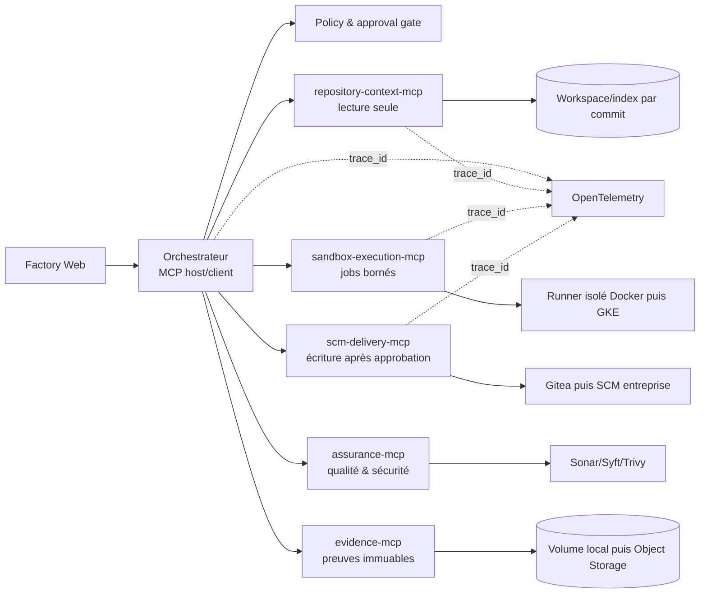

# Plan de mise en place des serveurs MCP

> Feuille de route exécutable pour découpler les outils de l'AI Software Factory, réduire les privilèges de l'orchestrateur et préparer la cible GCP.
>
> État de référence : prototype local Spring Boot 3.5 / Java 21, Docker Compose, tâches en mémoire, agents sans outils, sandbox lancée via `/var/run/docker.sock`.

## 1. Résultat recherché

À l'issue de cette feuille de route :

- l'orchestrateur est un **hôte/client MCP** et ne contient plus les intégrations Gitea, dépôt, sandbox, SonarQube, Syft ou Trivy ;
- chaque capacité est exposée par un serveur MCP à schémas stricts, avec une identité et des permissions minimales ;
- aucun agent ne reçoit un shell générique, un jeton SCM ou le socket Docker ;
- les contrôles de patch, tests, qualité et sécurité restent déterministes et bloquants ;
- chaque appel d'outil est autorisé, borné, idempotent, traçable et relié au ticket, au commit et aux preuves ;
- la création d'une Pull Request reste impossible avant la décision de politique et l'approbation humaine ;
- le passage de Docker Compose à Cloud Run/GKE ne change pas les contrats d'outils.

### Indicateurs de succès

- [x] `0` montage de `/var/run/docker.sock` dans le conteneur `orchestrator`.
- [ ] `0` outil de type shell libre, URL arbitraire ou chemin absolu exposé aux agents.
- [ ] `100 %` des outils ont un schéma d'entrée et de sortie versionné et testé.
- [ ] `100 %` des appels MCP portent `task_id`, `source_commit`, `actor`, `trace_id` et `idempotency_key` lorsqu'ils ont un effet.
- [ ] `100 %` des refus de politique et appels à effet sont présents dans l'audit.
- [ ] Une indisponibilité MCP produit un échec/retry explicite, jamais un contrôle considéré comme réussi.
- [ ] Une exécution de référence `examples/customer-api` donne le même verdict avant et après migration MCP.

## 2. Décisions d'architecture proposées

- **MCP est une frontière d'intégration, pas une frontière de sécurité.** L'authentification, l'autorisation, l'isolation, les quotas et les validations restent obligatoires dans chaque serveur.
- **L'orchestrateur appelle d'abord les outils de façon déterministe.** Le modèle ne choisira lui-même des outils qu'après mise en place du catalogue, des permissions par rôle et des limites de tours/coût.
- **Transport cible : HTTP MCP stateless.** Chaque opération longue retourne un identifiant explicite (`execution_id`) et se consulte par polling ; aucun état métier ne dépend d'une session de transport.
- **Transport local : le même HTTP stateless sur le réseau Compose.** `stdio` est réservé aux tests développeur/Inspector, pas au chemin d'exécution de l'usine.
- **Contrats d'abord.** Les noms d'outils, JSON Schema, erreurs, annotations, URI de ressources et règles d'idempotence sont versionnés avant le code serveur.
- **Découpage selon les frontières de confiance.** Un serveur est séparé lorsqu'il possède des secrets, des droits réseau ou un niveau d'effet différent.
- **Pas de chaînage implicite côté serveur.** L'orchestrateur conserve l'ordre du workflow et les gates ; un serveur n'appelle pas discrètement un autre outil privilégié.
- **Lecture et écriture SCM séparées.** Le serveur de livraison n'expose ni `merge`, ni suppression de branche, ni écriture arbitraire dans un dépôt.
- **Les résultats volumineux deviennent des ressources.** Un outil renvoie un résumé, des digests et des URI `evidence://...`, pas des mégaoctets de logs dans le contexte LLM.
- **Versions épinglées.** Le SDK MCP, les images de serveur, les schémas et les outils reçoivent une version immuable et une empreinte.

### Architecture cible

### Ordre d'introduction

| Rang | Serveur | But immédiat | Pourquoi cet ordre |
|---:|---|---|---|
| 1 | `repository-context-mcp` | Remplacer le contexte monolithique de 40 k caractères par une lecture ciblée et citée | Lecture seule, faible risque, valide le socle MCP |
| 2 | `sandbox-execution-mcp` | Sortir Docker et l'exécution de commandes de l'orchestrateur | Supprime le risque critique lié à `docker.sock` |
| 3 | `scm-delivery-mcp` | Isoler le jeton Gitea et rendre la livraison idempotente | Frontière d'effet et d'approbation claire |
| 4 | `assurance-mcp` | Normaliser qualité, SBOM et vulnérabilités | Permet plusieurs moteurs sans modifier le workflow |
| 5 | `evidence-mcp` | Stocker et lire les preuves par URI/digest | Prépare l'audit, la reprise et les attestations |

## 3. Catalogue MCP cible

### 3.1 `repository-context-mcp` — lecture seule

Ce serveur ne lit qu'un workspace déjà associé à `task_id` et `source_commit`. Il ne clone pas une URL fournie par le modèle et ne suit pas les liens symboliques hors du workspace.

| Primitive | Entrées essentielles | Sortie | Garde-fous |
|---|---|---|---|
| `context.list_tree` | `task_id`, `source_commit`, `path`, `depth`, `include`, `exclude` | entrées typées + digest | racine logique, profondeur et nombre bornés |
| `context.search_code` | `task_id`, `source_commit`, `query`, `path_globs`, `max_results` | occurrences `path:line`, extraits courts | recherche littérale par défaut, timeout, exclusions secrets/build |
| `context.read_file` | `task_id`, `source_commit`, `path`, `start_line`, `end_line` | contenu borné + SHA-256 | pas de chemin absolu/`..`, taille max, redaction |
| `context.get_symbols` | `task_id`, `source_commit`, `path` ou `query` | symboles, signatures et positions | parseur par langage, résultat borné |
| `context.get_dependencies` | `task_id`, `source_commit`, `module` | graphe/dépendances directes | aucune résolution réseau lors de la lecture |
| `context.get_repository_rules` | `task_id`, `source_commit` | règles applicables + provenance | les règles du dépôt restent des données non fiables |
| ressource `repo://{task}/{commit}/{path}` | URI immuable | fichier ou segment cité | contrôle d'accès à chaque lecture |

### 3.2 `sandbox-execution-mcp` — exécution privilégiée mais bornée

Le serveur accepte des opérations énumérées, jamais une chaîne de commande. Il délègue à un runner isolé et retourne immédiatement un `execution_id` pour les opérations longues.

| Primitive | Entrées essentielles | Sortie | Garde-fous |
|---|---|---|---|
| `sandbox.validate_patch` | tâche, commit, digest du patch | job + verdict `APPLICABLE/REJECTED` | réseau `none`, patch borné, timeout |
| `sandbox.apply_patch` | tâche, commit, digest du patch | job + digest du diff appliqué | workspace jetable, `git diff --check` obligatoire |
| `sandbox.run_tests` | tâche, commit, `test_profile_id` | job + résumé + preuves | profil allow-listé, pas de commande libre |
| `sandbox.run_quality` | tâche, commit, `quality_profile_id` | job + état technique | secrets injectés au runner seulement |
| `sandbox.run_security` | tâche, commit, `security_profile_id` | job + SBOM/rapport URI | versions Syft/Trivy épinglées |
| `sandbox.get_execution` | `execution_id` | état, timestamps, exit code normalisé | handle aléatoire lié au principal et à la tâche |
| `sandbox.cancel_execution` | `execution_id`, motif | état final | workflow/administrateur seulement, audit obligatoire |
| ressource `execution://{id}/log` | identifiant de job | log paginé et redacted | taille/retention bornées |

États communs : `ACCEPTED`, `RUNNING`, `SUCCEEDED`, `FAILED`, `TIMED_OUT`, `CANCELLED`. Un résultat `SUCCEEDED` signifie que l'outil s'est exécuté ; le verdict métier (`tests_passed`, `quality_gate`) reste un champ distinct.

### 3.3 `scm-delivery-mcp` — livraison contrôlée

| Primitive | Entrées essentielles | Sortie | Garde-fous |
|---|---|---|---|
| `scm.get_repository` | `repository_id` | métadonnées sans secret | dépôts allow-listés |
| `scm.resolve_revision` | dépôt, branche/tag | SHA immuable | validation du dépôt et de la ref |
| `scm.create_draft_pull_request` | tâche, source SHA, patch/evidence digests, branche cible, preuve d'approbation, clé d'idempotence | branche, commit, PR URL/ID | jeton non exposé, base protégée, opération atomique/rejouable |
| `scm.get_pull_request` | dépôt, PR ID | état en lecture | scope par dépôt |

`scm.create_draft_pull_request` remplace le triplet public `create_branch`/`push`/`create_pr` afin qu'un appel partiel ou détourné ne laisse pas une branche arbitraire. Aucun outil `merge`, `force_push`, `delete_branch`, `write_file` ou `run_git` n'est exposé.

### 3.4 `assurance-mcp` — lot de consolidation

| Primitive | Entrées essentielles | Sortie |
|---|---|---|
| `assurance.evaluate_quality_gate` | rapport brut/digest, profil | verdict normalisé, métriques, raisons |
| `assurance.evaluate_vulnerabilities` | SBOM/rapport digest, politique | verdict, findings structurés |
| `assurance.compare_sbom` | SBOM source/candidate | composants ajoutés, retirés, modifiés |
| `assurance.get_policy_result` | tâche, étape | décision signée et explication |

Le serveur interprète les preuves ; leur production reste dans le runner isolé. Une erreur technique ou une preuve absente retourne `INDETERMINATE` et bloque le workflow.

### 3.5 `evidence-mcp` — preuves et audit

| Primitive | Entrées essentielles | Sortie |
|---|---|---|
| `evidence.register` | tâche, type, digest, provenance, URI de staging | URI immuable | workflow seulement, vérification du digest |
| `evidence.get_manifest` | tâche/tentative | manifeste des preuves | filtrage par rôle |
| `evidence.verify` | URI/digest | intégrité, provenance | aucune mutation |
| ressource `evidence://tasks/{task}/attempts/{attempt}/{type}` | URI immuable | preuve paginée | contenu sensible non transmis au LLM par défaut |

## 4. Matrice d'autorisation minimale

`D` = appel déterministe du workflow, `L` = lecture possible par l'agent, `A` = approbation humaine obligatoire, `—` = interdit.

| Capacité | Planner | Developer/PatchRepair | Tester | Reviewer | Workflow | Delivery |
|---|---:|---:|---:|---:|---:|---:|
| lister/rechercher/lire le code | L | L | L | L | D | — |
| proposer un patch | — | sortie LLM uniquement | — | — | validation | — |
| valider/appliquer un patch | — | — | — | — | D | — |
| lancer les tests | — | — | L ultérieur | lecture résultat | D | — |
| lancer qualité/sécurité | — | — | — | lecture résultat | D | — |
| lire les preuves | plan/contexte | patch/contexte | tests | toutes preuves autorisées | D | manifeste seulement |
| créer une draft PR | — | — | — | — | preuve de gate | D + A |
| fusionner/déployer/supprimer | — | — | — | — | — | — |

## 5. Conventions transverses à figer

- Enveloppe d'entrée commune : `schema_version`, `task_id`, `attempt_id`, `source_commit`, `actor`, `trace_id`, `deadline`, et `idempotency_key` pour tout effet.
- Enveloppe de sortie commune : `status`, `result`, `evidence[]`, `warnings[]`, `error{code,retryable,safe_message}`, `server{name,version,image_digest}`, `started_at`, `completed_at`.
- Codes d'erreur stables : `INVALID_ARGUMENT`, `UNAUTHORIZED`, `FORBIDDEN`, `NOT_FOUND`, `CONFLICT`, `POLICY_DENIED`, `LIMIT_EXCEEDED`, `DEPENDENCY_UNAVAILABLE`, `TIMEOUT`, `INDETERMINATE`, `INTERNAL`.
- Toute pagination utilise un curseur opaque, signé et expirant.
- Toute donnée de dépôt, ticket, log, rapport ou serveur MCP est traitée comme **non fiable** dans les prompts.
- Les descriptions d'outils n'accordent aucune permission et ne sont jamais utilisées pour une décision de sécurité.
- Les annotations de lecture/destruction sont informatives ; les contrôles côté serveur restent autoritatifs.
- Les réponses sont bornées par nombre d'éléments, octets et temps ; les gros contenus passent par une ressource.
- Les chemins sont relatifs à une racine enregistrée côté serveur ; normalisation, contrôle de préfixe et refus des symlinks sortants.
- Les URL, images, profils d'exécution et dépôts sont résolus depuis un registre allow-listé, jamais directement depuis un argument LLM.
- Les tokens entrants sont destinés au serveur appelé ; aucun token MCP n'est transmis tel quel à Gitea, SonarQube ou un autre service.
- Les handles (`execution_id`, curseurs) sont non prédictibles, expirants et liés côté serveur au principal, à la tâche et au tenant.

## 6. Backlog détaillé

### Lot 0 — Cadrage, menace et baseline (`MCP-000` à `MCP-019`)

Objectif : rendre les décisions vérifiables avant d'ajouter des dépendances ou des services.

- [ ] **MCP-000** — Nommer un responsable produit et un responsable sécurité du catalogue d'outils.
- [x] **MCP-001** — Écrire `docs/adr/ADR-MCP-001-boundaries-and-transport.md` avec les frontières ci-dessus, HTTP stateless, handles explicites et alternatives rejetées.
- [ ] **MCP-002** — Faire l'inventaire des appels directs dans `TaskService`, `RepositoryContextService`, `SandboxService` et `GiteaService` ; associer chaque appel au futur outil.
- [ ] **MCP-003** — Inventorier secrets, volumes, réseaux, comptes techniques et destinations utilisés par chaque capacité.
- [ ] **MCP-004** — Définir les actifs et frontières de confiance : ticket, dépôt, source SHA, patch, workspace, preuves, approbation, jetons et PR.
- [ ] **MCP-005** — Réaliser un threat model couvrant prompt injection, tool poisoning, path traversal, SSRF, confused deputy, token passthrough, fuite de logs, handle hijacking, rejeu, déni de service et serveur compromis.
- [x] **MCP-006** — Décider par ADR entre le SDK Java officiel et les starters Spring AI ; vérifier explicitement la compatibilité avec Spring Boot 3.5.16, WebFlux, Jackson et la version de protocole retenue.
- [x] **MCP-007** — Épingler un BOM/version de SDK MCP et documenter le processus de montée de version avec tests de conformité.
- [ ] **MCP-008** — Définir une convention de nommage/versionnement pour outils, ressources, schémas et serveurs.
- [ ] **MCP-009** — Écrire les JSON Schema du tronc commun, des erreurs et des cinq premiers outils dans `resources/mcp/schemas/`.
- [x] **MCP-010** — Créer une matrice `agent-role -> outils -> scopes -> approbation -> quotas` lisible par machine.
- [ ] **MCP-011** — Définir les limites par défaut : octets, résultats, durée, concurrence, retries, tours agentiques et budget.
- [ ] **MCP-012** — Définir la politique de redaction des secrets/PII pour entrées, sorties, logs et traces.
- [ ] **MCP-013** — Capturer une baseline du scénario `examples/customer-api` : statut de chaque étape, durées, digests et verdict final.
- [ ] **MCP-014** — Ajouter des cas négatifs de référence : patch invalide, test échoué, Sonar absent, vulnérabilité bloquante, approbation absente et retry de création de PR.
- [ ] **MCP-015** — Choisir les SLO initiaux : disponibilité, latence p95 des lectures, délai de démarrage des jobs et taux d'erreur MCP.
- [ ] **MCP-016** — Définir le plan de compatibilité N/N-1 et la procédure de rollback d'un serveur ou d'un schéma.
- [ ] **MCP-017** — Faire relire ADR, menace, permissions et schémas par sécurité et exploitation.

**Gate du lot 0**

- [ ] Les contrats, frontières, risques, propriétaires, baseline et règles de rollback sont approuvés ; aucune implémentation serveur ne commence avant ce gate.

### Lot 1 — Socle client MCP dans l'orchestrateur (`MCP-020` à `MCP-039`)

Objectif : introduire MCP sans modifier les verdicts du pipeline.

- [x] **MCP-020** — Ajouter le BOM et le client MCP WebFlux choisis dans `apps/orchestrator/pom.xml`, avec versions épinglées.
- [ ] **MCP-021** — Ajouter `McpClientProperties` : serveurs, URI, audience, timeouts, limites, retry et activation par feature flag.
- [x] **MCP-022** — Créer `McpServerRegistry` avec allow-list statique locale ; interdire toute URL fournie par un ticket, dépôt ou modèle. _(Implémenté sous forme de connexion Spring statique et sélection par nom dans `SpringMcpToolInvoker`.)_
- [x] **MCP-023** — Créer un adaptateur `FactoryToolClient` indépendant du SDK MCP afin de ne pas propager les types du protocole dans le domaine du workflow. _(Port `McpToolInvoker`.)_
- [ ] **MCP-024** — Implémenter négociation de capacités/version au démarrage et health state `READY/DEGRADED/INCOMPATIBLE` par serveur.
- [ ] **MCP-025** — Valider toutes les réponses MCP avec les schémas locaux avant usage ; refuser les champs/tailles non conformes selon la politique définie.
- [ ] **MCP-026** — Propager `traceparent`, `task_id`, `attempt_id`, `actor` et deadline à chaque appel.
- [ ] **MCP-027** — Implémenter timeouts, retry exponentiel avec jitter uniquement sur erreurs retryables, circuit breaker et limite de concurrence par serveur.
- [ ] **MCP-028** — Ajouter une idempotency key stable pour chaque étape à effet : `<task>:<attempt>:<step>:<input_digest>`.
- [ ] **MCP-029** — Journaliser métadonnées, durée, code d'erreur, taille et digest ; ne pas journaliser arguments/résultats bruts par défaut.
- [ ] **MCP-030** — Exposer métriques `mcp_client_calls`, `mcp_client_duration`, `mcp_client_errors`, `mcp_client_retries`, `mcp_client_inflight` étiquetées sans cardinalité `task_id`.
- [x] **MCP-031** — Ajouter health indicators Actuator par serveur MCP et les afficher dans `/api/capabilities` sans exposer de secret. _(Terminé pour `repository-context-mcp` et `sandbox-execution-mcp` ; le motif sera répliqué avec chaque nouveau serveur.)_
- [x] **MCP-032** — Prévoir le double chemin `DIRECT`/`MCP_SHADOW`/`MCP_ACTIVE` par capacité, configuration non modifiable par le LLM.
- [ ] **MCP-033** — Ajouter tests unitaires des enveloppes, schémas, timeout, retry, circuit breaker, idempotence et redaction.
- [x] **MCP-034** — Ajouter un faux serveur MCP déterministe pour les tests de l'orchestrateur. _(Fake du port `McpToolInvoker`, sans dépendance réseau.)_
- [ ] **MCP-035** — Ajouter tests d'incompatibilité de version, outil absent, résultat malformé, réponse trop grande et serveur lent.
- [ ] **MCP-036** — Ajouter les services MCP au réseau Compose sans les exposer sur les ports hôte. _(`repository-context-mcp` terminé ; à répéter pour les quatre serveurs suivants.)_

**Gate du lot 1**

- [ ] Le client peut appeler un faux serveur, échouer fermé et produire traces/métriques sans changer le pipeline actif. _(Appel, échec fermé et métriques terminés ; propagation de traces à compléter.)_

### Lot 2 — `repository-context-mcp` (`MCP-040` à `MCP-069`)

Objectif : fournir un contexte ciblé, cité et reproductible à la place du dump fixe de `RepositoryContextService`.

- [x] **MCP-040** — Scaffolder `apps/mcp/repository-context-server/` avec health/readiness, endpoint MCP interne et image minimale non-root.
- [ ] **MCP-041** — Monter le volume workspace en lecture seule et enregistrer côté serveur la relation `task_id -> root -> source_commit`. _(Volume en lecture seule et validation `task_id`/SHA terminés ; registre explicite à persister.)_
- [x] **MCP-042** — Implémenter une primitive centrale de résolution de chemin : relatif seulement, normalisé, sous racine, symlinks contrôlés.
- [x] **MCP-043** — Porter les exclusions sensibles de `RepositoryContextService` et ajouter `.git`, build outputs, dépendances vendoriées, binaires et fichiers générés.
- [ ] **MCP-044** — Porter la redaction des réglages sensibles et ajouter des tests de faux positifs/faux négatifs. _(Redaction et test nominal terminés ; matrice faux positifs/faux négatifs à compléter.)_
- [ ] **MCP-045** — Implémenter `context.list_tree` avec filtres, pagination, profondeur et limites. _(Profondeur, limite et troncature terminées ; filtres et curseur opaque à ajouter.)_
- [ ] **MCP-046** — Implémenter `context.search_code` sans shell, avec timeout, nombre d'occurrences et extraits bornés. _(Recherche littérale, parcours/nombre/extraits bornés terminés ; deadline/timeout interruptible à ajouter.)_
- [ ] **MCP-047** — Implémenter `context.read_file` avec plages de lignes, MIME/type, taille et SHA-256. _(Plages, limites et SHA-256 terminés ; MIME explicite à ajouter.)_
- [ ] **MCP-048** — Implémenter `context.get_repository_rules` avec provenance et ordre d'applicabilité, sans promouvoir ces fichiers au rang d'instructions système. _(Lecture bornée et chemins terminés ; ordre d'applicabilité explicite à ajouter.)_
- [ ] **MCP-049** — Implémenter les ressources immuables `repo://` et refuser une divergence entre SHA demandé et workspace constaté.
- [ ] **MCP-050** — Ajouter ultérieurement `get_symbols` via tree-sitter/LSP derrière un feature flag ; indexer par commit et version de parseur.
- [ ] **MCP-051** — Ajouter ultérieurement `get_dependencies` sans téléchargement ni exécution de build pendant l'indexation.
- [ ] **MCP-052** — Ajouter tests de traversal (`..`, encodages), symlink sortant, fichier énorme, binaire, secret, regex coûteuse, commit incorrect et pagination.
- [ ] **MCP-053** — Ajouter tests de concurrence garantissant qu'une tâche ne lit jamais le workspace d'une autre.
- [ ] **MCP-054** — Passer le Planner en `MCP_SHADOW` : comparer le contexte actuel à un contexte reconstruit via outils, sans changer le prompt servi. _(Mode et métriques de comparaison disponibles ; activation sur la baseline encore requise.)_
- [ ] **MCP-055** — Mesurer couverture des fichiers utiles, citations valides, octets/tokens, latence et impact sur la qualité du plan.
- [ ] **MCP-056** — Basculer Planner puis Developer/PatchRepair sur `MCP_ACTIVE`, rôle par rôle.
- [ ] **MCP-057** — Remplacer `RepositoryContextService.collect()` par l'adaptateur MCP après une période de stabilité.
- [ ] **MCP-058** — Supprimer le montage workspace de l'orchestrateur en cible lorsque le clone/context builder a lui aussi été extrait.

**Gate du lot 2**

- [ ] Aucun accès inter-tâches ou hors workspace n'est possible ; la baseline fonctionnelle passe avec moins de contexte brut et des citations vérifiables.

### Lot 3 — `sandbox-execution-mcp` et retrait de `docker.sock` (`MCP-070` à `MCP-109`)

Objectif : retirer le principal privilège critique de l'orchestrateur.

- [x] **MCP-070** — Scaffolder `apps/mcp/sandbox-execution-server/` avec compte Unix non-root, API MCP interne et contrôleur de jobs séparé.
- [ ] **MCP-071** — Définir des profils immuables `patch-check-v1`, `patch-apply-v1`, `test-maven-v1`, `test-gradle-v1`, `test-node-v1`, `quality-sonar-v1`, `security-syft-trivy-v1`. _(Cinq profils immuables terminés ; Maven/Gradle/Node restent regroupés dans `test-auto-v1`.)_
- [x] **MCP-072** — Interdire toute commande, image, volume, variable ou réseau arbitraire dans les arguments MCP.
- [ ] **MCP-073** — Définir un manifeste de job validé : image digest, opération, workspace, CPU, mémoire, PIDs, timeout, volumes, variables autorisées et politique réseau. _(Profils et limites codés côté serveur ; pinning obligatoire de l'image par digest et manifeste persistant à ajouter.)_
- [x] **MCP-074** — Implémenter le stockage des jobs avec handles aléatoires, liaison au principal/tâche, expiration et transitions atomiques. _(Handles liés à la tâche/SHA et au seul principal workflow, transitions synchronisées, snapshots atomiques redacted, restauration après redémarrage et TTL configurable depuis `completed_at` ; purge au démarrage, avant accès et périodiquement, avec libération de la clé d'idempotence.)_
- [x] **MCP-075** — Implémenter `validate_patch` et `apply_patch` avec réseau coupé et contrôles Git actuels. _(Tests déterministes et smoke tests Docker réels réussis via MCP pour les deux opérations avec verdict `PASSED` et exit code 0 ; l'application produit un diff propre et son rejeu retourne le même job.)_
- [ ] **MCP-076** — Implémenter `run_tests` par profil ; conserver l'usage explicite d'Artifactory et interdire l'egress non requis. _(`test-auto-v1` et injection Artifactory terminés ; profils par build et egress allow-list à ajouter.)_
- [ ] **MCP-077** — Implémenter temporairement `run_quality` et `run_security` à parité avec `SandboxService`. _(Profils portés ; parité runtime à mesurer.)_
- [ ] **MCP-078** — Implémenter `get_execution`, logs paginés/redacted, heartbeats, timeout, cancellation et nettoyage garanti. _(État, sortie bornée/redacted, timeout, annulation et cleanup terminés ; pagination et heartbeat à ajouter.)_
- [x] **MCP-079** — Normaliser séparément état technique, exit code et verdict métier ; considérer preuve absente/incomplète comme `INDETERMINATE` bloquant.
- [x] **MCP-080** — Vérifier le digest du patch et du commit avant chaque job ; refuser un workspace modifié par une autre tentative.
- [x] **MCP-081** — Injecter les secrets au job au dernier moment ; ne jamais les inclure dans MCP, le manifeste persistant ou les logs.
- [ ] **MCP-082** — Conserver les preuves même en cas d'échec/timeout, avec digest et statut `partial` explicite.
- [ ] **MCP-083** — Ajouter quotas globaux/par tâche, limite de jobs concurrents et backpressure. _(Concurrence et capacité globales terminées ; quota par tâche et file bornée explicite à ajouter.)_
- [x] **MCP-084** — Ajouter tests des limites CPU/mémoire/PIDs/temps, réseau, volumes read-only, capabilities Linux et `no-new-privileges`. _(Le test Docker opt-in inspecte un conteneur réellement démarré et vérifie réseau `none`, 2 Gio, 2 CPU, 512 PIDs, `cap_drop=ALL`, `no-new-privileges`, workspace read-only et absence du cache Maven ; le timeout est normalisé en `TIMED_OUT/INDETERMINATE` par test déterministe.)_
- [ ] **MCP-085** — Ajouter tests de commande injectée dans noms de fichiers, profils, variables et contenu du patch. _(Injection via `task_id` testée ; corpus fichiers/patch/variables à compléter.)_
- [x] **MCP-086** — Ajouter tests de job orphelin, redémarrage serveur, double soumission, cancellation, retry et nettoyage. _(Tests déterministes de restauration, double soumission, cancellation et reprise fail-closed d'un job interrompu ; smoke test Docker réel validé avec snapshot restauré, rejeu idempotent sur le même `execution_id`, suppression ciblée de l'orphelin au redémarrage et aucun artefact éphémère résiduel.)_
- [ ] **MCP-087** — Exécuter `SandboxService` et MCP en shadow ; comparer exit codes, diff stat, tests, qualité, SBOM et Trivy. _(Mode shadow disponible pour les opérations comparables ; campagne de parité non exécutée.)_
- [ ] **MCP-088** — Basculer chaque opération sur MCP derrière un feature flag indépendant.
- [ ] **MCP-089** — Retirer l'appel `docker run` de `SandboxService`, puis supprimer la classe lorsqu'aucun chemin direct ne subsiste.
- [x] **MCP-090** — Retirer `/var/run/docker.sock:/var/run/docker.sock` du service `orchestrator` dans `infrastructure/compose.yaml`.
- [x] **MCP-091** — Limiter le socket Docker au contrôleur local temporaire ; documenter qu'il reste POC-only.
- [ ] **MCP-092** — Préparer l'adaptateur cible GKE Jobs/Agent Sandbox sans changer les outils MCP ni les profils.
- [x] **MCP-093** — Vérifier par test automatisé/OPA de configuration que l'orchestrateur n'a plus socket, privilèges ni droit de créer des jobs. _(Test automatisé `ComposeMcpSecurityTest`.)_

**Gate du lot 3**

- [ ] Le pipeline complet passe par MCP, les résultats sont à parité, les échecs sont fermés et l'orchestrateur fonctionne sans accès Docker.

### Lot 4 — `scm-delivery-mcp` (`MCP-110` à `MCP-139`)

Objectif : isoler les secrets SCM et garantir qu'une livraison n'arrive qu'après gate.

- [ ] **MCP-110** — Scaffolder `apps/mcp/scm-delivery-server/` avec identité Gitea dédiée et secrets hors variables de prompt/log.
- [ ] **MCP-111** — Créer un registre de dépôts autorisés ; accepter un `repository_id`, jamais des credentials ou une URL arbitraire.
- [ ] **MCP-112** — Implémenter `get_repository` et `resolve_revision` avec contrôles d'organisation, dépôt et branche.
- [ ] **MCP-113** — Définir une preuve d'approbation vérifiable contenant tâche, tentative, source SHA, patch digest, décision, approbateur et expiration.
- [ ] **MCP-114** — Implémenter `create_draft_pull_request` comme commande métier atomique et idempotente.
- [ ] **MCP-115** — Garantir qu'un retry retrouve la PR existante au lieu de créer une deuxième branche/PR.
- [ ] **MCP-116** — Vérifier source SHA, branche cible protégée, digests de preuves et approbation avant toute écriture.
- [ ] **MCP-117** — Conserver l'exclusion des artefacts `.ai-plan.md`, `changes.patch`, `.ai-review.md` et `.ai-factory` du commit, avec test explicite.
- [ ] **MCP-118** — Refuser force push, merge, suppression, écriture sur branche de base et changement de remote.
- [ ] **MCP-119** — Produire un événement d'audit avant/après écriture avec PR ID/URL, commit et clé d'idempotence.
- [ ] **MCP-120** — Ajouter tests : approbation absente/altérée/expirée, dépôt hors scope, SHA divergent, branche existante, timeout après push, retry après PR créée.
- [ ] **MCP-121** — Passer `GiteaService` en shadow sur les opérations de lecture, puis activer la commande de livraison MCP sur un dépôt de test.
- [ ] **MCP-122** — Basculer l'approbation de `TaskService.approve()` vers l'adaptateur MCP.
- [ ] **MCP-123** — Retirer le jeton Gitea de l'environnement de l'orchestrateur et supprimer `GiteaService` après stabilisation.

**Gate du lot 4**

- [ ] Les tests prouvent qu'aucune mutation SCM n'est possible sans approbation valide et qu'un retry ne crée pas de doublon.

### Lot 5 — Assurance et preuves (`MCP-140` à `MCP-169`)

Objectif : rendre les verdicts portables, explicables et auditables.

- [ ] **MCP-140** — Définir les schémas normalisés `TestResult`, `QualityGateResult`, `VulnerabilityResult`, `SbomReference`, `PolicyDecision` et `EvidenceManifest`.
- [ ] **MCP-141** — Scaffolder `assurance-mcp` sans accès au code source complet ni au jeton SCM.
- [ ] **MCP-142** — Déplacer l'interprétation du quality gate hors de `TaskService.requireQualityGate()` vers `evaluate_quality_gate`.
- [ ] **MCP-143** — Normaliser les findings Trivy/Sonar avec sévérité, règle, composant/fichier, preuve et recommandation.
- [ ] **MCP-144** — Rendre `INDETERMINATE` bloquant pour timeout, format inconnu, scanner absent ou preuve manquante.
- [ ] **MCP-145** — Scaffolder `evidence-mcp` avec stockage local immuable par tentative et digests vérifiés.
- [ ] **MCP-146** — Enregistrer plan, patch, métadonnées, logs de tests, Sonar, SBOM, Trivy, review et approbation dans un manifeste unique.
- [ ] **MCP-147** — Ajouter rétention, classification, chiffrement et contrôle d'accès par type de preuve.
- [ ] **MCP-148** — Ne fournir aux agents que résumés et URI autorisées ; l'accès au brut exige une lecture explicite auditée.
- [ ] **MCP-149** — Ajouter tests d'altération de digest, manifeste incomplet, preuve inter-tâches, résultat partiel et format scanner inconnu.
- [ ] **MCP-150** — Remplacer les concaténations de texte de `TaskService` par les résultats structurés, tout en gardant une vue lisible dans l'UI.
- [ ] **MCP-151** — Préparer le backend GCP Cloud Storage avec Object Lock/rétention et attestations, sans modifier les URI logiques.

**Gate du lot 5**

- [ ] Toute décision de review/approbation pointe vers un manifeste vérifiable ; une preuve absente ou altérée bloque la livraison.

### Lot 6 — Outils choisis par les agents, sous contrôle (`MCP-170` à `MCP-209`)

Objectif : améliorer la qualité du contexte sans augmenter silencieusement l'autonomie.

- [ ] **MCP-170** — Vérifier que LiteLLM et chaque modèle supporté conservent fidèlement noms, schémas, IDs et résultats d'appels d'outils.
- [ ] **MCP-171** — Implémenter une boucle d'agent avec maximum de tours, deadline, budget tokens/coût, résultat final obligatoire et arrêt explicite.
- [ ] **MCP-172** — Appliquer la matrice de permissions côté hôte avant chaque appel ; ne jamais faire confiance au nom de rôle renvoyé par le modèle.
- [ ] **MCP-173** — Limiter d'abord Planner et Reviewer aux outils de lecture `context.*` et ressources de preuves autorisées.
- [ ] **MCP-174** — Garder `validate_patch`, `apply_patch`, tests, scans et livraison exclusivement pilotés par le workflow pendant ce lot.
- [ ] **MCP-175** — Ajouter confirmation/policy gate pour toute future capacité à effet ; afficher clairement outil, arguments sûrs et impact dans l'UI.
- [ ] **MCP-176** — Détecter boucles, appels répétés, fan-out excessif et explosion de contexte.
- [ ] **MCP-177** — Filtrer les résultats d'outils comme données non fiables et conserver la séparation des prompts système.
- [ ] **MCP-178** — Tester prompt injection dans code, ticket, log, nom d'outil, description d'outil et résultat MCP.
- [ ] **MCP-179** — Tester un serveur compromis : outil ajouté dynamiquement, schéma modifié, réponse surdimensionnée, URI externe et instruction malveillante.
- [ ] **MCP-180** — Lancer une évaluation A/B sur la suite de référence : réussite au premier patch, réparations, tests, acceptation humaine, tokens, durée et coût.
- [ ] **MCP-181** — N'activer un rôle en production que si les seuils de qualité et de sécurité définis au lot 0 sont atteints.
- [ ] **MCP-182** — Ajouter un kill switch global et par serveur/outil/rôle, utilisable sans redéploiement mais réservé à l'exploitation.

**Gate du lot 6**

- [ ] Les agents n'accèdent qu'aux outils de lecture prévus, respectent leurs budgets et améliorent les métriques de référence sans régression de sécurité.

### Lot 7 — Durcissement et cible GCP (`MCP-210` à `MCP-249`)

Objectif : passer d'un réseau Compose de confiance à une plateforme Zero Trust exploitable.

- [ ] **MCP-210** — Ajouter TLS en transit ; HTTPS obligatoire hors loopback/développement.
- [ ] **MCP-211** — Mettre en place OAuth 2.1/workload identity avec tokens courts et audience spécifique à chaque serveur.
- [ ] **MCP-212** — Valider issuer, audience, signature, expiration, scopes et identité à chaque requête ; interdire le token passthrough vers les APIs amont.
- [ ] **MCP-213** — Utiliser un compte de service distinct par orchestrateur et serveur ; aucun fichier de clé persistant.
- [ ] **MCP-214** — Déployer les serveurs stateless sur Cloud Run privé ; conserver le runner dans le projet sandbox GKE séparé.
- [ ] **MCP-215** — Placer `sandbox-execution-mcp` derrière un contrôleur sans droit direct pour l'orchestrateur de créer des Pods/Jobs.
- [ ] **MCP-216** — Appliquer default-deny, egress allow-list/proxy, résolution DNS contrôlée et blocage metadata/private ranges pour les découvertes OAuth.
- [ ] **MCP-217** — Utiliser Secret Manager et Workload Identity pour Gitea/Sonar/Artifactory ; rotation et révocation testées.
- [ ] **MCP-218** — Signer les images, produire SBOM/provenance, scanner à la CI et autoriser uniquement les digests promus.
- [ ] **MCP-219** — Ajouter rate limits par identité/tenant/outil, quotas, protection contre corps volumineux et saturation.
- [ ] **MCP-220** — Centraliser audit inviolable et alertes : refus répétés, outil inconnu, audience invalide, accès inter-tâches, egress refusé, digest divergent.
- [ ] **MCP-221** — Ajouter traces OpenTelemetry de bout en bout avec propagation dans les jobs ; contenu des prompts/résultats désactivé par défaut.
- [ ] **MCP-222** — Créer dashboards disponibilité/latence/erreurs/retries/jobs/quotas et runbooks par serveur.
- [ ] **MCP-223** — Tester perte d'un serveur, latence, réseau partitionné, redémarrage, saturation, dépendance amont indisponible et reprise.
- [ ] **MCP-224** — Exécuter tests de conformité du SDK/protocole et tests de sécurité à chaque mise à jour MCP.
- [ ] **MCP-225** — Mettre en place canary par version serveur/schéma et rollback par digest d'image/configuration.
- [ ] **MCP-226** — Documenter sauvegarde/PRA des registres, jobs et preuves ; tester une restauration.
- [ ] **MCP-227** — Réaliser une revue de sécurité/pentest avant ouverture multi-tenant.

**Gate du lot 7**

- [ ] Tous les flux sont authentifiés et autorisés, les sandboxes sont séparées du control plane, la reprise est testée et les SLO sont supervisés.

## 7. Plan de tests minimal par couche

### Contrats et protocole

- [ ] Tests golden JSON pour chaque version de schéma.
- [ ] Tests de compatibilité client N avec serveur N et N-1 selon l'ADR.
- [ ] Tests de négociation de version/capabilities et d'outil absent.
- [ ] Tests de conformité avec MCP Inspector et la suite officielle applicable.
- [ ] Tests property-based/fuzzing sur arguments, URI, curseurs, chemins et tailles.

### Sécurité

- [ ] Accès cross-task/cross-tenant refusé pour outils, handles et ressources.
- [ ] Path traversal, symlink escape, SSRF, redirections et schémas URL dangereux refusés.
- [ ] Token d'un serveur refusé par un autre serveur ; token expiré ou mauvaise audience refusé.
- [ ] Aucun secret dans logs, traces, erreurs, ressources, manifests ou réponses LLM.
- [ ] Aucun outil ajouté/modifié sans correspondance avec le catalogue signé/allow-listé.
- [ ] Rejeu d'une commande à effet retourne le résultat idempotent ou un conflit sûr.

### Fonctionnel et résilience

- [ ] Parité complète avec le workflow actuel sur le dépôt de démonstration.
- [ ] Tous les gates échouent fermés quand leur serveur ou dépendance est indisponible.
- [ ] Retry après timeout réseau sans duplication de job, commit, branche ou PR.
- [ ] Reprise après redémarrage du serveur d'exécution et conservation du statut du job.
- [ ] Nettoyage de workspace/credentials après succès, échec, timeout et cancellation.

### Performance

- [ ] Charge sur lectures de contexte et exécutions concurrentes avec quotas vérifiés.
- [ ] Mesure p50/p95/p99 des appels, temps de queue et durée des jobs.
- [ ] Comparaison tokens/contexte avant-après retrieval MCP.
- [ ] Test de backpressure lorsque la capacité sandbox est saturée.

## 8. Stratégie de déploiement et rollback

1. `DIRECT` : comportement actuel, baseline uniquement.
2. `MCP_SHADOW` : double lecture/exécution sur environnement de test ; seul le résultat direct décide.
3. `MCP_CANARY` : un dépôt ou faible pourcentage de tâches non critiques utilise MCP ; comparaison automatique.
4. `MCP_ACTIVE` : MCP décide, chemin direct gardé temporairement pour rollback contrôlé.
5. `MCP_ONLY` : suppression du code direct, secrets et privilèges de l'orchestrateur.

- [ ] Chaque capacité possède son propre feature flag et sa métrique de comparaison.
- [ ] Le rollback revient à une version MCP précédente compatible, pas à réinjecter durablement les secrets/privilèges dans l'orchestrateur.
- [ ] Aucun rollback automatique ne contourne une approbation ou un gate de sécurité.
- [ ] Une migration de schéma est additive pendant N/N-1 ; la suppression d'un champ attend la fin de la fenêtre de compatibilité.

## 9. Modifications de dépôt prévues

| Zone | Modification attendue |
|---|---|
| `apps/orchestrator/pom.xml` | BOM/client MCP, résilience et instrumentation retenus |
| `apps/orchestrator/.../service/TaskService.java` | orchestration via ports/adaptateurs MCP et résultats structurés |
| `apps/orchestrator/.../service/RepositoryContextService.java` | remplacé progressivement par `repository-context-mcp` |
| `apps/orchestrator/.../service/SandboxService.java` | remplacé puis supprimé après extraction du runner |
| `apps/orchestrator/.../service/GiteaService.java` | remplacé puis supprimé après extraction de la livraison |
| `apps/orchestrator/.../config/AiFactoryProperties.java` | configuration MCP structurée et feature flags |
| `apps/mcp/` | nouveaux serveurs indépendants et Dockerfiles |
| `resources/mcp/schemas/` | contrats JSON versionnés |
| `resources/mcp/policies/` | catalogue et permissions par rôle |
| `infrastructure/compose.yaml` | services/réseaux/secrets MCP, retrait du socket de l'orchestrateur |
| `infrastructure/observability/` | métriques, traces, dashboards et alertes MCP |
| `docs/adr/` | décisions de transport, SDK, frontières, auth, erreurs et versionnement |

## 10. Définition de terminé globale

- [ ] Les cinq serveurs ont un propriétaire, une documentation, des contrats versionnés, une matrice de permissions et un runbook.
- [ ] Le scénario de démonstration et les cas négatifs sont reproductibles, sans régression par rapport à la baseline.
- [ ] L'orchestrateur ne détient plus le socket Docker ni les secrets Gitea/Sonar/Artifactory nécessaires aux serveurs.
- [ ] Les agents n'ont accès qu'aux lectures explicitement autorisées ; le workflow conserve toutes les actions à effet.
- [ ] Les appels et preuves sont corrélés de bout en bout et consultables sans exposer les contenus sensibles.
- [ ] La création de PR est idempotente, auditée et impossible sans preuves/gates/approbation valides.
- [ ] Les serveurs échouent fermés, respectent quotas/timeouts et disposent d'un canary, d'un rollback et de tests de résilience.
- [ ] La cible GCP utilise identités courtes, audiences dédiées, réseau privé/default-deny et sandbox séparée.

## 11. Références de conception

- [Spécification MCP 2026-07-28](https://modelcontextprotocol.io/specification/2026-07-28)
- [Bonnes pratiques de sécurité MCP](https://modelcontextprotocol.io/docs/tutorials/security/security_best_practices)
- [SDK Java MCP officiel](https://github.com/modelcontextprotocol/java-sdk)
- [Client MCP Spring AI](https://docs.spring.io/spring-ai/reference/api/mcp/mcp-client-boot-starter-docs.html)
- [Serveur MCP Spring AI](https://docs.spring.io/spring-ai/reference/api/mcp/mcp-server-boot-starter-docs.html)

> Les endpoints HTTP MCP Spring sont non authentifiés par défaut : la sécurité de transport et d'accès doit être ajoutée explicitement avant toute exposition hors du poste local.
