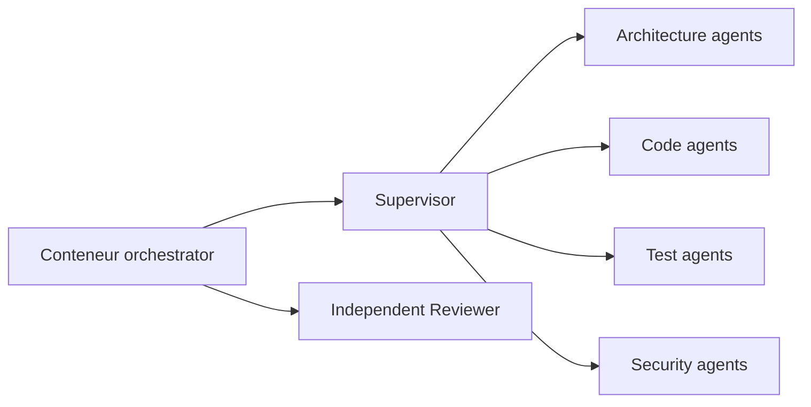
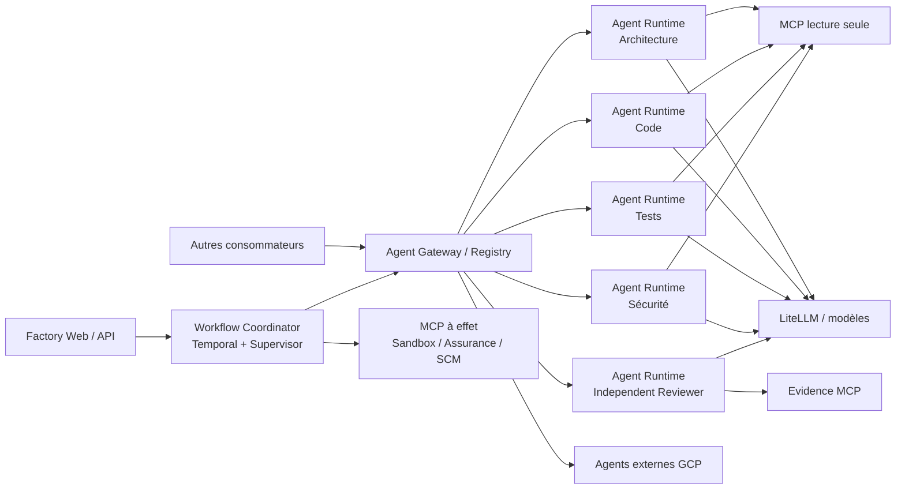

# Précision sur les agents

Les agents ne sont pas des services distincts dans `compose.yaml`. Ils sont exécutés comme des rôles internes au service `orchestrator`.

Le conteneur est déclaré dans [`compose.yaml`](../infrastructure/compose.yaml). Il embarque notamment :

- le runtime d’agents ;
- le catalogue des rôles ;
- les prompts ;
- les contrats JSON ;
- le scheduler de DAG ;
- les implémentations de workflows Temporal.

Les rôles sont configurés par ces variables Compose :

- `AI_FACTORY_AGENT_TOOL_ROLES` : rôles autorisés ;
- `AI_FACTORY_AGENT_TOOL_EVALUATION_ROLES` : rôles utilisables en shadow ;
- `AI_FACTORY_AGENT_TOOL_QUALIFICATION` : verdict de qualification ;
- `AI_FACTORY_AGENT_TOOL_SECURITY_PASSED` : validation sécurité.

Elles sont visibles dans [`compose.yaml`](../infrastructure/compose.yaml).

Le catalogue complet se trouve dans [`catalog-v1.yaml`](../resources/agents/catalog-v1.yaml), avec :

- `supervisor`
- `architecture-agent`
  - `impact-analysis`
  - `dependencies-contracts`
- `code-agent`
  - `developer`
  - `patch-repair`
- `test-agent`
  - `test-design`
  - `test-evidence`
- `security-agent`
  - `threat-model`
  - `security-findings`
- `independent-reviewer`

Le choix est volontaire : la hiérarchie multi-agent est une organisation logique, pas un microservice par agent. Les services séparés dans Compose sont plutôt les capacités techniques gouvernées : Temporal et les serveurs MCP.

Point important : même si leur code est embarqué dans l’orchestrateur, les agents hiérarchiques sont désactivés par défaut (`qualification=INCOMPLETE`, listes de rôles vides). Ils ne sont donc pas actuellement lancés comme un workflow hiérarchique opérationnel.

# Cible GCP

Si ces agents GCP doivent être invoqués par plusieurs systèmes, ils ne sont plus de simples rôles internes à la
Software Factory : ce sont des services autonomes avec leur propre API, identité, version et cycle de déploiement.

Aujourd’hui, le prototype les embarque tous dans `orchestrator`, comme indiqué dans ce document et dans la
[cible actuelle](version-1.2.0-archi-04/cible-architecture-multi-agent-hierarchique.md). Cette organisation
convient au prototype, mais ne représente pas une cible dans laquelle les agents sont mutualisés entre produits.

### Topologie Compose recommandée

Je n’irais cependant pas jusqu’à créer systématiquement un conteneur par sous-agent. La bonne granularité est une frontière de déploiement, de sécurité ou de montée en charge :

- `orchestrator` : workflow Temporal, Supervisor, DAG, budgets et décisions ;
- `agent-gateway` : contrat d’invocation versionné, authentification, routage et registre des agents ;
- `agent-runtime-analysis` : agents Architecture, Tests et éventuellement Sécurité en lecture seule ;
- `agent-runtime-code` : Developer et Patch Repair, fortement isolés ;
- `agent-runtime-review` : Independent Reviewer, séparé pour garantir son indépendance ;
- éventuellement un service par agent GCP réellement partagé ou ayant un SLA spécifique.

Les sous-agents courts comme `impact-analysis`, `test-design` ou `security-findings` peuvent rester des rôles configurés dans un runtime générique.

### Point de gouvernance essentiel

Les agents autonomes ne devraient pas appeler directement les opérations à effet :

- pas d’écriture SCM ;
- pas d’application directe de patch ;
- pas de validation de gate ;
- pas de secret de la Software Factory.

Ils produisent une réponse typée et des références de preuves. Le `WorkflowCoordinator` reste le seul composant autorisé à déclencher `sandbox-execution-mcp`, `assurance-mcp` et `scm-delivery-mcp`.

### Préparation de la cible GCP

Le même contrat d’invocation doit fonctionner localement dans Compose et sur GCP :

- Cloud Run privé pour les agents exposés par API et à charge intermittente ;
- Vertex AI Agent Engine pour un runtime d’agent managé ;
- GKE pour les workers longs, les besoins d’isolation avancée, les sidecars ou les traitements nécessitant davantage de contrôle ;
- une identité IAM minimale distincte par classe d’agent.

Cloud Run fournit des services privés et des identités de service dédiées
([sécurité Cloud Run](https://docs.cloud.google.com/run/docs/securing/security)). Vertex AI Agent Engine fournit
un runtime managé pour déployer et mettre à l'échelle des agents
([documentation Agent Engine](https://cloud.google.com/vertex-ai/generative-ai/docs/reasoning-engine/overview)).
Sur GKE, Workload Identity Federation permet d'attribuer des identités et autorisations distinctes aux runtimes
([documentation GKE](https://docs.cloud.google.com/kubernetes-engine/docs/concepts/workload-identity)).

La recommandation est donc de conserver temporairement le mode embarqué, puis d'ajouter un profil
`distributed-agents` avec un gateway et trois pools indépendants — analyse, code et review. Cela prépare GCP sans
imposer prématurément un microservice par rôle. L'argumentaire complet et la trajectoire de migration figurent dans
la [rétrodocumentation](RETRODOCUMENTATION.md#35-pertinence-de-modules-dagents-autonomes).
