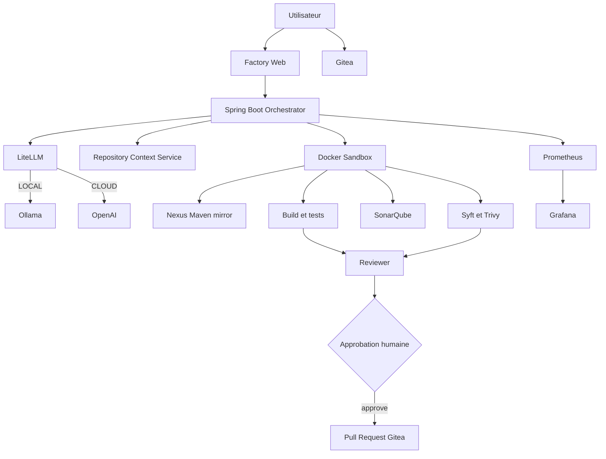
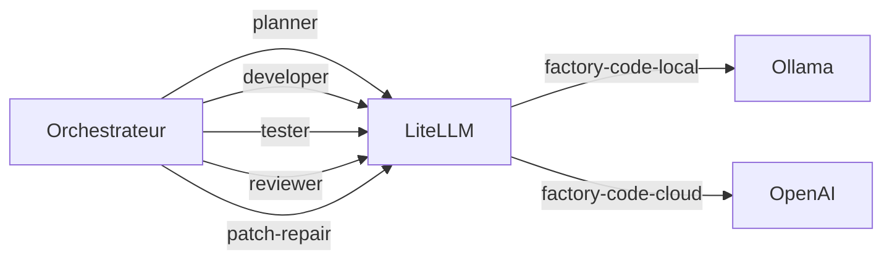

# AI Software Factory locale

## 1. Objectif du prototype

Ce dépôt implémente une usine logicielle agentique locale destinée à démontrer un enchaînement complet entre expression du besoin, génération de modification, contrôles automatisés et création de pull request sous validation humaine.

L'objectif réel du POC est de répondre à quatre questions :

1. Est-ce que le modèle produit des patches Git exploitables ?
2. Est-ce que ces patches passent les contrôles déterministes du dépôt cible ?
3. Est-ce que la séparation `génération -> validation -> approbation -> livraison` est suffisante pour une démonstration crédible ?
4. Quels sont les points durs à industrialiser ensuite ?

Le prototype ne cherche pas encore à résoudre la gouvernance complète d'une plateforme d'entreprise.

## 2. Résumé exécutable

Le comportement actuel est le suivant :

- le ticket est saisi depuis `factory-web` ou l'API ;
- l'orchestrateur clone le dépôt cible ;
- un `Planner` génère un plan ;
- un `Developer` génère un `unified diff` ;
- le diff est validé puis éventuellement réparé par un prompt dédié ;
- en exécution complète, le patch est appliqué en sandbox ;
- les tests Maven utilisent Nexus, SonarQube analyse les dépôts Maven, puis le SBOM et le scan Trivy sont exécutés ;
- un `Tester` et un `Reviewer` synthétisent les preuves ;
- la tâche attend une approbation humaine ;
- après approbation, une branche, un commit, un push et une PR Gitea sont créés.

## 3. Architecture d'ensemble



## 4. Composants réels du dépôt

| Répertoire ou service | Rôle |
|---|---|
| `web/` | interface ticket et suivi d'exécution |
| `orchestrator/` | API, orchestration, appels LLM, sandbox, PR |
| `litellm/` | config LiteLLM et point d'entrée |
| `sandbox/` | image d'exécution des patches, tests et scans |
| `agents/` | définition logique des agents |
| `prompts/` | prompts Planner, Developer, Tester, Reviewer, Patch Repair |
| `sample-repo/` | dépôt de démonstration poussé dans Gitea |
| `scripts/bootstrap-gitea.sh` | initialisation Gitea, dépôt demo et jeton Gitea |
| `scripts/bootstrap-sonar.sh` | attente de SonarQube et génération du jeton d'analyse |
| `scripts/demo.sh` | soumission d'une tâche de démonstration |
| `observability/` | Prometheus et Grafana |
| `docs/` | documentation du prototype |

## 5. Démarrage et initialisation

### Pré-requis

- Docker Compose v2 ;
- `make`, `curl`, `git` ;
- `jq` recommandé ;
- ressources mémoire suffisantes pour la stack locale.

### Démarrage

```bash
make init
make up
make model
make bootstrap
```

`make up` démarre tous les services, y compris SonarQube, Nexus, Prometheus et Grafana. Il n'existe plus de profil `full`. `make bootstrap` appelle `bootstrap-gitea.sh` puis `bootstrap-sonar.sh`, génère les jetons absents dans `.env`, puis recrée l'orchestrateur.

## 6. Variables de configuration importantes

Extrait de `.env.example` :

```bash
OLLAMA_MODEL=qwen2.5-coder:7b
OPENAI_MODEL=gpt-5.6-luna
OPENAI_API_KEY=
LITELLM_MASTER_KEY=local-dev-litellm-key
AI_FACTORY_CLOUD_ENABLED=false
ORCHESTRATOR_PORT=8088
WEB_APP_PORT=8080
GITEA_HTTP_PORT=3000
GITEA_SSH_PORT=2222
GITEA_ADMIN_USER=aiadmin
GITEA_ADMIN_PASSWORD=ChangeMe123!
GITEA_ADMIN_EMAIL=aiadmin@example.local
GITEA_TOKEN=
SONAR_TOKEN=
SONAR_ADMIN_LOGIN=admin
SONAR_ADMIN_PASSWORD=admin
```

Variables d'orchestration injectées dans le conteneur :

- `AI_FACTORY_LLM_BASE_URL`
- `AI_FACTORY_LLM_API_KEY`
- `AI_FACTORY_LOCAL_MODEL`
- `AI_FACTORY_CLOUD_MODEL`
- `AI_FACTORY_WORKSPACE_ROOT`
- `AI_FACTORY_WORKSPACE_VOLUME`
- `AI_FACTORY_SANDBOX_IMAGE`
- `AI_FACTORY_GITEA_BASE_URL`
- `AI_FACTORY_GITEA_PUBLIC_BASE_URL`
- `AI_FACTORY_GITEA_TOKEN`
- `AI_FACTORY_GITEA_USER`
- `AI_FACTORY_SONARQUBE_URL`
- `AI_FACTORY_SONAR_TOKEN`

## 7. Modèle d'exécution LLM

Le prototype ne distingue pas encore plusieurs moteurs spécialisés par rôle. Il utilise un routage logique via LiteLLM.



Règles actuelles :

- `llmMode=LOCAL` si absent ;
- `llmMode=CLOUD` refusé si `AI_FACTORY_CLOUD_ENABLED=false` ;
- LiteLLM contient deux alias :
  - `factory-code-local`
  - `factory-code-cloud`

## 8. Cycle de vie d'une tâche

### Création

L'API `POST /api/tasks` retourne immédiatement `202 Accepted` avec une vue de tâche.

La requête attend :

```json
{
  "repositoryUrl": "http://gitea:3000/aiadmin/customer-api.git",
  "baseBranch": "main",
  "requirement": "Add GET /customers/{id} with 404 and tests",
  "dryRun": true,
  "llmMode": "LOCAL"
}
```

Valeurs implicites :

- `baseBranch` -> `main`
- `dryRun` -> `true`
- `llmMode` -> `LOCAL`

### États utilisés

```text
QUEUED
CLONING
PLANNING
GENERATING_PATCH
APPLYING_PATCH
TESTING
SECURITY_SCANNING
REVIEWING
WAITING_APPROVAL
APPROVED
PR_CREATED
FAILED
```

### Détail du pipeline

#### Clonage et contexte

- clone Git du dépôt cible ;
- création d'un workspace dédié sous `AI_FACTORY_WORKSPACE_ROOT/<taskId>` ;
- collecte du contexte dépôt pour les prompts.

#### Planification

- appel du prompt `planner` ;
- persistance du résultat dans `.ai-plan.md`.

#### Génération du diff

- appel du prompt `developer` ;
- nettoyage des éventuels fences Markdown ;
- normalisation du diff ;
- écriture dans `changes.patch`.

#### Réparation automatique du patch

Si `git apply --check` échoue :

- conservation de la première tentative dans `changes.invalid.patch` ;
- appel du prompt `patch-repair` avec l'erreur Git ;
- nouvelle validation ;
- échec terminal si le second diff reste invalide.

#### Application et exécution

Si `dryRun=false` :

- application du patch en sandbox ;
- `git diff --check` ;
- tests ;
- synthèse `Tester` ;
- SBOM + Trivy.

Si `dryRun=true` :

- pas d'application du patch ;
- pas de tests ;
- pas de scan ;
- synthèse `Tester` basée uniquement sur le requirement et le patch proposé.

#### Revue finale

Le `Reviewer` reçoit :

- requirement ;
- plan ;
- patch ;
- synthèse de test ;
- synthèse sécurité.

La tâche termine en `WAITING_APPROVAL`.

### Livraison

Une approbation valide déclenche :

- création de branche `ai-factory/<taskId>` ;
- configuration Git auteur `AI Factory Agent` ;
- `git add -A` ;
- retrait des artefacts internes `.ai-*` du commit ;
- commit ;
- push ;
- création de pull request Gitea.

## 9. Interface utilisateur actuelle

L'interface `factory-web` propose deux vues :

- `Ticket`
- `Executions`

Fonctionnalités visibles :

- formulaire structuré pour le besoin ;
- sélection `LOCAL` ou `CLOUD` ;
- case `dry-run` ;
- suivi temps réel de la progression ;
- historique des exécutions ;
- consultation du plan, patch, tests, sécurité et review ;
- bouton d'approbation si la tâche est éligible.

Le formulaire assemble le requirement final à partir des champs :

- résumé ;
- objectif métier ;
- domaine ;
- comportement actuel ;
- comportement attendu ;
- critères d'acceptation ;
- contexte ;
- contraintes techniques ;
- hors périmètre ;
- validation attendue.

## 10. Artefacts produits par une tâche

Dans le workspace de tâche, on retrouve typiquement :

- `.ai-plan.md`
- `changes.patch`
- `changes.invalid.patch` en cas de première tentative invalide
- `.ai-review.md`
- `.ai-factory/test.txt`
- `.ai-factory/sonar.txt` si l'analyse SonarQube est exécutée
- `.ai-factory/trivy.txt`
- `.ai-factory/sbom.cdx.json`

Ces fichiers servent à la traçabilité locale et au débogage du POC.

## 11. Observabilité

L'orchestrateur expose Actuator sur :

- `/actuator/health`
- `/actuator/info`
- `/actuator/metrics`
- `/actuator/prometheus`

Prometheus collecte les métriques HTTP et les compteurs `ai_factory_tasks_submitted_total`, `ai_factory_tasks_completed_total` et `ai_factory_tasks_failed_total`. Grafana charge automatiquement le tableau de bord correspondant.

## 12. Ce que le prototype prouve

Le POC démontre déjà :

- un pipeline agentique cohérent ;
- un usage concret des rôles IA ;
- la nécessité d'un contrôle strict du format de patch ;
- l'intérêt du `dry-run` comme mode d'exploration sûr ;
- la valeur d'une approbation humaine avant livraison.

## 13. Ce qu'il ne résout pas encore

- persistance robuste des tâches ;
- multi-tenant ;
- RBAC/SSO ;
- gouvernance des modèles et des prompts ;
- sandbox réellement durcie ;
- contrôle fin des accès réseau ;
- stockage et audit centralisés ;
- analyse SonarQube des dépôts Gradle et npm ;
- planification distribuée ou scalabilité horizontale.

## 14. Suite logique d'industrialisation

1. Remplacer le pilotage Docker local par des jobs isolés.
2. Persister les tâches, artefacts et journaux d'audit.
3. Introduire une file de traitement et des workers dédiés.
4. Ajouter identité workload, gestionnaire de secrets et politiques réseau.
5. Gouverner les modèles, prompts, outils et niveaux d'autonomie.
6. Intégrer pleinement qualité, artefacts et supply chain signée.

## 15. Références

- [README](../README.md)
- [Architecture](architecture.md)
- [Sécurité](security.md)
