# AI Software Factory locale — prototype Docker

## 1. Objectif

Ce prototype matérialise, sur une seule machine, une version simplifiée d'une **usine de production logicielle basée sur l'IA**. L'objectif n'est pas de reproduire immédiatement toute la complexité d'une plateforme d'entreprise, mais de valider les principes structurants de l'architecture cible : orchestration agentique, contextualisation du code, exécution isolée, contrôles déterministes, sécurité, SBOM, revue et validation humaine avant création d'une Pull Request.

Le flux nominal est le suivant :

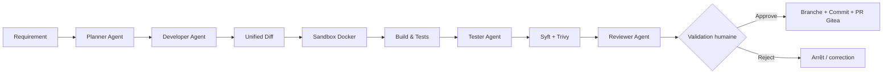

Le principe essentiel du prototype est le même que celui de la cible d'entreprise :

> **L'IA propose et exécute ; les contrôles déterministes et les validations gouvernées décident si le changement peut progresser.**

---

## 2. Pourquoi Docker Compose pour le prototype

Docker Compose est adapté à une première implémentation locale pour plusieurs raisons :

- mise en œuvre rapide ;
- reproductibilité de l'environnement ;
- isolation des composants ;
- déploiement sur un seul poste ;
- possibilité de simuler les plans de contrôle, d'exécution et d'assurance ;
- transition naturelle vers Kubernetes lorsque le POC est validé.

Le prototype repose donc sur des services persistants orchestrés par Docker Compose, complétés par des **containers éphémères** créés à la demande pour l'exécution des tâches agentiques.

---

## 3. Architecture fonctionnelle simplifiée

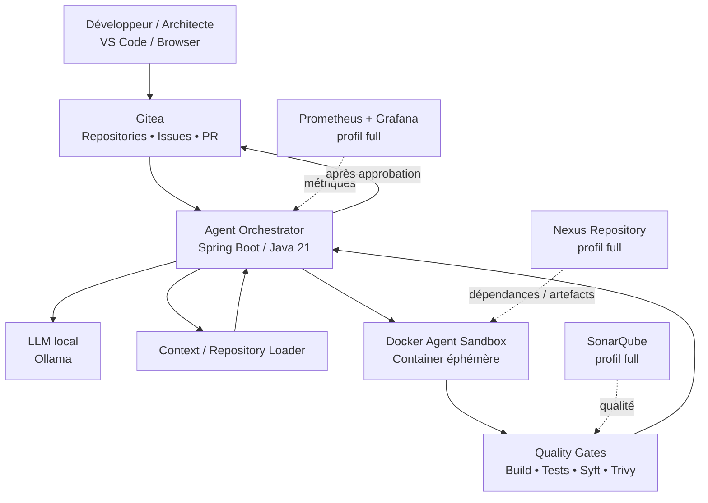

---

## 4. Architecture technique cible du prototype

La version locale conserve les mêmes plans logiques que l'architecture d'entreprise, mais avec des implémentations volontairement légères.

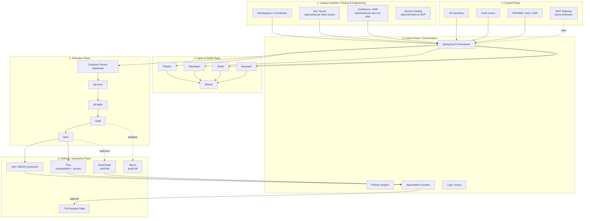

---

## 5. Composants du prototype

| Fonction | Composant | Rôle dans le POC |
|---|---|---|
| SCM / Issues / PR | Gitea | Dépôts Git, tickets, branches, Pull Requests |
| LLM local | Ollama | Exécution des rôles agentiques |
| Orchestration | Spring Boot 3.5 / Java 21 | Pilotage du workflow, appels LLM, sandboxes, états de tâche |
| Sandbox | Docker | Exécution isolée et éphémère des modifications |
| Tests | Maven / Gradle / npm | Validation fonctionnelle de base |
| SBOM | Syft / CycloneDX | Inventaire des composants logiciels |
| Vulnérabilités / secrets | Trivy | Analyse de sécurité |
| Qualité | SonarQube | Analyse qualité avancée, profil `full` |
| Artefacts | Nexus Repository | Proxy / dépôt d'artefacts, profil `full` |
| Observabilité | Spring Actuator + Prometheus + Grafana | Métriques techniques, profil `full` |

Le MVP ne cherche pas à intégrer immédiatement GitLab Duo, GitHub AI Controls ou un MCP Gateway complet. Il reproduit d'abord les **mécanismes architecturaux** afin de valider le modèle avant de remplacer les briques locales par leurs équivalents d'entreprise.

---

## 6. Organisation du projet

```text
ai-software-factory-local/
├── docker-compose.yml
├── Makefile
├── .env.example
├── orchestrator/
│   ├── Dockerfile
│   ├── pom.xml
│   └── src/...
├── sandbox/
│   └── Dockerfile
├── agents/
│   ├── planner.yaml
│   ├── developer.yaml
│   ├── tester.yaml
│   └── reviewer.yaml
├── prompts/
│   ├── planner.md
│   ├── developer.md
│   ├── tester.md
│   └── reviewer.md
├── sample-repo/
│   └── ...
├── scripts/
│   ├── bootstrap-gitea.sh
│   └── demo.sh
├── observability/
│   └── prometheus.yml
└── docs/
    ├── architecture.md
    ├── security.md
    └── AI_SOFTWARE_FACTORY_LOCAL.md
```

---

## 7. Principe d'orchestration agentique

Le premier prototype utilise **un seul LLM**, mais plusieurs rôles logiques. Cette approche évite de complexifier inutilement l'architecture dès le départ.

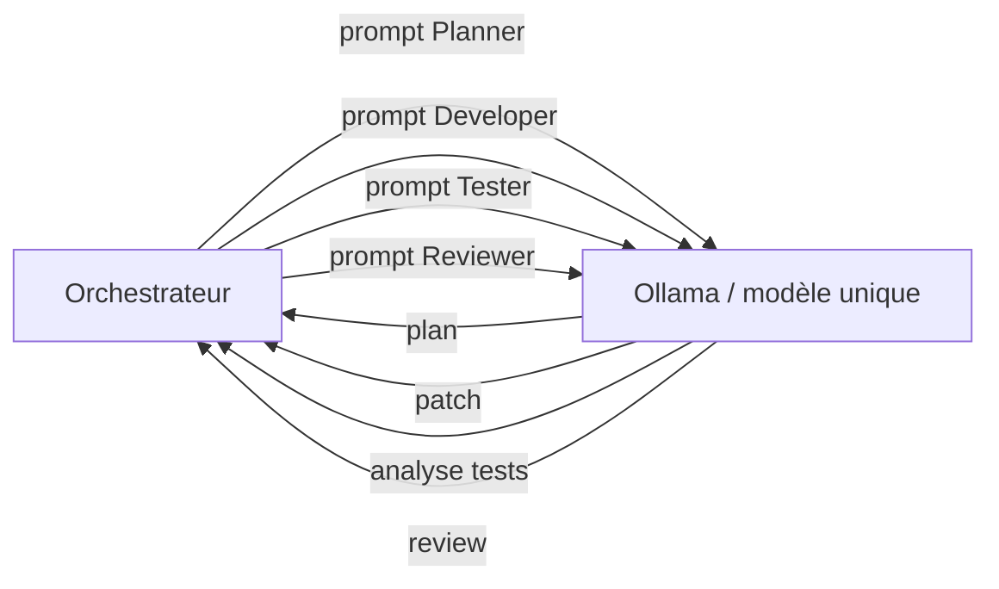

Les rôles sont définis par des prompts et des fichiers YAML distincts :

- **Planner** : comprend la demande et produit un plan de modification ;
- **Developer** : génère un patch strict au format unified diff ;
- **Tester** : examine les résultats de tests et complète l'analyse ;
- **Reviewer** : réalise une revue finale basée sur les preuves d'exécution.

Cette séparation permet ensuite d'affecter des modèles différents à chaque rôle sans modifier le workflow global.

---

## 8. Flux complet d'une tâche

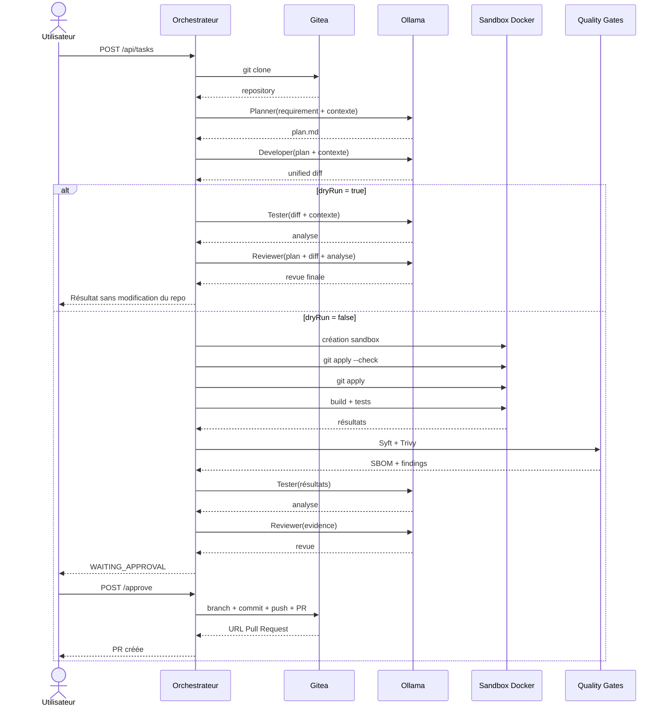

---

## 9. États de la tâche

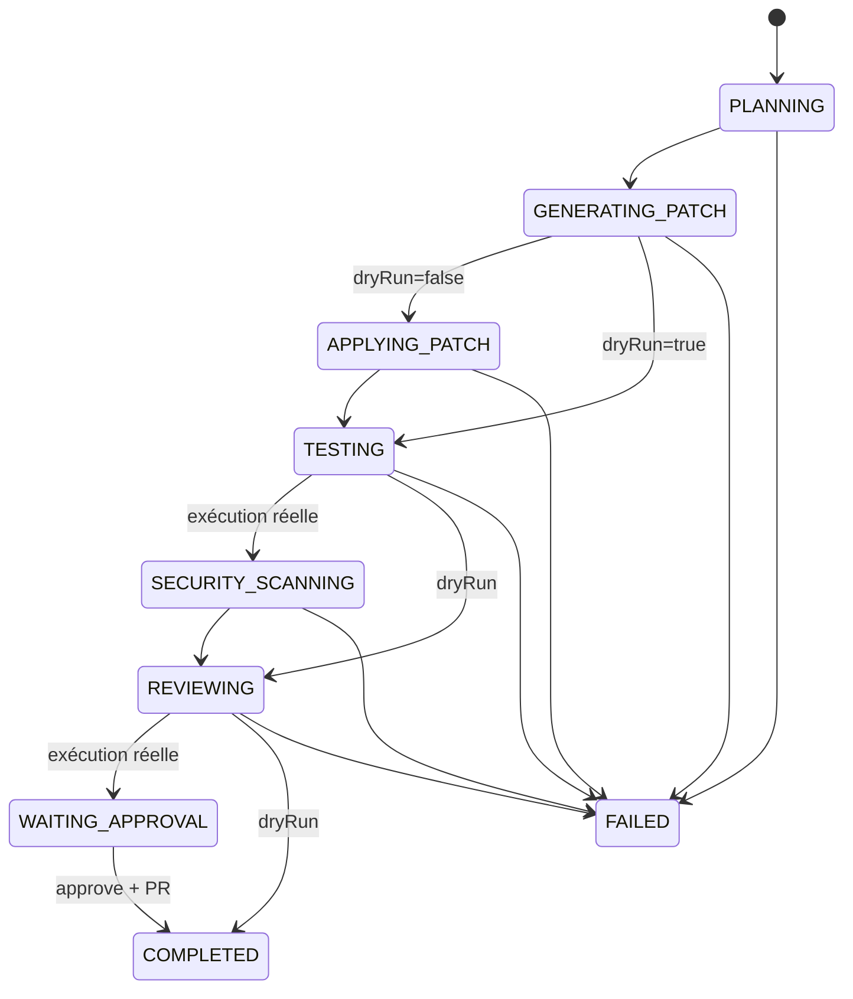

Les états principaux exposés par l'API sont :

- `PLANNING` ;
- `GENERATING_PATCH` ;
- `APPLYING_PATCH` ;
- `TESTING` ;
- `SECURITY_SCANNING` ;
- `REVIEWING` ;
- `WAITING_APPROVAL` ;
- `COMPLETED` ;
- `FAILED`.

---

## 10. Sandbox Docker

L'agent ne doit pas exécuter directement les commandes de build sur la machine hôte. L'orchestrateur crée donc un container temporaire pour chaque tâche.

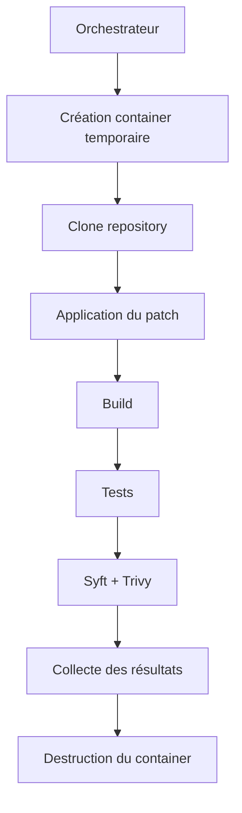

Le container de sandbox contient ou utilise :

- Git ;
- Java / Maven ou Gradle selon le projet ;
- Node/npm lorsque nécessaire ;
- Syft ;
- Trivy ;
- un workspace isolé ;
- des credentials temporaires ou limités au POC.

### Limitations de sécurité du MVP

Pour faciliter la création des sandboxes, l'orchestrateur monte le socket Docker :

```yaml
volumes:
  - /var/run/docker.sock:/var/run/docker.sock
```

Ce mécanisme est **acceptable uniquement pour un prototype local dédié**. Il donne à l'orchestrateur un niveau de privilège proche de root sur le moteur Docker.

Dans une cible industrielle, il faut remplacer ce mécanisme par une **Sandbox API**, des **Kubernetes Jobs** ou une technologie d'isolation équivalente.

---

## 11. Contrôles déterministes

La sortie du LLM n'est jamais considérée comme une preuve suffisante de qualité. Le prototype introduit des contrôles reproductibles et indépendants du modèle.

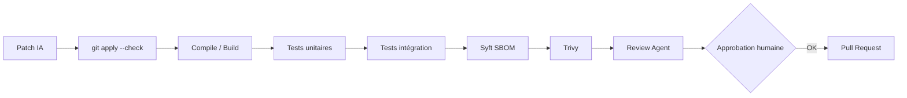

Le profil `full` ajoute SonarQube et Nexus comme briques supplémentaires, même si leur branchement automatique est volontairement laissé à adapter selon les projets et langages.

---

## 12. SBOM et sécurité

Syft génère un SBOM au format CycloneDX. Trivy analyse les vulnérabilités et les secrets.

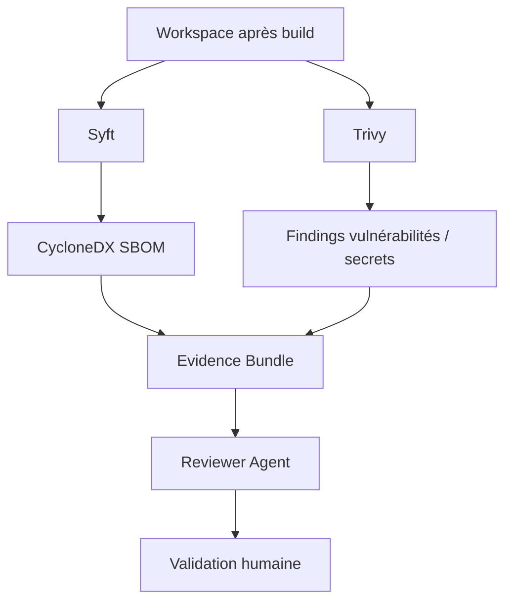

Dans une version industrielle, ce bloc serait étendu avec :

- signature des artefacts ;
- signature du SBOM ;
- provenance SLSA ;
- policy-as-code ;
- vérification de licences ;
- promotion contrôlée Dev → Test → Prod.

---

## 13. Validation humaine

Le prototype ne fait pas d'auto-merge. Après la génération du patch, les tests, les scans et la review, la tâche passe en `WAITING_APPROVAL`.

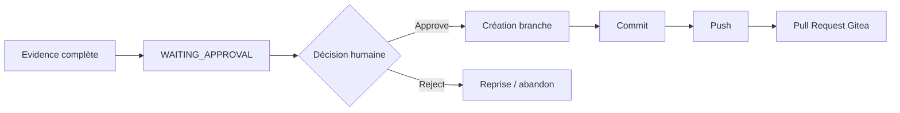

Cette étape matérialise le niveau d'autonomie **A2** : l'agent peut produire une PR, mais l'humain garde la décision de merge.

---

## 14. Niveaux d'autonomie visés

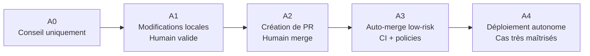

Le prototype est volontairement centré sur **A1/A2**. Une éventuelle ouverture A3 ne doit concerner que des changements faiblement risqués et très déterministes : documentation, génération de tests, refactorings simples ou mises à jour de dépendances encadrées.

---

## 15. Démarrage rapide

### Pré-requis

- Docker Desktop ou Docker Engine ;
- Docker Compose v2 ;
- `make` ;
- `curl` ;
- `git` ;
- `jq` recommandé.

Pour le profil core, 16 Go de RAM peuvent suffire. Pour le profil `full` combinant LLM local, SonarQube, Nexus, Prometheus et Grafana, 24 à 32 Go sont préférables.

### Initialisation

```bash
make init
make up
make model
make bootstrap
```

Services core :

- Gitea : `http://localhost:3000` ;
- Orchestrateur : `http://localhost:8088` ;
- Ollama : `http://localhost:11434`.

Le bootstrap crée un compte POC `aiadmin` ainsi qu'un repository `customer-api`.

---

## 16. Token Gitea

Le script `make bootstrap` tente de générer automatiquement un token Gitea et de le placer dans `.env`.

Si cette étape échoue, créer manuellement un token dans Gitea :

**Settings → Applications → Generate New Token**

Puis renseigner :

```bash
GITEA_TOKEN=...
```

et redémarrer l'orchestrateur :

```bash
docker compose up -d --force-recreate orchestrator
```

---

## 17. Démonstration en dry-run

Le mode `dryRun=true` permet de valider la qualité du raisonnement et la génération du diff sans modifier le repository.

```bash
make demo
curl -s http://localhost:8088/api/tasks | jq
```

Le flux exécuté est :

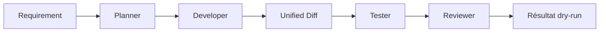

Ce mode est particulièrement utile pour mesurer la fiabilité du modèle sélectionné avant de lui permettre d'appliquer réellement ses modifications.

---

## 18. Exécution complète

Exemple :

```bash
curl -s -X POST http://localhost:8088/api/tasks \
  -H 'Content-Type: application/json' \
  -d '{
    "repositoryUrl":"http://gitea:3000/aiadmin/customer-api.git",
    "baseBranch":"main",
    "requirement":"Add GET /customers/{id}. Return 404 if not found and add tests.",
    "dryRun":false
  }' | jq
```

Suivi de la tâche :

```bash
curl -s http://localhost:8088/api/tasks/<TASK_ID> | jq
```

Lorsque la tâche arrive à `WAITING_APPROVAL` :

```bash
curl -s -X POST http://localhost:8088/api/tasks/<TASK_ID>/approve | jq
```

L'orchestrateur crée alors :

- une branche `ai-factory/<TASK_ID>` ;
- un commit ;
- un push ;
- une Pull Request Gitea.

---

## 19. Profil complet

```bash
make full
```

Le profil `full` ajoute :

- SonarQube : `http://localhost:9000` ;
- Nexus : `http://localhost:8081` ;
- Prometheus : `http://localhost:9090` ;
- Grafana : `http://localhost:3001`.

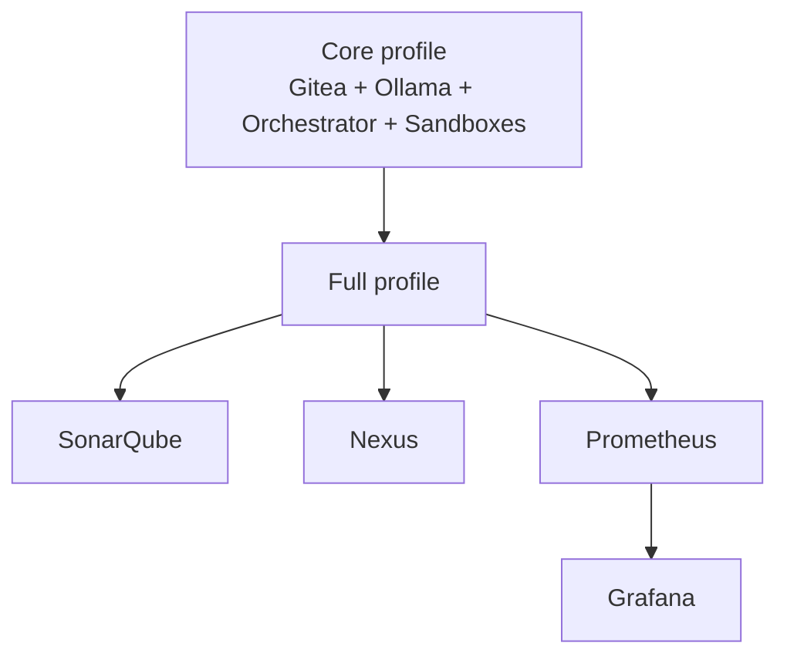

SonarQube et Nexus sont présents comme briques structurantes de l'usine, mais leur configuration projet, token et repository doit être adaptée au contexte réel.

---

## 20. Choix du modèle Ollama

Le modèle est configuré dans `.env` :

```bash
OLLAMA_MODEL=qwen2.5-coder:7b
```

Après modification :

```bash
make model
docker compose up -d --force-recreate orchestrator
```

Le critère le plus important du POC est la capacité du modèle à produire un **unified diff strict et applicable**. Un taux significatif d'échec à `git apply --check` est une mesure utile : il renseigne directement sur la robustesse du modèle dans un workflow industriel.

---

## 21. API du prototype

### Créer une tâche

`POST /api/tasks`

```json
{
  "repositoryUrl": "http://gitea:3000/aiadmin/customer-api.git",
  "baseBranch": "main",
  "requirement": "Add GET /customers/{id} with 404 and tests",
  "dryRun": true
}
```

### Lire une tâche

`GET /api/tasks/{id}`

### Lister les tâches

`GET /api/tasks`

### Approuver une tâche

`POST /api/tasks/{id}/approve`

---

## 22. Observabilité et KPIs

Le prototype doit permettre de mesurer autre chose que le nombre de tokens ou de lignes de code générées.

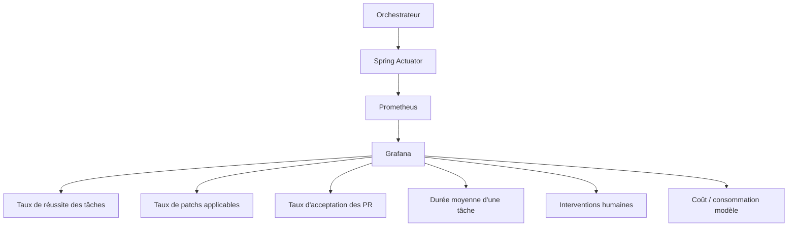

KPIs recommandés :

- taux de `git apply --check` réussi ;
- taux de build réussi après génération ;
- taux de tests réussis ;
- nombre de vulnérabilités introduites ;
- taux de PR acceptées ;
- temps moyen de traitement ;
- nombre d'interventions humaines ;
- coût par changement accepté ;
- taux d'échec par rôle agentique.

---

## 23. Limites assumées du MVP

Le prototype est volontairement simple :

- stockage des tâches en mémoire ;
- un seul LLM Ollama ;
- rôles logiques implémentés par prompts ;
- contexte chargé directement depuis le repository ;
- pas de MCP Gateway réel ;
- SonarQube et Nexus non branchés automatiquement à tous les workflows ;
- socket Docker monté dans l'orchestrateur ;
- pas de SSO / Keycloak ;
- pas de queue distribuée ;
- unified diff strict exigé ;
- pas d'auto-merge ;
- validation humaine obligatoire.

Ces limites sont intentionnelles : elles réduisent le nombre de variables à tester pendant la phase de validation.

---

## 24. Sécurité du prototype

### Docker socket

Le socket Docker constitue le principal compromis du POC. Un container qui peut piloter `/var/run/docker.sock` peut généralement obtenir un contrôle étendu sur l'hôte Docker.

### Réseau

L'application du patch peut être exécutée sans réseau. Les builds et scans peuvent rejoindre le réseau local de la factory afin de résoudre les dépendances et d'accéder aux services internes du POC.

Dans une cible d'entreprise, cela doit devenir :

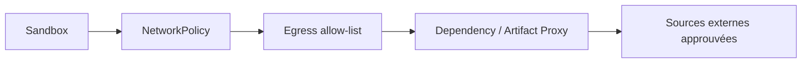

### Credentials

Les tokens stockés dans `.env` sont adaptés à un POC local uniquement. La cible doit utiliser :

- identité de workload ;
- tokens à durée de vie courte ;
- Secret Manager / Vault ;
- scopes minimaux.

---

## 25. Trajectoire d'industrialisation

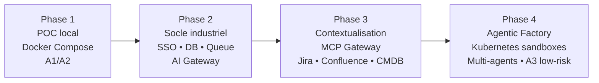

### Phase 1 — POC local

- Docker Compose ;
- Gitea ;
- Ollama ;
- Spring Boot Orchestrator ;
- Docker sandboxes ;
- Syft / Trivy ;
- approbation humaine.

### Phase 2 — socle industriel

- PostgreSQL pour persister les tâches ;
- Kafka ou RabbitMQ pour découpler les traitements ;
- SSO / RBAC ;
- AI Gateway multi-modèles ;
- policies centralisées ;
- télémétrie complète.

### Phase 3 — contextualisation

- MCP Gateway privé ;
- Git ;
- Jira ;
- Confluence ;
- CMDB ;
- API Catalog ;
- SonarQube ;
- Nexus / Artifactory.

### Phase 4 — Agentic Factory

- remplacement du socket Docker par Kubernetes Jobs ou Sandbox API ;
- agents spécialisés ;
- modèles différents selon les tâches ;
- workflows multi-agents ;
- niveaux d'autonomie A0 à A3 ;
- supply chain signée ;
- provenance SLSA.

---

## 26. Architecture cible après industrialisation

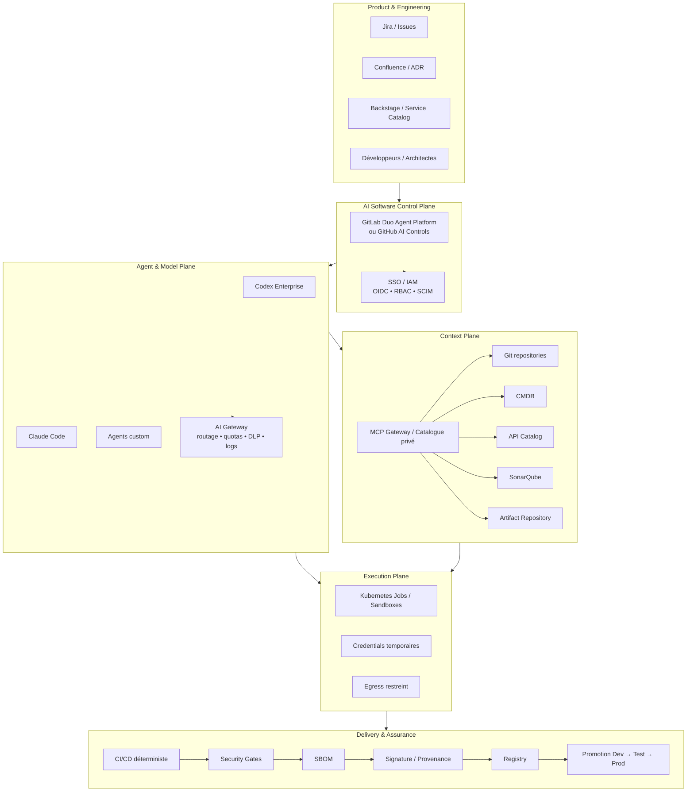

---

## 27. Conclusion

Ce prototype permet de tester localement les mécanismes essentiels d'une AI Software Factory sans dépendre immédiatement d'une plateforme SaaS ou d'un environnement Kubernetes complexe.

Il valide notamment :

1. la transformation d'une exigence en plan ;
2. la génération de code sous forme de patch ;
3. l'exécution isolée ;
4. la validation par build et tests ;
5. la génération d'un SBOM ;
6. le scan de vulnérabilités et de secrets ;
7. la revue agentique ;
8. la validation humaine ;
9. la création d'une Pull Request ;
10. la mesure de KPIs utiles à une future industrialisation.

Le POC doit être considéré comme une **miniature fonctionnelle de l'architecture cible**, et non comme une architecture de production. Sa valeur principale est de permettre de mesurer la qualité réelle des agents, la robustesse des workflows, la sécurité des sandboxes et le niveau d'autonomie acceptable avant de généraliser le modèle à l'échelle de l'entreprise.
