# AI Software Factory

## Executive Summary — accélérer la production logicielle sous contrôle

| Élément | Référence |
|---|---|
| Public | Direction, responsables IT, responsables Architecture, Engineering et Sécurité |
| Initiative | AI Software Factory locale |
| Version analysée | Prototype 1.2.0 — architecture 04 |
| Branche | `features/multiagents` |
| Date | 4 septembre 2026 |
| Décision recherchée | Autoriser une phase de consolidation et de qualification, sans passage immédiat en production |

> **Message clé.** Le prototype démontre qu’il est possible d’automatiser la préparation d’une évolution logicielle
> avec l’IA tout en conservant des contrôles déterministes et une responsabilité humaine. Il ne constitue pas encore
> une plateforme de production : la priorité est désormais de sécuriser, rendre durable et mesurer la solution avant
> toute généralisation.

---

## 1. Synthèse exécutive

L’AI Software Factory transforme un besoin fonctionnel en une **Pull Request brouillon vérifiée**, prête à être
examinée par une équipe de développement. Elle automatise l’analyse du ticket, la proposition de code, les tests,
les contrôles de qualité et de sécurité, puis attend une approbation humaine avant toute livraison dans le gestionnaire
de code source.

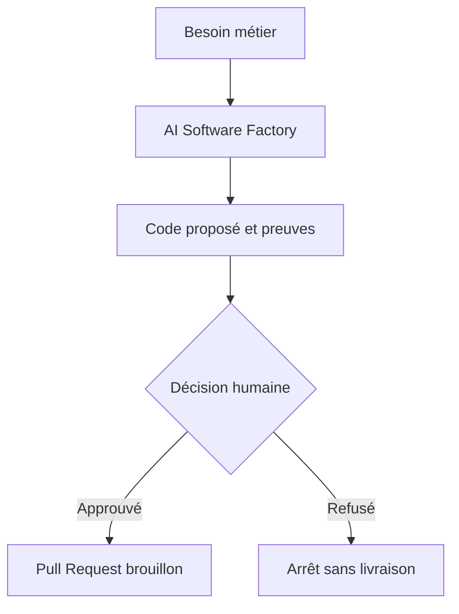

### Ce que le prototype démontre

- une chaîne complète du ticket à la Pull Request ;
- l’utilisation de plusieurs rôles IA spécialisés sans leur donner d’autorité technique directe ;
- des contrôles de tests, qualité, SBOM et vulnérabilités avant livraison ;
- une séparation entre raisonnement IA, exécution du code et accès au SCM ;
- une approbation humaine obligatoire ;
- une architecture préparée pour évoluer vers un fonctionnement multi-agent durable.

### Ce qu’il ne faut pas en déduire

- la solution n’effectue ni fusion, ni déploiement en production ;
- le mode multi-agent hiérarchique est présent mais désactivé par défaut ;
- la reprise durable après incident n’est pas encore opérationnelle de bout en bout ;
- la plateforme locale n’est pas adaptée à une exposition d’entreprise ;
- aucun gain financier ou de productivité ne peut être affirmé avant une campagne mesurée.

---

## 2. Proposition de valeur

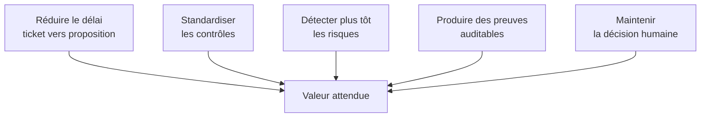

| Axe | Apport attendu | Indicateur à mesurer |
|---|---|---|
| Productivité | Réduire le travail répétitif d’analyse, de patch et de préparation de PR | Temps médian ticket → PR |
| Qualité | Appliquer systématiquement tests et quality gate | Taux de PR acceptées et régressions détectées |
| Sécurité | Produire SBOM et scan de vulnérabilités/secrets avant livraison | Findings bloquants détectés avant revue |
| Traçabilité | Relier besoin, commit source, patch, preuves, décision et PR | Taux de dossiers de preuve complets |
| Expérience développeur | Donner une proposition directement révisable | Temps humain de reprise et nombre d’itérations |
| Gouvernance IA | Encadrer modèles, rôles, outils, coûts et permissions | Appels refusés, budgets, coût par tâche et incidents |

La valeur ne doit pas être évaluée uniquement sur la quantité de code généré. Le bon indicateur est la capacité à
produire plus rapidement une proposition **utile, sûre, explicable et révisable**.

---

## 3. Fonctionnement en une vue

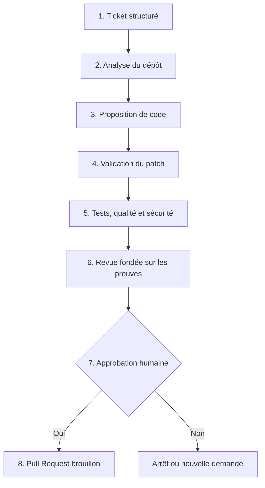

### Principe de contrôle

Le modèle d’IA propose un plan, un patch ou une analyse. Il ne choisit pas librement une commande, une image, un
réseau ou une action sur le SCM. Les opérations à effet sont exécutées par des composants déterministes, sous
contrôle de politiques et après validation des formats attendus.

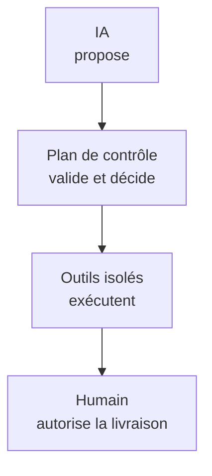

Cette séparation est le fondement de la maîtrise du risque : **autonomie de raisonnement ne signifie pas autorité
d’exécution**.

---

## 4. Architecture actuelle

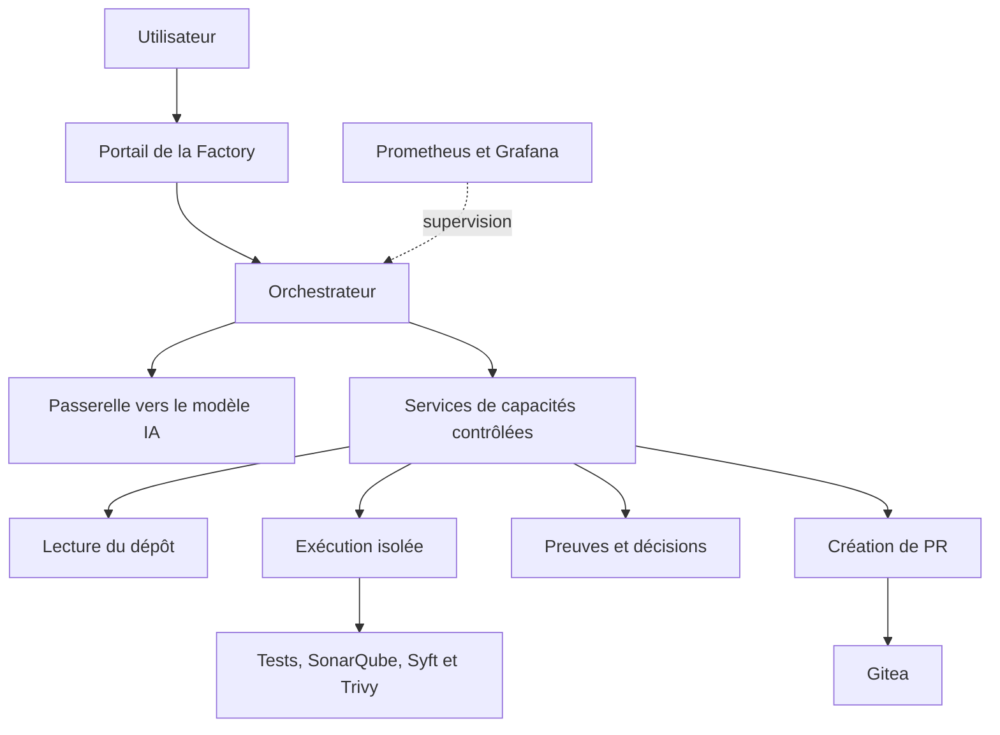

### Lecture pour un décideur

- l’orchestrateur conserve la maîtrise du workflow ;
- les agents sont aujourd’hui des rôles logiciels internes, pas une multitude de microservices ;
- les capacités sensibles sont séparées en services spécialisés ;
- le code généré est exécuté dans des conteneurs éphémères ;
- l’accès au SCM est isolé derrière un service de livraison ;
- le déploiement fourni reste mono-hôte et destiné au développement ou à la démonstration.

Ce choix de **monolithe modulaire entouré de services de capacités** est adapté au prototype : il permet de valider
les concepts sans introduire prématurément toute la complexité d’un système distribué.

---

## 5. Architecture multi-agent préparée

Le projet prépare une organisation dans laquelle un superviseur décompose un besoin en travaux spécialisés. Le
workflow reste toutefois seul autorisé à déclencher des effets.

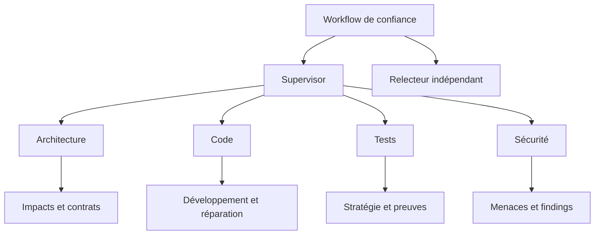

### Garanties recherchées

- spécialisation des analyses ;
- travaux parallèles uniquement sur des périmètres compatibles ;
- revue indépendante du superviseur ;
- budgets de temps, tokens, coût et appels d’outils ;
- contrats de sortie versionnés ;
- arrêt ou retour au pipeline de référence en cas de doute.

### Situation réelle

Ce mode est **désactivé par défaut** : qualification `INCOMPLETE`, rôles actifs vides et Temporal non utilisé par
l’orchestrateur. Il doit rester en qualification tant que les preuves, la durabilité, la supervision et le rollback
ne sont pas démontrés.

---

## 6. Niveau de maturité

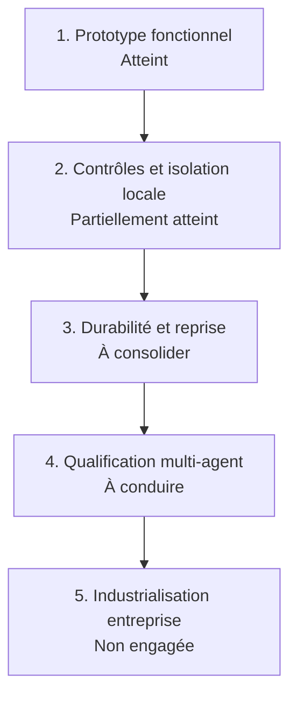

| Dimension | Appréciation | Commentaire |
|---|---|---|
| Démonstration fonctionnelle | Avancée | Workflow complet jusqu’à la PR brouillon |
| Architecture et contrats | Avancée | Frontières MCP, schémas et politiques documentés |
| Contrôles qualité/sécurité | Intermédiaire | Présents localement, à qualifier sur un corpus représentatif |
| Persistance et reprise | Faible à intermédiaire | Temporal préparé mais non actif ; état des tâches en mémoire |
| Sécurité d’entreprise | Faible | Pas de SSO/RBAC, secrets locaux, socket Docker |
| Observabilité | Intermédiaire | Dashboards présents, collecte et alerting incomplets |
| Exploitabilité | Intermédiaire | Runbooks présents, sauvegarde/PRA à automatiser et tester |
| Scalabilité et haute disponibilité | Faible | Déploiement mono-hôte |

La prochaine étape pertinente n’est pas la généralisation. C’est une phase de **consolidation mesurable**.

---

## 7. Risques principaux

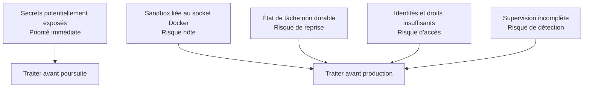

| Risque | Conséquence | Réponse recommandée |
|---|---|---|
| Valeurs sensibles dans un fichier suivi par Git | Compromission possible de secrets | Rotation immédiate, suppression et purge contrôlée |
| Accès au socket Docker par le contrôleur sandbox | Compromission potentielle de l’hôte | Remplacer par une sandbox Kubernetes/GKE dédiée |
| Tâches conservées en mémoire JVM | Perte de suivi après redémarrage | Activer le workflow durable et une projection reconstruisible |
| Absence de SSO, RBAC et séparation multi-tenant | Accès trop large | Intégrer identité d’entreprise et autorisations minimales |
| Secrets dans des fichiers locaux | Rotation et audit fragiles | Secret Manager et identités workload |
| Kill switch non monté dans le déploiement actuel | Confinement fin indisponible | Rendre le contrôle opérable et le tester |
| Prometheus non persistant et alerting non routé | Perte de métriques et incidents non notifiés | Persistance, couverture complète et Alertmanager |
| Images partiellement non épinglées | Dérive de supply chain | Digests, signatures et provenance |

Ces risques sont connus et traitables, mais ils interdisent une exposition en production dans l’état actuel.

---

## 8. Cible d’entreprise

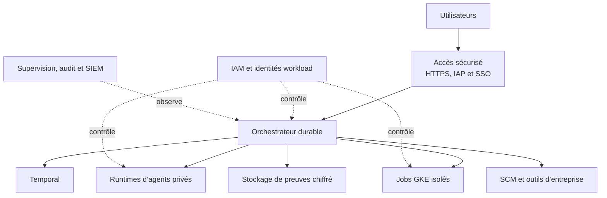

### Principes de la cible

- orchestrateur durable avec reprise et versionnement des workflows ;
- agents exposés uniquement par des interfaces privées et authentifiées ;
- exécution du code non fiable dans des Jobs GKE fortement isolés ;
- identité dédiée et privilèges minimaux pour chaque classe de composant ;
- secrets gérés par un coffre d’entreprise ;
- preuves chiffrées, immuables et soumises à rétention ;
- intégration avec le SCM, la qualité et les artefacts d’entreprise ;
- supervision centralisée et audit exporté vers le SIEM.

La cible ne nécessite pas un microservice par sous-agent. Les runtimes doivent être séparés seulement lorsqu’une
frontière de sécurité, de charge, de disponibilité, de résidence ou de gouvernance le justifie.

---

## 9. Trajectoire proposée

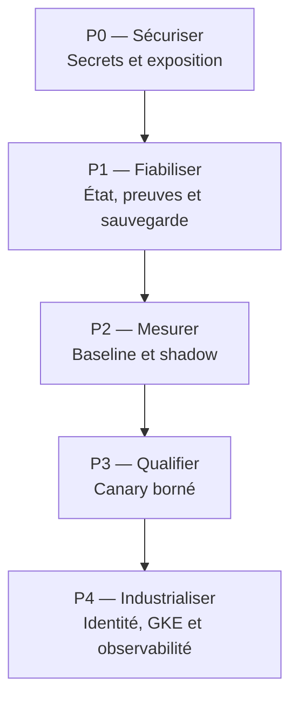

### P0 — Mesures immédiates

- faire tourner les secrets potentiellement exposés ;
- nettoyer le dépôt et renforcer la détection de secrets ;
- maintenir la solution dans une zone locale isolée ;
- formaliser le gel des admissions et la sauvegarde avant maintenance.

### P1 — Consolidation du socle

- rendre les tâches et workflows durables ;
- intégrer Evidence de bout en bout ;
- automatiser et tester sauvegarde et restauration ;
- rendre le kill switch réellement opérable ;
- compléter la collecte, la persistance et la notification des alertes.

### P2 — Évaluation contrôlée

- constituer un corpus représentatif de projets et tickets ;
- comparer le pipeline et le mode multi-agent en shadow ;
- mesurer qualité, durée, coût, taux d’intervention et sécurité ;
- établir des seuils de promotion objectifs.

### P3 — Canary limité

- commencer par des rôles de lecture et d’analyse ;
- limiter les dépôts, équipes et classes de risque ;
- conserver l’approbation humaine et le pipeline de rollback ;
- étendre uniquement après une fenêtre stable et une décision formelle.

### P4 — Industrialisation

- migrer l’exécution non fiable vers GKE ;
- intégrer IAM, SSO, RBAC/ABAC et Secret Manager ;
- mettre en place HA, SLO, audit centralisé et PRA ;
- connecter les services d’entreprise.

---

## 10. Gouvernance proposée

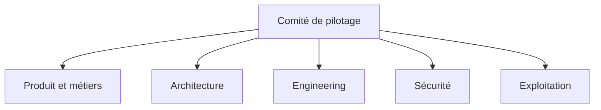

| Instance / rôle | Décision principale |
|---|---|
| Comité de pilotage | Financement, périmètre, calendrier et critères de succès |
| Produit | Cas d’usage éligibles et valeur attendue |
| Architecture | Contrats, frontières, trajectoire et cohérence SI |
| Engineering | Maintenabilité, qualité du code et intégration aux pratiques de développement |
| Sécurité | Modèle de menace, isolation, secrets, permissions et conformité |
| Exploitation | SLO, capacité, observabilité, sauvegarde, incident et reprise |
| Relecteur humain | Acceptation d’une proposition avant effet SCM |

### Principe de promotion

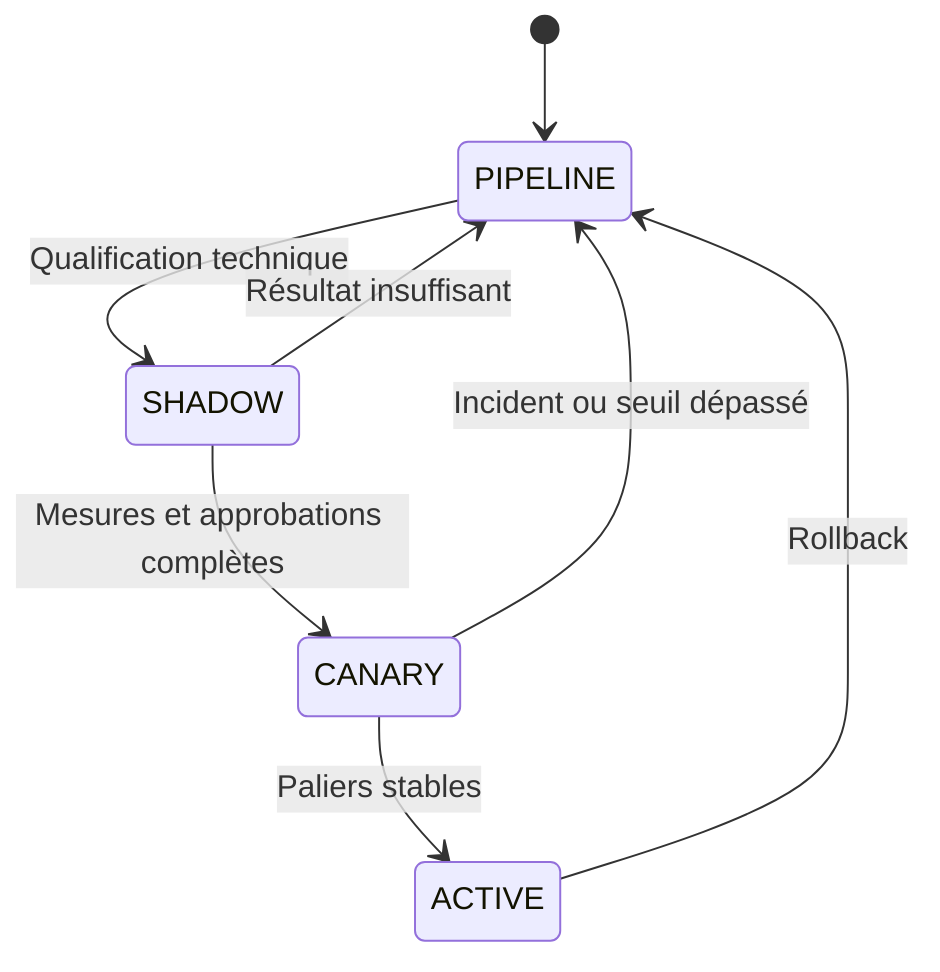

Chaque changement de modèle, prompt, contrat, politique ou outil impose une nouvelle qualification. Le passage de
palier est une décision explicite, jamais une conséquence automatique du temps écoulé.

---

## 11. Cadre de mesure

### Tableau de bord de décision

| Catégorie | Mesures minimales |
|---|---|
| Valeur | Temps ticket → PR, taux de propositions utiles, temps humain économisé |
| Qualité | Tests réussis, défauts détectés, régressions et taux de reprise manuelle |
| Sécurité | Findings bloquants, secrets détectés, violations de politique et appels refusés |
| Coût | Tokens, coût modèle, compute sandbox et coût par proposition acceptée |
| Performance | Durée totale, p95 par étape, files et saturation |
| Fiabilité | Taux de succès, erreurs système, retries et tâches indéterminées |
| Gouvernance | Preuves complètes, approbations valides, dérives de versions et incidents |
| Adoption | Nombre d’équipes, dépôts éligibles et satisfaction des développeurs |

### Critères suggérés pour poursuivre

- aucune violation d’un invariant de sécurité ;
- aucune livraison sans approbation valide ;
- preuves complètes et vérifiables ;
- amélioration mesurable par rapport au pipeline de référence ;
- coût par tâche connu et sous plafond ;
- rollback et restauration démontrés ;
- avis favorable conjoint Architecture, Sécurité, Engineering et Exploitation.

Les seuils numériques doivent être définis après constitution de la baseline. Les fixer sans mesures réelles
produirait une précision artificielle.

---

## 12. Décisions demandées

### Proposition

Autoriser une phase limitée de consolidation et de qualification, avec le périmètre suivant :

1. traitement des risques de priorité immédiate ;
2. durabilisation du workflow, de l’état et des preuves ;
3. observabilité et reprise testées ;
4. campagne comparative pipeline versus multi-agent en shadow ;
5. revue de décision avant tout canary.

### Décisions attendues des responsables

| Décision | Choix recommandé |
|---|---|
| Poursuite de l’initiative | Oui, sous forme de phase de qualification bornée |
| Mise en production immédiate | Non |
| Périmètre initial | Dépôts et tickets non sensibles, explicitement allow-listés |
| Autorité de livraison | Workflow déterministe après approbation humaine |
| Baseline | Conserver le pipeline actuel comme référence et rollback |
| Critère d’extension | Valeur et sécurité démontrées par des mesures appariées |
| Cible d’exécution | GKE pour le code non fiable avant usage d’entreprise |
| Gouvernance | Validation conjointe Produit, Architecture, Sécurité, Engineering et Exploitation |

### Résultat attendu de la phase

Un dossier de décision fondé sur des preuves, permettant de choisir entre :

- arrêter l’initiative si la valeur ou la maîtrise du risque est insuffisante ;
- conserver un usage local ciblé ;
- ouvrir un canary limité ;
- engager l’industrialisation de la plateforme.

---

## 13. Conclusion

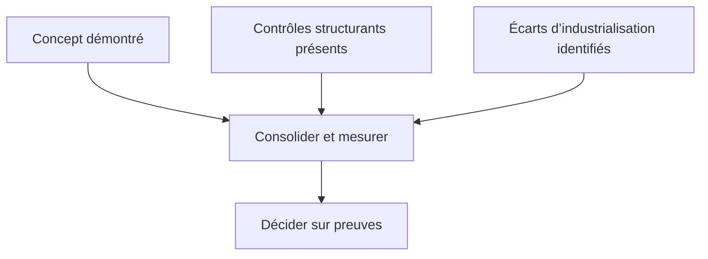

L’AI Software Factory apporte une réponse crédible à l’enjeu d’accélération du développement par l’IA, car elle
maintient une séparation nette entre proposition, contrôle, exécution et autorisation humaine.

Le prototype a atteint le niveau nécessaire pour justifier une **phase de qualification**, mais pas une mise en
production. La décision recommandée est donc d’investir de manière bornée dans la sécurité, la durabilité,
l’observabilité et la mesure de valeur, puis de revenir devant les responsables avec des résultats comparatifs et
un risque résiduel objectivé.

---

## Références

- [Présentation d’architecture détaillée](PRESENTATION-ARCHITECTURE-AI-SOFTWARE-FACTORY.md)
- [Guide de maintenance et d’exploitation](GUIDE-MAINTENANCE-EXPLOITATION-AI-SOFTWARE-FACTORY.md)
- [Rétrodocumentation](RETRODOCUMENTATION.md)
- [État du prototype 1.2.0](version-1.2.0-archi-04/ETAT-PROTO-1.2.0.md)
- [Architecture multi-agent hiérarchique](version-1.2.0-archi-04/cible-architecture-multi-agent-hierarchique.md)
- [Runbooks](runbooks/README.md)

