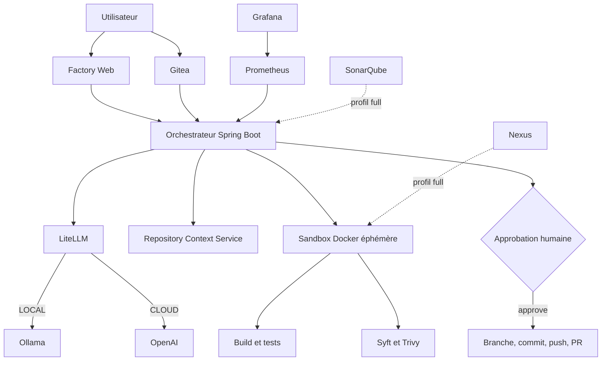
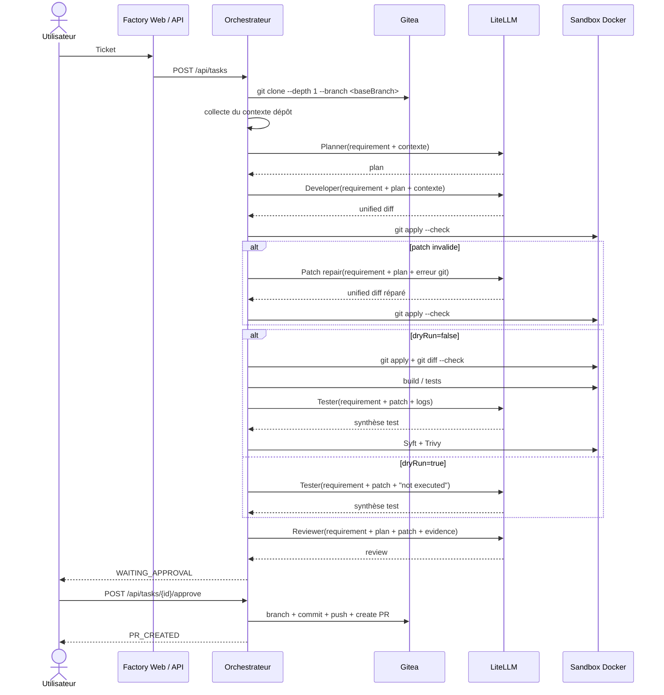

# Architecture du prototype

## Positionnement

Le dépôt implémente un prototype local centré sur quatre idées :

- un point d'entrée unique pour la demande de changement ;
- une génération de patch par rôles LLM distincts ;
- une exécution isolée avec contrôles déterministes ;
- une validation humaine avant toute création de pull request.

L'architecture n'est pas une plateforme d'entreprise complète. Elle reproduit surtout les mécanismes de contrôle, pas encore la gouvernance ni l'isolation cible.

## Architecture logique



## Services Docker Compose

### Socle core

| Service | Rôle |
|---|---|
| `gitea-db` | base PostgreSQL de Gitea |
| `gitea` | dépôts Git, API, pull requests |
| `ollama` | exécution locale du modèle |
| `litellm` | alias de modèles et routage local/cloud |
| `orchestrator` | moteur principal du workflow |
| `factory-web` | interface utilisateur |

### Profil `full`

| Service | Rôle |
|---|---|
| `sonar-db` | base PostgreSQL de SonarQube |
| `sonarqube` | analyse qualité additionnelle |
| `nexus` | dépôt/proxy d'artefacts |
| `prometheus` | collecte de métriques |
| `grafana` | visualisation |

## Flux réel d'une tâche



## Pipeline détaillé

### 1. Saisie et préparation

- `factory-web` construit un texte de requirement structuré à partir du formulaire.
- L'API `POST /api/tasks` crée une tâche en mémoire et lance le pipeline en asynchrone.
- La branche par défaut est `main` si `baseBranch` est vide.
- `dryRun` vaut `true` si le champ n'est pas fourni.
- `llmMode` vaut `LOCAL` si le champ n'est pas fourni.

### 2. Contextualisation

- l'orchestrateur clone le dépôt cible dans `AI_FACTORY_WORKSPACE_ROOT` ;
- le workspace est également monté via le volume Docker nommé `factory-workspace` ;
- le contexte est extrait à partir du dépôt cloné avant les appels LLM.

### 3. Génération du patch

- le `Planner` produit `.ai-plan.md` ;
- le `Developer` produit `changes.patch` ;
- le patch est nettoyé des éventuels fences Markdown ;
- seul un `unified diff` strict est accepté.

### 4. Validation et réparation du patch

- `git apply --check changes.patch` est exécuté en sandbox sans réseau ;
- si la validation échoue, le patch initial est conservé dans `changes.invalid.patch` ;
- un prompt de réparation demande au modèle de régénérer un diff complet ;
- si la seconde validation échoue, la tâche passe en `FAILED`.

### 5. Exécution déterministe

En `dryRun=false` :

- application du patch ;
- contrôle `git diff --check` ;
- lancement automatique des tests selon le dépôt :
  - `./mvnw -B test`
  - `mvn -B test`
  - `./gradlew test`
  - `npm test -- --runInBand`

En `dryRun=true` :

- aucun patch n'est appliqué ;
- aucun test ni scan n'est exécuté ;
- le `Tester` reçoit explicitement le fait que l'exécution déterministe a été ignorée.

### 6. SBOM et sécurité

En exécution complète :

- `syft dir:. -o cyclonedx-json=.ai-factory/sbom.cdx.json`
- `trivy fs --skip-db-update --scanners vuln,secret --severity HIGH,CRITICAL`

Les artefacts utiles restent dans le workspace :

- `.ai-factory/sbom.cdx.json`
- `.ai-factory/trivy.txt`
- `.ai-factory/test.txt`
- `.ai-review.md`

### 7. Revue et livraison

- le `Reviewer` reçoit requirement, plan, patch, synthèse de test et synthèse sécurité ;
- la tâche passe en `WAITING_APPROVAL` ;
- l'approbation déclenche commit, push et création de PR ;
- les fichiers de travail IA sont exclus du commit via `git reset -- .ai-plan.md changes.patch .ai-review.md .ai-factory`.

## API exposée

### `POST /api/tasks`

Crée une tâche et retourne `202 Accepted`.

Exemple :

```json
{
  "repositoryUrl": "http://gitea:3000/aiadmin/customer-api.git",
  "baseBranch": "main",
  "requirement": "Add GET /customers/{id} with 404 and tests",
  "dryRun": true,
  "llmMode": "LOCAL"
}
```

### `GET /api/tasks`

Liste les tâches connues en mémoire.

### `GET /api/tasks/{id}`

Retourne l'état complet de la tâche, dont :

- `status`
- `workspace`
- `plan`
- `patch`
- `testSummary`
- `securitySummary`
- `review`
- `pullRequestUrl`
- `error`
- `steps`
- `createdAt`
- `updatedAt`

### `POST /api/tasks/{id}/approve`

Valide une tâche en attente et déclenche la création de PR.

Contraintes :

- la tâche doit être en `WAITING_APPROVAL` ;
- `dryRun` doit être `false` ;
- `GITEA_TOKEN` doit être configuré.

### `GET /api/capabilities`

Expose les capacités de l'usine visibles par l'interface, actuellement :

```json
{
  "cloudEnabled": false
}
```

## Données et persistance

- les tâches ne sont pas stockées en base ;
- un redémarrage de l'orchestrateur vide l'historique en mémoire ;
- les workspaces sur disque restent dans le volume Docker tant qu'il n'est pas détruit ;
- Gitea, Ollama et les services du profil `full` ont chacun leur propre volume Docker.

## Écarts avec une cible industrielle

- pas de scheduler distribué ;
- pas de file de messages ;
- pas de contrôle d'accès centralisé ;
- pas d'identité workload ;
- pas de sandbox Kubernetes ;
- pas de politique réseau fine ;
- pas de gouvernance des prompts, modèles ou outils ;
- pas de séparation stricte entre control plane et execution plane.

Le prototype reste utile pour valider la chaîne d'exécution, la qualité des patches et les points de friction du workflow agentique.
