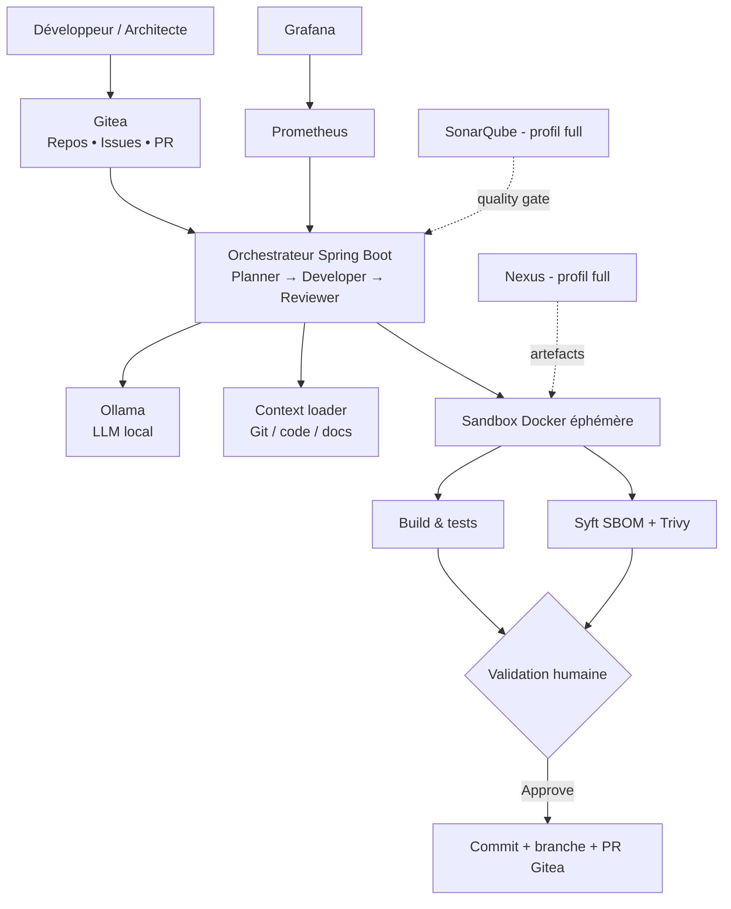
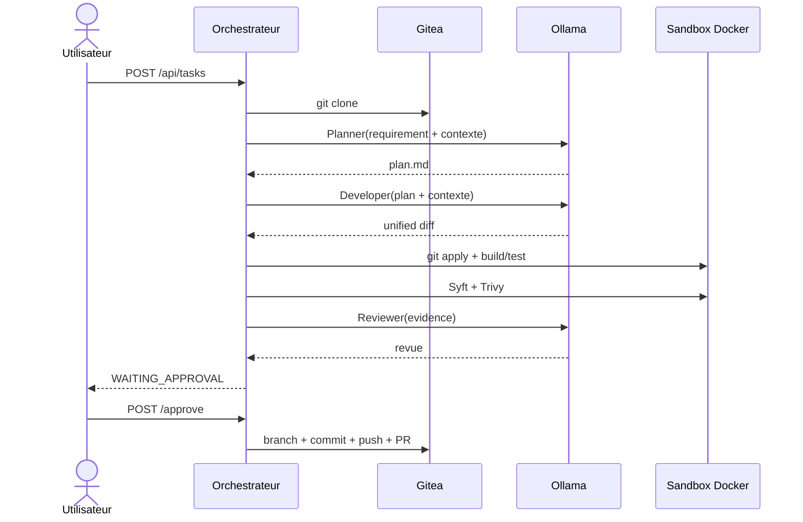

# Architecture du prototype

```mermaid
flowchart TB
  DEV[Développeur / Architecte] --> GIT[Gitea\nRepos • Issues • PR]
  GIT --> ORCH[Orchestrateur Spring Boot\nPlanner → Developer → Reviewer]
  ORCH --> OLLAMA[Ollama\nLLM local]
  ORCH --> CTX[Context loader\nGit / code / docs]
  ORCH --> SB[Sandbox Docker éphémère]
  SB --> BUILD[Build & tests]
  SB --> SEC[Syft SBOM + Trivy]
  BUILD --> HUMAN{Validation humaine}
  SEC --> HUMAN
  HUMAN -->|Approve| PR[Commit + branche + PR Gitea]
  PROM[Prometheus] --> ORCH
  GRAF[Grafana] --> PROM
  SONAR[SonarQube - profil full] -. quality gate .-> ORCH
  NEXUS[Nexus - profil full] -. artefacts .-> SB
```

## Flux d'une tâche

```mermaid
sequenceDiagram
  actor U as Utilisateur
  participant O as Orchestrateur
  participant G as Gitea
  participant L as Ollama
  participant S as Sandbox Docker

  U->>O: POST /api/tasks
  O->>G: git clone
  O->>L: Planner(requirement + contexte)
  L-->>O: plan.md
  O->>L: Developer(plan + contexte)
  L-->>O: unified diff
  O->>S: git apply + build/test
  O->>S: Syft + Trivy
  O->>L: Reviewer(evidence)
  L-->>O: revue
  O-->>U: WAITING_APPROVAL
  U->>O: POST /approve
  O->>G: branch + commit + push + PR
```
