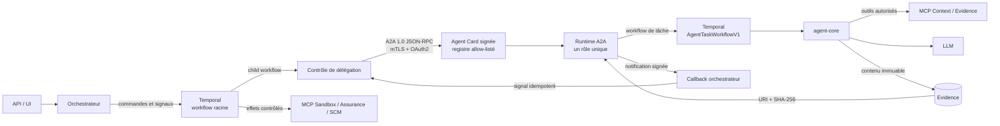

# Architecture A2A cible

Cette vue décrit l’architecture après la bascule franche. Temporal reste le plan de contrôle ; A2A 1.0 est
l’unique frontière réseau d’invocation d’un agent ; MCP reste la frontière des outils. Aucun agent ne contacte
directement un autre agent et aucun runtime d’agent ne reçoit un accès SCM, Docker ou à la projection métier.

## Frontières et responsabilités

| Frontière | Transporte | Ne décide jamais |
|---|---|---|
| Temporal | DAG, timers, retries, annulations, gates et références compactes | contenu d’artefact volumineux |
| A2A | instruction structurée, état de tâche et références Evidence | ordre global, délégation autonome ou effet SCM |
| MCP | appels d’outils allow-listés sous l’identité du rôle | choix du prochain agent |
| Evidence | contenu immuable, digest, classification et rétention | état du workflow |

Chaque délégation possède deux workflows corrélés : un child workflow de contrôle côté orchestrateur et un
`AgentTaskWorkflowV1` côté runtime. La table `a2a_task_associations` lie tentative, délégation, message, tâche A2A,
contexte et exécution Temporal. La notification accélère la convergence ; `tasks/get` reste la source de
réconciliation lorsqu’un callback est perdu.

## Réseau

En local, `infrastructure/compose.yaml` inclut `infrastructure/a2a/compose-agents.yaml`. Les quatorze runtimes sont
sur `a2a-internal`; seuls Context et Evidence leur sont accessibles sur les réseaux MCP dédiés. La PKI locale et
les secrets générés sous `.local/` sont montés en lecture seule.

Sur GKE, chaque rôle est un Deployment et un Service distinct dans `ai-factory-agents`. Les NetworkPolicies
n’autorisent que l’orchestrateur vers les endpoints A2A, les runtimes vers Temporal/LLM et les MCP accordés, puis
les callbacks vers l’orchestrateur. Les mêmes cartes, contrats, task queues et identités sont utilisés ; seules
les adresses de registre et les références de secrets changent.

## Observabilité

Le contexte W3C est propagé de l’API vers Temporal, A2A et MCP. Les spans de part et d’autre d’une attente
Temporal sont reliés par des span links. Métriques, traces et journaux partent en OTLP vers SigNoz ; aucune donnée
de prompt, sortie brute, référence sensible ou jeton n’est autorisée dans la télémétrie.

## Documents normatifs

- [ADR A2A/Temporal](../adr/ADR-A2A-001-agents-a2a-orchestration-temporal.md)
- [Catalogue des agents](../agents/CATALOGUE-AGENTS-V1.md)
- [Modèle de menaces](A2A-110-threat-model.md)
- [Plan de migration](../../delivery/migrations/migration-agents-a2a-temporal.md)
- [Rollback A2A](../../operations/runbooks/ROLLBACK-A2A.md)
