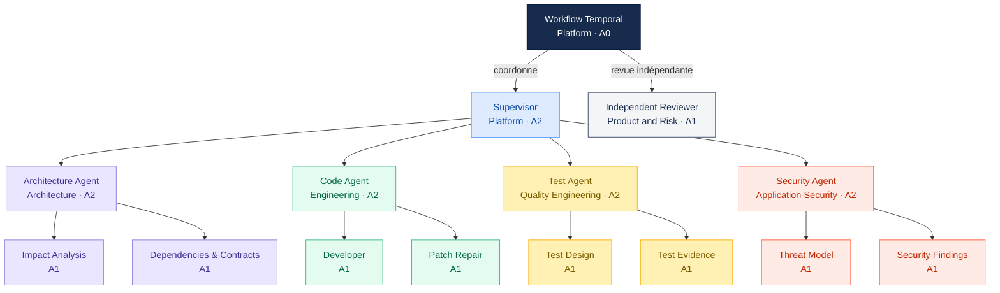

# Catalogue des agents multi-agent hiérarchiques v1

Le catalogue normatif lisible par machine est
[`resources/agents/catalog-v1.yaml`](../../../resources/agents/catalog-v1.yaml). Le rôle est fixé par le workflow et
n'est jamais accepté depuis une sortie du modèle.

## Niveaux d'autonomie

| Niveau | Capacité maximale |
|---|---|
| `A0` | Composant déterministe, sans décision de modèle. |
| `A1` | Analyse et demandes d'outils de lecture allow-listés. |
| `A2` | Proposition de délégations bornées, validées et exécutées par l'hôte. |

Aucun rôle du catalogue v1 ne possède une autonomie supérieure à `A2`.

## Hiérarchie

Les flèches représentent une autorité de délégation. Elles ne sont pas des connexions directes entre agents : le
workflow Temporal valide, planifie et suit chaque échange A2A. L'Independent Reviewer appartient au runtime
d'agents, mais il est enfant du workflow et non du Supervisor afin de préserver son indépendance.

## Matrice des rôles et contrats

| Rôle | Type / parent | Propriétaire | Autonomie | Peut déléguer à | Contrat de sortie principal |
|---|---|---|---|---|---|
| `workflow` | control plane / aucun | Platform | A0, effets autorisés | `supervisor`, `independent-reviewer` | `workflow-state-v1` |
| `supervisor` | agent / `workflow` | Platform | A2, sans effet | les quatre agents de périmètre | `delegation-plan-v1`, `supervisor-decision-v1` |
| `architecture-agent` | agent / `supervisor` | Architecture | A2, sans effet | `impact-analysis`, `dependencies-contracts` | `architecture-assessment-v1` |
| `impact-analysis` | sous-agent / Architecture | Architecture | A1, sans effet | aucun | `specialist-result-v1` |
| `dependencies-contracts` | sous-agent / Architecture | Architecture | A1, sans effet | aucun | `specialist-result-v1` |
| `code-agent` | agent / `supervisor` | Engineering | A2, sans effet | `developer`, `patch-repair` | `integration-proposal-v1` |
| `developer` | sous-agent / Code | Engineering | A1, sans effet | aucun | `patch-proposal-v1` |
| `patch-repair` | sous-agent / Code | Engineering | A1, sans effet | aucun | `patch-repair-proposal-v1` |
| `test-agent` | agent / `supervisor` | Quality Engineering | A2, sans effet | `test-design`, `test-evidence` | `test-assessment-v1` |
| `test-design` | sous-agent / Tests | Quality Engineering | A1, sans effet | aucun | `test-strategy-v1` |
| `test-evidence` | sous-agent / Tests | Quality Engineering | A1, sans effet | aucun | `test-assessment-v1` |
| `security-agent` | agent / `supervisor` | Application Security | A2, sans effet | `threat-model`, `security-findings` | `security-assessment-v1` |
| `threat-model` | sous-agent / Sécurité | Application Security | A1, sans effet | aucun | `security-assessment-v1` |
| `security-findings` | sous-agent / Sécurité | Application Security | A1, sans effet | aucun | `security-assessment-v1` |
| `independent-reviewer` | agent / `workflow` | Product and Risk | A1, sans effet | aucun | `independent-review-v1` |

Les contrats d'entrée détaillés sont portés par les manifestes `resources/agents/<role>.yaml`. Le catalogue de
schémas fermé est `resources/multiagents/schemas/contract-catalog-v1.json` ; les contrats MCP réutilisés, comme
`vulnerability-result-v1`, restent définis par le catalogue du serveur concerné.

## Profils de permissions

Toutes les permissions sont des allowlists. L'absence d'un rôle ou d'un outil signifie `deny`, y compris si le
modèle le demande dans une sortie valide.

| Profil | Outils accessibles | Interdictions structurantes |
|---|---|---|
| Workflow | lectures Context ; tous les profils Sandbox ; verdicts Assurance ; stockage/manifeste/lecture Evidence ; lecture SCM et création de draft PR | aucune livraison sans gate humain lié au manifeste |
| Supervisor | arbre, recherche, règles et dépendances ; résumés Evidence | patch, preuve brute, sandbox, assurance et SCM |
| Architecture | lectures Context, dépendances et symboles | patch, sandbox, Evidence brut et SCM |
| Code | lectures Context bornées au scope | application du patch, sandbox, assurance, Evidence à effet et SCM |
| Tests | lectures Context ou résumés Evidence selon le sous-rôle | lancement de tests, modification du dépôt et verdict déterministe |
| Sécurité | lectures Context ou résumés Evidence selon le sous-rôle | lancement de scans, modification du dépôt et dérogation de politique |
| Independent Reviewer | lectures Context, résumé et preuve Evidence auditée | délégation, replan, patch, sandbox, assurance et SCM |

La matrice exécutable est `resources/mcp/policies/tool-permissions-v1.yaml`. Le catalogue d'agents borne en plus
les outils, la filiation et l'autonomie ; l'intersection la plus restrictive des deux sources est appliquée par
l'hôte. Les outils `sandbox.*`, `assurance.*`, `evidence.store`, `evidence.create_manifest` et `scm.*` à effet
sont réservés à l'identité `workflow`.

## Responsabilités des propriétaires

| Propriétaire | Décide | Doit approuver avant promotion |
|---|---|---|
| Platform | runtime, orchestration, hiérarchie, limites communes et disponibilité | manifeste, prompt, permissions, budget et compatibilité Temporal |
| Architecture | règles d'impact, dépendances, API/données et compatibilité | changements des rôles Architecture et des contrats associés |
| Engineering | scopes de code, patch, réparation et maintenabilité | changements des rôles Code et stratégie d'intégration |
| Quality Engineering | stratégie, couverture et lecture des résultats | changements des rôles Tests et critères de preuve complète |
| Application Security | threat model, findings et règles de risque | changements des rôles Sécurité et de toute permission sensible |
| Product and Risk | indépendance de la revue et décisions humaines | Independent Reviewer, critères d'acceptation et dérogations métier |

Un propriétaire fonctionnel ne peut pas accorder seul une permission technique : toute extension d'outil ou
d'autonomie requiert aussi Platform et, pour une capacité sensible, Application Security. Une promotion ne
modifie jamais rétroactivement une délégation ou un workflow déjà épinglé à sa version.

## Règles de propriété

- Platform possède le coordinateur, le Supervisor, le runtime et les limites communes.
- Architecture possède les critères d'impact, dépendances et compatibilité.
- Engineering possède la production des patches et leur maintenabilité.
- Quality Engineering possède la stratégie de tests et l'analyse des résultats.
- Application Security possède le threat model et la qualification des findings.
- Product and Risk possède la politique de revue indépendante et les décisions humaines associées.

## Règles d'autorité

- seul `workflow` est `effectful: true` ;
- un agent ne peut déléguer qu'aux enfants déclarés par `mayDelegateTo` ;
- une délégation ne modifie ni le rôle, ni les outils, ni les plafonds du catalogue ;
- le Supervisor propose un DAG mais l'hôte le valide avant exécution ;
- le Reviewer indépendant ne peut ni déléguer, ni replanifier, ni produire un patch ;
- Planner et Reviewer historiques sont exclus des nouvelles admissions et conservés uniquement avec les
  ressources de replay V1 jusqu'au retrait de ce contrat.

## Activation

La présence d'un rôle au catalogue ne l'active pas. Chaque rôle doit disposer de son prompt, contrat, tests de
permissions, évaluation de qualité et autorisation explicite avant d'être ajouté à une configuration active.

## Sources normatives

- hiérarchie, propriétaires, autonomie et plafond d'outils : `resources/agents/catalog-v1.yaml` ;
- manifeste, prompt et contrats propres au rôle : `resources/agents/<role>.yaml` ;
- permissions MCP effectives : `resources/mcp/policies/tool-permissions-v1.yaml` ;
- schémas inter-agents : `resources/multiagents/schemas/contract-catalog-v1.json` ;
- limites cumulées : `resources/multiagents/policies/hierarchical-budget-policy-v1.yaml` ;
- seuils de qualification : `resources/multiagents/policies/qualification-thresholds-v1.yaml` et configuration
  `ai-factory.agent-tools` de l'orchestrateur.

En cas de divergence, l'hôte refuse l'activation ou l'appel. Aucune source documentaire ne peut élargir une
permission déclarée dans les politiques exécutables.
