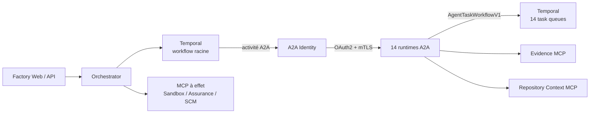
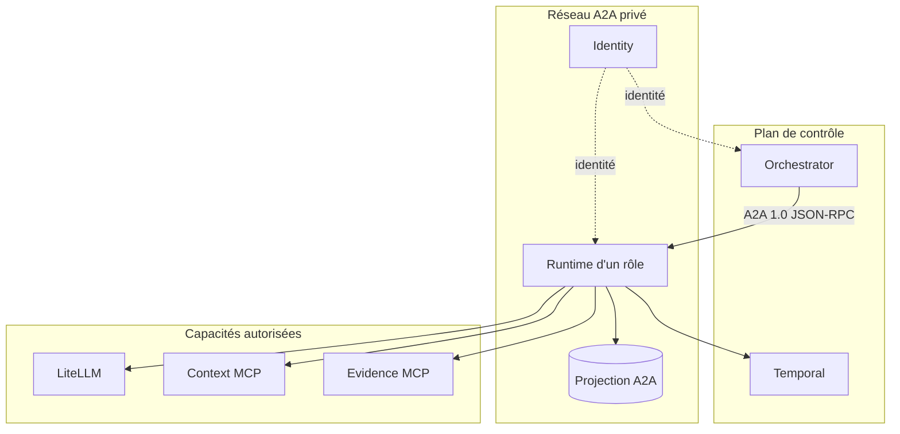

# Modèle de déploiement des agents A2A

> État courant au 7 septembre 2026. Cette page remplace le modèle historique où les rôles étaient chargés dans la
> JVM de l'orchestrateur.

## Topologie active

Les quatorze rôles du catalogue sont aujourd'hui quatorze services Compose distincts. Ils partagent l'image
immuable `ai-factory-a2a-agent-runtime`, mais chaque service possède son rôle, son identité mTLS, son secret OAuth2,
son Agent Card signée, ses réseaux MCP et sa task queue Temporal.



Temporal reste l'unique ordonnanceur. Un agent peut produire une intention de délégation, mais il ne contacte pas
directement un pair et ne déclenche aucun effet SCM. L'orchestrateur valide l'intention et crée la prochaine tâche
A2A depuis le workflow durable.

## Couverture des rôles

Le catalogue [`catalog-v1.yaml`](../../../resources/agents/catalog-v1.yaml) définit :

- `supervisor` ;
- `architecture-agent`, `impact-analysis`, `dependencies-contracts` ;
- `code-agent`, `developer`, `patch-repair` ;
- `test-agent`, `test-design`, `test-evidence` ;
- `security-agent`, `threat-model`, `security-findings` ;
- `independent-reviewer`.

La définition Compose se trouve dans
[`compose-agents.yaml`](../../../infrastructure/a2a/compose-agents.yaml), inclus par
[`compose.yaml`](../../../infrastructure/compose.yaml). Le profil `a2a-full` sélectionne les quatorze rôles ; chaque
profil `a2a-<role>` permet un démarrage isolé pour le développement.

## Isolation



Les runtimes sont non privilégiés, en lecture seule, sans socket Docker et sans secret SCM. Les réseaux accordés
diffèrent par rôle : un rôle ne rejoint que les MCP nécessaires à ses capacités. La matrice est vérifiée par
`make a2a-config`.

## Démarrage local

```shell
# Un rôle et ses dépendances
make a2a-up-role A2A_ROLE=developer

# Flotte complète, démarrée par lots bornés
make a2a-up-full

# Usine complète depuis des volumes Docker vides
make all
```

`make a2a-up-full` stabilise d'abord les identités DNS de la flotte, recrée ensuite l'orchestrateur, puis active les
Build IDs des deux déploiements Temporal. `make verify-ready` contrôle les quatorze Agent Cards et les vingt-huit
pollers workflow/activity.

## Cible GKE

La cible conserve exactement les mêmes frontières : un Deployment par rôle, une identité Workload Identity par
workload, des NetworkPolicies deny-by-default et le même contrat A2A. Les manifests sont générés sous
[`infrastructure/gke/a2a`](../../../infrastructure/gke/a2a/).

La cible GKE n'est pas qualifiée par le seul succès local. Elle exige encore un cluster réel, les identités cloud,
la gestion de secrets et les exercices de reprise décrits dans
[`A2A-GKE.md`](../../operations/A2A-GKE.md).

## Invariants

- A2A 1.0 est l'unique frontière d'invocation des agents.
- Temporal est l'unique autorité de coordination et de reprise.
- MCP reste la frontière d'accès aux outils.
- Evidence MCP porte les contenus volumineux ; A2A et Temporal ne transportent que des références digestées.
- Une identité, une carte ou une task queue invalide ferme les admissions ; aucun fallback en mémoire n'existe.
