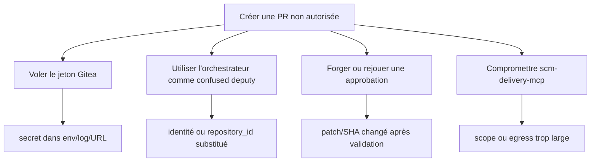

# MCP-005 — Threat model de la trajectoire MCP

> Statut : baseline approuvée pour le POC local ; risques ouverts remis en cohérence le 3 septembre 2026
> Propriétaires : `Product Owner AI Software Factory` et `Représentant RSSI`  
> Référence des actifs/frontières : `docs/architecture/mcp/MCP-004-actifs-frontieres-confiance.md`

## 1. Périmètre et hypothèses

Le modèle couvre le flux allant de la création d'un ticket à la création d'une draft Pull Request : orchestrateur, agents via LiteLLM, serveurs MCP, workspace, sandbox, Gitea, SonarQube, Artifactory et stockage de preuves.

Hypothèses retenues :

- le ticket, le dépôt, le code, les logs, les rapports, les réponses LLM et les résultats MCP sont des données non fiables ;
- un agent peut suivre une instruction malveillante présente dans n'importe laquelle de ces données ;
- un utilisateur authentifié peut être curieux ou malveillant et tenter d'accéder à une autre tâche ;
- un serveur MCP, une dépendance ou une image peut être compromis ;
- le réseau privé ne vaut ni authentification ni autorisation ;
- l'objectif maximal de l'usine est une draft PR contrôlée ; merge et déploiement restent hors périmètre.

Les menaces visant l'administration intrinsèque de Gitea, SonarQube, Artifactory, du fournisseur LLM ou de GCP restent sous la responsabilité des plateformes concernées, mais leurs interfaces avec l'usine sont incluses.

## 2. Méthode de cotation

Les catégories utilisent STRIDE : usurpation (`S`), altération (`T`), répudiation (`R`), divulgation (`I`), déni de service (`D`) et élévation de privilège (`E`).

| Valeur | Vraisemblance | Impact |
|---:|---|---|
| 1 | difficile, préconditions fortes | gêne locale et réversible |
| 2 | plausible mais accès/connaissance requis | perte limitée, reprise simple |
| 3 | probable avec une entrée exposée | fuite, corruption ou interruption significative |
| 4 | facile/automatisable ou composant très exposé | secret, effet SCM non autorisé, compromission hôte/tenant |

Le score est `vraisemblance × impact` : `1–3 Faible`, `4–7 Modéré`, `8–11 Élevé`, `12–16 Critique`. La cible n'accepte aucun risque résiduel critique et exige une acceptation RSSI explicite pour tout risque résiduel élevé.

## 3. Synthèse des menaces

| ID | Menace | STRIDE | Frontières | Score initial | Risque résiduel cible | État du prototype |
|---|---|---|---|---:|---|---|
| TM-01 | prompt injection directe ou indirecte | T/E | F1–F3 | 16 Critique | 6 Modéré | partiellement contrôlé |
| TM-02 | tool poisoning ou contrat d'outil altéré | T/E | F3–F4 | 12 Critique | 4 Modéré | ouvert |
| TM-03 | path traversal, encodage ou symlink escape | I/T/E | F5 | 12 Critique | 3 Faible | contrôles centraux présents, corpus incomplet |
| TM-04 | SSRF, redirection ou destination dynamique | I/E | F4/F8 | 12 Critique | 4 Modéré | partiellement contrôlé |
| TM-05 | confused deputy entre agent, orchestrateur et MCP | S/E | F3–F4/F8 | 16 Critique | 6 Modéré | ouvert |
| TM-06 | token passthrough, vol ou mauvaise audience | S/I/E | F4/F8 | 16 Critique | 4 Modéré | ouvert |
| TM-07 | fuite de secrets/PII par logs, traces ou erreurs | I/R | toutes | 12 Critique | 4 Modéré | partiellement contrôlé |
| TM-08 | handle hijacking et accès inter-tâches | S/I/T | F4/F7 | 12 Critique | 3 Faible | partiellement contrôlé sandbox |
| TM-09 | rejeu, double effet et confusion de tentative | T/R/E | F4/F9/F10 | 12 Critique | 4 Modéré | sandbox contrôlée, SCM ouvert |
| TM-10 | déni de service et consommation non bornée | D | F1–F8 | 12 Critique | 6 Modéré | quotas sandbox présents, reste ouvert |
| TM-11 | serveur MCP compromis | T/I/E/D | F4/F8 | 16 Critique | 8 Élevé | ouvert |
| TM-12 | évasion sandbox ou abus du socket Docker | E/T/I | F6 | 16 Critique | 4 Modéré | risque POC ouvert |
| TM-13 | altération/suppression de preuves | T/R | F7 | 12 Critique | 3 Faible | ouvert |
| TM-14 | approbation forgée, obsolète ou TOCTOU | S/T/R/E | F9/F10 | 16 Critique | 4 Modéré | preuve structurée ouverte |
| TM-15 | supply chain compromise d'image/SDK/scanner | T/E | F6/F8 | 12 Critique | 6 Modéré | versions partielles, signature ouverte |
| TM-16 | exfiltration vers un modèle ou par egress sandbox | I | F2/F6/F8 | 16 Critique | 6 Modéré | réseau et classification ouverts |

Le risque résiduel cible suppose l'ensemble des contrôles listés ci-dessous. Il ne décrit pas la posture actuelle du POC.

## 4. Scénarios, contrôles et tests

### TM-01 — Prompt injection directe ou indirecte

**Scénario.** Une instruction dans le ticket, le code, un fichier de règles, un log de test, un rapport ou une réponse MCP demande au modèle d'ignorer sa politique, de révéler un secret, de choisir un outil non prévu ou de masquer un finding.

**Contrôles.** Séparation stricte système/données ; balises de contenu non fiable ; sorties structurées ; outils et transitions autorisés côté orchestrateur ; aucun secret dans le contexte ; résultats d'outils traités comme données ; gates déterministes et approbation indépendante ; budgets de tours et d'appels.

**Tests.** Corpus MCP-178 injecté dans chaque origine, y compris noms/descriptions d'outils et résultats MCP ; vérifier absence d'effet, de fuite, de changement de rôle et maintien du verdict déterministe.

### TM-02 — Tool poisoning

**Scénario.** Un serveur compromis ajoute un outil, modifie sa description ou son schéma, renvoie une URI externe ou présente une instruction comme une donnée de confiance. Un agent est incité à appeler une capacité plus puissante.

**Contrôles.** Registre statique allow-listé ; noms et versions épinglés ; schémas locaux autoritatifs ; négociation de capacités ; refus d'outil inconnu ou schéma divergent ; matrice de permissions côté hôte ; descriptions sans valeur d'autorisation ; canary/rollback par digest d'image.

**Tests.** MCP-035 et MCP-179 : outil ajouté, type élargi, champ inconnu, annotation mensongère, description injectée, URI hors registre et réponse surdimensionnée.

### TM-03 — Path traversal et symlink escape

**Scénario.** Un chemin utilise `..`, séparateurs alternatifs, double encodage, absolu, lien symbolique ou course au remplacement pour lire un secret ou écrire hors du workspace.

**Contrôles.** Chemins relatifs uniquement ; décodage unique/canonique ; normalisation et contrôle de préfixe ; résolution sûre des symlinks ; racine enregistrée côté serveur ; volume RO pour le contexte ; aucun shell ; ouverture et contrôle limitant les courses lorsque le système le permet.

**Tests.** MCP-052/MCP-053 : variantes d'encodage, symlink entrant/sortant/chaîné, changement concurrent, chemins Unicode, fichier énorme, accès inter-tâches et divergence du SHA.

### TM-04 — SSRF et destination dynamique

**Scénario.** Une URL issue du ticket, du dépôt, d'un modèle, d'un redirect HTTP ou d'une découverte OAuth force un serveur à contacter metadata, loopback, réseau privé, endpoint d'administration ou hôte contrôlé par l'attaquant.

**Contrôles.** `repository_id` et destinations résolus par registres ; aucun argument URL générique ; schémas/ports autorisés ; DNS contrôlé ; validation après chaque redirect et résolution ; blocage loopback, link-local, metadata et plages privées non prévues ; egress proxy/default-deny ; timeout et taille bornée.

**Tests.** URL en IP/IPv6/entier/hexadécimal, DNS rebinding, CNAME, redirects, userinfo, schémas `file:`/`gopher:`, metadata cloud et destination privée ; rattacher à MCP-111, MCP-120 et MCP-216.

### TM-05 — Confused deputy

**Scénario.** Un agent, utilisateur ou serveur peu privilégié fait exécuter par l'orchestrateur ou un MCP privilégié une action qu'il ne pourrait pas effectuer lui-même, par exemple lire un autre dépôt ou créer une PR avec l'identité delivery.

**Contrôles.** Autorisation à chaque saut sur principal réel, tenant, rôle, outil, dépôt et tâche ; identité non déclarable par le modèle ; scopes serveur ; preuve d'approbation liée aux digests ; aucune délégation implicite ; policy decision auditée.

**Tests.** Substitution de `actor`, rôle, tenant, `repository_id`, tâche et tentative ; principal lecture appelant un outil à effet ; orchestrateur présentant une approbation d'un autre contexte.

### TM-06 — Token passthrough et vol de jeton

**Scénario.** Le token appelant est transmis à Gitea/Sonar, journalisé, placé dans un manifeste/job, réutilisé pour une mauvaise audience ou volé depuis l'environnement.

**Contrôles.** Token MCP destiné uniquement au serveur appelé ; identité backend distincte ; audience exacte, issuer, signature, expiration et scopes ; tokens courts ; Secret Manager/Workload Identity ; injection au dernier moment ; redaction ; aucune valeur dans prompt, URI, argument de processus, snapshot ou preuve.

**Tests.** Token à mauvaise audience/expiré/révoqué, token MCP présenté au backend, secret sentinelle dans erreur/log/snapshot, CR/LF dans variable, rotation en cours de job ; MCP-081 et MCP-211 à MCP-217.

### TM-07 — Fuite par logs, traces et erreurs

**Scénario.** Une commande, stacktrace, métrique, span, réponse MCP ou log de scanner contient secret, PII, code sensible ou contenu de prompt, puis est exposé à un rôle non autorisé.

**Contrôles.** Journaliser métadonnées/digests plutôt que contenu ; redaction centralisée avant persistance/pagination ; safe messages séparés des détails internes ; traces sans prompt/résultat par défaut ; limites de cardinalité ; accès par rôle et rétention ; détection de secrets sur les canaux de sortie.

**Tests.** Secrets sentinelles sous formes brute/encodée/multiligne dans arguments, stdout/stderr, exception et réponse ; vérifier logs, métriques, traces, snapshots et UI. Rattachement MCP-012, MCP-029, MCP-078, MCP-148 et MCP-221.

### TM-08 — Handle hijacking

**Scénario.** Un utilisateur devine, vole ou substitue un `execution_id`, curseur ou URI de preuve pour lire, annuler ou modifier l'exécution d'une autre tâche.

**Contrôles.** Handles aléatoires à forte entropie, opaques, expirants et liés côté serveur au principal/tenant/tâche/tentative ; autorisation sur chaque lecture/annulation ; curseur signé ; message d'erreur non révélateur ; aucune confiance dans un handle seul.

**Tests.** Enumeration, handle valide avec mauvais principal/tâche, handle expiré, curseur altéré, cancellation concurrente, accès après purge et accès inter-tenant. Étendre MCP-074, MCP-078 et MCP-149.

### TM-09 — Rejeu et double effet

**Scénario.** Une requête est rejouée après timeout ou avec une ancienne approbation ; deux branches/PR sont créées, un patch est appliqué deux fois ou un résultat d'une tentative précédente est accepté.

**Contrôles.** `attempt_id` obligatoire ; idempotency key stable liée aux digests ; stockage atomique du résultat ; même clé + mêmes entrées retourne le même objet ; même clé + entrées différentes produit `CONFLICT` ; expiration/revocation de l'approbation ; vérification auprès du SCM après timeout.

**Tests.** Double soumission parallèle, timeout avant/après effet, redémarrage, ancienne tentative, même clé avec patch différent et retry après PR créée ; MCP-028, MCP-086 et MCP-113 à MCP-120.

### TM-10 — Déni de service

**Scénario.** Entrées énormes, regex/pathologie de parsing, trop de fichiers, appels/tours en boucle, fan-out, jobs longs, fork bomb, saturation de file, réponses immenses ou cardinalité métrique épuisent CPU, mémoire, disque, réseau ou budget LLM.

**Contrôles.** Limites d'octets/éléments/durée ; pagination ; deadline propagée ; quotas par identité/tenant/tâche/outil ; concurrence et file bornées ; backpressure ; circuit breaker ; ressources sandbox CPU/mémoire/PID ; budget agentique ; rétention/purge ; rate limiting et kill switch.

**Tests.** Frontières et dépassements de chaque limite, slowloris/serveur lent, zip/billion-laughs selon formats, regex coûteuse, file pleine, disque plein, job bloqué, boucle agentique et tempête de retry ; MCP-011, MCP-027, MCP-035, MCP-083, MCP-176, MCP-182 et MCP-219.

### TM-11 — Serveur MCP compromis

**Scénario.** Le serveur renvoie de fausses preuves, exfiltre des données, tente des appels latéraux, accepte des arguments interdits ou abuse de son jeton backend.

**Contrôles.** Séparation par serveur/identité/réseau ; privilège et egress minimaux ; validation locale des réponses ; digests et attestations indépendants ; images signées/pinnées ; aucun chaînage caché ; audit central hors du serveur ; kill switch ; rotation/révocation ; détection d'outil/schéma/version divergent.

**Tests.** Faux serveur MCP de MCP-179, egress canary interdit, résultat signé par mauvaise identité, digest divergent, appel backend hors scope, serveur qui ignore deadline et réponse malveillante. Le risque reste élevé car le serveur détient nécessairement sa capacité propre.

### TM-12 — Évasion sandbox et socket Docker

**Scénario.** Du code généré exploite le runtime/conteneur ou compromet `sandbox-execution-mcp`, puis utilise `/var/run/docker.sock` pour contrôler l'hôte et les autres conteneurs.

**Contrôles.** POC : profil immuable, non-root, capabilities supprimées, `no-new-privileges`, ressources bornées, workspace contrôlé. Cible obligatoire : aucun socket Docker, contrôleur séparé, GKE Sandbox/gVisor, nœuds/namespace/identité dédiés, filesystem jetable, Pod Security, NetworkPolicy default-deny et images admises par digest.

**Tests.** MCP-084/MCP-085, tentative de montage/socket/privilege, accès host namespaces/devices/metadata, évasion connue de l'image de test et vérification de destruction. Tant que le socket subsiste, l'usage reste POC local isolé.

### TM-13 — Altération ou suppression de preuves

**Scénario.** Un workspace ou job modifie un rapport après validation, substitue un SBOM, supprime un échec ou fournit une URI vers un contenu mutable.

**Contrôles.** Digest calculé à la réception ; stockage immuable par tentative ; manifeste complet ; provenance image/profil/version ; comparaison avant décision ; Object Versioning/rétention puis Bucket Lock ; accès séparé écriture/lecture ; `INDETERMINATE` si preuve absente/partielle.

**Tests.** MCP-149 : digest altéré, contenu remplacé après enregistrement, type mensonger, manifeste incomplet, preuve d'une autre tâche, objet supprimé et résultat partiel.

### TM-14 — Approbation forgée ou obsolète

**Scénario.** Un appel direct à l'API d'approbation, une identité usurpée ou une course remplace le patch après la revue ; une approbation d'une ancienne tentative autorise une nouvelle livraison.

**Contrôles.** Authentification forte/RBAC ; séparation reviewer/delivery ; preuve structurée signée ou vérifiable ; liaison à tâche, tentative, source SHA, patch, manifeste, verdicts et expiration ; revalidation atomique dans `scm-delivery-mcp` juste avant l'effet ; invalidation à tout changement.

**Tests.** Approbation absente, champ altéré, mauvais approbateur/rôle, expirée/révoquée, patch ou SHA changé après décision et double approbation concurrente ; MCP-113, MCP-116 et MCP-120.

### TM-15 — Compromission de la supply chain

**Scénario.** SDK MCP, image serveur/runner, plugin Maven/npm, scanner ou base Trivy compromis introduit une porte dérobée ou falsifie un résultat.

**Contrôles.** Versions et digests épinglés ; dépendances via miroirs approuvés ; SBOM/provenance ; scan CI ; signature d'image ; Binary Authorization ; processus N/N-1/canary/rollback ; bases scanners mises à jour par pipeline séparé ; moindre privilège runtime.

**Tests.** Dépendance/digest non approuvé, signature absente, image mutée sous même tag, SBOM manquant, schéma/protocole incompatible et rollback ; MCP-007, MCP-016, MCP-218, MCP-224 et MCP-225.

### TM-16 — Exfiltration de données

**Scénario.** Du code ou un prompt envoie source, secret ou preuve à un modèle cloud, une dépendance malveillante, un serveur externe ou un endpoint accessible depuis le réseau sandbox.

**Contrôles.** Classification du dépôt et politique de modèle ; contexte minimal/redacted ; blocage cloud selon sensibilité ; egress default-deny/proxy avec destinations par profil ; DNS/proxy logs ; aucun secret global dans le job ; détection de secrets ; limites de volume et alerte sur refus répétés.

**Tests.** Prompt demandant l'envoi de code, dépendance tentant callback DNS/HTTP, exfiltration vers Gitea/Sonar non nécessaire, encodages/tunneling simples et accès metadata ; MCP-178, MCP-216 et MCP-220.

## 5. Chemin d'attaque prioritaire : PR non autorisée

La réduction principale prévue a été mise en œuvre : le jeton Gitea a été retiré de l'orchestrateur, la livraison
est centralisée dans une commande atomique, l'approbation durable est liée aux digests et l'identité SCM est
confinée à `scm-delivery-mcp`.

## 6. Plan de vérification priorisé

| Priorité | Campagne | Menaces | Critère de réussite |
|---:|---|---|---|
| P0 | identité et autorisation interservices | TM-05, TM-06, TM-08 | mauvaise audience/scope/tâche toujours refusée sans fuite d'existence |
| P0 | approbation et livraison idempotente | TM-09, TM-14 | aucune écriture sans preuve valide ; un retry produit une seule PR |
| P0 | isolation sandbox et egress | TM-04, TM-12, TM-16 | aucun socket/metadata/control-plane ; seules destinations de profil joignables |
| P0 | serveur MCP malveillant | TM-02, TM-11 | outil/schéma/URI/réponse divergents refusés et serveur désactivable |
| P1 | prompt injection multicanal | TM-01 | aucune injection ne change permission, gate ou destination |
| P1 | chemins et isolation inter-tâches | TM-03, TM-08 | zéro lecture/écriture hors racine/tâche dans le corpus négatif |
| P1 | secrets et observabilité | TM-06, TM-07 | aucune sentinelle détectée dans logs, traces, erreurs, UI ou preuves |
| P1 | intégrité des preuves | TM-13 | toute absence/substitution produit `INDETERMINATE` bloquant |
| P1 | charge et reprise | TM-10 | limites respectées, backpressure, reprise sans tempête de retry |
| P2 | supply chain et rollback | TM-15 | seul un digest signé/promu s'exécute ; rollback testé |

## 7. Risques ouverts bloquant une cible partagée

Les risques suivants sont acceptables uniquement pour une démonstration locale isolée et bloquent toute exposition partagée :

1. `/var/run/docker.sock` reste détenu par le contrôleur sandbox Compose.
2. Les endpoints MCP ne disposent pas encore d'authentification workload complète.
3. L'API opérateur ne possède pas encore de SSO, RBAC ni rate limiting.
4. Les preuves immuables et l'approbation liée aux digests sont disponibles dans le chemin durable, mais pas
   intégrées de bout en bout au pipeline déterministe de référence.
5. Le journal d'audit HMAC reste local au processus et n'est pas un journal externe WORM.
6. La cible GKE et l'équivalent de l'allow-list réseau locale ne sont pas opérationnels.

Ces risques ne peuvent pas être considérés comme compensés uniquement par le caractère privé du réseau Compose.

## 8. Gouvernance et acceptation

- Le `Product Owner AI Software Factory` possède l'usage, l'impact métier et l'arbitrage de priorité.
- Le `Représentant RSSI` valide la méthode, les scénarios, les risques résiduels élevés et les exceptions temporaires.
- Les propriétaires des plateformes valident les scopes Gitea/Sonar/Artifactory, les identités et destinations.
- Toute nouvelle capacité, backend, source de contexte, classe de données ou autonomie d'agent déclenche une mise à jour du modèle.
- Une revue est réalisée au minimum avant chaque gate majeur, après incident ou changement de frontière, puis périodiquement en exploitation.
- MCP-017 porte la revue formelle du lot 0 ; MCP-227 porte la revue/pentest avant ouverture multi-tenant.

## 9. Critères de clôture de MCP-005

- [x] Les onze familles de menace demandées sont couvertes explicitement.
- [x] Les scénarios supplémentaires sandbox, preuves, approbation, supply chain et exfiltration sont couverts.
- [x] Chaque menace possède contrôles et tests associés.
- [x] Les risques ouverts du POC sont distingués du risque résiduel cible.
- [x] Les règles de cotation, d'acceptation et de révision sont définies.
