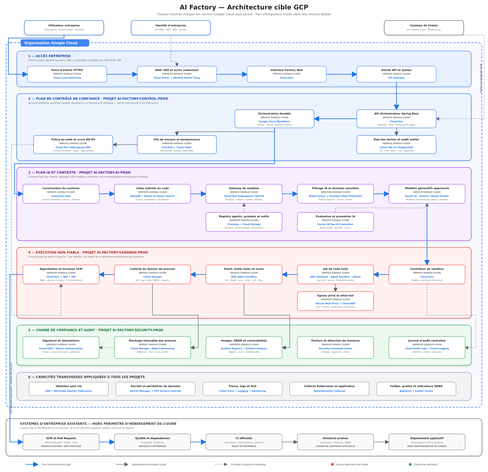

# Architecture cible GCP — AI Software Factory

## Diagramme d’architecture cible

Le diagramme représente la cible industrialisée de l’usine. Le **plan de contrôle de confiance** orchestre et audite les travaux, tandis que le code produit par l’IA est exécuté dans un **plan de sandbox séparé, éphémère et considéré comme non fiable**. L’usine s’arrête à la création d’une Pull Request accompagnée d’un dossier de preuves. La CI/CD d’entreprise conserve la responsabilité du build de référence, de la promotion et du déploiement.

## 1. Synthèse de la cible

La cible transforme l’usine locale en une plateforme GCP multi-projets, gouvernée et exploitable en entreprise. Elle repose sur six domaines logiques :

1. une zone d’accès protégée pour les utilisateurs et les API ;
2. un plan de contrôle qui porte l’orchestration et les décisions ;
3. un plan IA qui gouverne le contexte, les agents, les modèles et leurs évaluations ;
4. une zone d’exécution isolée pour le code non fiable ;
5. une chaîne de confiance qui conserve les preuves et les attestations ;
6. des capacités transverses de sécurité, d’observabilité et de pilotage.

Les composants existants de l’entreprise — ticketing, SCM, SonarQube, Artifactory et CI/CD — sont intégrés et non dupliqués. L’usine prépare un changement traçable ; elle ne se substitue ni aux protections de branche, ni à la revue humaine, ni à la chaîne officielle de livraison.

## 2. Principes structurants

| Principe | Application dans la cible |
|---|---|
| Séparation des responsabilités | Les plans de contrôle, IA, exécution et confiance sont placés dans des projets distincts. |
| Zero Trust | Aucun flux n’est autorisé par simple appartenance réseau. Chaque appel est authentifié, autorisé et journalisé. |
| Identités sans clé | Les workloads utilisent IAM et Workload Identity Federation ; les clés de comptes de service persistantes sont interdites. |
| Code généré non fiable | Toute tentative est exécutée dans une sandbox GKE éphémère avec gVisor, quotas et système de fichiers jetable. |
| Egress minimal | La sandbox ne contacte que le SCM, les miroirs de dépendances et les services de qualité explicitement autorisés. |
| Contexte reproductible | Chaque exécution est liée à un ticket, un dépôt et un commit immuable. |
| IA gouvernée | Modèles, prompts, agents, outils et jeux d’évaluation sont versionnés et promus selon une politique explicite. |
| Preuves avant livraison | Aucun changement n’est proposé sans diff, résultats de tests, scans, SBOM, journaux et décision de politique. |
| Humain dans la boucle | L’autonomie dépend d’un score de risque R0–R4 ; les changements sensibles exigent une validation humaine. |
| CI/CD souveraine | Le build produit dans la sandbox est exploratoire. Seule la CI officielle produit un artefact promouvable. |

## 3. Périmètre de responsabilité

### 3.1 Responsabilités de l’usine

- recevoir et valider un ticket ou un événement SCM ;
- figer le commit source et construire un contexte cité ;
- sélectionner les agents, prompts, outils et modèles autorisés ;
- générer un plan et un patch ;
- exécuter le patch, les builds, les tests et les scans dans une sandbox ;
- constituer un dossier de preuves immuable ;
- calculer le niveau de risque et recueillir les approbations requises ;
- créer de manière idempotente une Pull Request dans le SCM.

### 3.2 Responsabilités conservées par l’entreprise

- gestion du backlog et des habilitations dans le système de tickets ;
- gouvernance du dépôt, protections de branche et règles de revue ;
- build officiel à partir du commit fusionné ;
- signature et promotion des artefacts de référence ;
- déploiement, changement, rollback et exploitation applicative.

## 4. Organisation GCP cible

La séparation en projets constitue une frontière d’IAM, de quotas, de facturation, de réseau et d’audit. Les noms ci-dessous sont des noms logiques à adapter aux conventions de l’entreprise.

| Domaine | Projet ou portée recommandée | Responsabilités principales | Services Google Cloud structurants |
|---|---|---|---|
| 1 — Accès entreprise | Zone d’accès du projet de contrôle ou projet edge dédié | Entrée HTTPS, WAF, SSO, IHM et quotas d’API | Cloud Load Balancing, Cloud Armor, Identity-Aware Proxy, Cloud Run, API Gateway |
| 2 — Plan de contrôle | `ai-factory-control-prod` | API, workflow, files de travaux, persistance et politiques | Cloud Run, Google Cloud Workflows, Pub/Sub, Cloud Tasks, Cloud SQL for PostgreSQL |
| 3 — Plan IA et contexte | `ai-factory-ai-prod` | Contexte, index, gateway, protection et évaluation IA | Cloud Run Jobs, AlloyDB, Vertex AI Vector Search, Cloud Run, Model Armor, Sensitive Data Protection, Vertex AI |
| 4 — Exécution non fiable | `ai-factory-sandbox-prod` | Sandboxes éphémères, builds, tests, scans et egress contrôlé | Cloud Run, GKE Standard avec GKE Sandbox/gVisor, Secure Web Proxy, Cloud NAT |
| 5 — Confiance et audit | `ai-factory-security-prod` | Preuves, artefacts, signatures, posture et audit | Cloud Storage, Cloud KMS, Binary Authorization, Artifact Registry, Artifact Analysis, Security Command Center, Cloud Audit Logs |
| 6 — Capacités transverses | Organisation, dossiers et projets de supervision | Identités, secrets, périmètres, télémétrie et pilotage | IAM, Workload Identity Federation, Secret Manager, VPC Service Controls, Cloud Logging, Cloud Monitoring, Cloud Trace, Managed Service for Prometheus, BigQuery, Looker Studio |

Les environnements `dev`, `integration`, `preprod` et `prod` doivent être isolés au minimum par projet. Pour la production, les projets de sandbox et de sécurité ne sont jamais mutualisés avec les environnements hors production.

## 5. Architecture détaillée par domaine

### 5.1 Accès entreprise

Le trafic utilisateur entre par **Cloud Load Balancing**. **Cloud Armor** applique les règles WAF, la protection DDoS et les restrictions d’exposition. **Identity-Aware Proxy** fédère l’authentification avec l’IdP SAML/OIDC de l’entreprise et contrôle l’accès selon l’identité et le contexte.

L’interface Factory Web est déployée sur **Cloud Run** avec un ingress limité à la chaîne d’accès approuvée. L’entrée API utilise **API Gateway** pour l’authentification machine, les quotas et le versionnement des contrats. Si l’entreprise exige un portail développeur, une médiation complexe ou une gouvernance API transverse, **Apigee X** peut remplacer API Gateway sans modifier le reste de l’architecture.

Le diagramme présente une vue logique : le flux Web est protégé par Load Balancing, Cloud Armor et IAP, tandis que les appels API sont contrôlés par API Gateway avant d’atteindre l’orchestrateur.

### 5.2 Plan de contrôle de confiance

L’API d’orchestration Spring Boot est stateless et s’exécute sur **Cloud Run**. Elle valide les commandes, crée les identifiants de corrélation et déclenche les workflows ; elle n’exécute jamais le code généré.

**Google Cloud Workflows** porte l’enchaînement durable des étapes, les reprises, les délais, les compensations et les attentes d’approbation. **Pub/Sub** diffuse les événements métier ; **Cloud Tasks** absorbe les appels asynchrones nécessitant quota, retry contrôlé ou limitation de débit.

**Cloud SQL for PostgreSQL** stocke l’état transactionnel des tickets, runs, tentatives, décisions et approbations. Il est déployé en haute disponibilité, avec IP privée, sauvegardes automatiques et restauration à un instant donné.

Le moteur de politique **OPA**, hébergé sur Cloud Run, calcule le score R0–R4 à partir du type de dépôt, des chemins modifiés, des résultats de scans, du niveau de données, des outils employés et de l’incertitude des évaluations.

### 5.3 Plan IA et contexte

Le **Context Builder**, exécuté avec Cloud Run Jobs, travaille sur un commit immuable. Il extrait les fichiers pertinents, symboles, dépendances, conventions et historique utile. Chaque élément injecté dans le prompt conserve sa provenance.

L’index hybride combine :

- **AlloyDB** pour les métadonnées, relations, symboles et recherches structurées ;
- **Vertex AI Vector Search** pour la recherche sémantique ;
- une recherche lexicale et symbolique construite lors de l’indexation.

La gateway de modèles, par exemple **LiteLLM sur Cloud Run**, centralise le routage, les quotas, budgets, timeouts, fallbacks et métadonnées d’usage. Aucun agent ne détient directement de secret fournisseur.

**Model Armor** protège les appels contre les attaques propres aux LLM. **Sensitive Data Protection** détecte et masque les secrets, données personnelles et contenus interdits avant l’envoi au modèle et avant la réutilisation de sa réponse.

Les modèles approuvés sont exposés par **Vertex AI** — Gemini ou modèles autorisés du Model Garden. Leur utilisation dépend de la classification des données, de la région, du cas d’usage et de la version validée.

Le registre des agents, prompts, schémas d’outils et politiques est conservé dans **Firestore** et **Cloud Storage**. **Vertex AI Gen AI Evaluation** exécute les benchmarks fonctionnels, de sécurité et de non-régression nécessaires à la promotion d’une nouvelle version.

### 5.4 Zone d’exécution non fiable

Le contrôleur de sandbox est un service Cloud Run. Il reçoit un manifeste signé décrivant le commit, l’image du runner, les outils, les ressources, la durée maximale et les destinations réseau autorisées.

Chaque tentative crée un job dans un cluster privé **GKE Standard** avec **GKE Sandbox/gVisor**. Le pod est non-root, sans privilèges, sans montage du socket Docker et sans secret global. Son identité, son namespace, ses volumes et ses règles réseau sont limités à la tentative, puis détruits.

Le job réalise le checkout du commit figé, applique le patch, lance les builds, tests et analyses puis collecte les résultats. Les outils peuvent inclure Git, Maven, npm, Sonar, Syft et Trivy, mais leurs versions sont fixées dans une image de runner approuvée.

La sortie réseau est refusée par défaut. **Secure Web Proxy** et **Cloud NAT** n’autorisent que les destinations nécessaires : SCM, SonarQube, Artifactory ou miroirs de dépendances approuvés. La sandbox n’a aucun chemin réseau vers les API d’administration du plan de contrôle.

### 5.5 Chaîne de confiance et audit

Le dossier de preuves est d’abord collecté dans Cloud Storage, puis versé dans un bucket dédié du projet de sécurité. Il contient au minimum :

- identifiants du ticket, dépôt, commit, run et tentative ;
- versions de l’agent, du prompt, des outils, du modèle et de l’image runner ;
- plan proposé, diff final et citations du contexte ;
- journaux d’exécution et résultats de tests ;
- rapports de qualité et de vulnérabilité ;
- SBOM CycloneDX ou SPDX ;
- score de risque, décisions de politique et approbations humaines ;
- empreintes, signatures et attestations de provenance.

**Cloud Storage Object Versioning** protège l’historique. Une politique de rétention, puis **Bucket Lock** après validation juridique et opérationnelle, empêche l’altération des preuves pendant la durée réglementaire définie.

Les images et métadonnées de build sont conservées dans **Artifact Registry** et analysées par **Artifact Analysis**. **Cloud KMS**, Cosign et **Binary Authorization** permettent de signer les attestations et de contrôler les artefacts admis dans les environnements protégés.

**Security Command Center** agrège les findings de posture et de menace. **Cloud Audit Logs** et Cloud Logging conservent les actions d’administration, accès aux données, décisions et changements de configuration.

### 5.6 Capacités transverses

| Capacité | Mise en œuvre |
|---|---|
| Identités de workload | Un compte de service dédié par composant ; Workload Identity pour GKE et Workload Identity Federation pour les systèmes externes. |
| Secrets | Secret Manager, accès à la demande et versionné ; aucun secret dans une image, un prompt, un log ou une variable partagée. |
| Chiffrement | Clés Cloud KMS séparées par domaine sensible ; rotation et séparation des rôles d’administration et d’utilisation. |
| Périmètres de données | VPC Service Controls autour des données, modèles et preuves compatibles, avec règles d’ingress/egress explicites. |
| Observabilité | OpenTelemetry, Cloud Logging, Cloud Monitoring, Cloud Trace et Managed Service for Prometheus. |
| Pilotage | Export vers BigQuery et tableaux de bord Looker Studio pour coûts, qualité, sécurité, productivité et indicateurs DORA. |
| Gouvernance | Organization Policies, tags, budgets, quotas, Policy Controller et Infrastructure as Code. |

## 6. Flux fonctionnel de bout en bout

1. Un Product Owner ou un développeur soumet un ticket, ou un événement SCM déclenche le processus.
2. L’utilisateur est authentifié par l’IdP d’entreprise ; Cloud Armor et IAP contrôlent l’accès.
3. API Gateway et l’orchestrateur valident la demande et créent un `run_id` corrélé au ticket.
4. Workflows fige le commit et demande au Context Builder de produire un contexte cité et reproductible.
5. Le registre sélectionne la version autorisée de l’agent, du prompt, des outils et du modèle.
6. La gateway filtre la requête, applique budgets et quotas, puis appelle Vertex AI.
7. Le contrôleur crée une sandbox GKE éphémère et transmet un manifeste d’exécution borné.
8. Le runner applique le patch, compile, teste, analyse et produit la SBOM.
9. Les résultats sont déposés dans la chaîne de confiance et corrélés par leurs empreintes.
10. OPA calcule le niveau de risque et détermine les approbations nécessaires.
11. Le service de livraison crée, de façon idempotente, la Pull Request et y associe le dossier de preuves.
12. Après revue et merge, la CI officielle reconstruit l’artefact de référence, le signe, le promeut et le transmet à la chaîne de déploiement.

## 7. Modèle de risque et d’autonomie

| Niveau | Exemple | Comportement cible |
|---|---|---|
| R0 — Information | Analyse, explication ou documentation sans changement exécutable | Exécution automatique, résultat conservé et audité. |
| R1 — Faible | Tests, documentation, refactoring local sans API ni dépendance nouvelle | PR automatique après contrôles obligatoires. |
| R2 — Modéré | Code applicatif courant, dépendance approuvée, configuration non sensible | PR automatique, revue humaine obligatoire avant merge. |
| R3 — Élevé | Authentification, IAM, réseau, données sensibles, migrations ou dépendance nouvelle | Approbation préalable d’un expert et contrôles renforcés. |
| R4 — Interdit | Contournement de sécurité, exfiltration, secrets, action de production ou périmètre non autorisé | Blocage immédiat, conservation des preuves et alerte sécurité. |

Le niveau final est le maximum entre le risque déclaré par le ticket et celui détecté pendant le run. Une incertitude excessive, un scan incomplet ou une preuve manquante augmente le niveau ou bloque la livraison.

## 8. Réseau et protection contre l’exfiltration

La cible s’intègre à la landing zone de l’entreprise et privilégie une **Shared VPC** administrée par l’équipe réseau. Les projets applicatifs sont des service projects ; les règles, DNS privés et routes sont centralisés.

- Cloud Run utilise un accès VPC contrôlé pour joindre Cloud SQL et les services privés.
- Cloud SQL et AlloyDB sont accessibles uniquement en IP privée.
- Le cluster GKE est privé ; ses nœuds et pods ne disposent pas d’adresse IP publique.
- Private Google Access et Private Service Connect sont utilisés lorsque le service le permet.
- Les flux interprojets sont explicitement autorisés par identité et par réseau.
- Le trafic sortant de la sandbox passe obligatoirement par Secure Web Proxy et Cloud NAT.
- Les journaux de flux VPC, DNS et proxy sont centralisés dans le projet de sécurité.
- Le plan de sandbox reste hors du périmètre de confiance du control plane, même lorsqu’il partage l’infrastructure réseau d’entreprise.

## 9. IAM et séparation des rôles

| Identité | Droits principaux | Interdictions structurantes |
|---|---|---|
| Utilisateur Factory | Soumettre, consulter ses runs, approuver selon son groupe | Aucun accès direct aux workloads ou données techniques. |
| Orchestrateur | Créer un workflow, publier des événements, lire/écrire l’état métier | Aucun droit d’exécuter un pod ou de signer un artefact. |
| Workflow | Invoquer les services explicitement prévus par l’étape | Aucun rôle générique de type Editor. |
| Gateway IA | Invoquer les modèles autorisés et écrire la télémétrie | Aucun accès au SCM ni à la sandbox. |
| Contrôleur de sandbox | Créer un job borné dans un namespace dédié | Aucun accès aux preuves historiques ni aux clés KMS. |
| Job de sandbox | Lire un commit, joindre les destinations allow-listées, écrire les résultats du run | Aucun accès au control plane, aux secrets globaux ou à l’administration GCP. |
| Service de livraison | Créer ou mettre à jour la PR après décision valide | Aucun droit de merge ou de déploiement. |
| Service de signature | Utiliser une version précise de clé KMS après validation de politique | Aucun droit de modifier les preuves ou le code. |
| Opérateur sécurité | Lire les audits et traiter les findings | Pas de modification applicative implicite. |

Les groupes humains, comptes de service et rôles personnalisés sont gérés par Infrastructure as Code. Les accès privilégiés utilisent une élévation temporaire, une approbation et une journalisation renforcée.

## 10. Observabilité et SRE

Tous les composants propagent un contexte de corrélation commun :

`ticket_id → repository_id → commit_sha → run_id → attempt_id → agent_version → model_version → evidence_id → pull_request_id`

Les traces OpenTelemetry relient les appels API, étapes Workflows, messages, appels LLM, outils et jobs GKE. Les prompts et réponses ne sont pas journalisés en clair par défaut ; seules les métadonnées, empreintes et informations autorisées sont conservées.

### Indicateurs recommandés

| Domaine | Indicateurs |
|---|---|
| Fiabilité | disponibilité de l’API, taux de workflows réussis, reprises, files en attente, durée p95 d’un run |
| IA | succès par modèle et agent, latence, tokens, coût, fallback, score d’évaluation, taux de contenu filtré |
| Sandbox | temps d’attente, durée de démarrage, CPU/mémoire, timeout, refus réseau, taux de tests réussis |
| Qualité | taux de PR acceptées, corrections humaines, régressions, dette, vulnérabilités et couverture |
| Sécurité | runs R3/R4, secrets détectés, violations de policy, egress refusés, findings SCC |
| Produit | délai ticket→PR, taux d’abandon, valeur livrée, adoption par équipe et satisfaction des reviewers |
| FinOps | coût par run, dépôt, modèle, équipe et PR fusionnée |

### SLO initiaux proposés

- disponibilité mensuelle de l’API et de l’IHM : 99,9 % ;
- perte maximale de l’état transactionnel : RPO ≤ 5 minutes ;
- reprise du plan de contrôle : RTO ≤ 4 heures ;
- 100 % des Pull Requests de l’usine associées à un dossier de preuves complet ;
- 100 % des appels modèles corrélés à une version d’agent, de prompt et de modèle ;
- 0 clé persistante de compte de service dans les workloads.

Ces objectifs doivent être confirmés par les métiers, la sécurité et l’exploitation avant engagement contractuel.

## 11. Disponibilité, sauvegarde et reprise

- Cloud Run est déployé avec instances minimales pour les services sensibles à la latence et limites maximales pour maîtriser les coûts.
- Cloud SQL utilise la haute disponibilité régionale, les sauvegardes automatiques, le PITR et des tests réguliers de restauration.
- Les événements Pub/Sub non traités sont dirigés vers des dead-letter topics avec procédures de replay.
- Les buckets de preuves utilisent versionnement, rétention, réplication conforme à la politique de résidence et contrôle d’intégrité.
- Artifact Registry applique des politiques de nettoyage qui excluent les artefacts et attestations encore référencés.
- Les configurations, rôles IAM, politiques, dashboards et alertes sont reconstruisibles par Infrastructure as Code.
- Les procédures de reprise incluent la perte d’une région, l’indisponibilité d’un modèle, la compromission d’un runner et la révocation d’une clé.

## 12. Infrastructure as Code et chaîne de livraison de la plateforme

La plateforme elle-même est gérée comme un produit. Terraform — idéalement avec une fabrique de modules validés — décrit projets, réseaux, IAM, services, bases, buckets, clés, politiques et observabilité.

La chaîne de livraison de la plateforme applique :

- revue obligatoire des changements d’infrastructure ;
- `terraform plan` conservé comme preuve ;
- contrôles Policy as Code avant application ;
- environnements séparés et promotion progressive ;
- images épinglées par digest et SBOM obligatoire ;
- signature des images de runner ;
- Binary Authorization pour les workloads GKE protégés ;
- déploiements progressifs et rollback testé ;
- dérive de configuration détectée et alertée.

## 13. Exigences non fonctionnelles

| Catégorie | Exigence cible |
|---|---|
| Sécurité | moindre privilège, aucune clé persistante, sandbox non privilégiée, egress allow-listé et preuves inaltérables |
| Traçabilité | corrélation de bout en bout et versionnement de tout élément influençant le résultat |
| Reproductibilité | commit, image runner, dépendances, outils, agent, prompt et modèle identifiables |
| Scalabilité | services stateless autoscalables, backpressure et quotas par équipe/dépôt |
| Résilience | retry idempotent, dead-letter, reprise de workflow et restauration testée |
| Performance | budgets de latence par étape et traitements longs asynchrones |
| Conformité | résidence, rétention, classification, audit des accès et droit d’effacement lorsque applicable |
| Maîtrise des coûts | budgets, alertes, quotas LLM, extinction des sandboxes et allocation par labels |
| Portabilité | contrats d’outils et gateway de modèles limitant le couplage à un seul modèle |

## 14. Trajectoire d’industrialisation

### Phase 0 — Fondations

- définir ownership, RACI, classification des données et modèle de menace ;
- intégrer la landing zone, les projets, réseaux, IAM et journaux centralisés ;
- construire les modules Terraform et la chaîne de livraison de la plateforme ;
- définir les identifiants de corrélation et le schéma du dossier de preuves.

### Phase 1 — MVP contrôlé

- déployer accès, orchestrateur, Workflows, Cloud SQL et un premier modèle Vertex AI ;
- supporter un langage, un type de dépôt et un petit nombre d’équipes pilotes ;
- exécuter les changements dans GKE Sandbox avec egress restreint ;
- produire uniquement des Pull Requests R0–R2 avec revue humaine systématique.

### Phase 2 — Gouvernance IA et sécurité

- industrialiser le registry d’agents, prompts et outils ;
- ajouter Model Armor, Sensitive Data Protection et évaluations continues ;
- intégrer OPA, la matrice R0–R4, les attestations et la rétention verrouillée ;
- réaliser les tests d’intrusion, de prompt injection, d’exfiltration et d’isolation multi-tenant.

### Phase 3 — Passage à l’échelle

- ouvrir plusieurs stacks technologiques au moyen d’images runner validées ;
- introduire quotas, showback/chargeback, SLO et capacity planning ;
- automatiser la promotion des versions d’agents et de modèles par canary ;
- étendre l’intégration aux SCM, SonarQube, Artifactory et CI/CD de référence.

### Phase 4 — Optimisation continue

- comparer modèles et stratégies d’agents sur des jeux de référence internes ;
- mesurer le gain réel jusqu’à la PR fusionnée et non le seul taux de génération ;
- réduire coût et latence par cache, routage et sélection dynamique de modèle ;
- réviser trimestriellement politiques, menaces, dépendances et périmètres d’autonomie.

## 15. Critères de passage en production

La plateforme est prête pour la production lorsque les conditions suivantes sont démontrées :

- tests d’isolation de la sandbox et d’egress concluants ;
- aucun secret ou compte de service à clé persistante dans les workloads ;
- restauration Cloud SQL et reprise des workflows testées ;
- dossier de preuves complet, intègre et consultable pour chaque PR ;
- matrice R0–R4 validée par sécurité, architecture et métiers ;
- audit des rôles IAM et séparation des tâches validés ;
- modèles, agents, prompts et outils soumis à évaluation et promotion ;
- dashboards, SLO, alertes et runbooks opérationnels ;
- budgets, quotas et mécanismes anti-emballement testés ;
- responsabilités usine/SCM/CI/CD formellement acceptées.

## 16. Décisions d’architecture à formaliser

Les ADR suivantes doivent être produites avant généralisation :

1. API Gateway ou Apigee X selon le niveau de gouvernance API requis ;
2. choix de l’index hybride entre AlloyDB, Vertex AI Vector Search et éventuels services déjà standardisés ;
3. stratégie de gateway multi-modèles et règles de fallback ;
4. durée et verrouillage de la rétention des preuves ;
5. niveaux R0–R4 et actes nécessitant une approbation préalable ;
6. modèle multi-tenant des namespaces, comptes de service, quotas et clés ;
7. stratégie régionale, résidence des données, RPO et RTO ;
8. intégration aux produits SCM, qualité, dépendances et CI/CD déjà retenus par l’entreprise ;
9. formats normatifs de SBOM, provenance et attestations ;
10. conditions de promotion ou de retrait d’un modèle, agent, prompt ou outil.

## Conclusion

La cible GCP ne consiste pas à transposer les conteneurs locaux dans le cloud. Elle introduit des frontières de confiance, une orchestration durable, une gouvernance des modèles, une exécution éphémère, une chaîne de preuves et un modèle opérationnel mesurable. La règle centrale reste la suivante : **l’IA propose et démontre ; la politique décide ce qui est autorisé ; l’humain et la CI/CD d’entreprise conservent le contrôle de la livraison**.
