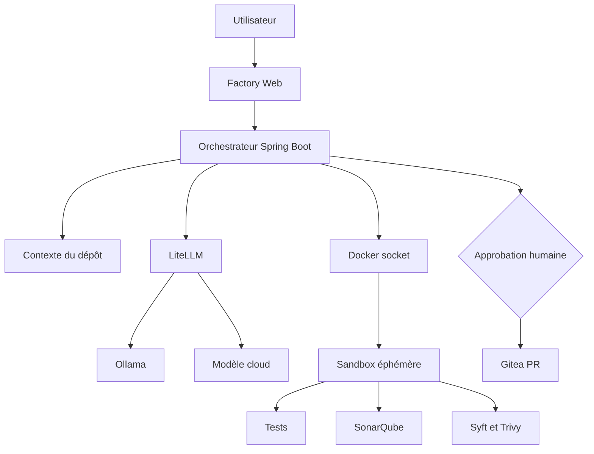
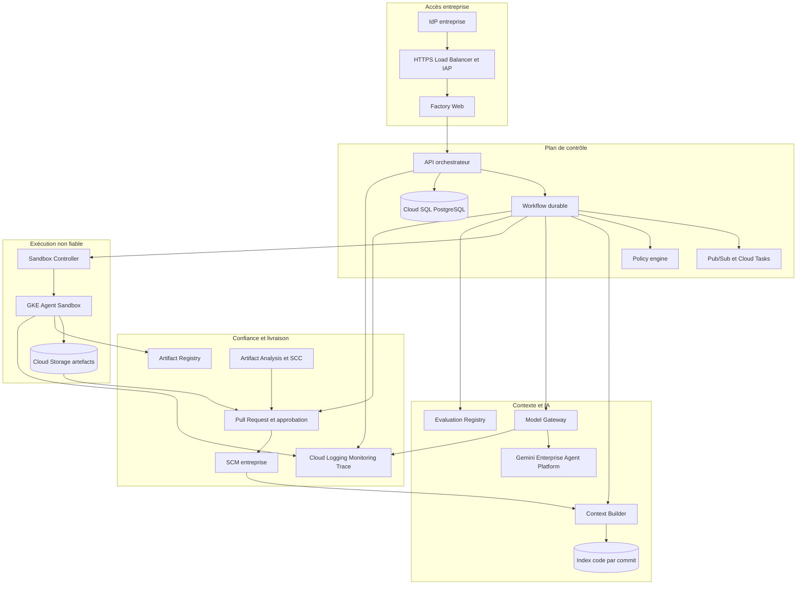
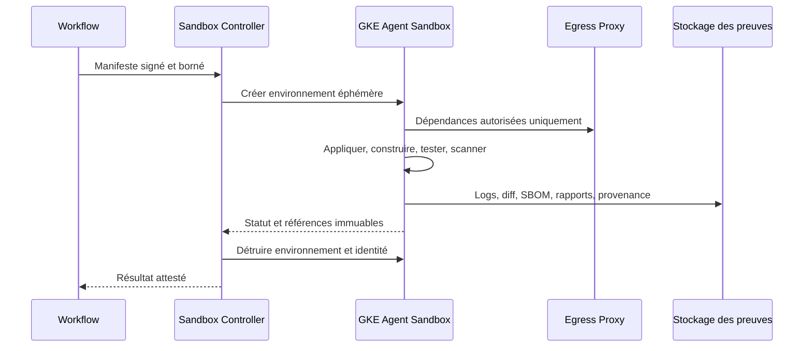
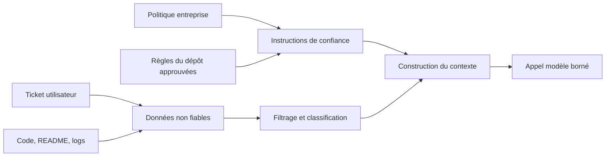
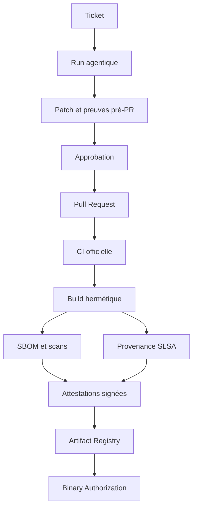
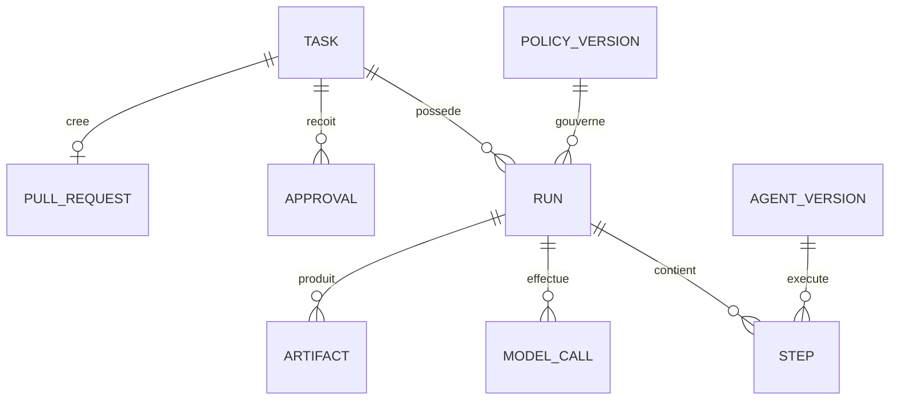
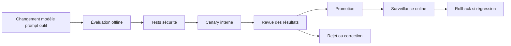

# Industrialisation GCP de l’AI Software Factory

**Dépôt analysé :** [`dbeaumont/ai-software-factory-local`](https://github.com/dbeaumont/ai-software-factory-local)  
**Révision de référence :** [`3b68ba5e`](https://github.com/dbeaumont/ai-software-factory-local/commit/3b68ba5e491e219c6d5bb8cc6ad280b12dfaf398), branche `main`, 27 août 2026  
**Objet :** état de l’art du marché, diagnostic du prototype et trajectoire vers une usine logicielle IA d’entreprise déployée dans Google Cloud.

---

## 1. Synthèse exécutive

Le dépôt constitue déjà un **bon prototype d’agent de développement asynchrone piloté par des preuves**. Il ne se contente pas de générer du code : il transforme un ticket en plan puis en patch, vérifie le diff, tente une réparation, exécute les tests dans une sandbox, produit des analyses SonarQube, Syft et Trivy, sollicite une revue IA, impose une approbation humaine, puis crée une Pull Request. Cette chaîne est décrite dans le [README](https://github.com/dbeaumont/ai-software-factory-local/blob/main/README.md), l’[architecture](https://github.com/dbeaumont/ai-software-factory-local/blob/main/docs/proto-architecture.md) et le [workflow](https://github.com/dbeaumont/ai-software-factory-local/blob/main/docs/proto-workflow.md).

Son positionnement est cohérent avec l’évolution du marché : les assistants dans l’IDE deviennent des **agents asynchrones capables de prendre un ticket, travailler dans un environnement éphémère et proposer une PR**. GitHub Copilot, GitLab Duo, Amazon Q Developer et Gemini Code Assist convergent vers des agents spécialisés, des règles d’entreprise, des outils structurés, MCP, des revues automatiques et une gouvernance centralisée.

En revanche, le prototype n’est pas encore exploitable comme plateforme d’entreprise. Les écarts les plus critiques sont structurels :

- état des tâches conservé en mémoire ;
- orchestrateur disposant du socket Docker de l’hôte ;
- absence de workflow durable, de file de travaux et d’idempotence de bout en bout ;
- absence de SSO, RBAC, séparation des responsabilités et identité par workload ;
- sandbox raccordée au réseau partagé lors des builds ;
- secrets locaux et comptes techniques statiques ;
- gouvernance limitée des modèles, prompts, outils et données envoyées aux LLM ;
- absence de banc d’évaluation et de critères de promotion d’un modèle ou d’un prompt ;
- télémétrie insuffisante sur les appels LLM, les outils, les coûts et la qualité réelle après merge ;
- preuves de sécurité présentes, mais non encore liées cryptographiquement à une provenance de build.

La cible recommandée n’est pas une simple transposition de Docker Compose vers GKE. Elle repose sur quatre plans clairement séparés :

1. **plan de contrôle** : API, workflow durable, règles, persistance et approbations ;
2. **plan de contexte et d’IA** : index du code, passerelle de modèles, prompts, outils et évaluations ;
3. **plan d’exécution non fiable** : sandboxes éphémères GKE Agent Sandbox/gVisor, isolées par tâche et privées par défaut ;
4. **plan de confiance et de livraison** : tests, scans, attestations, audit, signature et intégration au SCM/CI existant.

Le choix architectural central est le suivant : **utiliser GCP pour industrialiser la plateforme, sans reconstruire inutilement le SCM, le dépôt d’artefacts ou la CI/CD déjà présents dans l’entreprise**. L’usine agentique doit rester centrée sur la production contrôlée d’une PR et de ses preuves ; la CI/CD aval conserve la responsabilité du build de référence, de la promotion et du déploiement.

### Priorités recommandées

| Priorité | Décision | Résultat attendu |
|---:|---|---|
| P0 | Retirer `docker.sock` et exécuter chaque tâche dans une sandbox GKE dédiée | Suppression du principal risque de compromission de l’hôte |
| P0 | Persister les workflows, étapes, artefacts et approbations | Reprise après incident, audit et exécution idempotente |
| P0 | Mettre en place SSO, RBAC, IAM par workload et Secret Manager | Contrôle d’accès d’entreprise et disparition des clés statiques |
| P1 | Structurer les sorties d’agents et leurs outils | Réduction des erreurs d’intégration et contrôle des permissions |
| P1 | Créer une suite d’évaluation versionnée | Promotion objective des modèles, prompts et workflows |
| P1 | Ajouter l’observabilité GenAI de bout en bout | Pilotage des coûts, latences, erreurs, outils et résultats |
| P1 | Construire un contexte de code hybride et traçable | Moins de tokens, meilleure pertinence et sources explicables |
| P2 | Produire provenance, signature et attestations vérifiables | Chaîne de confiance compatible SLSA |
| P2 | Ajouter des workflows par niveau de risque et des boucles de feedback | Autonomie graduée, qualité mesurée après merge |

---

## 2. Périmètre et méthode

L’analyse du dépôt s’appuie en particulier sur :

- le [README](https://github.com/dbeaumont/ai-software-factory-local/blob/main/README.md) ;
- [`infrastructure/compose.yaml`](https://github.com/dbeaumont/ai-software-factory-local/blob/main/infrastructure/compose.yaml) ;
- [`docs/proto-architecture.md`](https://github.com/dbeaumont/ai-software-factory-local/blob/main/docs/proto-architecture.md) ;
- [`docs/proto-security.md`](https://github.com/dbeaumont/ai-software-factory-local/blob/main/docs/proto-security.md) ;
- [`docs/proto-workflow.md`](https://github.com/dbeaumont/ai-software-factory-local/blob/main/docs/proto-workflow.md) ;
- [`docs/cible-industrialisation avec GCP.md`](https://github.com/dbeaumont/ai-software-factory-local/blob/main/docs/cible-industrialisation%20avec%20GCP.md) ;
- le `pom.xml` de l’orchestrateur Spring Boot 3.5 / Java 21.

L’état de l’art est fondé prioritairement sur la documentation des éditeurs et des standards ouverts. Les offres changent rapidement ; les principes d’architecture proposés cherchent donc à limiter la dépendance à un modèle ou à un fournisseur particulier.

Le périmètre fonctionnel recommandé s’arrête à :

> **ticket → analyse → modification → preuves → approbation → Pull Request**

La CI/CD après la PR est considérée comme un système aval à intégrer. Elle n’est pas absorbée par l’orchestrateur agentique dans la première cible.

---

## 3. Analyse du prototype actuel

### 3.1 Architecture réelle

Le prototype assemble, dans Docker Compose :

| Capacité | Implémentation actuelle |
|---|---|
| Entrée web | Nginx `reverse-proxy` + SPA `factory-web` |
| Orchestration | Spring Boot 3.5 / Java 21, exécution asynchrone |
| Rôles IA | `Planner`, `Developer`, `PatchRepair`, `Tester`, `Reviewer` |
| Passerelle LLM | LiteLLM |
| Modèle local | Ollama, `qwen2.5-coder:7b` par défaut |
| Modèle cloud | OpenAI configurable via LiteLLM |
| SCM et PR | Gitea + PostgreSQL |
| Exécution | Conteneurs Docker éphémères lancés via `/var/run/docker.sock` |
| Dépendances | Artifactory OSS, miroir Maven |
| Qualité | SonarQube Community |
| Sécurité | Syft CycloneDX + Trivy vulnérabilités/secrets |
| Observabilité | Micrometer, Prometheus, Grafana |

### 3.2 Points forts à préserver

#### Une séparation entre génération et décision

Le modèle ne pousse pas directement du code. La livraison est placée derrière `WAITING_APPROVAL`, ce qui limite l’« excessive agency ». Ce contrôle est plus sain qu’un agent autorisé à modifier arbitrairement un dépôt.

#### Des preuves déterministes avant la revue IA

Le `Reviewer` synthétise des résultats provenant de Git, des tests, de SonarQube, de Syft et de Trivy. L’IA n’est donc pas l’unique juge de sa propre production. Cette combinaison **contrôles déterministes + synthèse IA + validation humaine** est une excellente base.

#### Une sandbox déjà contrainte

La [note de sécurité](https://github.com/dbeaumont/ai-software-factory-local/blob/main/docs/proto-security.md) mentionne limites CPU/mémoire/PID, suppression des capacités Linux, `no-new-privileges` et réseau coupé pour la validation de patch. Ces principes devront être transposés à GKE et renforcés.

#### Une abstraction de modèles

LiteLLM apporte une interface commune et permet un routage local/cloud. Cette abstraction est utile pour comparer les modèles, maîtriser les coûts, organiser un repli et réduire l’adhérence fournisseur.

#### Un workflow visible et compréhensible

Les statuts, le stepper, les logs et les artefacts rendent le processus lisible. Cette explicabilité opérationnelle est importante pour obtenir la confiance des développeurs et des équipes de contrôle.

### 3.3 Limites et risques

| Domaine | Situation actuelle | Risque entreprise | Cible |
|---|---|---|---|
| Durabilité | Tâches en mémoire | Perte, doublons, reprise impossible | Workflow durable + Cloud SQL |
| Exécution | Socket Docker dans l’orchestrateur | Compromission de l’hôte | Jobs/sandboxes GKE, aucune API Docker |
| Réseau | Sandbox sur réseau Compose partagé pour build/scan | Mouvement latéral et exfiltration | Default deny + egress proxy allow-list |
| Identités | Jetons statiques dans `.env`/`.vault` | Fuite, rotation difficile | Workload Identity + Secret Manager |
| Accès humain | Pas de SSO/RBAC | Utilisateur non attribuable, droits excessifs | IAP/IdP + rôles et séparation des tâches |
| Multi-tenant | Volume et services partagés | Fuite inter-projets | isolation par tâche, namespace et projet |
| Contexte | Extraction essentiellement linéaire | Coût, bruit, fichiers manquants | recherche hybride symbolique/lexicale/vectorielle |
| Agent | Sorties surtout textuelles | Parsing fragile, décisions ambiguës | JSON Schema et contrats versionnés |
| Outils | Appels fortement couplés | Extension et contrôle difficiles | catalogue d’outils typés, permissions par rôle |
| Gouvernance IA | Modèles/prompts configurés mais peu évalués | Régression silencieuse | registry + benchmarks + promotion |
| Observabilité | Métriques globales de tâches | RCA et FinOps incomplets | traces OpenTelemetry GenAI |
| Supply chain | SBOM et scan locaux | Preuves falsifiables ou non rattachées au build | provenance SLSA, signatures, attestations |
| Résilience | Instance locale unique | indisponibilité et saturation | services stateless, queue, autoscaling, SLO |
| Politique | Approbation unique | même contrôle quel que soit le risque | policy-as-code et approbation graduée |

---

## 4. État de l’art du marché en 2026

### 4.1 Du copilote synchrone à l’agent asynchrone

Le marché est passé de l’autocomplétion dans l’IDE à la délégation de tâches complètes. Les agents travaillent en arrière-plan, utilisent un environnement isolé, exécutent des tests, ouvrent une PR et demandent une revue.

- GitHub décrit son agent cloud comme un environnement dans lequel on peut ajouter des **agents personnalisés** et des **hooks** de validation, journalisation et scan de sécurité ([GitHub Copilot cloud agent](https://docs.github.com/copilot/concepts/agents/cloud-agent/about-cloud-agent)).
- GitLab Duo propose des **flows** combinant plusieurs agents pour corriger des bugs, écrire du code ou résoudre des vulnérabilités ([GitLab Duo Agent Platform](https://docs.gitlab.com/user/duo_agent_platform/), [Flows API](https://docs.gitlab.com/api/duo_agent_platform_flows/)).
- Amazon Q Developer peut prendre un issue GitHub, implémenter la demande et créer une PR ([Amazon Q Developer for GitHub](https://docs.aws.amazon.com/amazonq/latest/qdeveloper-ug/amazon-q-for-github.html)).
- Gemini Code Assist cible l’ensemble du cycle de développement et fournit assistance et agents sécurisés pour l’entreprise ([Gemini Code Assist](https://cloud.google.com/products/gemini/code-assist)).

**Conséquence pour l’usine :** son parcours ticket-vers-PR est au bon niveau. Il faut l’industrialiser plutôt que le remplacer par un simple assistant IDE.

### 4.2 Agents spécialisés, instructions hiérarchiques et compétences réutilisables

Les plateformes permettent de définir des agents par métier, dépôt, organisation ou entreprise. GitHub permet des agents personnalisés au niveau dépôt, organisation et entreprise ([configuration des agents personnalisés](https://docs.github.com/en/copilot/how-tos/copilot-on-github/customize-copilot/customize-cloud-agent/create-custom-agents)) et formalise des **Agent Skills** réutilisables ([About agent skills](https://docs.github.com/en/copilot/concepts/agents/about-agent-skills)). GitLab utilise règles personnalisées, `AGENTS.md`, contexte étendu et flows spécialisés ([GitLab Duo context](https://docs.gitlab.com/user/duo_agent_platform/context/)).

**Tendance :** le multi-agent utile n’est pas un groupe d’agents conversant librement. Il s’agit plutôt d’un catalogue gouverné de rôles, compétences, outils et workflows, avec permissions limitées et contrats de sortie.

### 4.3 MCP et outils structurés

MCP s’impose comme mécanisme d’intégration entre agents, contexte et outils. GitHub le décrit comme un standard ouvert pour connecter les modèles aux systèmes externes et l’utilise dans ses différentes surfaces Copilot ([MCP dans GitHub Copilot](https://docs.github.com/en/copilot/concepts/context/mcp)).

**Tendance :** les agents ne devraient pas disposer d’un shell universel. Ils devraient utiliser des outils à schéma explicite tels que `read_file`, `search_symbol`, `run_test_suite`, `get_quality_gate` ou `create_draft_pr`, chacun soumis à une autorisation et à une politique.

### 4.4 Une plateforme d’ingénierie avant une plateforme de modèles

Le rapport DORA 2025 souligne que l’IA amplifie le système d’ingénierie existant : une bonne plateforme, des boucles de feedback courtes et des pratiques de delivery solides permettent de convertir le gain individuel en performance collective ; une chaîne fragile absorbe mal l’augmentation de débit ([DORA State of AI-assisted Software Development 2025](https://dora.dev/dora-report-2025/)). DORA recommande aussi de mesurer la performance de la plateforme et de la delivery au moyen d’indicateurs de flux et de stabilité ([DORA Platform Engineering](https://dora.dev/capabilities/platform-engineering/)).

**Tendance :** la priorité n’est pas le nombre de modèles ou d’agents, mais la qualité de la plateforme : golden paths, self-service, sécurité intégrée, observabilité et feedback de production.

### 4.5 Évaluations continues plutôt que démonstrations ponctuelles

Les leaders du marché introduisent des évaluations de modèles et d’agents. Le service d’évaluation de Google fournit des tests objectifs, des rubriques adaptatives et des comparaisons utiles lors d’un changement de modèle ou de prompt ([Gen AI evaluation service](https://docs.cloud.google.com/gemini-enterprise-agent-platform/models/evaluation-overview)).

**Tendance :** chaque version d’un workflow agentique est traitée comme un produit logiciel. Elle passe une suite de cas de référence, des tests de sécurité, des mesures de coût/latence et un canary avant promotion.

### 4.6 Sécurité centrée sur l’agent

Le code du dépôt, les tickets, les logs de build et les pages de documentation sont des contenus non fiables capables de contenir une injection de prompt. Les contrôles classiques du SDLC ne suffisent donc pas. Google Model Armor filtre injections, jailbreaks, données sensibles, URL malveillantes et contenus à risque dans les requêtes et réponses ([Securing AI](https://cloud.google.com/security/securing-ai)). Le NIST fournit un profil GenAI pour intégrer ces risques à l’AI Risk Management Framework ([NIST AI 600-1](https://www.nist.gov/publications/artificial-intelligence-risk-management-framework-generative-artificial-intelligence)).

**Tendance :** traiter séparément les instructions de confiance et les données non fiables, limiter l’agence, filtrer les secrets, contrôler les outils et conserver une approbation graduée pour les actions sensibles.

### 4.7 Sandboxes renforcées pour le code non fiable

Les agents de code exécutent par définition une production non fiable. GKE Sandbox utilise gVisor afin d’ajouter une barrière entre le code du conteneur et le noyau de l’hôte ([GKE Sandbox](https://docs.cloud.google.com/kubernetes-engine/docs/concepts/sandbox-pods)). GKE Agent Sandbox ajoute une posture réseau `default deny` et des restrictions spécifiques aux environnements d’agents ([GKE Agent Sandbox](https://docs.cloud.google.com/kubernetes-engine/docs/concepts/machine-learning/agent-sandbox)).

**Tendance :** une sandbox par tâche, une identité éphémère, aucun accès au control plane, aucun secret global, système de fichiers jetable, ressources bornées et réseau privé par défaut.

### 4.8 Observabilité standardisée des systèmes GenAI

OpenTelemetry formalise les traces, métriques et événements GenAI : modèle, tokens, latence, appels d’outils et résultats, avec collecte du contenu uniquement lorsqu’elle est explicitement autorisée ([OpenTelemetry GenAI](https://opentelemetry.io/blog/2026/genai-observability/)). Google Cloud documente l’instrumentation des applications et agents GenAI, notamment ADK et LangGraph ([instrumentation GenAI](https://docs.cloud.google.com/stackdriver/docs/instrumentation/ai-agent-overview)).

**Tendance :** relier dans une même trace le ticket, le commit source, la version du workflow, chaque appel LLM, chaque outil, la sandbox, les preuves et la décision humaine.

### 4.9 Chaîne de confiance et provenance

SLSA formalise plusieurs niveaux de garantie, de l’existence d’une provenance jusqu’à une plateforme de build durcie ([SLSA 1.2](https://slsa.dev/spec/v1.2/), [Build track](https://slsa.dev/spec/v1.2/build-track-basics)). Google Cloud associe Cloud Build, Artifact Registry, Artifact Analysis et Binary Authorization pour établir et vérifier une chaîne de confiance ([Software supply chain security](https://docs.cloud.google.com/software-supply-chain-security/docs/overview)).

**Tendance :** le SBOM ou le rapport de scan n’est plus un fichier isolé ; il devient une attestation liée au commit, au builder, à l’image et à la politique de promotion.

### 4.10 Synthèse comparative

| Axe | GitHub Copilot | GitLab Duo | Amazon Q Developer | Gemini / GCP | Leçon pour l’usine |
|---|---|---|---|---|---|
| Déclenchement | issue/prompt/PR | issue, IDE, flow CI | issue/commande | IDE, PR, agents | conserver ticket → PR |
| Exécution | agent cloud éphémère | local ou CI/CD | service managé | Cloud/Agent Platform | découpler contrôle et sandbox |
| Spécialisation | custom agents, skills | agents et flows | agents par tâche | ADK/agents/outils | catalogue gouverné de rôles |
| Contexte | dépôt + instructions + MCP | dépôt + règles + MCP | workspace + AWS | grand contexte + outils GCP | retrieval hybride et traçable |
| Contrôles | hooks et revue PR | CI, sécurité GitLab | code review/sécurité | évaluations, Model Armor | preuves déterministes obligatoires |
| Gouvernance | politiques enterprise | composite identity, métriques | IAM AWS | IAM, VPC-SC, Model Armor | identité et politique par action |
| Ouverture | MCP, agents tiers | MCP, API flows | GitHub/GitLab/AWS | ADK, modèles partenaires | maintenir une gateway multi-modèles |

---

## 5. Principes de la cible GCP

1. **Managed-first, mais pas managed-only.** Utiliser les services GCP lorsqu’ils réduisent réellement l’exploitation ; conserver des composants portables lorsqu’ils évitent un verrouillage excessif.
2. **Stateless control plane.** L’API ne porte ni workspace durable ni état de workflow en mémoire.
3. **Durable execution.** Chaque étape est persistée, rejouable, idempotente et bornée.
4. **Zero trust entre plans.** Une sandbox ne fait pas confiance à l’orchestrateur, aux autres sandboxes ni au contenu cloné.
5. **Une identité par workload et par rôle.** Aucun fichier de clé de service account.
6. **Données minimales vers le modèle.** Classification, redaction, résidence et politique de rétention explicites.
7. **Contrats structurés.** Entrées et sorties validées par JSON Schema ; le texte libre reste un artefact destiné à l’humain.
8. **Evidence first.** Une décision de revue pointe vers des résultats reproductibles et horodatés.
9. **Model agnostic.** Le modèle est une dépendance versionnée et remplaçable, non le centre de l’architecture.
10. **Autonomie graduée.** Les permissions et approbations dépendent du risque du changement.

---

## 6. Architecture cible dans GCP

### 6.1 Vue logique

### 6.2 Découpage en projets GCP

Une organisation d’entreprise devrait au minimum séparer :

| Projet | Contenu | Niveau de confiance |
|---|---|---|
| `ai-factory-control-prod` | API, workflow, Cloud SQL, règles, audit | élevé |
| `ai-factory-ai-prod` | gateway, modèles, index, évaluations | élevé et données sensibles |
| `ai-factory-sandbox-prod` | cluster GKE dédié, jobs éphémères | non fiable |
| `ai-factory-security-prod` | journaux centralisés, KMS, SCC, attestations | très élevé |
| `ai-factory-nonprod-*` | environnements de dev/intégration | séparé de la production |

Des Shared VPC, règles de firewall, Private Service Connect et périmètres VPC Service Controls peuvent limiter les chemins d’exfiltration. VPC Service Controls est conçu pour créer des périmètres autour des services, données et ressources IA ([VPC Service Controls](https://cloud.google.com/security/vpc-service-controls)).

### 6.3 Mapping des composants actuels

| Composant local | Cible recommandée | Remarque |
|---|---|---|
| `factory-web` | Cloud Run ou GKE, derrière HTTPS LB + IAP | Cloud Run suffit si l’IHM est stateless |
| Nginx reverse proxy | External/Internal HTTPS Load Balancer + IAP | Cloud Armor si exposition externe |
| Orchestrateur Spring | Cloud Run ou GKE Autopilot | API stateless ; aucun lancement de conteneur local |
| État en mémoire | Cloud SQL PostgreSQL HA | schéma tasks/runs/steps/artifacts/approvals |
| Pipeline asynchrone | moteur de workflow durable + Pub/Sub/Cloud Tasks | Temporal est adapté aux boucles longues ; Workflows convient aux orchestrations GCP plus simples |
| Docker sandbox | GKE Standard dédié avec Agent Sandbox/gVisor | un environnement éphémère par tentative |
| Volume workspace | disque éphémère + Cloud Storage versionné | suppression automatique et rétention réglementée |
| `.env` / `.vault` | Secret Manager + Workload Identity | aucune clé de service account |
| LiteLLM | LiteLLM HA sur GKE ou gateway interne équivalente | conserver si multi-modèles requis |
| Ollama | Vertex AI endpoints ou pool GPU GKE dédié | ne pas mélanger avec les sandboxes de code |
| OpenAI direct | appel via gateway et egress contrôlé | politique par classification de dépôt |
| Gitea | SCM d’entreprise existant | ne pas recréer le SCM sans besoin métier |
| Artifactory | Artifactory entreprise ou Artifact Registry | garder l’existant si standard groupe |
| SonarQube | SonarQube entreprise/Cloud existant | intégrer les quality gates officiels |
| Syft/Trivy | outils dans job + Artifact Analysis | produire des attestations exploitables |
| Prometheus/Grafana | Managed Service for Prometheus + Cloud Monitoring/Grafana | traces OpenTelemetry en complément |

### 6.4 Cloud Run ou GKE pour le plan de contrôle ?

**Recommandation :** commencer avec Cloud Run pour `factory-web`, l’API et les petits services stateless ; utiliser GKE exclusivement là où il apporte une capacité nécessaire, en premier lieu la sandbox.

GKE devient pertinent pour le plan de contrôle si l’entreprise impose un socle Kubernetes commun, un service mesh, des sidecars, des contraintes réseau avancées ou l’hébergement de LiteLLM/Temporal. Il ne faut pas déplacer toute la stack Compose dans un cluster par réflexe.

### 6.5 Workflow durable

Le moteur doit supporter :

- persistance de l’état après redémarrage ;
- retries avec backoff et classification transitoire/définitive ;
- timeouts et annulation ;
- activités idempotentes ;
- attente humaine de plusieurs heures ou jours ;
- reprise depuis une étape ;
- compensation en cas d’échec de livraison ;
- versionnement du workflow pour les exécutions en cours.

Deux options crédibles :

| Option | Avantages | Limites | Usage recommandé |
|---|---|---|---|
| Temporal Cloud ou Temporal sur GKE | excellent pour workflows longs, retries, signaux humains, versionnement | composant supplémentaire et compétences spécifiques | cible complète |
| Cloud Workflows + Pub/Sub + Cloud Tasks + Cloud SQL | services GCP managés et simples à opérer | boucles agentiques et état fin plus verbeux | première version ou workflow peu dynamique |

L’API Spring reste le plan de contrôle métier. Le moteur de workflow ne doit pas contenir les secrets ni les gros artefacts ; il conserve des références vers Cloud Storage et Cloud SQL.

### 6.6 Sandbox d’exécution

Chaque tentative crée un environnement isolé avec :

- `RuntimeClass` gVisor / GKE Agent Sandbox ;
- service account Kubernetes dédié et Workload Identity minimale ;
- namespace ou environnement de sandbox par tâche ;
- root filesystem en lecture seule quand possible ;
- volume éphémère, quota CPU/mémoire/PID/durée ;
- Pod Security Standards `restricted` ;
- seccomp, capacités supprimées, non-root ;
- réseau `default deny` ;
- egress uniquement vers le SCM en lecture, le miroir de dépendances, SonarQube et les services explicitement nécessaires ;
- aucun accès aux métadonnées GCP, au control plane Kubernetes ou aux secrets du plan de contrôle ;
- destruction automatique après export des preuves.

Workload Identity Federation permet d’attribuer des permissions IAM distinctes à chaque workload sans clé statique ([Workload Identity for GKE](https://docs.cloud.google.com/kubernetes-engine/docs/concepts/workload-identity)). L’intégration Secret Manager peut s’appuyer sur cette identité ([Secret Manager add-on](https://docs.cloud.google.com/secret-manager/docs/secret-manager-managed-csi-component)).

### 6.7 Contexte du code

Le contexte doit être construit pour un **commit immuable**, et non pour une branche mouvante. Une stratégie hybride est recommandée :

1. inventaire filtré du dépôt et fichiers de build ;
2. recherche lexicale/BM25 ;
3. index symbolique AST/tree-sitter ou LSP ;
4. graphe modules, imports, appels et tests ;
5. embeddings pour la proximité sémantique ;
6. reranking selon le ticket, le langage et le rôle de l’agent ;
7. citations internes `repo@sha:path:lines` dans chaque décision.

Les règles d’entreprise et du dépôt doivent être séparées du contenu non fiable :

Une phrase dans un commentaire source ne doit jamais être interprétée comme une nouvelle règle système. Les fichiers secrets, binaires, générés, vendorisés et trop volumineux sont exclus avant indexation.

### 6.8 Passerelle de modèles et gouvernance

LiteLLM peut être conservé, mais doit devenir un service HA avec :

- authentification par identité de workload ;
- catalogue de modèles approuvés ;
- routage par classification des données et type de tâche ;
- quotas, budgets, rate limits et limites de contexte ;
- retries contrôlés, circuit breakers et repli explicite ;
- journalisation sans prompt brut par défaut ;
- version du modèle effectivement servi ;
- métriques de tokens, coût, latence et cache ;
- intégration Model Armor avant et après inférence ;
- interdiction d’un fournisseur externe pour les dépôts classifiés.

La nouvelle Gemini Enterprise Agent Platform est présentée par Google comme la plateforme unifiée pour construire, déployer, gouverner et optimiser les agents ([présentation](https://cloud.google.com/products/gemini-enterprise-agent-platform)). Elle peut fournir modèles, évaluation et services d’agent, mais elle ne remplace pas la sandbox de code ni les contrôles déterministes de l’usine.

### 6.9 Outils et permissions

Définir un catalogue d’outils à entrées/sorties typées :

| Outil | Rôles autorisés | Effet | Approbation |
|---|---|---|---|
| `search_code` | Planner, Developer, Tester, Reviewer | lecture | non |
| `read_file` | tous selon scope | lecture bornée | non |
| `propose_patch` | Developer, Repair | artefact, pas de push | non |
| `run_tests` | Tester/Workflow | sandbox | politique automatique |
| `scan_security` | Workflow | sandbox | automatique |
| `read_quality_gate` | Reviewer | lecture | non |
| `create_branch` | Delivery service | SCM | après approbation |
| `create_pull_request` | Delivery service | SCM | après approbation |
| `merge_pull_request` | aucun agent par défaut | action irréversible | hors périmètre usine |

MCP peut standardiser la surface d’intégration, mais il ne constitue pas en lui-même un mécanisme de sécurité. Chaque serveur, outil, argument, identité et destination doit rester soumis à une politique.

### 6.10 Policy-as-code et autonomie graduée

Attribuer un score de risque selon :

- chemins modifiés (`iam/`, `.github/workflows/`, Terraform, réseau, sécurité, migration DB) ;
- ajout de dépendances ;
- exposition d’API ou modification d’authentification ;
- criticité du dépôt ;
- taille et dispersion du diff ;
- échec ou absence de tests ;
- vulnérabilités nouvelles ;
- confiance issue du benchmark et du modèle utilisé.

| Niveau | Exemple | Politique |
|---|---|---|
| R0 | documentation, formatage | PR automatique, revue humaine standard |
| R1 | code applicatif localisé avec tests | une approbation humaine |
| R2 | dépendance, schéma DB, API publique | approbation propriétaire + expert |
| R3 | IAM, CI/CD, secrets, réseau, sécurité | double approbation, agent restreint |
| R4 | merge ou déploiement production | hors périmètre par défaut |

OPA/Gatekeeper ou un moteur de politique métier peut évaluer le manifeste avant exécution et avant livraison. La décision et la version de politique deviennent des artefacts d’audit.

### 6.11 Supply chain

Le job agentique produit des **preuves de pré-PR** ; la CI officielle produit le **build de référence** après création de la PR ou après merge.

La cible inclut :

- images référencées par digest ;
- dépendances verrouillées et miroirs approuvés ;
- SBOM CycloneDX ou SPDX ;
- scan des vulnérabilités et secrets avec politique différentielle ;
- provenance SLSA générée par une plateforme de build hébergée ;
- signature Cosign avec clé KMS ou identité keyless autorisée ;
- attestations stockées avec l’artefact ;
- Binary Authorization pour les workloads déployés sur GKE.

### 6.12 Observabilité et audit

Chaque run porte un `trace_id` reliant : ticket, dépôt, commit, workflow, modèle, prompt, appels d’outils, sandbox, artefacts, approbation et PR.

Indicateurs minimaux :

| Catégorie | Mesures |
|---|---|
| Fiabilité | succès, échecs, retries, timeouts, reprise, saturation queue |
| IA | tokens, coût, latence, modèle, cache, refus Model Armor |
| Agent | appels d’outils, tours, erreurs de schéma, réparations |
| Qualité | patch applicable, tests passants, couverture, quality gate |
| Sécurité | secrets, CVE nouvelles, violations de politique, egress bloqué |
| Expérience | temps jusqu’à PR, attente d’approbation, taux d’acceptation |
| Valeur | taux de merge, changements demandés, revert, incident post-merge |
| Delivery | métriques DORA et rework après intégration |

Les prompts et réponses complets ne doivent pas être collectés par défaut. On conserve hash, version, métadonnées, catégories de données et extraits redacted ; l’accès au contenu complet doit être exceptionnel, tracé et soumis à rétention.

### 6.13 SLO et résilience

Exemples de SLO à ajuster après mesure :

- API de contrôle : 99,9 % mensuel ;
- aucune perte d’un run accepté par l’API ;
- 99 % des transitions persistées en moins de 2 secondes ;
- démarrage d’une sandbox P95 inférieur à 60 secondes ;
- reprise automatique après redémarrage du control plane ;
- RPO Cloud SQL inférieur à 5 minutes, RTO inférieur à 60 minutes ;
- 100 % des actions SCM et approbations attribuables à une identité.

---

## 7. Modèle de données minimal

Entités essentielles :

- `Task` : ticket, dépôt, SHA source, classification, risque ;
- `Run` : version de workflow, état, dates, idempotency key ;
- `Step` : entrée hashée, tentative, résultat, erreur, durée ;
- `AgentVersion` : rôle, prompt, outils, modèle, schéma de sortie ;
- `ModelCall` : fournisseur, modèle réel, tokens, coût, filtres ;
- `Artifact` : URI, hash, type, rétention, signature ;
- `Approval` : identité, rôle, décision, commentaire, périmètre ;
- `PolicyVersion` : bundle et décision ;
- `PullRequest` : SCM, branche, commit, URL, état.

Cloud Storage conserve les objets volumineux ; Cloud SQL conserve métadonnées, transitions et références. Les artefacts sont adressés par hash afin de détecter toute modification.

---

## 8. Évaluations et promotion continue

### 8.1 Banc d’essai propre à l’entreprise

Créer un jeu de tâches versionné couvrant :

- Java/Spring et Angular, puis les autres stacks prioritaires ;
- bug localisé, nouvelle API, refactoring, dépendance, migration, sécurité ;
- cas simples, ambigus et volontairement hostiles ;
- injections de prompt dans README, commentaires, tickets et logs ;
- tests visibles et tests cachés ;
- règles de chemins interdits ;
- budget maximal de tokens et de temps.

### 8.2 Mesures

- taux de tâches résolues ;
- patch applicable au premier essai ;
- précision de sélection des fichiers ;
- réussite des tests cachés ;
- régressions et mutations détectées ;
- violations de sécurité/politique ;
- taux d’hallucination d’API ;
- coût et durée par tâche réussie ;
- acceptation humaine, merge, rework et revert.

### 8.3 Pipeline de promotion

Une modification de modèle, prompt, outil, règle ou stratégie de contexte est une release de l’usine. Elle ne doit pas être promue uniquement parce qu’elle réussit une démonstration.

---

## 9. Roadmap proposée

### Lot 0 — Cadrage et landing zone, 3 à 5 semaines

- confirmer SCM, CI, SonarQube et dépôt d’artefacts d’entreprise à intégrer ;
- classifier les dépôts et définir les modèles autorisés ;
- définir projets GCP, Shared VPC, régions, VPC-SC, IAM et journalisation ;
- établir le threat model et les niveaux de risque R0–R4 ;
- définir SLO, rétention, RTO/RPO et responsabilités RACI ;
- constituer 20 à 30 tâches de référence.

**Critère de sortie :** architecture, politique de données et modèle de menace validés.

### Lot 1 — Control plane durable, 6 à 8 semaines

- rendre l’orchestrateur stateless ;
- ajouter Cloud SQL et le modèle `Task/Run/Step/Artifact/Approval` ;
- introduire queue et workflow durable ;
- rendre clone, génération, sandbox et création de PR idempotents ;
- stocker les artefacts dans Cloud Storage avec hash ;
- déployer API/UI derrière IAP et SSO ;
- ajouter RBAC et audit d’approbation.

**Critère de sortie :** un redémarrage ou retry ne perd pas la tâche et ne crée pas de PR dupliquée.

### Lot 2 — Exécution sécurisée, 6 à 10 semaines

- déployer un cluster GKE sandbox séparé ;
- supprimer totalement `/var/run/docker.sock` ;
- implémenter manifeste d’exécution, quotas et timeouts ;
- activer gVisor/GKE Agent Sandbox, Pod Security et `default deny` ;
- mettre en place egress proxy et miroirs autorisés ;
- attribuer une identité éphémère minimale par job ;
- détruire workspace et credentials après export des preuves.

**Critère de sortie :** tests d’évasion, d’accès métadonnées et d’exfiltration bloqués.

### Lot 3 — Gouvernance IA et qualité, 6 à 8 semaines

- registry des agents, prompts, schémas, outils et modèles ;
- sorties JSON validées ;
- Model Armor et redaction de secrets ;
- contexte hybride indexé par commit ;
- banc d’évaluation exécuté automatiquement ;
- canary et rollback des versions d’agent ;
- traces OpenTelemetry GenAI et coûts.

**Critère de sortie :** chaque version est comparable et promue sur seuils mesurés.

### Lot 4 — Chaîne de confiance, 4 à 6 semaines

- intégrer CI officielle et quality gates ;
- générer provenance et attestations ;
- signer SBOM et artefacts ;
- vérifier signatures et politiques ;
- différencier vulnérabilités nouvelles/préexistantes ;
- publier un dossier de preuves dans la PR.

**Critère de sortie :** toute PR générée est liée à un ensemble de preuves intègres et attribuables.

### Lot 5 — Passage à l’échelle, continu

- multi-tenant et quotas par équipe ;
- portail self-service et golden paths ;
- charge, chaos, PRA et capacity planning ;
- routing coût/qualité et FinOps ;
- feedback post-merge et métriques DORA ;
- extension graduée des stacks et des workflows.

---

## 10. Backlog priorisé

| ID | Epic | Priorité | Dépendance |
|---|---|---:|---|
| FND-01 | Persistance Cloud SQL et migrations | P0 | landing zone |
| FND-02 | Workflow durable et idempotence | P0 | FND-01 |
| SEC-01 | SSO/IAP/RBAC | P0 | landing zone |
| SEC-02 | Workload Identity et Secret Manager | P0 | landing zone |
| SBX-01 | Sandbox Controller sans Docker socket | P0 | FND-02 |
| SBX-02 | GKE Agent Sandbox/gVisor | P0 | SBX-01 |
| SBX-03 | Default deny et egress proxy | P0 | SBX-02 |
| AGT-01 | Contrats JSON des agents | P1 | FND-02 |
| AGT-02 | Catalogue d’outils typés et permissions | P1 | AGT-01 |
| CTX-01 | Index symbolique et lexical par SHA | P1 | stockage artefacts |
| CTX-02 | Retrieval hybride avec citations | P1 | CTX-01 |
| GOV-01 | Registry modèles/prompts/agents | P1 | AGT-01 |
| GOV-02 | Model Armor et classification | P1 | gateway |
| EVA-01 | Jeu de référence et tests cachés | P1 | Lot 0 |
| EVA-02 | Pipeline de promotion et canary | P1 | EVA-01, GOV-01 |
| OBS-01 | Traces OpenTelemetry GenAI | P1 | FND-02 |
| OBS-02 | Tableaux de bord coût/qualité/SLO | P1 | OBS-01 |
| POL-01 | Scoring de risque et policy-as-code | P1 | AGT-02 |
| SUP-01 | Provenance SLSA et attestations | P2 | CI officielle |
| SUP-02 | Signature KMS/Cosign | P2 | SUP-01 |
| EXP-01 | Vue de revue fondée sur les preuves | P2 | artefacts structurés |
| FBK-01 | Feedback merge/rework/revert | P2 | intégration SCM |

---

## 11. Décisions à éviter

- **Migrer Compose tel quel vers GKE.** Cela conserverait le couplage, les secrets et les frontières de confiance du POC.
- **Donner un shell et un réseau ouverts aux agents.** MCP ou un framework d’agent ne remplace pas une politique de sécurité.
- **Utiliser le LLM comme quality gate.** Les tests, scans et politiques restent l’autorité ; l’IA explique et complète.
- **Envoyer tout le dépôt au modèle.** Cette approche augmente coût, bruit, fuite potentielle et surface d’injection.
- **Conserver les prompts complets dans tous les logs.** L’observabilité doit appliquer minimisation, redaction et contrôle d’accès.
- **Mesurer seulement les lignes générées ou les tokens.** La valeur est le changement accepté, mergé, stable et sans rework.
- **Remplacer le SCM ou la CI d’entreprise sans besoin.** L’usine doit s’intégrer au système de delivery, pas créer un silo.
- **Étendre immédiatement jusqu’au merge et au déploiement.** Commencer par fiabiliser la production de PR et les preuves.
- **Ajouter de nombreux agents avant les fondations.** La durabilité, l’isolation et l’évaluation ont un meilleur retour initial.

---

## 12. Indicateurs de succès du programme

Après six mois de pilote, viser des tendances plutôt que des objectifs artificiels :

- zéro perte de tâche et zéro PR dupliquée après retry ;
- 100 % des runs rattachés à un commit, une version d’agent et une identité ;
- 100 % des sandboxes sans secret statique et avec egress contrôlé ;
- amélioration mesurable du taux de patch applicable et des tests passants ;
- baisse du temps médian ticket → PR sur les cas éligibles ;
- taux de merge et de rework comparés à une population témoin ;
- aucune régression de sécurité lors d’un changement de modèle ;
- coût par PR acceptée et non coût par requête ;
- satisfaction développeur et confiance dans les preuves ;
- métriques DORA suivies pour vérifier que l’accélération ne dégrade pas la stabilité.

---

## 13. Conclusion

L’AI Software Factory actuelle possède déjà le bon squelette fonctionnel : rôles distincts, patch vérifié, sandbox, preuves déterministes, revue IA, approbation humaine et PR. Elle est donc plus proche de l’état de l’art fonctionnel que ne le suggère son statut de prototype.

Le passage à l’entreprise exige toutefois un changement de nature : **l’orchestrateur doit devenir un plan de contrôle durable et la sandbox un plan d’exécution hostile, jetable et strictement isolé**. Autour de cette séparation viennent l’identité, la gouvernance des données et des modèles, les évaluations, l’observabilité GenAI, la policy-as-code et la chaîne de confiance.

La cible GCP recommandée combine Cloud Run pour les services stateless, Cloud SQL et un workflow durable pour l’état, GKE Agent Sandbox/gVisor pour le code non fiable, Vertex/Gemini pour les modèles et évaluations, Secret Manager et Workload Identity pour les identités, ainsi que les services de sécurité et d’observabilité GCP. Elle conserve une gateway multi-modèles et s’intègre au SCM, à SonarQube, au dépôt d’artefacts et à la CI/CD de l’entreprise.

Le premier investissement ne doit donc pas être un agent supplémentaire. Il doit être, dans cet ordre : **supprimer le socket Docker, rendre les exécutions persistantes et idempotentes, établir les identités et frontières réseau, puis mesurer objectivement la qualité des agents**. Une fois ces fondations installées, l’usine pourra gagner en autonomie sans perdre en maîtrise.

---

## 14. Références principales

### Dépôt analysé

- [AI Software Factory — README](https://github.com/dbeaumont/ai-software-factory-local/blob/main/README.md)
- [Architecture du prototype](https://github.com/dbeaumont/ai-software-factory-local/blob/main/docs/proto-architecture.md)
- [Sécurité du prototype](https://github.com/dbeaumont/ai-software-factory-local/blob/main/docs/proto-security.md)
- [Workflow](https://github.com/dbeaumont/ai-software-factory-local/blob/main/docs/proto-workflow.md)
- [Docker Compose](https://github.com/dbeaumont/ai-software-factory-local/blob/main/infrastructure/compose.yaml)

### Marché, standards et GCP

- [DORA — State of AI-assisted Software Development 2025](https://dora.dev/dora-report-2025/)
- [GitHub Copilot cloud agent](https://docs.github.com/copilot/concepts/agents/cloud-agent/about-cloud-agent)
- [GitLab Duo Agent Platform](https://docs.gitlab.com/user/duo_agent_platform/)
- [Amazon Q Developer for GitHub](https://docs.aws.amazon.com/amazonq/latest/qdeveloper-ug/amazon-q-for-github.html)
- [Gemini Code Assist](https://cloud.google.com/products/gemini/code-assist)
- [Gemini Enterprise Agent Platform](https://cloud.google.com/products/gemini-enterprise-agent-platform)
- [GKE Sandbox](https://docs.cloud.google.com/kubernetes-engine/docs/concepts/sandbox-pods)
- [GKE Agent Sandbox](https://docs.cloud.google.com/kubernetes-engine/docs/concepts/machine-learning/agent-sandbox)
- [Model Armor et sécurité de l’IA](https://cloud.google.com/security/securing-ai)
- [Gen AI evaluation service](https://docs.cloud.google.com/gemini-enterprise-agent-platform/models/evaluation-overview)
- [OpenTelemetry GenAI](https://opentelemetry.io/blog/2026/genai-observability/)
- [SLSA 1.2](https://slsa.dev/spec/v1.2/)
- [Google Cloud Software Supply Chain Security](https://docs.cloud.google.com/software-supply-chain-security/docs/overview)
- [NIST AI RMF — Generative AI Profile](https://www.nist.gov/publications/artificial-intelligence-risk-management-framework-generative-artificial-intelligence)
