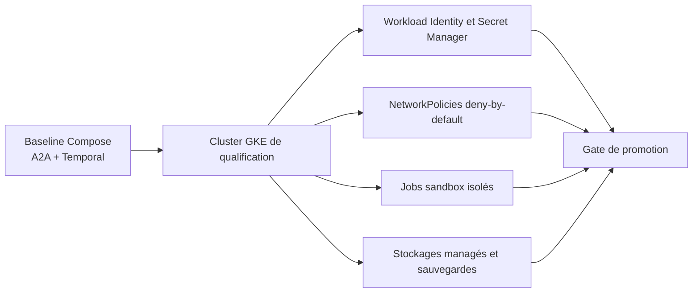

# Améliorations recommandées pour l'AI Software Factory

> État revu le 7 septembre 2026. Temporal, A2A, OpenTelemetry et le retrait de la socket Docker sont désormais des
> acquis ; cette roadmap ne les présente plus comme des activations futures.

## Baseline acquise

- [x] Temporal est l'unique moteur du parcours public et la projection PostgreSQL est active.
- [x] Les quatorze rôles sont des runtimes isolés invoqués exclusivement par A2A 1.0.
- [x] Les appels aux outils passent par les cinq frontières MCP.
- [x] Le backend sandbox local utilise des runners Compose statiques sans socket Docker.
- [x] Les applications exportent métriques, traces et logs par OpenTelemetry vers SigNoz.
- [x] Les migrations Temporal et A2A ont été réalisées par coupure franche, qualifiées et documentées.
- [x] `make all` reconstruit et vérifie une fabrique A2A complète depuis des volumes Docker vides.

## Priorités actuelles

| Priorité | Chantier | Résultat attendu |
|---:|---|---|
| P0 | Authentification et autorisation | OIDC, RBAC/ABAC et séparation demandeur/approbateur |
| P0 | CI obligatoire | Tests, contrats, replay, scans et provenance imposés avant fusion |
| P0 | Gestion des secrets | Secret Manager et identités workload hors fichiers locaux |
| P1 | Qualification GKE | Agents, Temporal, sandbox, réseaux et reprise validés sur cluster réel |
| P1 | PRA et haute disponibilité | RTO/RPO mesurés, sauvegardes et restaurations automatisées |
| P1 | Évaluation métier | Qualité, coût, délai et intervention humaine mesurés sur un corpus représentatif |
| P2 | Console opérateur | DAG, décisions, budgets, traces, retries et kill switch accessibles avec contrôle |
| P2 | Routage de modèles | Politique explicite selon complexité, sensibilité, coût et disponibilité |

## 1. Sécuriser l'accès humain

Avant tout usage partagé :

- intégrer un fournisseur OIDC ;
- définir les rôles `REQUESTER`, `OPERATOR`, `APPROVER`, `SECURITY_ADMIN` et `PLATFORM_ADMIN` ;
- interdire l'auto-approbation et propager l'identité comme donnée d'audit ;
- appliquer CSRF, rate limiting et quotas par identité/projet ;
- journaliser toute modification de configuration et de politique.

Les jetons humains ne doivent jamais être transmis aux agents, aux MCP ou aux sandboxes.

## 2. Rendre la CI obligatoire

La CI distante doit vérifier au minimum :

- tests Java et frontend ;
- schémas JSON, politiques YAML et cohérence des Agent Cards ;
- déterminisme et replay des workflows Temporal ;
- topologies Compose et GKE ;
- séparation réseau et absence de socket Docker ;
- contrats OpenTelemetry, dashboards et alertes SigNoz ;
- SBOM, Trivy, détection de secrets, signatures et provenance ;
- compatibilité `N`/`N-1` des workflows, messages A2A et artefacts Evidence.

Un changement de prompt, modèle, skill, permission, budget ou contrat doit suivre la même gouvernance qu'un
changement applicatif.

## 3. Qualifier la cible GKE

La qualification doit reprendre les invariants locaux sans créer de deuxième chemin : même protocole A2A, mêmes
contrats, mêmes task queues et même autorité Temporal. Le backend GKE remplace uniquement l'implémentation sandbox
et les primitives d'infrastructure.

## 4. Automatiser sauvegarde et reprise

Le plan de reprise doit restaurer ensemble :

- historique Temporal ;
- projection métier PostgreSQL ;
- projection A2A ;
- Evidence et état SCM idempotent ;
- Gitea, SonarQube et Artifactory ;
- configuration SigNoz et données nécessaires à l'audit.

Les exercices doivent mesurer RTO/RPO, vérifier les digests, réconcilier les effets inconnus et exécuter la barrière
de disponibilité avant réouverture.

## 5. Mesurer la valeur agentique

Constituer un corpus versionné de tickets Maven, Gradle et npm couvrant correctifs, évolutions multi-fichiers,
contrats et sécurité. Répéter les cas pour mesurer la variance.

Mesures minimales :

- patch correct au premier essai et taux de tests réussis ;
- défauts ou vulnérabilités introduits ;
- replans, réparations et contradictions ;
- durée totale et chemin critique ;
- tokens, coût disponible/indisponible et coût par proposition acceptée ;
- interventions humaines et taux de PR utilisables ;
- incidents de contrat, identité, preuve ou idempotence.

Le coût inconnu ne doit jamais être enregistré comme zéro.

## 6. Construire la console opérateur

La console devrait présenter le DAG Temporal, les tâches A2A, leurs Agent Cards et Build IDs, les budgets, les
preuves, les traces et la livraison SCM. Les actions pause, annulation, retry, réponse humaine et kill switch doivent
être autorisées, auditées et liées à une révision.

## 7. Routage de modèles

Un catalogue de modèles peut sélectionner un modèle selon la complexité, la sensibilité, le coût et la disponibilité.
Le modèle demandé et le modèle réellement utilisé doivent être conservés. Aucun fallback ne doit contourner une
politique de résidence ou réduire silencieusement les exigences de revue.

## Critères d'expérimentation d'entreprise

- aucune mutation anonyme ou auto-approuvée ;
- aucune socket Docker ou charge privilégiée ;
- restauration et rollback A2A démontrés ;
- tâches et effets réconciliés après panne ;
- CI et supply chain obligatoires ;
- coût et qualité mesurés sur un corpus représentatif ;
- SLO, alertes et astreinte validés ;
- approbation conjointe Produit, Architecture, Sécurité et Exploitation.

## Références

- [État courant](../../overview/current-state.md)
- [Plan A2A/Temporal réalisé](../migrations/migration-agents-a2a-temporal.md)
- [Plan de retrait de la socket Docker](../migrations/retrait-docker-socket.md)
- [Stratégie OpenTelemetry](../migrations/strategie-opentelemetry.md)
- [Exploitation GKE A2A](../../operations/A2A-GKE.md)
