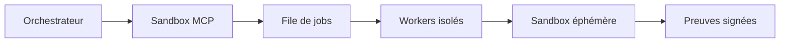
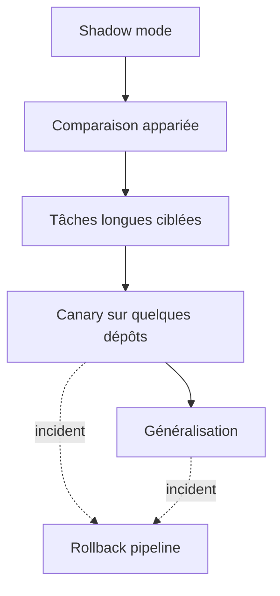
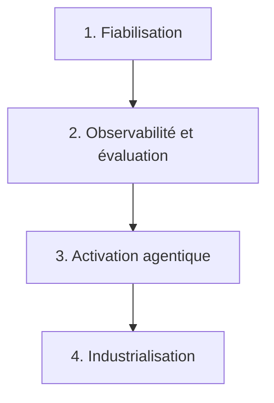

# Améliorations recommandées pour l’AI Software Factory

> Dépôt : `dbeaumont/ai-software-factory-local`  
> Branche analysée : `features/multiagents`  
> Date : 4 septembre 2026  
> Objet : trajectoire d’amélioration priorisée de l’usine logicielle IA.

## Synthèse

La priorité n’est pas d’ajouter davantage d’agents. L’usine possède déjà une architecture agentique avancée ; son prochain gain de maturité viendra surtout de la fiabilité, de la sécurité et de la mesure objective.

Les trois prochains chantiers recommandés sont :

1. rendre l’état et l’audit durables ;
2. sécuriser l’API et le backend de sandbox ;
3. mettre en place OpenTelemetry et un banc d’évaluation multi-agent.

Ces évolutions permettront de faire passer l’usine d’un prototype techniquement riche à une plateforme réellement exploitable.

## Priorités recommandées

| Priorité | Amélioration | Pourquoi |
|---:|---|---|
| P0 | Persistance durable des tâches | L’état principal est encore en mémoire ; un redémarrage peut interrompre ou faire perdre le suivi |
| P0 | Sécurisation de l’API | L’API doit être protégée par OIDC, RBAC, CSRF et rate limiting avant un usage partagé |
| P0 | Suppression de la socket Docker | Le Sandbox MCP dispose d’un accès très puissant au moteur Docker hôte |
| P0 | CI obligatoire | Les nombreux tests existent, mais rien ne garantit actuellement leur exécution avant fusion |
| P1 | OpenTelemetry de bout en bout | Indispensable pour diagnostiquer les workflows, agents parallèles, appels LLM et MCP |
| P1 | Évaluation industrielle des agents | Il faut prouver que le multi-agent améliore réellement qualité, délai et coût |
| P1 | Activation progressive de Temporal | Nécessaire pour la reprise, les workflows longs et l’exécution distribuée |
| P1 | Audit externe immuable | Le journal HMAC local n’est pas suffisant après une perte du processus |
| P2 | Mode LLM hybride local/cloud | Pour confidentialité, résilience, coût et sélection du modèle selon la tâche |
| P2 | Amélioration de l’IHM opérateur | Supervision métier, décisions humaines, kill switch et explication des choix |

## 1. Rendre le contrôle durable

C’est le premier chantier recommandé.

Aujourd’hui, `InMemoryTaskMemory` conserve l’état métier dans le processus. Il faut créer un véritable control plane persistant :

- PostgreSQL pour les tâches, tentatives, transitions et décisions humaines ;
- verrouillage optimiste pour éviter les doubles traitements ;
- outbox transactionnelle pour les événements ;
- conservation des identifiants Temporal ;
- reprise après redémarrage ;
- réconciliation périodique entre PostgreSQL, Temporal, Evidence et SCM ;
- règles explicites de rétention et de purge.

Temporal ne doit pas devenir la seule base métier :

| Composant | Responsabilité recommandée |
|---|---|
| PostgreSQL | état métier interrogeable par l’API et l’IHM |
| Temporal | historique d’exécution durable |
| Evidence MCP | artefacts et preuves immuables |
| SCM | résultat de livraison |

## 2. Sécuriser l’accès à l’usine

Avant toute exposition à plusieurs utilisateurs :

- authentification OIDC avec Keycloak ou l’IdP d’entreprise ;
- rôles `REQUESTER`, `OPERATOR`, `APPROVER`, `SECURITY_ADMIN` et `PLATFORM_ADMIN` ;
- séparation entre création d’une tâche et approbation d’une PR ;
- protection CSRF pour les actions effectuées depuis l’IHM ;
- rate limiting et quotas par utilisateur et par projet ;
- journalisation des changements de configuration ;
- approbation renforcée pour les opérations à haut risque.

L’identité de l’utilisateur doit être propagée comme identité d’audit, sans transmettre son jeton aux agents ou aux sandboxes.

## 3. Remplacer l’accès à la socket Docker

Le montage de `/var/run/docker.sock` a été retiré du contrôleur Sandbox MCP. Docker Compose reste utilisé sur macOS avec des runners statiques sans socket. Les environnements partagés utilisent des Jobs GKE isolés.

Cible retenue :

- runners Compose statiques, non privilégiés et accessibles uniquement sur le réseau interne pour le développement local ;
- Jobs GKE éphémères pour les environnements partagés et la production ;
- microVM Firecracker ou Kata Containers comme renforcement ultérieur pour les traitements non fiables.

Chaque job doit recevoir une image figée par digest, un workspace jetable, un réseau fermé, des limites CPU/mémoire/temps et aucune capacité de choisir ses volumes ou commandes.

Le déroulé complet et ses critères d'acceptation sont suivis dans le [plan de migration sans socket Docker](../migrations/retrait-docker-socket.md).

## 4. Mettre en place une CI obligatoire

Le dépôt possède beaucoup de tests, mais pas de workflow CI imposé.

La CI devrait vérifier :

- tests Java et frontend ;
- contrats JSON et politiques YAML ;
- déterminisme des workflows Temporal ;
- syntaxe Docker Compose ;
- validation des contrats OTLP, dashboards et alertes SigNoz ;
- analyse Sonar ;
- SBOM CycloneDX ;
- scans Trivy et secrets ;
- signature des images ;
- provenance SLSA ;
- absence de changement non documenté des permissions d’agents ;
- compatibilité des schémas `N` et `N-1`.

Une modification des prompts, budgets, permissions ou modèles doit être traitée comme une modification de production, pas comme un simple changement documentaire.

## 5. Mesurer la valeur du multi-agent

Le projet possède déjà une campagne de référence, mais les résultats montrent que le passage au multi-agent ne doit pas être activé uniquement parce que l’architecture existe.

Construire un banc d’évaluation avec :

- au moins 50 à 100 tickets représentatifs ;
- projets Maven, Gradle, npm et Angular ;
- correctifs simples, évolutions multi-fichiers et cas de sécurité ;
- comparaison pipeline déterministe/multi-agent ;
- répétition de chaque cas pour mesurer la variance.

Mesures importantes :

- taux de patch correct au premier essai ;
- réussite des tests ;
- défauts introduits ;
- vulnérabilités ;
- respect de l’architecture ;
- nombre de réparations et replans ;
- temps total et chemin critique ;
- tokens et coût réel ;
- taux d’intervention humaine ;
- taux de PR acceptées sans reprise manuelle.

Il faut aussi corriger la sémantique du coût : `0` ne doit jamais signifier « gratuit » lorsque la télémétrie fournisseur est absente.

## 6. Activer Temporal progressivement

Le pipeline déterministe doit rester disponible comme solution de repli.

Trajectoire recommandée :

1. Shadow mode Temporal sans piloter le résultat.
2. Comparaison systématique avec le pipeline actif.
3. Activation pour les tâches longues ou comportant plusieurs périmètres.
4. Canary sur quelques dépôts.
5. Généralisation après tests de reprise.
6. Rollback immédiat vers le pipeline en cas d’état inconnu.

Les workers peuvent ensuite être séparés par file :

- contexte ;
- LLM ;
- sandbox ;
- assurance ;
- evidence ;
- SCM.

Cela permet de dimensionner et sécuriser chaque périmètre sans transformer chaque agent logique en microservice.

## 7. Conserver les agents dans le monolithe pour l’instant

Il est déconseillé de créer un conteneur par agent à ce stade.

Les agents peuvent déjà fonctionner en parallèle dans l’orchestrateur. Leur séparation physique ne devient utile que pour :

- des besoins de dimensionnement différents ;
- l’isolation de modèles ou de données sensibles ;
- des équipes responsables distinctes ;
- des cycles de déploiement indépendants ;
- une limite de sécurité entre périmètres.

La bonne frontière de déploiement est aujourd’hui la capacité technique — LLM, contexte, sandbox, assurance, evidence, SCM — plus que le rôle logique de l’agent.

## 8. Ajouter un routage LLM hybride

Le projet force encore le mode cloud. Une usine locale gagnerait à introduire un catalogue de modèles et une politique de routage.

| Type de tâche | Modèle possible |
|---|---|
| Classification et extraction | petit modèle local |
| Recherche dans le dépôt | modèle local avec outils MCP |
| Génération complexe | modèle de code plus puissant |
| Revue indépendante | fournisseur ou famille de modèles différente |
| Contenu sensible | local uniquement |
| Indisponibilité cloud | fallback local borné |

Le routage doit dépendre de la complexité, de la sensibilité, du coût, du contexte nécessaire et du niveau de risque. Il faut enregistrer le modèle demandé et le modèle réellement utilisé.

## 9. Améliorer le contexte fourni aux agents

Le Repository Context MCP constitue une bonne frontière. Il pourrait être amélioré progressivement avec :

- index incrémental par commit ;
- recherche lexicale et symbolique ;
- graphe de dépendances ;
- liens contrôleur → service → repository → table ;
- recherche des tests associés ;
- détection des règles de contribution ;
- résumé architectural versionné ;
- cache adressé par digest.

Une base vectorielle et un RAG hybride ne devraient être introduits qu’après un benchmark démontrant un gain par rapport à Tree-sitter, à la recherche lexicale et au graphe de dépendances.

## 10. Construire une véritable console opérateur

L’IHM devrait permettre de consulter :

- le DAG des délégations ;
- les branches exécutées en parallèle ;
- le chemin critique ;
- les décisions du Supervisor ;
- les contradictions et arbitrages ;
- les budgets consommés ;
- les appels LLM et MCP ;
- les preuves produites ;
- les étapes Temporal ;
- la trace OpenTelemetry ;
- le coût et son statut de disponibilité.

Elle devrait également offrir des actions contrôlées :

- pause et reprise ;
- annulation ;
- retry d’une délégation ;
- réponse à une demande humaine ;
- fallback vers le pipeline ;
- activation du kill switch ;
- approbation liée à un manifest précis.

## 11. Trajectoire d’industrialisation

### Étape 1 — Fiabilisation

- PostgreSQL métier ;
- CI obligatoire ;
- authentification et RBAC ;
- audit durable ;
- suppression de la socket Docker.

### Étape 2 — Observabilité et évaluation

- OpenTelemetry Collector et Tempo ;
- propagation API → LLM → MCP → Temporal ;
- métriques de coût fiables ;
- campagnes comparatives automatisées ;
- dashboards opérateur et FinOps.

### Étape 3 — Activation agentique

- Temporal en shadow mode ;
- mode hiérarchique en canary ;
- routage déterministe/multi-agent ;
- kill switch opérationnel ;
- rollback testé.

### Étape 4 — Industrialisation

- workers distribués ;
- sandbox Kubernetes ou microVM ;
- secrets externalisés et mTLS ;
- stockage Evidence immuable ;
- sauvegarde, restauration et purge ;
- haute disponibilité.

## 12. Critères de réussite

L’usine pourra être considérée comme prête pour une expérimentation d’entreprise lorsque :

- un redémarrage ne provoque aucune perte d’état ou double effet ;
- aucune mutation anonyme n’est possible ;
- le sandbox ne donne pas accès au moteur Docker de l’hôte ;
- chaque fusion passe obligatoirement par la CI et les contrôles de sécurité ;
- une tâche peut être suivie de l’intention jusqu’à la PR dans une trace distribuée ;
- le coût est mesuré ou explicitement déclaré indisponible ;
- la valeur du multi-agent est démontrée sur un corpus représentatif ;
- le canary, le kill switch et le rollback ont été exercés ;
- la restauration et la purge des données sont testées ;
- les runbooks ont un propriétaire et sont régulièrement exercés.

## Conclusion

La prochaine étape ne consiste pas à multiplier les rôles agentiques ou les composants. Il faut d’abord consolider le control plane, l’isolation d’exécution, la chaîne de livraison et la preuve de performance.

L’ordre recommandé est donc : **persistance durable**, **sécurisation de l’API et du sandbox**, **OpenTelemetry et évaluation multi-agent**, puis **activation progressive de Temporal et de l’architecture hiérarchique**.
