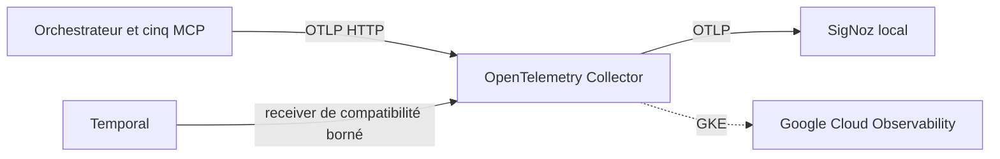

# Stratégie OpenTelemetry retenue

> État vérifié le 5 septembre 2026 sur `features/multiagents`.

## Décision

OpenTelemetry est l'unique chaîne active de métriques, traces et logs. Les six applications Spring Boot exportent
en OTLP vers un Collector central. SigNoz fournit le stockage, la recherche, sept dashboards et 15 alertes en
Docker Compose sur macOS. Sur GKE, la gateway Collector exporte vers Cloud Monitoring, Cloud Trace et Cloud
Logging avec Workload Identity et mTLS.

Prometheus et Grafana ont été retirés du runtime, des dépendances, du Makefile et des interfaces. Les anciens
exports ne sont conservés que comme preuves de comparaison et artefacts temporaires de rollback, jamais comme
chaîne parallèle.

## Architecture active

Le Collector applique limites mémoire, batch, filtrage et redaction. Les applications conservent stdout comme
secours et ne dépendent jamais de la disponibilité de l'observabilité pour exécuter une opération métier.

## Contrat de télémétrie

- `trace_id` et `span_id` proviennent du SDK OpenTelemetry et sont propagés en W3C `traceparent` ;
- `service.name`, environnement, rôle, opération, résultat et classes d'erreur restent bornés ;
- les identifiants uniques (`ai.task.id`, tentative, run, sandbox, preuve) sont réservés aux traces et logs ;
- prompts, réponses, code, patchs, preuves, secrets, jetons et paramètres d'URL sont interdits ;
- les métriques SLO utilisent des histogrammes OTLP et des dimensions à cardinalité bornée.

## Exploitation locale

- `make up` démarre la chaîne complète et `make bootstrap-signoz` reprovisionne les vues ;
- `./scripts/check-signoz-telemetry.sh` vérifie ingestion, dashboards, alertes et rétention ;
- `./scripts/validate-signoz-queries.sh` valide toutes les requêtes versionnées ;
- `./scripts/test-otel-redaction.sh` vérifie la confidentialité ;
- `./scripts/test-otel-resilience.sh` vérifie les pannes du Collector et du backend ;
- `OTEL_SDK_DISABLED=true` est le mode explicite des tests sans observabilité.

## Cible GKE

Les manifests de `infrastructure/gke/observability/` imposent ServiceAccount dédié, Workload Identity, mTLS,
NetworkPolicy, Pod Security, limites, HPA et PDB. La validation hors cluster est automatisée ; le déploiement et
les contrôles Cloud réels exigent un projet GCP et un cluster de validation autorisés.

## Travaux encore ouverts

- qualifier saturation, débit, perte, délai d'ingestion et coût sur une charge contrôlée ;
- tester sauvegarde/restauration cohérente de ClickHouse et PostgreSQL ;
- réaliser la campagne GKE et valider quotas, rétention et notifications ;
- obtenir les approbations exploitation, sécurité, plateforme et propriétaires des SLO ;
- supprimer les artefacts de rollback après expiration de la fenêtre de stabilité.

Le suivi détaillé et les preuves sont dans
[`remplacement-prometheus-grafana-opentelemetry.md`](../migrations/remplacement-prometheus-grafana-opentelemetry.md)
et [`docs/evidence/observability`](../../evidence/observability/README.md).
