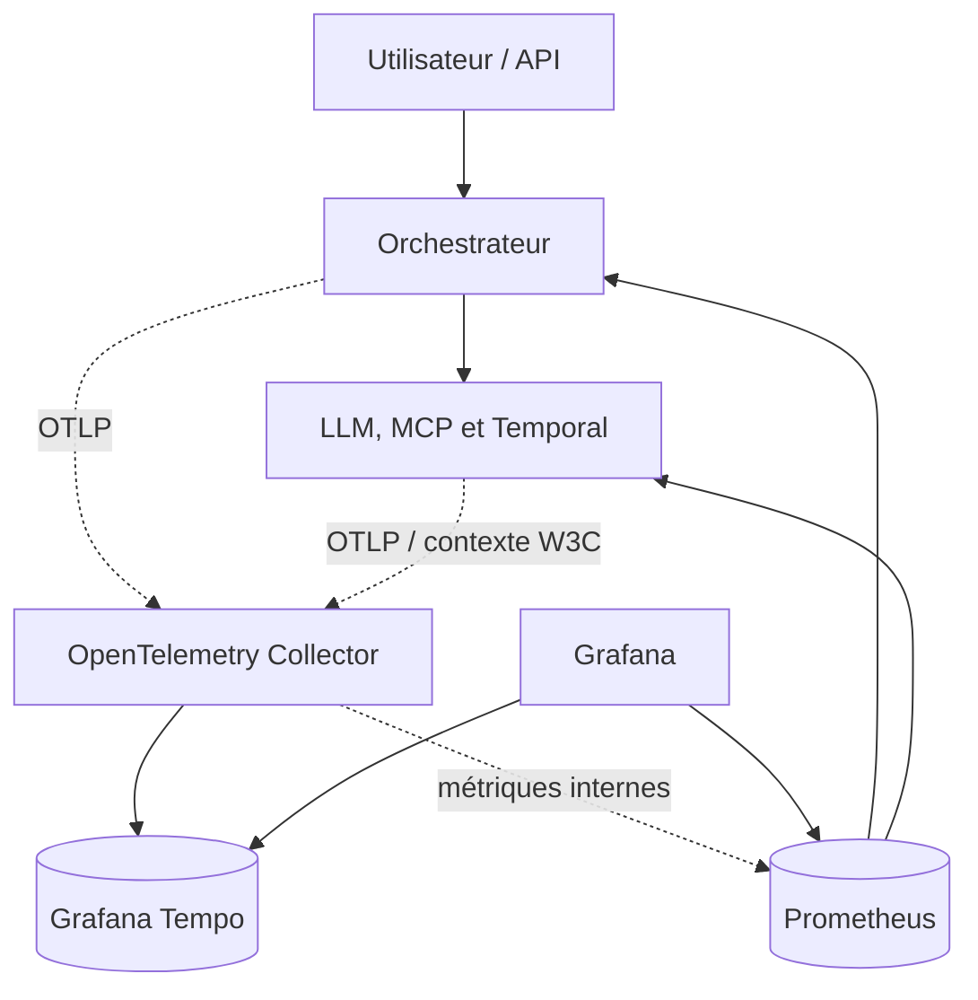
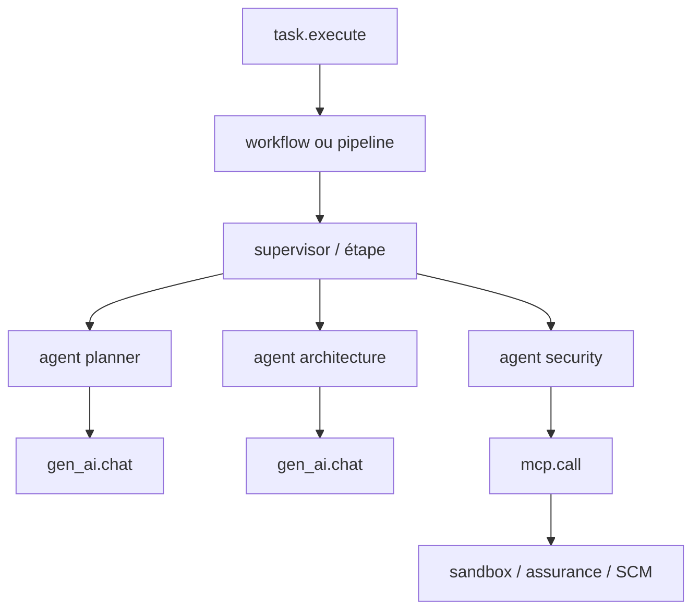
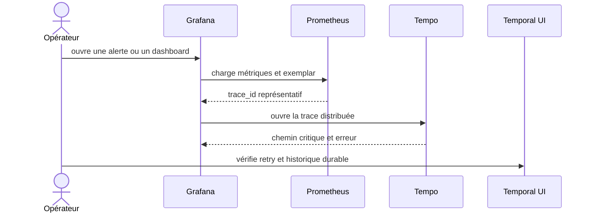

# Stratégie de mise en place d’OpenTelemetry

> Dépôt analysé : `dbeaumont/ai-software-factory-local`  
> Branche : `features/multiagents`  
> État observé : 4 septembre 2026  
> Nature du document : proposition de trajectoire ; les composants OpenTelemetry et Tempo décrits ci-dessous ne sont pas encore présents dans le runtime.

## 1. Synthèse exécutive

Le projet possède déjà une base d’observabilité solide : Micrometer, Actuator, Prometheus, Grafana, six dashboards, sept alertes et des observations applicatives aux frontières Workflow, Activity, LLM et MCP. Il ne possède toutefois pas encore de chaîne de traces distribuées opérationnelle : aucun starter/bridge OpenTelemetry, aucun exporteur OTLP, aucun OpenTelemetry Collector et aucun backend de traces ne sont déclarés.

La stratégie recommandée est incrémentale :

1. conserver la collecte Prometheus existante afin de ne pas casser dashboards et alertes ;
2. ajouter `spring-boot-starter-opentelemetry` aux six applications Spring Boot ;
3. déployer un OpenTelemetry Collector central recevant OTLP ;
4. stocker les traces dans Grafana Tempo et les consulter depuis le Grafana déjà présent ;
5. corriger la propagation W3C entre HTTP, MCP et Temporal ;
6. ajouter les corrélations métriques ↔ traces ↔ logs sans capturer prompts, code source, résultats ou preuves ;
7. envisager seulement ensuite l’export OTLP des métriques, après une période de double collecte et une preuve de parité.

La cible locale minimale ajoute deux conteneurs — Collector et Tempo — et réutilise l’IHM Grafana. Temporal UI reste complémentaire : elle explique l’historique durable d’un workflow, tandis que Grafana/Tempo montre les latences et appels distribués.

## 2. Fonctionnement vérifié de la branche

### 2.1 Chemin réellement actif par défaut

Le chemin public lancé par `POST /api/tasks` reste le pipeline déterministe, coordonné dans le processus `orchestrator`. Les rôles multi-agents sont des rôles logiques dans ce même processus, pas des conteneurs séparés.

| Capacité | État vérifié | Conséquence pour OpenTelemetry |
|---|---|---|
| Pipeline déterministe | actif | le span racine doit partir de l’API puis couvrir tout le traitement asynchrone |
| Orchestrateur Spring Boot | actif | point d’instrumentation principal |
| Cinq serveurs MCP | actifs | services distribués à relier par propagation W3C |
| LiteLLM | actif | appel HTTP sortant à tracer sans contenu de prompt/réponse |
| Temporal | démarré mais désactivé côté orchestrateur | instrumentation à qualifier avant activation du chemin durable |
| Agents hiérarchiques | présents mais non qualifiés | les attributs de délégation doivent être prêts avant le canary |
| Prometheus et Grafana | actifs | à conserver pendant l’introduction d’OTel |

Les valeurs par défaut confirment cette situation : `AI_FACTORY_TEMPORAL_ENABLED=false`, liste des rôles vide et verdict `AI_FACTORY_AGENT_TOOL_QUALIFICATION=INCOMPLETE`.

### 2.2 Observabilité déjà câblée

- `ExecutionTracer` crée des `Observation` Micrometer pour `WORKFLOW`, `CHILD_WORKFLOW`, `ACTIVITY`, `LLM` et `MCP`.
- `AgentRuntime` entoure l’exécution d’un agent et chaque tour LLM.
- `ResilientMcpToolInvoker` entoure les appels MCP et mesure appels, erreurs, retries, durée et concurrence.
- `TemporalWorkerTracingInterceptor` crée des observations autour des workflows et activités.
- `AgentMetrics`, `TaskQueueMetrics` et `WorkflowOperationalMetrics` exposent tokens, coûts, durée, erreurs, fan-out, profondeur, événements et saturation.
- Prometheus scrape l’orchestrateur, Repository Context MCP, Sandbox Execution MCP et Temporal.
- Grafana provisionne six dashboards : global, agents, Supervisor, MCP, sandbox et Temporal.
- Les captures de prompts, résultats et preuves sont désactivées par défaut.

### 2.3 Écarts constatés

| Écart | Effet actuel | Correction proposée |
|---|---|---|
| Aucun starter/bridge OTel dans les POM | les observations ne sont pas exportées comme traces OTLP | ajouter le starter OpenTelemetry Spring Boot |
| Aucun Collector ni backend de traces | aucun stockage ni écran de recherche de traces | ajouter OTel Collector + Grafana Tempo |
| `trace_id` métier distinct du contexte OTel actif | corrélation logique, mais pas nécessairement une vraie parenté de spans | garder les identifiants métier comme attributs et utiliser le contexte W3C réel |
| `McpRequestMetadata` fabrique manuellement un `traceparent` | le parent peut être décorrélé du span actif | injecter le contexte avec le propagateur OpenTelemetry dans les en-têtes HTTP |
| L’intercepteur Temporal observe le corps du workflow | un export futur peut produire des doublons lors des replays | instrumenter les frontières client/worker et activités ; rendre toute instrumentation replay-safe |
| Assurance, Evidence et SCM MCP non scrapés | angles morts sur gates, preuves et livraison | ajouter les trois jobs Prometheus |
| Les POM MCP ne déclarent pas `micrometer-registry-prometheus` | `/actuator/prometheus` peut ne pas disposer du registre attendu | ajouter explicitement le registre ou exporter les métriques via OTLP |
| Pas de logs centralisés | navigation trace → logs impossible | phase ultérieure Loki ou backend de logs compatible OTLP |
| Le coût absent devient encore `0` | risque d’interpréter “non mesuré” comme “gratuit” | introduire `cost_status` et une source de tarification traçable |

## 3. Bénéfices attendus

### 3.1 Diagnostic de bout en bout

Une trace unique permettra de répondre à des questions aujourd’hui difficiles :

- quel agent, outil MCP ou appel LLM a ralenti une tâche ;
- quelles branches du fan-out se sont exécutées en parallèle ;
- combien de retries ont précédé un succès ou un échec ;
- quel appel sandbox, assurance ou SCM correspond à une décision ;
- où le contexte a été perdu entre API, orchestrateur, Temporal, MCP et LiteLLM ;
- quelle part du temps total relève du modèle, de l’attente en file, des tests ou de la livraison.

### 3.2 Exploitation et SRE

- réduction du temps moyen de diagnostic grâce aux liens dashboards → exemplars → traces ;
- calcul de métriques RED par service et opération : débit, erreurs, durée ;
- construction d’un service graph réel ;
- alertes enrichies par des traces représentatives ;
- mesure des SLO par périmètre : API, LLM, MCP, Temporal et sandbox ;
- suivi de la saturation et des files avec la cause distribuée correspondante.

### 3.3 Pilotage IA et FinOps

- comparaison coût/latence/qualité par rôle, modèle et mode d’exécution ;
- visibilité sur le nombre de tours, appels d’outils, retries et réparations ;
- analyse du coût marginal du fan-out ;
- détection des boucles agentiques et des appels redondants ;
- qualification objective du pipeline déterministe face au mode hiérarchique.

### 3.4 Portabilité

OTLP découple l’instrumentation du backend. Tempo peut être utilisé localement, puis remplacé ou complété par une plateforme d’entreprise sans réécrire le code métier.

## 4. Architecture cible recommandée



### Responsabilités

| Composant | Rôle |
|---|---|
| SDK/bridge OTel dans Spring | transforme les observations en spans et propage le contexte |
| OpenTelemetry Collector | reçoit, limite, traite, échantillonne et route la télémétrie |
| Tempo | stocke et recherche les traces |
| Prometheus | conserve les métriques actuelles et les règles d’alerte |
| Grafana | IHM commune pour métriques, traces, corrélations et service graph |
| Temporal UI | historique, événements, retries et état durable des workflows Temporal |

## 5. Modèle de trace

### 5.1 Hiérarchie proposée



Les branches `A1`, `A2` et `A3` apparaissent avec des plages temporelles superposées lorsqu’elles s’exécutent réellement en parallèle. Le graphe de trace rend donc visible le fan-out sans supposer que chaque agent soit un processus ou un conteneur séparé.

### 5.2 Noms et attributs

Noms de spans stables :

- `ai.task.execute` ;
- `ai.workflow.execute` ;
- `ai.agent.execute` ;
- `gen_ai.chat` ;
- `mcp.call` ;
- `sandbox.job` ;
- `assurance.evaluate` ;
- `scm.create_draft_pull_request`.

Attributs à faible cardinalité, utilisables dans métriques et dashboards :

- `service.name`, `deployment.environment.name` ;
- `ai.execution.mode`, `ai.agent.role`, `ai.operation` ;
- `ai.outcome`, `ai.stop_condition`, `error.type` ;
- `gen_ai.system`, `gen_ai.request.model`, `gen_ai.response.model` lorsque disponibles ;
- `mcp.server.name`, `mcp.tool.name` avec catalogues bornés ;
- `temporal.namespace`, `temporal.task_queue`, `temporal.workflow.type`, `temporal.activity.type`.

Attributs de corrélation réservés aux traces/logs, jamais aux labels Prometheus :

- `ai.task.id`, `ai.attempt.id`, `ai.run.id` ;
- `ai.delegation.id`, `ai.agent.run.id` ;
- identifiants sandbox, manifest et PR ;
- empreintes de prompts, contrats et preuves, mais pas leur contenu.

`trace_id` et `span_id` doivent provenir du SDK OpenTelemetry. Les identifiants fonctionnels existants restent des attributs : ils ne doivent pas être utilisés pour fabriquer un contexte de trace parallèle.

## 6. Mise en place technique

### 6.1 Phase 0 — sécuriser les prérequis

Avant tout export :

- conserver `AI_FACTORY_OBSERVABILITY_CAPTURE_PROMPTS=false` ;
- conserver `AI_FACTORY_OBSERVABILITY_CAPTURE_RESULTS=false` ;
- conserver `AI_FACTORY_OBSERVABILITY_CAPTURE_EVIDENCE=false` ;
- conserver `OTEL_INSTRUMENTATION_GENAI_CAPTURE_MESSAGE_CONTENT=false` ;
- définir une liste fermée d’attributs et leurs règles de redaction ;
- interdire secrets, jetons, URL contenant des credentials, code source, prompts, réponses et contenu des preuves ;
- fixer des limites de longueur et de nombre d’attributs par span.

### 6.2 Phase 1 — traces de l’orchestrateur

Dans `apps/orchestrator/pom.xml`, ajouter le starter Spring Boot OpenTelemetry correspondant à la version Spring Boot utilisée :

```xml
<dependency>
  <groupId>org.springframework.boot</groupId>
  <artifactId>spring-boot-starter-opentelemetry</artifactId>
</dependency>
```

Configurer l’export OTLP vers le Collector et un échantillonnage à 100 % uniquement pour le faible volume local :

```yaml
management:
  tracing:
    sampling:
      probability: ${OTEL_TRACES_SAMPLER_ARG:1.0}
  opentelemetry:
    tracing:
      export:
        otlp:
          endpoint: ${OTEL_EXPORTER_OTLP_TRACES_ENDPOINT:http://otel-collector:4318/v1/traces}
```

La syntaxe exacte des propriétés doit être validée contre la version Spring Boot verrouillée lors de l’implémentation. Le `WebClient` du projet est construit depuis le `WebClient.Builder` auto-configuré : après ajout du starter, la propagation HTTP vers LiteLLM peut donc être automatique.

Adapter `ExecutionTracer` :

- utiliser le contexte OTel actif comme parent ;
- enregistrer l’exception et positionner le statut d’erreur ;
- placer les identifiants fonctionnels en attributs de span ;
- ne conserver en basse cardinalité que rôle, opération, mode et outcome ;
- éviter de créer à la fois un span manuel et un span HTTP équivalent sans relation claire.

### 6.3 Phase 2 — Collector et Tempo dans Compose

Ajouter les services :

```yaml
otel-collector:
  image: otel/opentelemetry-collector-contrib:<version-pinned>
  command: ["--config=/etc/otelcol-contrib/config.yaml"]
  volumes:
    - ./observability/otel-collector.yaml:/etc/otelcol-contrib/config.yaml:ro
  networks: [factory, mcp-internal, workflow-internal]

tempo:
  image: grafana/tempo:<version-pinned>
  command: ["-config.file=/etc/tempo/tempo.yaml"]
  volumes:
    - ./observability/tempo.yaml:/etc/tempo/tempo.yaml:ro
    - tempo-data:/var/tempo
  networks: [factory]
```

Configuration minimale du Collector :

```yaml
receivers:
  otlp:
    protocols:
      grpc:
        endpoint: 0.0.0.0:4317
      http:
        endpoint: 0.0.0.0:4318

processors:
  memory_limiter:
    check_interval: 1s
    limit_mib: 256
  batch: {}

exporters:
  otlp/tempo:
    endpoint: tempo:4317
    tls:
      insecure: true

extensions:
  health_check: {}

service:
  extensions: [health_check]
  pipelines:
    traces:
      receivers: [otlp]
      processors: [memory_limiter, batch]
      exporters: [otlp/tempo]
```

Le mode `insecure` est acceptable uniquement sur le réseau Docker local interne. Une cible d’entreprise doit utiliser TLS/mTLS, authentification, limitations réseau et gestion externalisée des secrets.

### 6.4 Phase 3 — serveurs MCP

Ajouter le même starter aux cinq serveurs MCP. Pour chaque appel :

1. le client injecte le `traceparent` et éventuellement `tracestate` dans les en-têtes HTTP MCP ;
2. le serveur extrait ce contexte avant d’exécuter l’outil ;
3. le span serveur devient enfant du span `mcp.call` de l’orchestrateur ;
4. les opérations internes importantes créent des spans enfants ;
5. aucune donnée métier brute ne devient attribut.

Le champ `traceparent` placé aujourd’hui dans les arguments MCP peut être conservé temporairement pour compatibilité, mais la source de vérité doit devenir l’en-tête W3C. Il sera supprimé du payload après validation de bout en bout.

Ajouter aussi `micrometer-registry-prometheus` explicitement dans les cinq POM si la collecte Prometheus directe est conservée, puis scraper :

- `repository-context-mcp:8091` ;
- `sandbox-execution-mcp:8092` ;
- `scm-delivery-mcp:8093` ;
- `assurance-mcp:8094` ;
- `evidence-mcp:8095`.

### 6.5 Phase 4 — Temporal

Temporal nécessite une attention particulière, car un workflow peut être rejoué :

- propager le contexte lors du démarrage du workflow et des child workflows ;
- propager le contexte des workflows vers les activités ;
- créer les spans exportables dans les interceptors client/worker et autour des activités ;
- ne pas exporter naïvement un span à chaque replay du corps déterministe ;
- distinguer `workflow_id`/`run_id` Temporal des `trace_id`/`span_id` OTel ;
- relier les `continue-as-new`, retries et child workflows par parenté ou `Span Link` selon le cas ;
- tester redémarrage worker, retry d’activité et replay historique sans duplication incohérente.

Les métriques serveur Temporal continuent d’être scrapées sur `temporal:8000/metrics`. Elles décrivent le moteur ; les traces OTel décrivent la traversée d’une tâche dans le code applicatif. Les deux signaux sont complémentaires.

### 6.6 Phase 5 — métriques dérivées des traces et logs

Après stabilisation :

- activer le `spanmetrics` connector ou le générateur de métriques Tempo pour obtenir débit, erreurs et latence par service ;
- ajouter des exemplars Prometheus pointant vers des traces ;
- corréler `traceId` et `spanId` dans le pattern de logs Spring ;
- ajouter Loki ou un backend OTLP logs seulement si la rétention, la redaction et le volume sont maîtrisés ;
- maintenir une double collecte des métriques avant toute suppression des endpoints Prometheus.

## 7. Échantillonnage et volumétrie

| Environnement | Politique proposée |
|---|---|
| local / qualification | 100 % des traces, volume borné |
| intégration | 20 à 50 %, 100 % des erreurs |
| production | tail sampling : erreurs, lenteurs, sécurité et canary toujours conservés ; échantillon du succès |

Le tail sampling doit être introduit seulement lorsque le volume le justifie. Il consomme de la mémoire dans le Collector et impose que les spans d’une même trace arrivent au même ensemble de collecteurs.

## 8. Exploitation et IHM

### 8.1 Interfaces disponibles

| IHM | URL locale par défaut | Usage |
|---|---|---|
| Grafana | `http://localhost:3001` | dashboards, Explore, recherche TraceQL, service graph, navigation métrique → trace |
| Prometheus | `http://localhost:9090` | requêtes PromQL, targets, règles et alertes techniques |
| Temporal UI | `http://localhost:8233` | historique des workflows, activités, retries et état durable |
| Application | `http://localhost:8080` | état fonctionnel des tâches et décisions opérateur |

Tempo n’exige pas une IHM séparée : il est ajouté comme datasource dans Grafana. Prometheus possède sa propre IHM, utile pour le diagnostic, mais Grafana reste l’interface opérateur recommandée.

### 8.2 Parcours de diagnostic



Exemples de recherches dans Grafana/Tempo :

- traces d’une tâche par `ai.task.id` ;
- traces en erreur par `status = error` ;
- appels `mcp.call` lents par serveur ou outil ;
- appels LLM d’un rôle donné ;
- trace ayant le plus grand nombre de branches de délégation ;
- latence entre planification et démarrage d’une activité Temporal.

### 8.3 Dashboards à ajouter

1. **Trace overview** : volume, taux d’erreur, p50/p95/p99, services sans télémétrie.
2. **Critical path** : part du temps API, agent, LLM, MCP, queue, sandbox et assurance.
3. **Multi-agent topology** : fan-out, profondeur, parallélisme réel, replans et contradictions.
4. **LLM/FinOps** : tokens, statut de coût, modèle demandé/résolu, latence et retries.
5. **Collector health** : spans reçus/exportés/refusés, files, mémoire et erreurs d’export.

## 9. SLO et alertes proposées

| Indicateur | Exemple de seuil initial | Source |
|---|---:|---|
| disponibilité API | ≥ 99,5 % | Prometheus |
| tâches terminées sans erreur technique | ≥ 95 % | métriques métier |
| p95 MCP lecture | < 2 s | span metrics |
| p95 LLM | à établir par baseline | traces + métriques |
| perte d’export Collector | 0 durable, alerte dès croissance | métriques internes Collector |
| traces orphelines | < 1 % | Tempo / contrôle synthétique |
| couverture coût | 100 % ou statut explicite non disponible | métriques FinOps |

Ajouter des alertes sur : Collector indisponible, export refusé, file d’export saturée, absence de spans d’un service, taux de traces orphelines et dépassement de rétention.

L’observabilité ne doit pas devenir une dépendance bloquante du chemin métier : en cas de panne du Collector, le SDK bufferise de façon bornée puis abandonne la télémétrie ; il ne bloque pas une décision de sécurité ni un workflow.

## 10. Sécurité et gouvernance

- OTLP n’est exposé qu’aux réseaux internes utiles ; aucun port OTLP n’est publié sur l’hôte par défaut.
- Le Collector applique `memory_limiter`, `batch`, limites de file et redaction.
- Les ressources portent `service.name`, version, environnement et instance ; jamais de secret.
- Les IDs utilisateur et contenus métier ne deviennent pas des labels de métriques.
- Les prompts, résultats, code, diffs et preuves restent non capturés par défaut.
- Les traces de sécurité ont une rétention et des droits d’accès distincts si nécessaire.
- En entreprise : TLS/mTLS, authentification, RBAC Grafana, chiffrement au repos, politique de rétention et purge testée.
- Toute activation de capture de contenu exige une analyse de risque, une base légale, une durée de rétention et des tests de redaction.

## 11. Plan de réalisation

| Lot | Contenu | Critère de sortie |
|---:|---|---|
| 0 | règles de données, conventions, budget de cardinalité | tests négatifs prouvant l’absence de secrets et contenu |
| 1 | starter OTel orchestrateur, Collector, Tempo, datasource Grafana | une requête API apparaît comme trace dans Grafana |
| 2 | spans agent/LLM/MCP et vraie propagation W3C | une trace relie API → agent → LLM/MCP |
| 3 | instrumentation des cinq MCP et scraping complet | aucun MCP actif n’est absent des targets |
| 4 | propagation Temporal replay-safe | retry, child workflow et redémarrage testés |
| 5 | exemplars, span metrics, service graph et dashboards | navigation métrique → trace opérationnelle |
| 6 | tail sampling, TLS, rétention, sauvegarde et SLO | exercice de panne et restauration concluant |

Ordre conseillé pour le prototype local : lots 0 à 3. Les lots 4 à 6 accompagnent l’activation de Temporal et du mode hiérarchique.

## 12. Tests d’acceptation

- démarrer la stack et vérifier la santé du Collector, de Tempo, Prometheus et Grafana ;
- lancer une tâche nominale et retrouver sa trace par `ai.task.id` ;
- vérifier la parenté API → workflow/pipeline → agent → LLM/MCP ;
- forcer une erreur LLM, un timeout MCP et un retry ;
- confirmer que l’erreur et l’exception sont visibles sans données sensibles ;
- vérifier qu’un fan-out apparaît comme spans frères superposés ;
- redémarrer le Collector et confirmer que l’application reste fonctionnelle ;
- comparer les séries Prometheus avant/après et exiger la parité des six dashboards et sept alertes ;
- exécuter un replay Temporal et vérifier l’absence de doublons incohérents ;
- scanner un export de trace pour secrets, prompts, code, résultats et preuves ;
- contrôler la cardinalité et la mémoire du Collector sous campagne de charge.

## 13. Décision recommandée

Adopter **Micrometer Observation + OpenTelemetry/OTLP + OpenTelemetry Collector + Grafana Tempo**, tout en conservant **Prometheus + Grafana** pour les métriques pendant la transition.

Cette option valorise le code et les dashboards existants, fournit une IHM intégrée, limite le nombre de nouveaux composants et garde la possibilité de changer de backend. La priorité n’est pas de remplacer Prometheus, mais de rendre la corrélation distribuée réelle et fiable.

## 14. Références officielles

- [Spring Boot — Tracing](https://docs.spring.io/spring-boot/reference/actuator/tracing.html)
- [OpenTelemetry Collector — configuration](https://opentelemetry.io/docs/collector/configuration/)
- [OpenTelemetry Protocol — spécification OTLP](https://opentelemetry.io/docs/specs/otlp/)
- [OpenTelemetry — sampling](https://opentelemetry.io/docs/concepts/sampling/)
- [OpenTelemetry — sécurité du Collector](https://opentelemetry.io/docs/security/config-best-practices/)
- [Grafana Tempo — configurer un Collector](https://grafana.com/docs/tempo/latest/set-up-for-tracing/instrument-send/set-up-collector/)
- [Grafana Tempo — visualiser les traces](https://grafana.com/docs/tempo/latest/visualize-traces/)
- [Grafana Tempo — span metrics](https://grafana.com/docs/tempo/latest/metrics-from-traces/span-metrics/)
- [Temporal — configuration de la télémétrie](https://docs.temporal.io/references/configuration)

