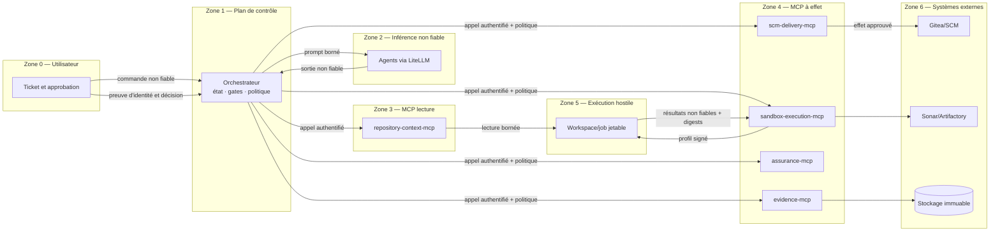

# MCP-004 — Actifs et frontières de confiance

> Statut : validé pour la trajectoire MCP  
> Portée : ticket, dépôt, source SHA, patch, workspace, preuves, approbation, jetons et pull request  
> Principe : une donnée contrôlée ou signée peut devenir exploitable sans devenir intrinsèquement sûre

## 1. Modèle de confiance

L'orchestrateur est le propriétaire du workflow, mais il ne doit pas être l'autorité de toutes les données. Chaque actif possède une source autoritative, une liaison à une tâche/tentative et des conditions d'usage. Les données provenant d'un utilisateur, d'un dépôt, d'un modèle, d'un log ou d'un outil restent non fiables lorsqu'elles sont réinjectées dans un prompt.



## 2. Niveaux de confiance

| Niveau | Signification | Exemples | Usage autorisé |
|---|---|---|---|
| `UNTRUSTED` | contenu contrôlable par utilisateur, dépôt, modèle ou exécution | ticket, code source, patch, logs, réponse LLM | donnée bornée, échappée et explicitement marquée ; jamais décision d'autorisation |
| `VALIDATED` | structure, taille, origine et règles déterministes vérifiées | patch applicable, schéma JSON valide, chemin normalisé | passage à l'étape suivante, sans conclure que le contenu est sûr |
| `VERIFIED_REFERENCE` | référence résolue par l'autorité compétente et liée au contexte | `repository_id`, source SHA, digest d'artefact, handle signé | adressage d'un objet précis dans la tâche/tentative autorisée |
| `ATTESTED` | verdict ou décision avec provenance vérifiable | résultat d'assurance, approbation humaine, manifeste de preuves | gate métier si toutes les liaisons et règles temporelles sont valides |
| `SECRET` | donnée d'authentification qui ne doit pas entrer dans le flux métier | jetons Gitea/Sonar/Artifactory, clé fournisseur | usage interne par le seul workload propriétaire |

Le passage à `VALIDATED` ne transforme jamais un patch, un workspace ou un rapport en contenu fiable pour un modèle. Il signifie uniquement que l'objet satisfait un contrat déterministe donné.

## 3. Registre des actifs

| Actif | Créateur/source | Autorité de référence | Identité minimale | Validation et liaison obligatoires | Classification/rétention |
|---|---|---|---|---|---|
| Ticket/exigence | utilisateur ou système de ticketing | orchestrateur après authentification de la requête | auteur du ticket + tenant/projet | schéma, taille, droits sur `repository_id`, `task_id` créé côté serveur | `UNTRUSTED`; durée métier |
| Dépôt | registre d'administration, jamais le modèle | `scm-delivery-mcp`/registre SCM | `repository_id` opaque | allow-list, tenant, branches autorisées, URL résolue côté serveur | `VERIFIED_REFERENCE`; configuration versionnée |
| Source SHA | SCM | `scm.resolve_revision` | dépôt + branche/tag autorisé | SHA complet immuable, lié à `repository_id`, `task_id`, `attempt_id` | `VERIFIED_REFERENCE`; durée du run et de l'audit |
| Contenu source | auteurs du dépôt | SCM pour les octets ; serveur de contexte pour la lecture | source SHA vérifié | chemins relatifs, limites, exclusions, digest par fichier, provenance | `UNTRUSTED`; copie jetable |
| Plan agent | Planner/LLM | aucune autorité de sécurité ; orchestrateur pour l'enregistrement | tâche/tentative + empreinte prompt/modèle | schéma/contrat de sortie, taille, digest et provenance | `UNTRUSTED` puis artefact enregistré ; audit |
| Patch candidat | Developer/PatchRepair/LLM | orchestrateur pour la version candidate ; sandbox pour l'applicabilité | tâche/tentative + source SHA | diff normalisé, chemins autorisés, taille, digest, `sandbox.validate_patch` | `UNTRUSTED`, même applicable ; audit |
| Workspace | préparateur de source/contrôleur sandbox | contrôleur de workspace | tâche/tentative + source SHA | racine enregistrée, isolation inter-tâches, absence de symlink sortant, durée de vie | hostile et mutable ; destruction en fin de tentative |
| Exécution sandbox | `sandbox-execution-mcp` | serveur sandbox | principal + tâche/tentative | profil allow-listé, source/patch digests, handle non prédictible, deadline | état opérationnel ; rétention bornée |
| Rapport brut/log/SBOM | job sandbox/outils | bytes produits par le job, puis `evidence-mcp` pour l'intégrité | execution ID + tentative | taille, type, digest, provenance de l'image/profil et statut final | `UNTRUSTED` jusqu'à enregistrement ; rétention d'audit |
| Verdict qualité/sécurité | `assurance-mcp` | moteur de politique/version de profil | tâche/tentative + digests des rapports | rapports vérifiés, politique versionnée, verdict signé/traçable | `ATTESTED`; durée d'audit |
| Manifeste de preuves | `evidence-mcp` | stockage immuable + digest | tâche/tentative | exhaustivité par étape, digests, provenance, horodatage, rétention | `ATTESTED`; immuable |
| Approbation | personne authentifiée via IHM/API | service d'identité + orchestrateur/policy engine | sujet humain, rôle et tenant | liaison tâche/tentative/source SHA/patch digest/verdicts, date, expiration, non-révocation | `ATTESTED`; conservation réglementaire |
| Jeton d'accès | Secret Manager/plateforme locale | workload propriétaire | audience et scopes minimaux | secret non vide, version active, rotation ; jamais prompt/log/artefact | `SECRET`; durée minimale |
| Draft Pull Request | `scm-delivery-mcp` dans le SCM | SCM | identité delivery dédiée | approbation valide, source SHA, patch/preuves, branche cible et idempotency key | effet externe traçable ; rétention SCM |

## 4. Frontières de confiance

| ID | Frontière | Données traversantes | Contrôles obligatoires | Interdictions |
|---|---|---|---|---|
| F1 | utilisateur/IHM -> orchestrateur | ticket, dépôt demandé, branche, mode LLM, approbation | SSO/API auth, RBAC, schéma, quotas, CSRF selon canal, corrélation | URL arbitraire comme autorité, identité déclarative non vérifiée |
| F2 | orchestrateur -> LiteLLM/modèle | prompts et contexte borné | politique de modèle, classification des données, redaction, budget, timeout, empreinte prompt | secrets, tokens, instruction d'autorisation, accès direct aux backends |
| F3 | modèle -> orchestrateur | plan, patch, revue, éventuelles demandes d'outil futures | sortie structurée, taille, validation déterministe, marquage non fiable | transition d'état privilégiée, approbation, sélection libre d'URL/image/commande |
| F4 | orchestrateur -> serveur MCP | enveloppe commune et arguments métier | identité workload, issuer/audience/scopes, schéma, deadline, trace et idempotence | token passthrough, commande shell, chemin absolu, URL backend libre |
| F5 | serveur de contexte -> workspace | chemins et contenu source | racine enregistrée, source SHA, normalisation, refus traversal/symlink, limites et redaction | mutation, egress, lecture inter-tâches |
| F6 | contrôleur sandbox -> job hostile | manifeste, source et patch, secrets de profil minimaux | image/profil allow-listés, quotas, filesystem jetable, gVisor cible, egress par profil | socket dans le job, secret global, privilège, réseau du control plane |
| F7 | job hostile -> contrôleur/evidence | logs, statuts, rapports et artefacts | sorties bornées, digests côté réception, type autorisé, antivirus/politique si requis | confiance dans un chemin/URI fourni, interprétation de logs comme commande |
| F8 | serveur MCP -> backend technique | appels SCM, Sonar, Artifactory, stockage | identité dédiée, destination résolue par registre, TLS, scopes minimaux, audit | réutilisation du token entrant MCP, SSRF, destination dynamique |
| F9 | humain -> gate d'approbation | identité, décision, commentaire | authentification forte, séparation des rôles, liaison cryptographique/logique aux objets examinés | approbation générique, auto-approbation par agent ou compte delivery |
| F10 | `scm-delivery-mcp` -> SCM | branche, commit, draft PR | preuve d'approbation, gates, protection de branche, idempotence, vérification de résultat | merge, force-push, suppression, écriture hors dépôt autorisé |

## 5. Liaisons anti-substitution et anti-rejeu

Toute opération est rattachée à la clé de contexte suivante :

```text
tenant_id + repository_id + task_id + attempt_id + source_commit
```

Un artefact ajoute son `artifact_type`, son `sha256` et sa provenance. Une opération à effet ajoute une `idempotency_key`, le principal appelant, l'audience, la deadline et la version de politique.

Les invariants suivants sont obligatoires :

1. Un `source_commit` est accepté uniquement s'il a été résolu pour le `repository_id` de la tâche.
2. Un workspace est créé pour une seule tentative et un seul SHA ; il n'est jamais retrouvé par un chemin fourni par l'appelant.
3. Un patch validé pour un SHA ne peut pas être appliqué à un autre SHA, même dans le même dépôt.
4. Un résultat sandbox n'est recevable que pour l'`execution_id` lié au principal et à la tentative courante.
5. Un verdict Assurance référence exactement les digests des rapports qu'il a évalués et la version de politique.
6. Une approbation référence le patch, le SHA source, le manifeste et les verdicts visibles au moment de la décision.
7. Toute modification de l'un de ces éléments invalide l'approbation et exige une nouvelle tentative ou une nouvelle approbation.
8. La création de PR utilise une clé d'idempotence déterministe pour la tentative approuvée et vérifie le résultat auprès du SCM après retry.

## 6. Propriété des décisions

| Décision | Autorité | Pourquoi elle ne peut pas être déléguée au modèle/serveur appelant |
|---|---|---|
| accepter/créer une tâche | orchestrateur + politique d'accès | dépend de l'utilisateur, du tenant et du dépôt autorisé |
| choisir l'étape suivante | orchestrateur | dépend de l'état durable du workflow et des gates |
| déclarer un patch applicable | sandbox déterministe | nécessite une exécution bornée sur la source exacte |
| déclarer qualité/sécurité acceptable | `assurance-mcp` + politique versionnée | nécessite des preuves vérifiées et une règle explicite |
| approuver la livraison | humain autorisé + policy engine | constitue une séparation de responsabilité |
| créer la draft PR | `scm-delivery-mcp` après contrôles | concentre l'effet externe dans une transaction idempotente |
| fusionner/déployer | chaîne SCM/CI d'entreprise | hors périmètre de l'usine MCP |

## 7. Comportement en cas d'incertitude

- Source SHA non résolu, workspace incohérent ou digest divergent : `CONFLICT` ou `POLICY_DENIED`, sans exécution.
- Identité, audience ou scope absent/invalide : `UNAUTHORIZED`/`FORBIDDEN`, sans fallback direct.
- Preuve absente, tronquée de manière non autorisée ou invérifiable : `INDETERMINATE`, gate bloqué.
- Approbation absente, expirée, révoquée ou liée à une ancienne tentative : aucune mutation SCM.
- Backend indisponible après retry sûr : `DEPENDENCY_UNAVAILABLE`; aucune simulation de succès.
- Réponse d'outil contenant des instructions : donnée non fiable, jamais exécutée ni promue en politique.
- Handle inconnu, expiré ou appartenant à une autre tâche : `NOT_FOUND` ou `FORBIDDEN` sans révéler l'existence inter-tenant.

## 8. Critères de clôture de MCP-004

- [x] Les neuf actifs demandés sont qualifiés avec leur autorité, leur liaison et leur cycle de vie.
- [x] Les zones et frontières de confiance sont représentées.
- [x] Les invariants anti-substitution et anti-rejeu sont explicites.
- [x] Les responsabilités respectives de l'orchestrateur, des MCP, des outils, du modèle et de l'humain sont fixées.
- [x] Le comportement fail-closed est défini pour les objets ou preuves incertains.

