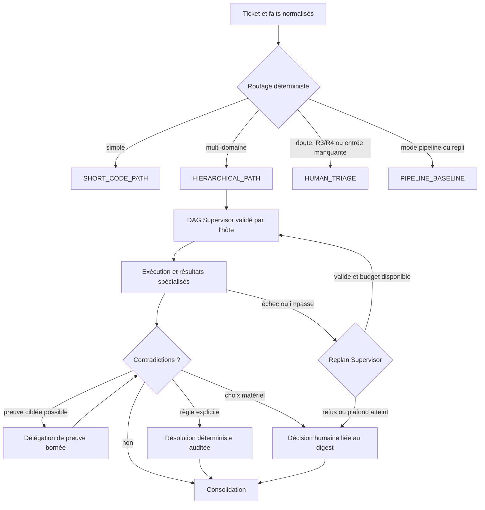

# Routage, replans, contradictions et décisions humaines

## Principe

Le modèle propose ; l'hôte décide. Le Supervisor peut proposer un DAG ou un replan, mais il ne choisit ni le
mode effectif, ni l'autorité d'une conclusion, ni la résolution silencieuse d'une contradiction. Chaque étape
est liée à une politique versionnée et produit une trace reproductible.

## Routage

La politique `resources/multiagents/policies/routing-policy-v1.yaml` est évaluée dans cet ordre : plafond du
mode, qualification, triage humain, éligibilité canary, chemin hiérarchique, chemin court, défaut. Le défaut est
`HUMAN_TRIAGE`, jamais l'activation autonome.

| Chemin | Conditions principales | Autorité |
|---|---|---|
| `PIPELINE_BASELINE` | mode `PIPELINE`, repli ou shadow de référence | résultat opérationnel de la baseline |
| `SHORT_CODE_PATH` | R0/R1, un module, un domaine, au plus 8 fichiers estimés, aucun impact interdit | hôte ; gates inchangés |
| `HIERARCHICAL_PATH` | R0–R2 et complexité multi-module, multi-domaine, scopes indépendants ou impact matériel | hôte après qualification |
| `HUMAN_TRIAGE` | R3/R4, donnée requise absente/contradictoire, budget indisponible ou aucune règle sûre | humain propriétaire |

En shadow, le chemin hiérarchique est observé mais `PIPELINE_BASELINE` reste autoritatif. En canary, la
qualification, l'allowlist du dépôt et un bucket stable sont obligatoires. La décision journalise politique,
version, tâche, commit, mode demandé/effectif, faits normalisés, règle, chemin et raisons.

## Replan borné

Seul `supervisor` peut proposer un remplacement du DAG. `DelegationReplanPolicy` impose :

- deux replans acceptés au maximum par tentative ;
- une justification non vide et bornée ;
- le digest exact du DAG courant et celui du DAG de remplacement ;
- une nouvelle validation complète de la hiérarchie, du DAG, des scopes et budgets ;
- un digest jamais déjà rencontré, afin d'interdire les cycles ;
- une progression exécutable réelle ;
- l'absence de répétition d'une délégation déjà terminée ou d'un travail équivalent.

Un replan ne rouvre pas un budget consommé, ne change pas le commit source et ne peut pas augmenter les plafonds
du catalogue. Un refus de replan conserve le DAG courant dans l'historique et conduit à l'échec fermé ou à une
décision humaine selon la politique de risque.

## Détection et classification des contradictions

Les conclusions Architecture, Code, Tests et Sécurité sont comparées sous forme d'assertions normalisées. Une
contradiction porte son identifiant, sa tâche/tentative, ses sources, ses preuves, sa classification et son
statut. La taxonomie fermée est :

- `FACTUAL` : faits incompatibles sur le même objet ;
- `INCOMPATIBLE_SCOPE` : scopes ou changements incompatibles ;
- `RISK` : niveaux ou traitements du risque incompatibles ;
- `MISSING_TEST` : preuve de couverture manquante ;
- `DIVERGENT_RECOMMENDATION` : choix métier ou technique concurrents.

Le défaut est `OPEN`. Une résolution automatique n'est permise que si la paire classification/autorité figure
explicitement dans `contradiction-resolution-policy-v1.yaml`. `MISSING_TEST` et
`DIVERGENT_RECOMMENDATION` ne disposent d'aucune résolution automatique.

## Ordre d'autorité

L'ordre strict est :

1. `DETERMINISTIC_GATE` ;
2. `POLICY` ;
3. `VERIFIED_EVIDENCE` ;
4. `SPECIALIST_CONSENSUS` ;
5. `SUPERVISOR`.

Une conclusion plus faible peut apporter du contexte, jamais remplacer le verdict dominant. Deux conclusions
opposées au même niveau dominant sont escaladées. Un modèle ne peut donc transformer ni un test échoué, ni un
quality gate, ni un finding bloquant, ni une preuve absente en succès.

## Délégation de preuve

Lorsqu'un fait manque mais peut être établi sans décision subjective, le workflow crée une délégation ciblée
avec scope, budget, contrat et preuves attendues. Le résultat revient dans la même tentative et la contradiction
est réévaluée. Une réponse tardive, étrangère au digest ou hors scope n'est pas incorporée.

Cette boucle n'est pas un replan libre : elle ne change que la preuve nécessaire et reste soumise aux limites de
profondeur, de concurrence, de tokens, de coût et de durée.

## Décision humaine

Une contradiction ouverte devient une requête `human-decision-request-v1` avec une question, deux à cinq
options identifiées, leurs impacts et réversibilité, les URI de preuves et le digest exact de l'objet décidé.

| Domaine | Classes prises en charge |
|---|---|
| Produit | recommandation divergente |
| Architecture | scope incompatible, recommandation divergente |
| Sécurité | risque, fait sécurité |
| Données | scope incompatible, risque ou fait lié aux données |

Le workflow attend un Signal lié à `task_id`, `attempt_id`, `request_id`, rôle décideur, option autorisée et
digest. Une réponse sur une ancienne version de l'objet est refusée. Le décideur ne peut pas contourner un gate
déterministe ; une dérogation éventuelle suit une politique explicite distincte et reste auditée.

## Consolidation et audit

La consolidation finale exige que les contradictions requises soient résolues, que chaque arbitrage référence
sa règle et ses preuves, et que le manifeste soumis soit celui lu par l'Independent Reviewer. Les enregistrements
d'arbitrage sont append-only et triés de manière canonique pour produire un digest reproductible.

Les contrôles de référence sont `WorkflowRoutingServiceTest`, `DelegationReplanPolicyTest`,
`CrossPerimeterContradictionDetectorTest`, `ContradictionClassifierTest`,
`DeterministicContradictionResolverTest`, `ContradictionEvidenceDelegatorTest`,
`HumanDecisionEscalatorTest`, `DecisionAuthorityPolicyTest`, `ArbitrationRecorderTest` et
`SoftwareFactoryWorkflowTest`.
