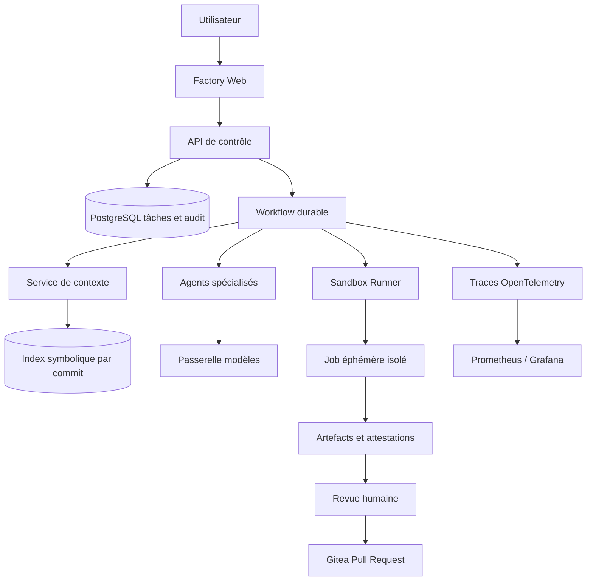
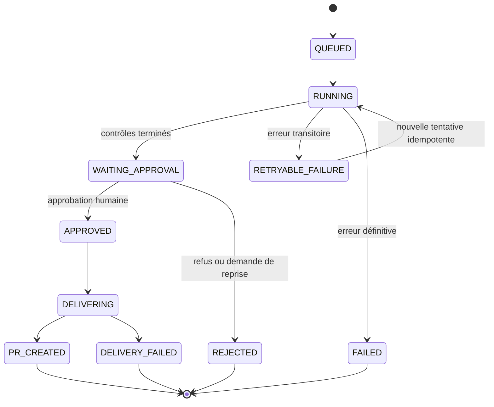
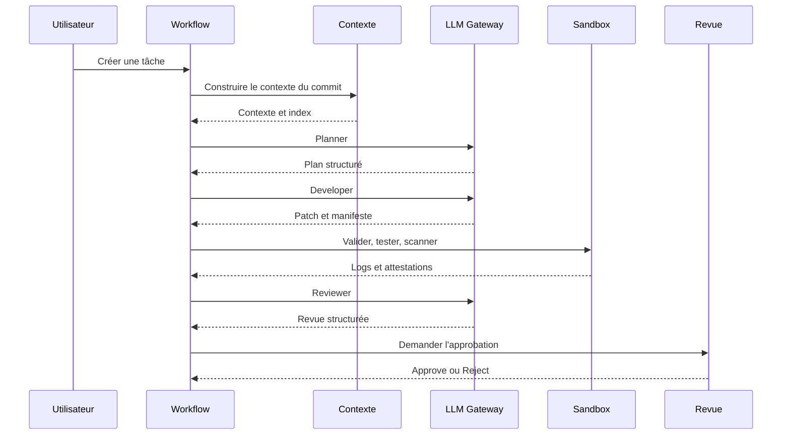

# Modernisation de l'usine logicielle IA

> **ARCHIVE — note non normative.** Les modes et composants cités peuvent avoir été remplacés. Consulter la
> [rétrodocumentation](../RETRODOCUMENTATION.md) pour l'état actuel.

## Objectif

Cette note propose une trajectoire pour faire évoluer le prototype AI Software Factory vers une plateforme d'agents de développement fiable, mesurable et exploitable en équipe.

Le projet dispose déjà d'une base solide :

- pipeline asynchrone avec agents `Planner`, `Developer`, `PatchRepair`, `Tester` et `Reviewer` ;
- génération et validation de patches unifiés ;
- exécution dans une sandbox Docker ;
- contrôles Maven, Gradle, npm, SonarQube, Syft et Trivy ;
- approbation humaine obligatoire avant le commit, le push et la Pull Request Gitea ;
- modes LLM local via Ollama et cloud via LiteLLM ;
- métriques Prometheus et tableau de bord Grafana.

Les priorités ci-dessous tiennent compte des pratiques qui se généralisent sur le marché : agents capables de travailler en arrière-plan dans un environnement éphémère, outils structurés, évaluations reproductibles, observabilité GenAI et sécurité de la supply chain.

## Diagnostic actuel

Les limites principales du prototype sont les suivantes :

| Limite | Conséquence | Priorité |
|---|---|---:|
| Tâches conservées en mémoire | Perte de l'historique et impossibilité de reprendre proprement après redémarrage | P0 |
| `/var/run/docker.sock` monté dans l'orchestrateur | Une compromission de l'orchestrateur peut compromettre l'hôte Docker | P0 |
| Sorties d'agents principalement textuelles | Contrôles et intégrations fragiles | P1 |
| Évaluations non standardisées | Impossible de mesurer une régression de modèle ou de prompt | P1 |
| Traces limitées aux métriques de tâches | Coûts, appels d'outils et erreurs difficiles à expliquer | P1 |
| Contexte de dépôt encore linéaire | Fenêtre de contexte coûteuse et risque de fichiers manquants | P1 |
| Approbation humaine unique | Même niveau de contrôle pour une documentation et une modification de sécurité | P2 |

## Cible d'architecture

L'orchestrateur devrait progressivement devenir un plan de contrôle. Il décide quoi exécuter, mais ne devrait plus exécuter directement du code non fiable ni posséder le socket Docker.

### Principes de conception

- chaque tâche est associée à un commit source précis ;
- chaque étape possède un contrat d'entrée, une sortie structurée et une preuve ;
- une étape peut être rejouée sans produire de doublon ;
- les agents n'ont accès qu'aux outils nécessaires à leur rôle ;
- les actions irréversibles restent soumises à une approbation explicite ;
- toute décision doit être explicable par des artefacts conservés et versionnés.

## 1. Rendre les workflows durables

Remplacer l'état en mémoire par une persistance PostgreSQL contenant au minimum :

- `tasks` : exigence, dépôt, branche, niveau de risque et statut global ;
- `runs` : chaque exécution complète ou reprise ;
- `steps` : transitions, tentatives, durée, erreur et résultat ;
- `artifacts` : plans, patches, logs, SBOM, rapports et attestations ;
- `approvals` : identité, date, décision, commentaire et périmètre approuvé ;
- `model_calls` : modèle, version de prompt, tokens, coût et résultat redacted.

Une transition devrait être enregistrée avant et après l'exécution de l'étape. Les clés d'idempotence doivent empêcher un retry de créer deux branches, deux commits ou deux Pull Requests.

## 2. Isoler l'exécution

Le montage direct de `/var/run/docker.sock` doit être retiré de l'orchestrateur.

Trajectoire recommandée :

1. créer un service `sandbox-runner` séparé avec une identité et des permissions minimales ;
2. faire communiquer l'orchestrateur et le runner au moyen d'un manifeste d'exécution validé ;
3. remplacer progressivement le lancement Docker par des Jobs Kubernetes ou une solution de sandbox dédiée ;
4. appliquer des profils réseau différents selon l'étape ;
5. détruire la sandbox et ses credentials à la fin de chaque tentative.

Le manifeste devrait borner l'image, les commandes, le CPU, la mémoire, la durée, les volumes, les variables autorisées et les destinations réseau. Les secrets ne doivent jamais être inclus dans le contexte LLM ni dans les logs bruts.

## 3. Structurer les agents et leurs outils

Le diff unifié reste utile pour l'intégration Git, mais il ne devrait plus être la seule sortie contrôlée. Chaque agent devrait retourner un document structuré contenant :

- `decision` et `status` ;
- fichiers et symboles concernés ;
- changements proposés ;
- tests attendus ;
- risques et hypothèses ;
- références vers les artefacts produits ;
- version du prompt et du modèle.

Les outils peuvent suivre une convention inspirée de [Model Context Protocol](https://modelcontextprotocol.io/introduction) :

| Outil | Usage |
|---|---|
| `list_files` | Explorer le dépôt sans donner accès à l'hôte |
| `read_file` | Lire un fichier autorisé et borné en taille |
| `search_code` | Rechercher du texte ou un symbole |
| `get_dependencies` | Lire le graphe de dépendances du projet |
| `run_tests` | Lancer uniquement une commande autorisée dans la sandbox |
| `get_diff` | Retourner le diff et ses métadonnées |

Les permissions doivent être définies par rôle. Le `Reviewer` peut lire les preuves mais ne doit pas modifier le dépôt. Le `Developer` peut proposer un patch mais ne doit pas l'envoyer vers Gitea. La livraison doit rester sous le contrôle du service d'approbation.

## 4. Améliorer le contexte du dépôt

`RepositoryContextService` devrait produire un contexte par commit avec :

- arborescence filtrée ;
- fichiers de build et de configuration ;
- index des classes, méthodes, contrôleurs et tests ;
- graphe des dépendances entre modules ;
- règles de contribution et conventions du dépôt ;
- liens entre exigences, symboles et tests pertinents.

Un index tree-sitter ou LSP permettrait de récupérer les symboles concernés sans charger inutilement tout le dépôt. Les fichiers générés, secrets, caches et dépendances vendoriées doivent être exclus explicitement.

Le contenu du dépôt doit être traité comme une donnée non fiable. Une instruction trouvée dans un `README`, un commentaire ou un fichier de test ne doit jamais remplacer les règles système de l'agent.

## 5. Évaluer les performances réelles

Il faut constituer une suite de tâches de référence propre à l'usine, en complément des benchmarks publics de type SWE-bench.

Chaque cas devrait figer :

- le commit initial ;
- le ticket ;
- les tests visibles et cachés ;
- les contraintes de sécurité ;
- les fichiers autorisés ;
- le résultat attendu.

Indicateurs à suivre par modèle, prompt et version d'agent :

- taux de patch applicable ;
- réussite au premier essai ;
- taux de tests passants ;
- nombre de réparations ;
- taux de régression ;
- taux d'acceptation humaine ;
- taux de revert après merge ;
- durée jusqu'à la Pull Request ;
- coût et tokens par tâche.

Une modification de modèle ou de prompt ne devrait être promue que si elle ne dégrade pas les seuils de la suite de référence.

## 6. Instrumenter les appels GenAI

Les métriques de tâches doivent être complétées par des traces distribuées. Une exécution devrait ressembler à ceci :

À tracer : modèle, version de prompt, durée, tokens, coût estimé, outils appelés, retries, erreurs, artefacts, données redacted et décision finale. Les conventions [OpenTelemetry GenAI](https://github.com/open-telemetry/semantic-conventions-genai) fournissent une base pour normaliser ces traces.

## 7. Renforcer la sécurité

La sécurité doit couvrir à la fois le code généré et l'agent lui-même. Les risques prioritaires correspondent notamment aux risques OWASP 2025 : prompt injection, divulgation d'informations, supply chain, mauvaise gestion des sorties, excessive agency et consommation non bornée.

Contrôles à ajouter :

- allow-list des outils et commandes ;
- limites de temps, tokens, coût et nombre de tours ;
- validation stricte des chemins de fichiers ;
- séparation des instructions système et du contenu du dépôt ;
- interdiction pour un agent de modifier ses propres permissions ;
- filtrage des secrets avant envoi au modèle et avant journalisation ;
- blocage ou approbation renforcée pour les fichiers CI, IAM, réseau et déploiement ;
- analyse des dépendances nouvelles par rapport à l'état initial ;
- approbation à deux personnes pour les changements de sécurité critiques.

Le [NIST AI Risk Management Framework](https://www.nist.gov/itl/ai-risk-management-framework) peut servir de cadre de gouvernance pour documenter les risques, les mesures et les preuves.

## 8. Sécuriser la supply chain

Syft et Trivy sont déjà présents. La prochaine étape consiste à rattacher leurs résultats au build et à la Pull Request :

- générer une provenance de build compatible SLSA ;
- signer images, SBOM et attestations avec Sigstore/Cosign ;
- vérifier les signatures avant promotion ;
- distinguer les vulnérabilités nouvelles des vulnérabilités préexistantes ;
- verrouiller les versions d'images, d'actions CI et de dépendances ;
- conserver les attestations avec la Pull Request.

[SLSA](https://slsa.dev/spec/v1.2/) formalise la provenance des artefacts. [Sigstore](https://docs.sigstore.dev/) permet de signer les artefacts avec une identité et de rendre les signatures vérifiables.

## 9. Faire évoluer l'expérience de revue

La vue d'exécution devrait devenir un poste de contrôle complet :

- résumé du changement ;
- fichiers et symboles modifiés ;
- diff navigable ;
- commandes exactes et résultats des tests ;
- preuves SonarQube, Trivy et SBOM ;
- risques détectés ;
- modèle, prompt et outils utilisés ;
- comparaison entre tentatives ;
- demande d'itération ciblée ;
- approbation désactivée tant que les contrôles obligatoires ne sont pas terminés.

La Pull Request générée devrait reprendre automatiquement ces informations et signaler les limites connues de l'exécution.

## Roadmap

### Court terme

- persister tâches, étapes, artefacts et approbations dans PostgreSQL ;
- rendre les étapes rejouables et idempotentes ;
- ajouter des schémas JSON aux sorties d'agents ;
- créer une suite d'évaluation sur `examples/customer-api` ;
- tracer tokens, coûts, durée et retries ;
- filtrer les prompt injections dans le contexte du dépôt.

### Moyen terme

- extraire un `sandbox-runner` de l'orchestrateur ;
- introduire un index symbolique par commit ;
- enrichir la revue avec preuves et provenance ;
- définir des niveaux d'approbation selon le risque ;
- ajouter des outils structurés compatibles MCP ;
- router les tâches entre modèles locaux, cloud et modèles spécialisés.

### Cible industrielle

- remplacer Docker socket par des Jobs Kubernetes ou une sandbox fortement isolée ;
- utiliser un workflow durable et scalable ;
- ajouter SSO, RBAC et séparation des responsabilités ;
- produire des attestations SLSA et des signatures Sigstore ;
- exécuter les évaluations de référence en continu ;
- déployer progressivement avec canary, rollback et supervision humaine.

## Ordre de priorité

| Rang | Chantier | Justification |
|---:|---|---|
| 1 | Supprimer l'accès direct à `docker.sock` | Réduire le risque critique sur l'hôte |
| 2 | Persister et reprendre les workflows | Garantir la fiabilité opérationnelle |
| 3 | Mettre en place les évaluations | Mesurer objectivement les progrès |
| 4 | Structurer outils et sorties | Réduire les erreurs d'intégration |
| 5 | Tracer les appels GenAI et les coûts | Piloter la plateforme |
| 6 | Renforcer contexte, revue et provenance | Augmenter la confiance utilisateur |
| 7 | Ajouter MCP et le multi-agent contrôlé | Étendre la plateforme sans multiplier les intégrations propriétaires |

## Conclusion

La prochaine étape ne devrait pas être d'ajouter davantage d'agents ou d'augmenter leur autonomie. Le meilleur investissement est de rendre les exécutions durables, isolées, mesurables et explicables. Une fois ces fondations en place, de nouveaux modèles et de nouveaux outils pourront être introduits sans perdre la maîtrise du risque ni la capacité de comparer leurs résultats.
