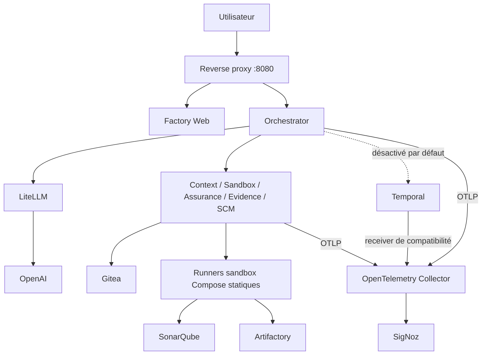

# Guide de maintenance et d’exploitation — AI Software Factory locale

| Référence | Valeur |
|---|---|
| Dépôt | `dbeaumont/ai-software-factory-local` |
| Branche analysée | `features/multiagents` |
| Révision de référence | `57aee95f0fe360aa9ba45553056a46e9e42b873e` |
| Date de l’analyse | 4 septembre 2026 |
| Version fonctionnelle documentée | Prototype 1.2.0 — architecture 04 |
| Déploiement couvert | Docker Compose local, mono-hôte |
| Périmètre métier | Du ticket à la création d’une Pull Request brouillon |

> Ce guide décrit le dépôt tel qu’il existe à la révision indiquée. Il distingue systématiquement le chemin actif,
> les capacités présentes mais désactivées et la cible d’industrialisation. Il ne couvre ni la fusion de la Pull
> Request, ni la CI/CD aval, ni le déploiement ou l’exploitation des applications produites.

## 1. Résumé opératoire

L’AI Software Factory locale transforme un ticket en proposition de changement vérifiée. Le chemin actif est le
pipeline déterministe : clonage du dépôt, planification LLM, génération et réparation éventuelle d’un patch,
tests, contrôle SonarQube, SBOM Syft, scan Trivy, revue LLM, approbation humaine, puis création d’une Pull Request
brouillon dans Gitea.

Le mode multi-agent hiérarchique est implémenté dans le code mais n’est pas actif par défaut. Les rôles
`Supervisor`, Architecture, Code, Tests, Sécurité et `Independent Reviewer` s’exécutent dans la JVM de
`orchestrator`; ils ne sont pas des conteneurs indépendants. Temporal est démarré mais son utilisation par
l’orchestrateur reste désactivée. La mémoire des tâches actives est en JVM : un redémarrage de l’orchestrateur
fait perdre la vue API des tâches, même si certains workspaces et états MCP restent présents dans les volumes.

### 1.1 Principes d’exploitation impératifs

1. Conserver `PIPELINE` comme mode de référence et de retour arrière.
2. Ne jamais contourner les gates de tests, qualité, sécurité ou approbation humaine.
3. Ne jamais rejouer à l’aveugle une action à effet dont l’issue est inconnue ; la réconcilier avec sa clé
   d’idempotence auprès du système cible.
4. Préserver tâches, workspaces, preuves, états MCP et journaux pendant un incident.
5. Ne pas activer Temporal ou les modes hiérarchiques sur la seule base de leur présence dans le code.
6. Garder la stack sur une machine locale ou un environnement de démonstration isolé : elle n’est pas durcie pour
   une exposition d’entreprise.

### 1.2 Alerte de sécurité prioritaire

Le fichier suivi par Git `.env.delete` contient des valeurs renseignées pour des variables sensibles. Aucune de ces
valeurs ne doit être réutilisée ou copiée dans un ticket d’incident.

Actions prioritaires :

1. considérer tous les secrets présents dans ce fichier comme compromis ;
2. révoquer et régénérer au minimum les jetons Gitea et SonarQube, la clé OpenAI, les clés Artifactory et la clé
   d’attestation d’approbation ;
3. remplacer les secrets dans les systèmes cibles, `.env` et `.vault` ;
4. supprimer `.env.delete` de la branche ;
5. évaluer l’exposition du dépôt et purger l’historique Git avec une procédure coordonnée si nécessaire ;
6. vérifier les journaux d’accès des services concernés ;
7. ajouter un contrôle de secrets en pré-commit et dans la chaîne d’intégration du dépôt.

La suppression d’un fichier dans le dernier commit ne retire pas ses anciennes versions de l’historique.

## 2. Architecture exploitable



### 2.1 Inventaire des services Compose

| Domaine | Services | État / rôle opérationnel |
|---|---|---|
| Accès | `reverse-proxy`, `factory-web` | Entrée HTTP publique locale et interface statique |
| Contrôle | `orchestrator` | API, pipeline actif, rôles d’agents, coordination des effets |
| LLM | `litellm` | Passerelle interne vers le modèle OpenAI configuré |
| SCM | `gitea`, `gitea-db` | Dépôts, branches, commits et PR de démonstration |
| MCP | `repository-context-mcp` | Lecture bornée du dépôt, sans port hôte |
| MCP | `sandbox-execution-mcp` | Contrôle de runners Compose statiques, sans socket Docker |
| MCP | `assurance-mcp` | Évaluation déterministe des gates et politiques |
| MCP | `evidence-mcp` | Stockage local chiffré et immuable des preuves |
| MCP | `scm-delivery-mcp` | Livraison Gitea après approbation |
| Sandbox | `sandbox-egress-proxy` | Proxy Squid à destinations autorisées |
| Workflow | `temporal-db`, `temporal-schema`, `temporal`, `temporal-namespace`, `temporal-ui` | Socle durable préparé ; client orchestrateur désactivé par défaut |
| Qualité | `sonarqube`, `sonar-db` | Analyse et quality gate |
| Artefacts | `artifactory`, `artifactory-db`, `artifactory-config` | Dépôt local et initialisation one-shot |
| Observabilité | `otel-collector`, SigNoz, `signoz-bootstrap`, `alert-sink` | OTLP, stockage, dashboards et alertes |

`temporal-schema`, `temporal-namespace` et `artifactory-config` sont des services d’initialisation qui se terminent
normalement après succès. Leur état `Exited (0)` n’est pas une panne.

### 2.2 Réseaux et exposition

| Réseau | Caractéristique | Membres / usage principal |
|---|---|---|
| `ai-factory-network` | Accès externe possible | Web, orchestrateur, Gitea, LiteLLM, SonarQube, Artifactory et Collector |
| `ai-factory-mcp-internal` | `internal: true` | Orchestrateur, MCP et Collector |
| `ai-factory-workflow-internal` | `internal: true` | Temporal, orchestrateur et Collector |
| `ai-factory-sandbox-egress` | `internal: true` | Jobs de test, Artifactory et proxy egress |
| `ai-factory-sandbox-quality` | `internal: true` | Jobs qualité, SonarQube, Artifactory et proxy egress |

Ports hôte par défaut : Web `8080`, orchestrateur `8088`, Gitea HTTP `3000`, Gitea SSH `2222`, SonarQube
`9000`, Artifactory `8082`, SigNoz `3301` et Temporal UI sur `127.0.0.1:8233`. Les cinq
serveurs MCP, LiteLLM, Temporal gRPC et les bases PostgreSQL ne publient pas de port hôte.

### 2.3 Persistance réelle

| Volume | Données | Criticité |
|---|---|---|
| `temporal-db-data` | Historique Temporal | Important seulement après activation durable ; à préserver dès maintenant |
| `gitea-db-data`, `gitea-data` | Métadonnées et dépôts Gitea | Critique pour branches et PR locales |
| `factory-workspace` | Clones et workspaces de tâches | Recréable depuis Git, mais utile à l’enquête |
| `sandbox-job-state` | États, sorties bornées et idempotence des jobs | Critique pour réconciliation après reprise |
| `context-registry-state` | Registre des workspaces accessibles au Context MCP | Important pour la cohérence d’accès |
| `scm-delivery-state` | États et idempotence de livraison SCM | Critique pour éviter les doubles effets |
| `evidence-state` | Preuves chiffrées et manifestes | Critique dès que le chemin Evidence est utilisé |
| `sonar-db-data`, `sonar-data`, `sonar-logs`, `sonar-extensions` | Données SonarQube | Important pour historique qualité et configuration |
| `artifactory-data`, `artifactory-db-data` | Binaires, métadonnées et configuration Artifactory | Critique et dépendant de clés stables |
| volumes SigNoz ClickHouse/PostgreSQL | métriques, traces, logs, règles et dashboards | À sauvegarder ensemble avec les secrets locaux associés |

## 3. Modèle de responsabilité

| Rôle | Responsabilités |
|---|---|
| Exploitation | Démarrage, arrêt, supervision, sauvegarde, restauration, incidents et changements de capacité |
| Équipe IA | Modèles, prompts, dérives de coût/qualité et campagnes comparatives |
| Architecture | Contrats, politiques, routage, compatibilité Temporal et frontières MCP |
| Sécurité | Secrets, vulnérabilités, compromission MCP, isolation, preuves et exposition réseau |
| Produit | Périmètre fonctionnel, critères d’acceptation et décision de promotion |
| Relecteur humain | Examen des preuves et approbation avant l’effet SCM |

Pour une promotion hiérarchique, les validations Produit, Architecture, Sécurité et Exploitation sont toutes
requises. La présence de code ou de paramètres ne constitue jamais une autorisation d’activation.

## 4. Pré-requis et dimensionnement

### 4.1 Poste d’exploitation

- Docker Engine ou Docker Desktop avec Compose v2 ;
- `make`, `bash`, `curl`, `git`, `openssl` et Python 3 ;
- `jq` recommandé ;
- JDK 25 et Maven 3.6.3+ uniquement pour construire/tester hors conteneur ;
- 16 Gio de RAM recommandés pour la stack complète ;
- espace disque surveillé, particulièrement pour Gitea, SonarQube, Artifactory, Temporal et les workspaces.

### 4.2 Contrôles préalables

```bash
docker version
docker compose version
git status --short --branch
docker system df
```

Vérifier ensuite que la configuration effective ne contient aucun montage de socket Docker :

```bash
./scripts/check-no-docker-socket.sh
docker compose --env-file .env -f infrastructure/compose.yaml config | grep -F docker.sock && exit 1 || true
```

Le runtime local attendu est `AI_FACTORY_SANDBOX_RUNTIME=compose`. `make init` migre automatiquement une ancienne
configuration locale vers cette valeur et génère le jeton interne des runners.

## 5. Configuration et secrets

### 5.1 Fichiers

| Fichier | Usage | Règle |
|---|---|---|
| `.env.example` | Modèle versionné | Ne doit contenir que des valeurs non sensibles ou factices |
| `.env` | Configuration locale et certains secrets POC | `0600`, ignoré par Git, sauvegarde protégée |
| `.vault.example` | Structure minimale du coffre local | Aucun secret réel |
| `.vault` | Clé OpenAI et secrets partagés | `0600`, ignoré par Git, jamais joint aux logs/incidents |

Initialisation :

```bash
make init
```

Cette commande crée les deux fichiers s’ils sont absents, génère les secrets locaux obligatoires et synchronise
les valeurs partagées entre `.env` et `.vault`. Elle refuse d’écraser deux valeurs déjà établies mais divergentes.

### 5.2 Variables essentielles

| Domaine | Variables principales | Valeur / précaution |
|---|---|---|
| Modèle | `OPENAI_MODEL`, `OPENAI_API_KEY`, `LITELLM_IMAGE`, `LITELLM_MASTER_KEY` | Le modèle logique exposé est `factory-code-cloud` |
| Build | `SYFT_VERSION`, `TRIVY_VERSION`, `NODE_VERSION` | Versions épinglées dans l’image sandbox |
| Artefacts | `MAVEN_MIRROR_URL`, `AI_FACTORY_SANDBOX_MAVEN_MIRROR_URL`, `NPM_REGISTRY_URL` | Doivent être compatibles avec l’allow-list Squid |
| SCM | `GITEA_TOKEN`, comptes bootstrap | Le jeton doit avoir les seules portées nécessaires |
| Qualité | `SONAR_TOKEN` | Régénéré/validé par `make tokens` |
| Preuves | `APPROVAL_ATTESTATION_KEY` | Stable tant que les preuves associées doivent être lues |
| Artifactory | `JF_SHARED_SECURITY_MASTERKEY`, `JF_SHARED_SECURITY_JOINKEY`, mot de passe DB | Ne jamais changer tant que les volumes existants sont réutilisés sans procédure de rotation |
| Modes | `AI_FACTORY_TEMPORAL_ENABLED`, rôles, qualification | Conserver les valeurs fail-closed par défaut |

Le code LiteLLM accepte `OPENAI_API_KEY` et, par compatibilité, `VAULT_OPENAI_API_KEY`. Le modèle `.vault.example`
utilise `OPENAI_API_KEY`; cette forme est donc la référence à privilégier.

### 5.3 Baseline sûre

```dotenv
AI_FACTORY_TEMPORAL_ENABLED=false
AI_FACTORY_AGENT_TOOL_ROLES=
AI_FACTORY_AGENT_TOOL_QUALIFICATION=INCOMPLETE
AI_FACTORY_AGENT_TOOL_SECURITY_PASSED=false
AI_FACTORY_AGENT_TOOL_EVALUATION_ENABLED=false
AI_FACTORY_AGENT_TOOL_EVALUATION_ROLES=
AI_FACTORY_MCP_ENABLED=true
AI_FACTORY_MCP_REPOSITORY_CONTEXT_MODE=MCP_ACTIVE
AI_FACTORY_MCP_SANDBOX_MODE=MCP_ACTIVE
```

Ne pas utiliser les anciens modes `DIRECT` ou `MCP_SHADOW` pour le contexte ou la sandbox : ils sont considérés
obsolètes et refusés sans fallback.

### 5.4 Rotation des secrets

1. geler les nouvelles soumissions ;
2. inventorier les consommateurs du secret ;
3. créer la nouvelle valeur dans le système source ;
4. mettre à jour `.env` et/ou `.vault` sans afficher la valeur ;
5. recréer uniquement les services consommateurs ;
6. vérifier santé et opération de lecture sans effet ;
7. révoquer l’ancienne valeur ;
8. vérifier les journaux d’accès et documenter la rotation.

Pour les jetons Gitea/SonarQube du POC :

```bash
make tokens
```

Cette cible recrée ensuite `scm-delivery-mcp` et `orchestrator`. Elle ne constitue pas une rotation générale des
clés Artifactory, OpenAI ou d’attestation.

## 6. Construction, démarrage et arrêt

Toutes les commandes sont lancées à la racine du dépôt.

### 6.1 Premier démarrage

```bash
make init
make config
make up
make bootstrap
make status
make urls
```

`make up` appelle `make init` puis `make build`. L’image sandbox est construite, son identifiant immuable SHA-256
est écrit dans `.env`, puis les images applicatives sont construites avant le démarrage Compose. `make bootstrap`
crée les comptes et dépôts Gitea de démonstration, génère les jetons et recrée les consommateurs concernés.

Ne pas utiliser `make all` sur une installation à conserver : cette cible exécute d’abord `make clean` et détruit
les volumes.

### 6.2 Démarrage courant sans reconstruction

Après un simple arrêt conservant les volumes :

```bash
docker compose --env-file .env -f infrastructure/compose.yaml up -d
make status
```

Employer `make up` lorsqu’une reconstruction et un nouvel épinglage de l’image sandbox sont voulus.

### 6.3 Arrêt propre

Avant l’arrêt :

1. bloquer les nouvelles soumissions ;
2. attendre les tâches en cours ou enregistrer précisément leur état ;
3. ne pas arrêter pendant un effet SCM non réconcilié ;
4. exporter les preuves et journaux requis par la politique de conservation ;
5. sauvegarder si l’arrêt précède une maintenance à risque.

```bash
make down
```

Cette commande conserve les volumes. Pour un arrêt ciblé :

```bash
docker compose --env-file .env -f infrastructure/compose.yaml stop orchestrator
```

### 6.4 Redémarrage

```bash
make restart
```

Cette cible ne redémarre que `orchestrator` et ne recrée pas son conteneur. Une modification d’environnement ou
d’image exige une recréation :

```bash
docker compose --env-file .env -f infrastructure/compose.yaml up -d --no-deps --force-recreate orchestrator
```

Attention : la mémoire active des tâches est en JVM. Avant tout redémarrage de l’orchestrateur, inventorier les
tâches et accepter explicitement la perte de leur vue en mémoire. Les états persistés des jobs MCP ne reconstruisent
pas encore automatiquement la mémoire API.

### 6.5 Réinitialisation destructive

```bash
make clean
```

Cette commande exécute `docker compose down -v --remove-orphans`. Elle supprime toutes les données portées par les
volumes Compose. Elle ne doit être utilisée que pour réinitialiser volontairement un environnement jetable, après
sauvegarde et double vérification du projet Compose ciblé.

## 7. Contrôles de santé

### 7.1 Contrôle synthétique

```bash
make status
curl -fsS http://localhost:8080/
curl -fsS http://localhost:8088/actuator/health
curl -fsS http://localhost:3000/api/healthz
curl -fsS http://localhost:9000/api/system/status
curl -fsS http://localhost:8082/artifactory/api/system/ping
curl -fsS http://localhost:9090/-/ready
curl -fsS http://localhost:3001/api/health
```

Utiliser les ports de `.env` si les valeurs par défaut ont été modifiées.

### 7.2 Santé des MCP non exposés

Les endpoints sont consultés depuis un conteneur appartenant au réseau MCP, par exemple l’orchestrateur :

```bash
docker compose --env-file .env -f infrastructure/compose.yaml exec -T orchestrator \
  curl -fsS http://repository-context-mcp:8091/actuator/health/readiness
docker compose --env-file .env -f infrastructure/compose.yaml exec -T orchestrator \
  curl -fsS http://sandbox-execution-mcp:8092/actuator/health/readiness
docker compose --env-file .env -f infrastructure/compose.yaml exec -T orchestrator \
  curl -fsS http://assurance-mcp:8094/actuator/health/readiness
docker compose --env-file .env -f infrastructure/compose.yaml exec -T orchestrator \
  curl -fsS http://evidence-mcp:8095/actuator/health/readiness
docker compose --env-file .env -f infrastructure/compose.yaml exec -T orchestrator \
  curl -fsS http://scm-delivery-mcp:8093/actuator/health/readiness
```

### 7.3 Contrôle fonctionnel

```bash
curl -fsS http://localhost:8080/api/capabilities
curl -fsS http://localhost:8080/api/tasks
make demo
```

Le test fonctionnel est réussi lorsque la tâche progresse jusqu’à `WAITING_APPROVAL`, les preuves sont complètes
et cohérentes, puis une approbation explicite mène à `PR_CREATED`. Ne pas approuver automatiquement un test sur un
dépôt non jetable.

### 7.4 États d’une tâche

`QUEUED → CLONING → PLANNING → GENERATING_PATCH → APPLYING_PATCH → TESTING → QUALITY_SCANNING →`
`SECURITY_SCANNING → REVIEWING → WAITING_APPROVAL → APPROVED → PR_CREATED`.

`FAILED` et `CANCELLED` sont terminaux. `PR_CREATED` est la fin de responsabilité de l’usine ; la fusion et le
déploiement sont hors périmètre.

## 8. Exploitation quotidienne

### 8.1 Prise de service

- vérifier `make status` et les healthchecks ;
- contrôler l’espace disque et la mémoire de l’hôte ;
- vérifier les services, ingestion et files du Collector dans SigNoz ;
- consulter les neuf alertes métier, les six alertes techniques et les sept dashboards SigNoz ;
- contrôler les files sandbox, tâches bloquées et erreurs récentes ;
- vérifier qu’aucun mode ou rôle hiérarchique n’a été activé sans changement approuvé ;
- confirmer que la capture du contenu des prompts, résultats et preuves reste désactivée.

### 8.2 Surveillance des tâches

```bash
curl -fsS http://localhost:8080/api/tasks | jq .
curl -fsS http://localhost:8080/api/tasks/<TASK_ID> | jq .
docker compose --env-file .env -f infrastructure/compose.yaml logs --tail=200 orchestrator
```

Pour chaque tâche, suivre l’identifiant, le commit source, le statut, la tentative, les digests de preuve, le
verdict des gates et l’éventuel identifiant de PR. Ne pas copier le prompt, le patch ou les logs complets dans les
labels de métriques ou les tickets non protégés.

### 8.3 Approbation

```bash
curl -fsS -X POST http://localhost:8080/api/tasks/<TASK_ID>/approve
```

Avant approbation, vérifier :

- dépôt, branche et commit source ;
- patch proposé ;
- tests réussis ;
- quality gate SonarQube réussi ;
- SBOM disponible ;
- absence de finding Trivy HIGH/CRITICAL bloquant ;
- revue sans `blocker` ;
- preuves complètes, non tronquées et digest cohérent.

Une approbation ne doit pas être réutilisée après modification du commit, du patch, des preuves ou de la tentative.

### 8.4 Fin de service

- inventorier les tâches non terminales ;
- documenter tout effet à issue inconnue ;
- vérifier le drainage des files ;
- confirmer l’absence d’alerte critique non acquittée ;
- archiver les éléments d’incident ou de changement ;
- vérifier la dernière sauvegarde réussie selon le calendrier local.

## 9. Observabilité

### 9.1 Collecte actuelle

Les six applications Spring envoient métriques, traces et logs en OTLP au Collector interne. Temporal est la seule
source de compatibilité scrutée par le receiver du Collector. SigNoz expose les dashboards Orchestrator, Supervisor,
Agents, Temporal, MCP, Sandbox et OpenTelemetry Collector sur `http://localhost:3301`.

### 9.2 Alertes configurées

| Alerte | Sévérité | Réponse initiale |
|---|---|---|
| `AiFactoryAgentLoopDetected` | warning | Isoler le rôle, conserver les budgets |
| `AiFactoryAgentBudgetExhausted` | warning | Diagnostiquer sans augmenter les plafonds |
| `AiFactoryAgentCostSpike` | warning | Vérifier modèle, rôle, boucle et télémétrie fournisseur |
| `AiFactoryTaskQueueBacklog` | warning | Suspendre les admissions hiérarchiques et localiser le goulot |
| `AiFactorySandboxHeartbeatInvalid` | critical | Geler les effets et traiter comme incident MCP |
| `AiFactorySandboxExecutionFailures` | critical | Conserver les preuves et isoler le runner ou Job affecté |
| `AiFactorySandboxMaintenanceFailure` | critical | Suspendre les admissions et réparer la maintenance d'état |
| `AiFactoryAgentContractError` | warning | Refuser la sortie et corriger contrat/prompt/version |
| `AiFactoryEvidenceAltered` | critical | Isoler Evidence MCP, invalider les approbations liées |
| `AiFactoryCollectorExportFailures` | critical | Vérifier ingester, ClickHouse et réseau ; préserver le métier |
| `AiFactoryCollectorQueueSaturation` | warning | Corriger le backend avant toute modification de capacité |
| `AiFactoryTelemetryIngestionAbsent` | critical | Localiser application, Collector, ingester ou stockage |
| `AiFactoryCollectorRestart` | warning | Vérifier OOM, configuration et historique de déploiement |
| `AiFactoryCollectorMemoryPressure` | warning | Réduire volume/cardinalité avant d'augmenter la limite |
| `AiFactoryCollectorReceiverRefused` | critical | Corriger transport ou schéma sans journaliser le payload |

Les règles sont provisionnées dans SigNoz. En local, elles sont routées vers `alert-sink`, qui vérifie le chemin de
notification sans publier de port ni conserver les payloads. En environnement partagé, remplacer ce canal par la
destination d'astreinte approuvée et tester sa rotation/déduplication.

### 9.3 Parcours de recherche

Dans SigNoz, filtrer les métriques par `service.name`, environnement, rôle, opération et résultat. Depuis un panneau,
ouvrir la trace représentative puis les logs portant le même `trace_id`. Rechercher un identifiant unique comme
`ai.task.id` uniquement dans traces/logs. Temporal UI reste l'autorité de l'historique durable ; le détail de tâche
de l'application reste l'autorité de son état projeté. Les runbooks sont indexés dans
[`docs/operations/runbooks`](runbooks/README.md).

### 9.4 SLO proposés, non encore contractuels

| Indicateur | Cible initiale |
|---|---:|
| Disponibilité de chaque MCP | ≥ 99,5 % sur 28 jours |
| p95 `list_tree` / `read_file` | ≤ 1 s |
| p95 `search_code` | ≤ 2 s |
| p95 symboles / dépendances | ≤ 3 s |
| p95 / p99 démarrage sandbox | ≤ 5 s / ≤ 15 s |
| Erreurs système MCP | ≤ 0,5 % |

L’instrumentation canonique n’est pas complète. En dessous de 100 appels éligibles, ne pas conclure sur un p95.
Une preuve altérée, une mutation non approuvée ou un succès erroné est une violation d’invariant, indépendamment du
budget d’erreur.

### 9.5 Requêtes utiles

```promql
max(ai_factory_sandbox_jobs_queued)
max(ai_factory_sandbox_jobs_running)
max by (perimeter) (ai_task_queue_saturation_ratio)
sum by (role, stop_condition, reason) (increase(ai_agent_failures[15m]))
sum by (role) (increase(ai_agent_cost_micros[15m]))
```

## 10. Capacité, quotas et rétention

| Ressource | Valeur par défaut |
|---|---:|
| Workers déclarés par task queue | 4 |
| Réponses MCP | 65 536 octets |
| Appels MCP simultanés | 32 globaux, 16/serveur, 4/tâche, 8/rôle |
| Timeout MCP standard | 20 s |
| Jobs sandbox simultanés / en file | 2 / 32 |
| Jobs sandbox actifs par tâche | 2 |
| États sandbox conservés | 500, pendant 7 jours |
| Sortie sandbox / patch | 65 536 caractères / 1 Mio |
| Conteneur sandbox | 2 CPU, 2 Gio, 512 PID |
| Tests / qualité / sécurité | 15 min / 15 min / 10 min |
| Heartbeat / polling sandbox | 15 s / 20 min |

Ne modifier un quota qu’après identification du goulot, contrôle CPU/mémoire/PID/disque, validation de l’isolation
et analyse du coût. Une hausse en cours d’incident agentique est interdite. Une soumission idempotente retrouve son
job ; une nouvelle demande hors quota est refusée avant création du snapshot.

Rétention Evidence cible : plans/patches/tests 90 jours, évaluations et Sonar 180 jours, SBOM/Trivy/review/
approbation/manifeste 365 jours, audit immuable 730 jours, avec délai de grâce de purge de 30 jours. Cette politique
décrit le mode durable cible et ne remplace pas une sauvegarde opérationnelle du POC.

## 11. Sauvegarde et restauration

### 11.1 Limite actuelle

Le dépôt ne fournit pas de commande de sauvegarde ou de restauration intégrée. Les volumes Docker sont persistants,
mais ne sont ni une sauvegarde, ni un stockage WORM, ni un PRA. Toute procédure locale doit être testée sur une
copie isolée avant d’être déclarée exploitable.

### 11.2 Périmètre minimal de sauvegarde

- `.env` et `.vault`, chiffrés et séparés des données ;
- commit Git du dépôt de la Factory, prompts, contrats, politiques et catalogues associés ;
- volumes Gitea et base Gitea ;
- volumes Artifactory, base Artifactory et clés de sécurité correspondantes ;
- volumes SonarQube et sa base ;
- `sandbox-job-state`, `scm-delivery-state`, `evidence-state`, `context-registry-state` ;
- `factory-workspace` lorsque la conservation d’une enquête l’exige ;
- `temporal-db-data` dès que Temporal contient un historique utile ;
- volumes ClickHouse/PostgreSQL SigNoz et exports versionnés des dashboards/règles.

Une copie cohérente exige l’arrêt des écritures. Pour les bases PostgreSQL, privilégier des dumps logiques contrôlés
et restaurables, complétés par les volumes applicatifs associés. Sauvegarder Artifactory sans ses clés rend les
données inutilisables.

### 11.3 Procédure de sauvegarde locale

1. geler les admissions et attendre/réconcilier les effets en vol ;
2. relever le commit de la Factory, les digests d’images et versions ;
3. effectuer les dumps PostgreSQL Gitea, SonarQube, Artifactory et Temporal ;
4. arrêter les services qui écrivent dans les volumes ;
5. archiver les volumes applicatifs avec leurs métadonnées ;
6. chiffrer l’archive et stocker les secrets séparément ;
7. produire sommes SHA-256, inventaire, date, périmètre et résultat ;
8. redémarrer, vérifier la santé et réaliser un contrôle fonctionnel ;
9. restaurer périodiquement la sauvegarde dans un environnement isolé.

### 11.4 Procédure de restauration

1. maintenir les admissions fermées ;
2. recréer exactement la version de code et les images compatibles ;
3. restaurer les bases avant leurs services ;
4. restaurer les volumes et les clés correspondantes ;
5. démarrer Gitea, Artifactory, SonarQube et les MCP avant l’orchestrateur ;
6. vérifier les digests, clés d’idempotence, manifestes et preuves ;
7. ne pas déduire l’état d’un effet externe depuis le seul workspace ;
8. échantillonner des dépôts, analyses et preuves ;
9. rouvrir d’abord un canary interne, puis les admissions après validation Exploitation/Sécurité.

Dans la cible durable, Temporal est l’autorité de chronologie, Evidence MCP l’autorité des artefacts et PostgreSQL
une projection reconstruisible. Cette organisation n’est pas encore câblée de bout en bout dans le chemin actif.

### 11.5 Différences local et GKE

En local, SigNoz, ClickHouse et PostgreSQL sont dans Compose ; `alert-sink` valide les notifications sans les sortir
du poste. Les secrets sont dans `.env`/`.vault` et la restauration porte sur les volumes locaux. En GKE, la gateway
Collector exporte vers Cloud Monitoring, Trace et Logging avec Workload Identity, mTLS et NetworkPolicies ; les
secrets résiduels relèvent de Secret Manager, les dashboards/alertes du projet GCP et leur rétention doivent être
validés dans ce projet. Une preuve locale ne vaut donc jamais qualification cloud.

## 12. Maintenance préventive

### 12.1 Chaque jour d’utilisation

- santé des conteneurs, ingestion OTLP et files du Collector ;
- espace disque, mémoire et saturation sandbox ;
- tâches bloquées et erreurs de contrat ;
- findings critiques et intégrité des preuves ;
- absence de dérive des modes/qualifications ;
- validité des jetons nécessaires.

### 12.2 Chaque semaine

- sauvegarde complète et contrôle des digests ;
- revue des journaux d’erreur et rejets d’admission ;
- taille des volumes et workspaces orphelins ;
- dépendances/images disponibles et vulnérabilités connues ;
- vérification de l’allow-list egress ;
- test sur les trois projets de référence Maven, Gradle et npm.

### 12.3 Chaque mois

- exercice de restauration isolée ;
- rotation planifiée des jetons à durée courte ;
- revue des comptes Gitea, SonarQube, SigNoz et Artifactory ;
- revue des versions Docker, Java, Spring, Temporal, LiteLLM, Syft et Trivy ;
- revue des SLO, coûts, capacités et rétention ;
- vérification des runbooks et contacts d’escalade ;
- test du rollback et, lorsqu’il sera réellement monté, du kill switch.

### 12.4 Nettoyage

Les états terminaux sandbox sont purgés automatiquement suivant
`AI_FACTORY_SANDBOX_JOB_RETENTION` et `AI_FACTORY_SANDBOX_MAX_JOBS`. Ne jamais vider manuellement
`sandbox-job-state` pour traiter une saturation. Les conteneurs éphémères de la Factory suivent le préfixe
`ai-factory-sbx-<execution_id>` ; toute suppression doit être précédée d’une corrélation avec l’état du contrôleur.

## 13. Mise à jour de la Factory

### 13.1 Préparation

1. ouvrir un changement et définir retour arrière, fenêtre et responsables ;
2. vérifier `git status` et identifier la révision source/cible ;
3. sauvegarder la configuration et les données ;
4. inventorier tâches et effets en vol ;
5. lire les changements Compose, migrations, contrats, politiques et prompts ;
6. comparer les versions d’images et vérifier leur compatibilité CPU/OS ;
7. exécuter les tests hors production locale.

### 13.2 Validation avant bascule

```bash
make config
make test
make build
make test-sandbox-runtime
```

`make test-sandbox-runtime` utilise le daemon Docker et crée temporairement un conteneur et un volume aléatoires.
Il vérifie les contraintes réellement appliquées par le runtime.

### 13.3 Déploiement local

```bash
docker compose --env-file .env -f infrastructure/compose.yaml up -d --build
make status
```

Vérifier les initialisations one-shot, les healthchecks, l'ingestion SigNoz et un scénario de référence.
Conserver les anciennes images jusqu’à validation de la fenêtre de retour arrière.

### 13.4 Compatibilité Temporal

Tant que `AI_FACTORY_TEMPORAL_ENABLED=false`, ne pas présenter le redémarrage local comme un déploiement durable.
Après activation, tout changement de code Workflow modifiant l’historique exige Worker Versioning ou
`Workflow.getVersion`. Un rolling update sans l’un de ces mécanismes est interdit. Les anciens workers restent
disponibles jusqu’au drainage des workflows épinglés et expiration de la période de retour arrière.

### 13.5 Prompts, contrats et politiques

Un changement de modèle, prompt, schéma, outil ou politique invalide une qualification en cours. Il doit :

- recevoir une version et un digest immuables ;
- passer les tests de compatibilité et de régression ;
- être évalué sur un corpus apparié ;
- repasser par `HIERARCHICAL_SHADOW` ;
- obtenir les approbations prévues avant canary ou activation.

## 14. Incidents et dépannage

### 14.1 Priorités communes

1. stopper ou réduire les nouvelles admissions ;
2. ne pas élargir les droits, budgets ou scopes ;
3. geler les effets à issue inconnue ;
4. préserver les journaux, volumes, workspaces, versions et preuves ;
5. identifier tâche, tentative, commit, serveur, outil et clé d’idempotence ;
6. restaurer la dépendance ou version connue ;
7. vérifier sur deux fenêtres stables avant réouverture ;
8. documenter cause, impact, correction, tests et décision.

### 14.2 Un service ne démarre pas

```bash
docker compose --env-file .env -f infrastructure/compose.yaml ps -a
docker compose --env-file .env -f infrastructure/compose.yaml logs --tail=300 <service>
docker inspect --format '{{json .State.Health}}' <container>
```

Vérifier d’abord : variables absentes, port hôte occupé, healthcheck de dépendance, espace disque, image inaccessible,
secret divergent et droits de volume/socket. Ne pas effacer le volume pour faire disparaître le symptôme.

### 14.3 LiteLLM ou OpenAI indisponible

- vérifier la santé `litellm` et l’existence de `OPENAI_API_KEY` sans l’afficher ;
- vérifier `LITELLM_IMAGE`, `OPENAI_MODEL` et `AI_FACTORY_CLOUD_ENABLED` ;
- en environnement intercepté, contrôler `OPENAI_CA_CERT_HOST` et la chaîne TLS ;
- vérifier l’egress, les quotas et erreurs du fournisseur ;
- conserver la tâche en échec ou en attente selon le contrat ; ne pas désactiver TLS.

Le démarrage LiteLLM récupère la chaîne du point configuré uniquement si une clé OpenAI et
`OPENAI_CA_CERT_HOST` sont présents. La vérification TLS demeure active.

### 14.4 Gitea / création de PR

- vérifier Gitea, sa base et le jeton ;
- vérifier l’état de livraison dans `scm-delivery-state` ;
- rechercher la branche/PR avec l’identifiant de tâche ;
- si l’issue de l’appel est inconnue, réconcilier avant tout retry ;
- régénérer un jeton invalide avec `make tokens` ;
- ne pas réutiliser une approbation si le digest a changé.

### 14.5 SonarQube

- attendre le statut `UP` ;
- vérifier que le mot de passe de `.env` correspond au compte stocké dans le volume ;
- régénérer le jeton avec `make tokens` ;
- vérifier l’accès depuis le réseau `sandbox-quality` ;
- un jeton absent ou un type de projet non supporté doit produire un échec fermé, pas un succès implicite.

### 14.6 Artifactory

- vérifier la base avant Artifactory ;
- préserver `JF_SHARED_SECURITY_MASTERKEY` et `JF_SHARED_SECURITY_JOINKEY` ;
- vérifier le dépôt virtuel et la cohérence du miroir Maven ;
- vérifier que l’URL choisie est autorisée par le proxy sandbox ;
- ne jamais restaurer `artifactory-data` sans sa base et ses clés compatibles.

### 14.7 Sandbox saturée

```promql
max(ai_factory_sandbox_jobs_queued)
max(ai_factory_sandbox_jobs_running)
```

Suspendre les admissions hiérarchiques, identifier le goulot et laisser le backpressure préserver l’ordre. Ne pas
supprimer les états, ne pas relancer les actions à effet et n’augmenter les quotas qu’après validation des ressources.
La clôture exige une file sous 20 et une saturation sous 0,90 pendant vingt minutes.

### 14.8 Job sandbox interrompu

Après redémarrage du contrôleur, un job précédemment actif devient `FAILED / INDETERMINATE`; ses sorties peuvent
rester comme preuve `PARTIAL`. Une preuve partielle, tronquée ou au digest incohérent ne peut valider le workflow.
Ne pas convertir manuellement cet état en succès. Créer une nouvelle tentative seulement après réconciliation et
selon la politique de retry.

### 14.9 Agent défaillant

Pour une boucle, un budget épuisé, une dérive de coût ou une sortie hors contrat : isoler le rôle, conserver la
tentative, ne pas augmenter les budgets et corriger le modèle/prompt/contrat dans une nouvelle version. Le fallback
pipeline ne doit jamais servir à contourner un gate.

### 14.10 MCP compromis ou preuve altérée

Incident critique : couper les admissions, arrêter/isoler le service suspect, geler les effets, préserver volumes
et journaux, révoquer ses secrets et vérifier hors du serveur suspect les digests et manifestes. Le kill switch est
présent dans le code, mais son fichier n’est pas monté ni transmis par le Compose courant ; l’arrêt du service reste
le confinement local disponible.

### 14.11 Temporal indisponible

Le chemin actif n’en dépend pas tant que `AI_FACTORY_TEMPORAL_ENABLED=false`. Après activation : préserver
`temporal-db-data`, restaurer PostgreSQL avant Temporal, vérifier le namespace et les pollers, puis redémarrer les
workers compatibles. Ne jamais terminer massivement les workflows ni les forcer sur un code incompatible.

### 14.12 Perte de l’orchestrateur

Le risque principal actuel est la perte de `InMemoryTaskMemory`. Conserver workspaces et états MCP, redémarrer
l’orchestrateur, puis traiter les tâches précédemment en cours comme non réconciliées. Vérifier Gitea, états sandbox,
Evidence et SCM avant toute nouvelle tentative. Ne pas déduire un succès depuis la seule présence d’un fichier.

## 15. Activation du multi-agent hiérarchique

Le paramétrage par défaut (`qualification=INCOMPLETE`, rôles vides) empêche l’activation. La trajectoire autorisée
est :

```text
PIPELINE → HIERARCHICAL_SHADOW → HIERARCHICAL_CANARY → HIERARCHICAL_ACTIVE
```

Préconditions : qualification liée aux digests exacts, campagne appariée complète, télémétrie coût/latence/qualité,
approbations formelles, périmètre allow-listé, kill switch réellement monté et testé, exercice de rollback archivé.

Progression recommandée : shadow, rôles lecture seule, consolidation active, code parallèle borné sur scopes
disjoints, puis extension dépôt par dépôt. Toute violation d’isolation, effet non autorisé, preuve invalide ou gate
déterministe échoué impose un retour immédiat à `PIPELINE`.

Dans le Compose actuel, ces préconditions ne sont pas toutes réunies. Il faut donc maintenir les rôles vides et la
qualification `INCOMPLETE` pour l’exploitation normale du prototype.

## 16. Rollback

Déclencheurs immédiats : effet non autorisé ou dupliqué, fuite de secret, accès cross-task, escalade de permission,
preuve/approbation invalide, contrat invalide accepté ou qualification révoquée.

Ordre sûr :

1. ouvrir l’incident et relever versions, tâches et effets ;
2. ramener le plafond d’admission à `PIPELINE` ;
3. placer la qualification à `INCOMPLETE` et le canary à zéro ;
4. bloquer les nouveaux workflows hiérarchiques ;
5. geler et réconcilier les effets inconnus ;
6. préserver les historiques et preuves ;
7. router uniquement les nouvelles tâches vers la baseline ;
8. corriger sur une nouvelle version et ajouter un test de régression ;
9. reprendre exclusivement en `HIERARCHICAL_SHADOW` après approbation.

Le retour direct à `HIERARCHICAL_ACTIVE` est interdit.

## 17. Tests et qualification technique

| Commande | Portée |
|---|---|
| `make config` | Validation de la configuration Compose |
| `make test` | Tests orchestrateur et cinq serveurs MCP |
| `make package` | Packaging orchestrateur sans tests |
| `make test-sandbox-runtime` | Contraintes effectives du runtime Docker |
| `make mcp-shadow-campaign` | Validation du corpus de 20 tâches, sans exécution par défaut |
| `make mcp-active-campaign` | Canary MCP actif borné aux rôles autorisés |
| `make mcp-shadow-report` | Rapport des métriques de campagne |

Une mise à jour n’est pas qualifiée par le seul succès des tests unitaires. Ajouter selon l’impact : replay Temporal,
compatibilité ancien/nouveau des payloads, restauration isolée, test d’idempotence, contrôle d’egress, scan de
secrets, test de rollback et scénario complet jusqu’à `PR_CREATED`.

## 18. Écarts bloquants avant usage d’entreprise

1. fichier `.env.delete` sensible suivi dans Git ;
2. absence de SSO, RBAC, séparation multi-tenant et rate limiting utilisateur ;
3. runners Compose locaux moins isolés que les Jobs GKE/gVisor cibles ;
4. transports MCP sans authentification forte ;
5. secrets locaux en fichiers et mots de passe de démonstration ;
6. mémoire des tâches active non durable ;
7. Temporal et projection PostgreSQL non intégrés au chemin actif ;
8. sauvegarde/restauration et PRA non automatisés ni éprouvés ;
9. rétention SigNoz et notification externe non encore éprouvées sur une campagne longue ;
10. kill switch non monté dans Compose ;
11. images non toutes épinglées par digest ;
12. absence de haute disponibilité ;
13. campagne cloud, canary réel et approbations formelles non réalisés.

## 19. Plan d’amélioration priorisé

### Priorité 0 — immédiat

- rotation et purge contrôlée des secrets exposés par `.env.delete` ;
- maintien de la stack sur boucle locale ;
- sauvegarde testée des données critiques ;
- procédure explicite de gel des admissions avant maintenance.

### Priorité 1 — fiabilisation du POC

- persister les tâches et relier la projection au workflow ;
- monter et tester un kill switch exploitable atomiquement ;
- éprouver sauvegarde/restauration SigNoz et les alertes techniques du Collector ;
- raccorder un canal d'astreinte approuvé hors environnement local ;
- automatiser sauvegarde/restauration et tests de reprise ;
- épingler toutes les images par digest ;
- ajouter scan de secrets et SBOM de la Factory elle-même.

### Priorité 2 — industrialisation

- supprimer le socket Docker au profit de Jobs Kubernetes/GKE isolés ;
- SSO, RBAC/ABAC, identités workload et Secret Manager ;
- mTLS/authentification des MCP et politiques réseau `default deny` ;
- Temporal durable avec Worker Versioning et workers par task queue ;
- stockage objet immuable des preuves et audit centralisé/SIEM ;
- haute disponibilité, SLO contractuels et PRA testé.

## 20. Checklist release et sécurité OpenTelemetry

Avant chaque release modifiant instrumentation, Collector, dashboard ou alerte :

- [ ] les six suites applicatives et les tests de contrat/confidentialité passent ;
- [ ] `docker compose config --quiet`, la validation Collector et les manifests GKE passent ;
- [ ] aucune image flottante, socket Docker, port OTLP public ou secret versionné n'est introduit ;
- [ ] `check-signoz-telemetry.sh`, `validate-signoz-queries.sh` et `test-otel-redaction.sh` passent ;
- [ ] les attributs nouveaux ont type, unité, cardinalité, rétention et propriétaire documentés ;
- [ ] prompts, résultats, code, patchs, preuves, credentials et paramètres d'URL restent absents ;
- [ ] dashboards, alertes, notifications, runbooks et liens sont cohérents avec la définition versionnée ;
- [ ] la sauvegarde compatible et le rollback atomique sont disponibles pendant la fenêtre convenue ;
- [ ] toute hausse de rétention, exposition réseau ou destination externe est approuvée par Sécurité/Exploitation ;
- [ ] les preuves locales et GKE sont distinguées explicitement dans la décision de release.

## 21. Références du dépôt

- [`README.md`](https://github.com/dbeaumont/ai-software-factory-local/blob/57aee95f0fe360aa9ba45553056a46e9e42b873e/README.md)
- [`infrastructure/compose.yaml`](https://github.com/dbeaumont/ai-software-factory-local/blob/57aee95f0fe360aa9ba45553056a46e9e42b873e/infrastructure/compose.yaml)
- [Rétrodocumentation](https://github.com/dbeaumont/ai-software-factory-local/blob/57aee95f0fe360aa9ba45553056a46e9e42b873e/docs/RETRODOCUMENTATION.md)
- [État du prototype 1.2.0](https://github.com/dbeaumont/ai-software-factory-local/blob/57aee95f0fe360aa9ba45553056a46e9e42b873e/docs/version-1.2.0-archi-04/ETAT-PROTO-1.2.0.md)
- [Runbooks](https://github.com/dbeaumont/ai-software-factory-local/tree/57aee95f0fe360aa9ba45553056a46e9e42b873e/docs/runbooks)
- [Exploitation Task Memory et Evidence](https://github.com/dbeaumont/ai-software-factory-local/blob/57aee95f0fe360aa9ba45553056a46e9e42b873e/docs/multiagents/TASK-MEMORY-EVIDENCE-OPERATIONS.md)
- [Politique de versionnement Temporal](https://github.com/dbeaumont/ai-software-factory-local/blob/57aee95f0fe360aa9ba45553056a46e9e42b873e/docs/multiagents/POLITIQUE-VERSIONNEMENT-WORKFLOWS-TEMPORAL.md)
- [SLO MCP initiaux](https://github.com/dbeaumont/ai-software-factory-local/blob/57aee95f0fe360aa9ba45553056a46e9e42b873e/docs/mcp/MCP-015-slo-initiaux.md)

## Annexe A — Aide-mémoire

```bash
# Valider
make config

# Démarrer et construire
make up

# Initialiser Gitea/Sonar
make bootstrap

# État et URLs
make status
make urls

# Logs orchestrateur
make logs

# Tests
make test
make test-sandbox-runtime

# Régénérer/valider les jetons locaux
make tokens

# Arrêt conservant les données
make down

# Destruction des volumes — environnement jetable uniquement
make clean
```

## Annexe B — Fiche d’incident minimale

| Champ | Valeur à renseigner |
|---|---|
| Identifiant / début / fin | |
| Sévérité et invariant touché | |
| Commit Factory / images / configuration | |
| Tâches, tentatives et commits source | |
| Services, outils et rôles concernés | |
| Effets confirmés / inconnus / réconciliés | |
| Preuves, manifestes et digests | |
| Mesures de confinement | |
| Secrets révoqués/rotés | |
| Cause racine | |
| Correctif et tests de régression | |
| Vérification sur deux fenêtres | |
| Approbations de reprise | |
