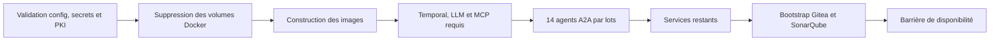
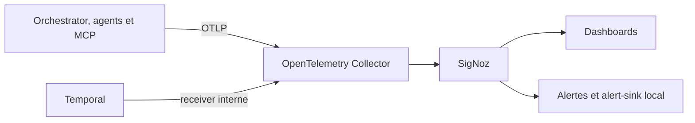

# Guide de maintenance et d'exploitation locale

| Référence | Valeur |
|---|---|
| Branche | `features/multiagents` |
| État revu | 7 septembre 2026 |
| Déploiement | Docker Compose local, mono-hôte |
| Workflow | Temporal obligatoire |
| Agents | 14 runtimes A2A obligatoires |

Ce guide couvre l'environnement de développement et de démonstration local. Il ne constitue pas un runbook de
production GKE.

## 1. Invariants d'exploitation

- Ne jamais contourner Temporal ou A2A pour restaurer le service.
- Ne jamais donner aux agents un accès direct au SCM, au daemon Docker ou aux secrets du plan de contrôle.
- Ne jamais rejouer une opération à effet dont l'issue est inconnue avant réconciliation.
- Préserver l'historique Temporal, les projections PostgreSQL, Evidence et les états MCP pendant un incident.
- Conserver l'approbation humaine avant branche, commit, push et Pull Request.
- Une identité, une Agent Card, une task queue ou une preuve invalide doit fermer les admissions.

## 2. Pré-requis macOS

- Docker Desktop avec Compose v2 ;
- `make`, Bash, `curl`, `jq`, `git`, `openssl`, Ruby et Python 3 ;
- JDK 25 et Maven pour les tests exécutés hors conteneur ;
- 20 à 24 Gio de mémoire Docker recommandés pour la stack complète ;
- au moins 30 Gio de disque disponible pour images, caches et volumes.

Vérifications initiales :

```shell
docker version
docker compose version
git status --short --branch
docker system df
```

## 3. Configuration et secrets

`make init` crée `.env` et `.vault` s'ils sont absents, initialise la PKI et les secrets A2A, synchronise le registre
de confiance des cartes et valide les permissions locales.

```shell
make init
make config
```

La validation échoue avant toute action Docker destructive si un secret établi ne respecte plus la politique. Les
principales contraintes sont :

- `ORCHESTRATOR_DB_PASSWORD` : au moins 24 caractères ;
- `SIGNOZ_DB_PASSWORD` : au moins 32 caractères ;
- `SIGNOZ_ROOT_PASSWORD` : au moins 12 caractères avec majuscule, minuscule, chiffre et symbole ;
- `AI_FACTORY_SANDBOX_RUNNER_TOKEN` et `APPROVAL_ATTESTATION_KEY` : au moins 32 caractères.

Ne pas corriger un mot de passe de base sur une stack conservant ses volumes sans procédure de rotation : la valeur
initialisée dans PostgreSQL ne serait plus cohérente. Pour une usine jetable neuve, corriger les fichiers avant
`make all`.

`.env`, `.vault`, `.local/a2a-pki` et `.local/a2a-secrets` sont hors Git. Les cibles Make ne doivent jamais afficher
leur contenu ; `make urls` ne publie que les adresses.

## 4. Démarrage

### Usine complète en conservant les données

```shell
make up
```

La cible construit toutes les images, démarre le socle Temporal/LLM/MCP, lance les quatorze agents par lots, active
les Build IDs Temporal, démarre les services restants et applique la barrière `verify-ready`.

### Usine neuve depuis des volumes Docker vides

```shell
make all
```

Cette cible est destructive. Son ordre est :



La suppression porte sur les volumes Docker du projet. Les identités locales `.env`, `.vault` et `.local/a2a-*`
sont volontairement conservées.

### Développement ciblé d'un rôle

```shell
make a2a-up-role A2A_ROLE=developer
```

Pour démarrer seulement la flotte complète et ses dépendances :

```shell
make a2a-up-full
```

## 5. Barrière de disponibilité

```shell
make verify-ready
```

La réussite garantit :

1. les jobs `signoz-bootstrap`, `temporal-worker-activation` et `a2a-worker-activation` terminés ;
2. les quatorze runtimes sains et leurs Agent Cards valides ;
3. le namespace, l'UI, le Build ID et les sept pollers spécialisés de l'orchestrateur ;
4. le Build ID A2A et les vingt-huit pollers workflow/activity des agents ;
5. `admissionsOpen=true` avec `admissionReason=normal_operation`.

Contrôles ciblés :

```shell
make a2a-smoke
make test-temporal-compose
make test-a2a-temporal
make temporal-status
```

## 6. État et journaux

```shell
make status
make logs
make temporal-logs
make a2a-status
make a2a-logs
```

`make status` utilise le profil `a2a-full` et montre aussi les jobs one-shot avec `ps -a`. Un service
d'initialisation en `Exited (0)` est normal. Une absence de poller, un runtime `unhealthy` ou un job one-shot en
échec ne l'est pas.

Pour limiter les logs A2A :

```shell
A2A_ROLES="developer test-agent" A2A_LOG_TAIL=500 make a2a-logs
```

## 7. Arrêt et redémarrage

Arrêt conservant toutes les données :

```shell
make down
```

La cible arrête aussi les services du profil `a2a-full` et supprime les conteneurs orphelins, sans supprimer les
volumes.

Recréation contrôlée de l'orchestrateur :

```shell
make restart
```

Cette cible recrée l'orchestrateur, attend sa santé, réactive son Build ID Temporal puis vérifie les files Temporal
et A2A. Les tâches sont reprises depuis Temporal et la projection PostgreSQL ; elles ne résident plus uniquement en
mémoire JVM.

Réinitialisation complète :

```shell
make clean
```

`make clean` supprime tous les volumes Docker du projet, notamment Temporal, projections, Evidence, SCM, qualité,
artefacts et télémétrie. Sauvegarder avant usage.

Réinitialisation de la seule projection A2A :

```shell
CONFIRM_A2A_RESET=DELETE_A2A_LOCAL_STATE make a2a-reset-state
```

## 8. Rotation des jetons et bootstrap

```shell
make bootstrap
make tokens
```

Ces cibles recréent les consommateurs de credentials, réactivent les workers Temporal puis exécutent la barrière de
disponibilité. Elles ne tournent pas les clés Artifactory, les certificats A2A ou les secrets d'attestation.

Rotation coordonnée de la PKI A2A :

```shell
make a2a-pki-rotate
make a2a-up-full
make verify-ready
```

Conserver la sauvegarde datée créée par le script jusqu'à validation complète.

## 9. Architecture observable



SigNoz est disponible sur `http://localhost:3301`. Temporal UI est disponible sur
`http://127.0.0.1:8233`. Aucun serveur Prometheus ou Grafana autonome n'est utilisé.

Pendant une investigation :

1. relever `task_id`, `attempt_id`, `workflow_id`, `run_id`, rôle et Build ID ;
2. inspecter l'historique dans Temporal UI ;
3. pivoter depuis le dashboard SigNoz vers la trace et les logs corrélés ;
4. vérifier les projections sans les modifier ;
5. réconcilier Evidence et SCM avant tout retry d'un effet inconnu.

Les prompts, résultats, preuves et contenus GenAI restent exclus de la télémétrie par défaut.

## 10. Données à préserver

| Domaine | Volume ou stockage |
|---|---|
| Historique de workflow | `temporal-db-data` |
| Projection métier | `orchestrator-db-data` |
| Associations et tâches A2A | `a2a-task-db-data` |
| Preuves | `evidence-state` |
| Workspaces et jobs | `factory-workspace`, `sandbox-job-state` |
| Livraison idempotente | `scm-delivery-state` |
| Dépôts | volumes Gitea |
| Qualité et artefacts | volumes SonarQube et Artifactory |
| Télémétrie | volumes SigNoz et `otel-collector-queue` |

Une restauration cohérente doit conserver les clés compatibles et respecter l'ordre bases → services → workers →
barrière de disponibilité. Ne jamais restaurer un seul volume métier en ignorant Temporal et Evidence.

## 11. Mise à jour

Avant modification d'un workflow, d'un contrat A2A, d'une Agent Card, d'une politique MCP ou d'un schéma :

1. fermer ou borner les admissions selon le runbook ;
2. inventorier les workflows et effets en vol ;
3. sauvegarder les autorités concernées ;
4. exécuter `make config`, `make test` et les tests spécialisés ;
5. rejouer les historiques Temporal ;
6. construire les images et vérifier leur supply chain ;
7. déployer avec un Build ID compatible ;
8. exécuter `make verify-ready` et un scénario métier ;
9. conserver la release A2A antérieure jusqu'au drainage.

Un rollback ne réactive jamais un moteur local ou un appel direct. Il redéploie une release antérieure compatible
A2A conformément à [`ROLLBACK-A2A.md`](runbooks/ROLLBACK-A2A.md).

## 12. Incidents

Priorités communes : fermer les admissions, préserver les preuves, identifier la tâche et l'effet, puis restaurer
la dépendance sans élargir les droits.

| Symptôme | Première procédure |
|---|---|
| Agent indisponible | [`A2A-AGENT-INDISPONIBLE.md`](runbooks/A2A-AGENT-INDISPONIBLE.md) |
| Carte invalide | [`A2A-CARTE-INVALIDE.md`](runbooks/A2A-CARTE-INVALIDE.md) |
| Callback perdu | [`A2A-CALLBACK-PERDU.md`](runbooks/A2A-CALLBACK-PERDU.md) |
| Divergence A2A/Temporal | [`A2A-DIVERGENCE-ETAT.md`](runbooks/A2A-DIVERGENCE-ETAT.md) |
| Temporal indisponible | [`TEMPORAL-INDISPONIBLE.md`](runbooks/TEMPORAL-INDISPONIBLE.md) |
| Worker défaillant | [`WORKER-TEMPORAL-DEFAILLANT.md`](runbooks/WORKER-TEMPORAL-DEFAILLANT.md) |
| Sandbox indisponible | [`SANDBOX-BACKEND-INDISPONIBLE.md`](runbooks/SANDBOX-BACKEND-INDISPONIBLE.md) |
| MCP compromis | [`MCP-COMPROMIS.md`](runbooks/MCP-COMPROMIS.md) |
| Télémétrie absente | [`TELEMETRIE-ABSENTE.md`](runbooks/TELEMETRIE-ABSENTE.md) |

## 13. Limites du déploiement local

- pas de SSO/RBAC ou séparation multi-tenant ;
- secrets en fichiers locaux plutôt que Secret Manager ;
- mono-hôte sans haute disponibilité ;
- runners Compose moins isolés que les Jobs GKE/gVisor cibles ;
- canal d'alerte local sans astreinte d'entreprise ;
- restauration et charge à requalifier sur l'infrastructure GKE cible.

## Références

- [État courant](../overview/current-state.md)
- [Architecture](../overview/architecture-overview.md)
- [Exploitation A2A macOS](../development/a2a-macos.md)
- [Index des runbooks](runbooks/README.md)
- [Exploitation GKE A2A](A2A-GKE.md)
