# AI Software Factory locale

## Présentation d’architecture — du ticket à la Pull Request gouvernée

| Référence | Valeur |
|---|---|
| Public | Architectes SI, solution, logiciel, cloud et sécurité |
| Dépôt | `dbeaumont/ai-software-factory-local` |
| Branche | `features/multiagents` |
| Révision observée | `e5730e8a2e575355ee6f553fd214af6351ce3862` |
| Version documentée | Prototype 1.2.0 — architecture 04 |
| Périmètre | Prototype local Docker Compose |

> Cette présentation décrit les capacités réellement présentes dans le dépôt. Elle différencie le chemin actif,
> les composants disponibles mais non activés et la cible d’industrialisation. L’usine s’arrête à la création d’une
> Pull Request brouillon : la fusion, la CI/CD aval et le déploiement applicatif sont hors périmètre.

## Table des matières

1. [En une phrase](#1-en-une-phrase)
2. [Périmètre fonctionnel](#2-périmètre-fonctionnel)
3. [Matrice de vérité de l’architecture](#3-matrice-de-vérité-de-larchitecture)
4. [Vue contexte](#4-vue-contexte)
5. [Vue conteneurs locale](#5-vue-conteneurs-locale)
6. [Workflow actif](#6-workflow-actif)
7. [Cycle de vie d’une tâche](#7-cycle-de-vie-dune-tâche)
8. [Architecture logique multi-agent](#8-architecture-logique-multi-agent)
9. [DAG, parallélisme et consolidation](#9-dag-parallélisme-et-consolidation)
10. [Frontières MCP](#10-frontières-mcp)
11. [Exécution du code non fiable](#11-exécution-du-code-non-fiable)
12. [Modèle de confiance](#12-modèle-de-confiance)
13. [Données, état et preuves](#13-données-état-et-preuves)
14. [Réseaux et isolation](#14-réseaux-et-isolation)
15. [Observabilité et exploitabilité](#15-observabilité-et-exploitabilité)
16. [Budgets et garde-fous](#16-budgets-et-garde-fous)
17. [Décisions d’architecture majeures](#17-décisions-darchitecture-majeures)
18. [Principaux risques et dettes](#18-principaux-risques-et-dettes)
19. [Cible d’industrialisation GCP](#19-cible-dindustrialisation-gcp)
20. [Trajectoire de transformation](#20-trajectoire-de-transformation)
21. [Promotion des modes](#21-promotion-des-modes)
22. [Questions à soumettre au comité d’architecture](#22-questions-à-soumettre-au-comité-darchitecture)
23. [Conclusion](#23-conclusion)
24. [Références](#références)

---

## 1. En une phrase

L’AI Software Factory transforme un besoin fonctionnel en une **proposition de changement vérifiée, traçable et
soumise à approbation humaine**, en confinant le LLM dans un rôle de proposition et en réservant les effets à un
plan de contrôle déterministe.

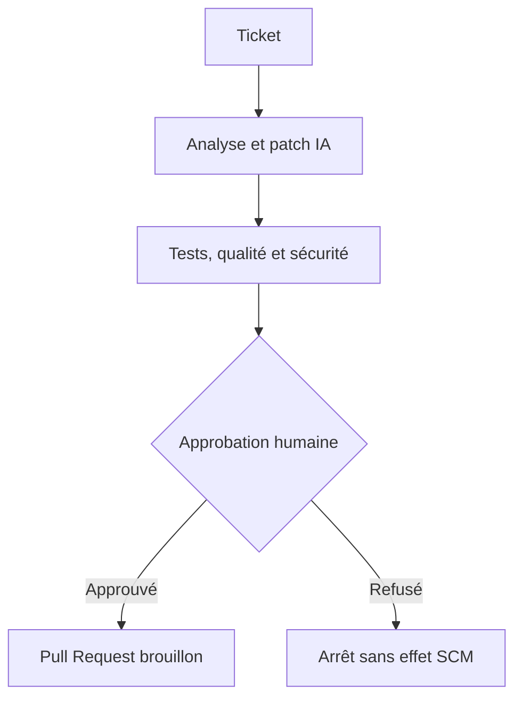
```mermaid
flowchart TB
  A[Ticket] --> B[Analyse et patch IA]
  B --> C[Tests, qualité et sécurité]
  C --> D{Approbation humaine}
  D -->|Approuvé| E[Pull Request brouillon]
  D -->|Refusé| F[Arrêt sans effet SCM]
```

### Valeur recherchée

| Enjeu | Réponse architecturale |
|---|---|
| Accélération | Planification et génération de patch assistées par LLM |
| Maîtrise du risque | Validation Git, tests, quality gate, SBOM, scan et revue |
| Traçabilité | Tâche, commit source, preuves, digests, tentative et PR corrélés |
| Responsabilité | Approbation humaine obligatoire avant écriture dans le SCM |
| Gouvernance agentique | Rôles, contrats JSON, permissions, budgets et fermeture en cas de doute |
| Réversibilité | Pipeline déterministe conservé comme baseline et chemin de rollback |

---

## 2. Périmètre fonctionnel

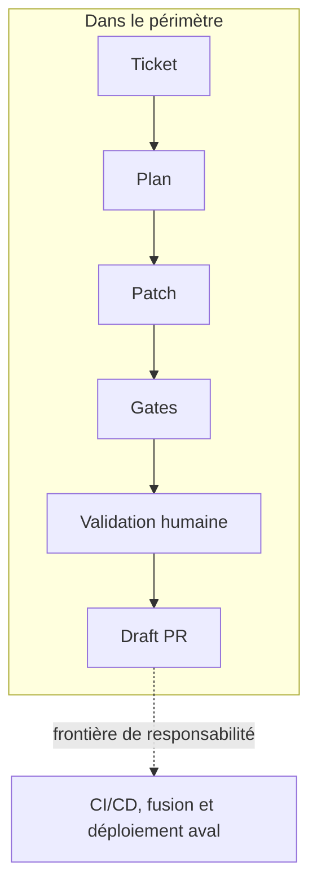
```mermaid
flowchart TB
  subgraph IN[Dans le périmètre]
    T[Ticket]
    P[Plan]
    PATCH[Patch]
    G[Gates]
    H[Validation humaine]
    PR[Draft PR]
    T --> P --> PATCH --> G --> H --> PR
  end

  PR -. frontière de responsabilité .-> OUT[CI/CD, fusion et déploiement aval]
```

### Pris en charge

- dépôts Maven, Gradle et npm ;
- analyse bornée du dépôt ;
- génération et réparation d’un diff unifié ;
- tests automatisés ;
- analyse SonarQube ;
- SBOM CycloneDX avec Syft ;
- analyse Trivy des vulnérabilités et secrets ;
- revue fondée sur les preuves ;
- branche, commit et Pull Request brouillon dans Gitea.

### Hors périmètre

- fusion automatique de la Pull Request ;
- pipeline CI/CD aval ;
- déploiement ou exploitation de l’application produite ;
- remédiation automatique d’un finding de sécurité ;
- environnement multi-tenant ou exposé en production.

---

## 3. Matrice de vérité de l’architecture

| Capacité | Présente dans le code | Active par défaut | Lecture architecturale |
|---|:---:|:---:|---|
| Pipeline déterministe | Oui | Oui | Chemin opérationnel de référence |
| Rôles Planner, Developer, Patch Repair, Tester, Reviewer | Oui | Oui | Agents logiques séquentiels du pipeline |
| Cinq serveurs MCP | Oui | Oui | Frontières techniques actives |
| Conteneurs sandbox Docker | Oui | Oui | Exécution locale non fiable, POC uniquement |
| Evidence MCP | Oui | Partiellement intégré | Stockage disponible, intégration durable à terminer |
| Temporal | Oui, démarré | Raccordement en cours | Socle préparé, sélecteur historique retiré |
| Task Memory PostgreSQL | Schémas préparés | Non | `InMemoryTaskMemory` reste actif |
| Supervisor et agents hiérarchiques | Oui | Non | Qualification `INCOMPLETE`, rôles actifs vides |
| Worktrees et intégration multi-patch | Oui | Non généralisé | Capacité du chemin hiérarchique |
| Backend sandbox GKE | Interface/adaptateur préparé | Non | Pas de contrôleur GKE opérationnel |
| Kill switch | Code présent | Non exploitable dans Compose | Fichier non monté et variable non transmise |

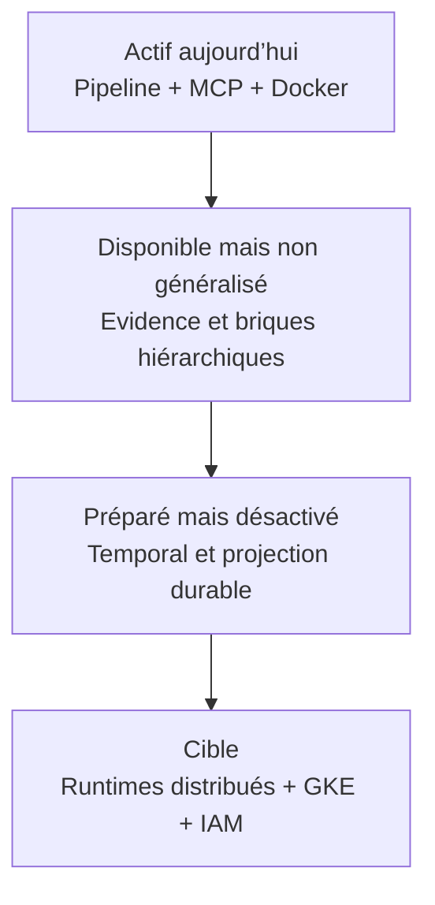
```mermaid
flowchart TB
  ACTIVE[Actif aujourd’hui<br/>Pipeline + MCP + Docker]
  READY[Disponible mais non généralisé<br/>Evidence et briques hiérarchiques]
  PREP[Préparé mais désactivé<br/>Temporal et projection durable]
  TARGET[Cible<br/>Runtimes distribués + GKE + IAM]

  ACTIVE --> READY --> PREP --> TARGET
```

La présence d’une classe, d’un schéma ou d’un conteneur ne constitue pas une preuve d’activation. La configuration,
le câblage runtime, la qualification et les preuves d’exploitation font foi.

---

## 4. Vue contexte

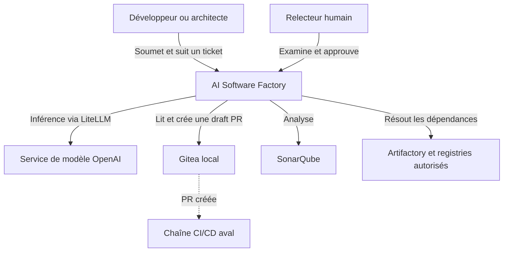
```mermaid
flowchart TB
  USER[Développeur ou architecte]
  REVIEWER[Relecteur humain]
  FACTORY[AI Software Factory]
  MODEL[Service de modèle OpenAI]
  SCM[Gitea local]
  QUALITY[SonarQube]
  ARTIFACTS[Artifactory et registries autorisés]
  DOWNSTREAM[Chaîne CI/CD aval]

  USER -->|Soumet et suit un ticket| FACTORY
  REVIEWER -->|Examine et approuve| FACTORY
  FACTORY -->|Inférence via LiteLLM| MODEL
  FACTORY -->|Lit et crée une draft PR| SCM
  FACTORY -->|Analyse| QUALITY
  FACTORY -->|Résout les dépendances| ARTIFACTS
  SCM -. PR créée .-> DOWNSTREAM
```

### Acteurs

| Acteur | Responsabilité |
|---|---|
| Demandeur | Formuler le besoin, le dépôt, la branche et les critères d’acceptation |
| Opérateur | Superviser le workflow, les dépendances, les files et incidents |
| Relecteur | Examiner les preuves et autoriser l’effet SCM |
| Propriétaires de rôles | Maintenir prompts, contrats, critères et jeux d’évaluation |
| Sécurité | Valider isolation, secrets, permissions, preuves et scans |

---

## 5. Vue conteneurs locale

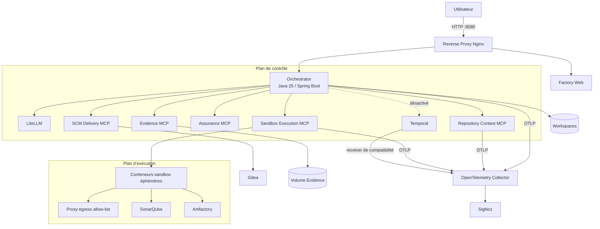
```mermaid
flowchart TB
  U[Utilisateur] -->|HTTP :8080| RP[Reverse Proxy Nginx]
  RP --> WEB[Factory Web]
  RP --> ORCH[Orchestrator<br/>Java 25 / Spring Boot]

  subgraph CONTROL[Plan de contrôle]
    ORCH --> LLM[LiteLLM]
    ORCH --> CTX[Repository Context MCP]
    ORCH --> SBX[Sandbox Execution MCP]
    ORCH --> ASS[Assurance MCP]
    ORCH --> EVD[Evidence MCP]
    ORCH --> SCM[SCM Delivery MCP]
    ORCH -. désactivé .-> TEMP[Temporal]
  end

  subgraph EXEC[Plan d’exécution]
    SBX --> JOB[Conteneurs sandbox éphémères]
    JOB --> EGRESS[Proxy egress allow-list]
    JOB --> SONAR[SonarQube]
    JOB --> ARTI[Artifactory]
  end

  SCM --> GITEA[Gitea]
  EVD --> EVOL[(Volume Evidence)]
  ORCH --> WS[(Workspaces)]
  ORCH -->|OTLP| OTEL[OpenTelemetry Collector]
  CTX -->|OTLP| OTEL
  SBX -->|OTLP| OTEL
  TEMP -->|receiver de compatibilité| OTEL
  OTEL --> SIGNOZ[SigNoz]
```

### Choix structurant

L’orchestrateur est un **monolithe modulaire**. Les agents sont des rôles internes à sa JVM. La séparation en
conteneurs concerne les capacités dont les frontières de confiance, les secrets ou le cycle d’exploitation sont
différents : contexte, sandbox, assurance, preuves et SCM.

Cette granularité limite la complexité distribuée du prototype tout en préparant des interfaces remplaçables.

---

## 6. Workflow actif

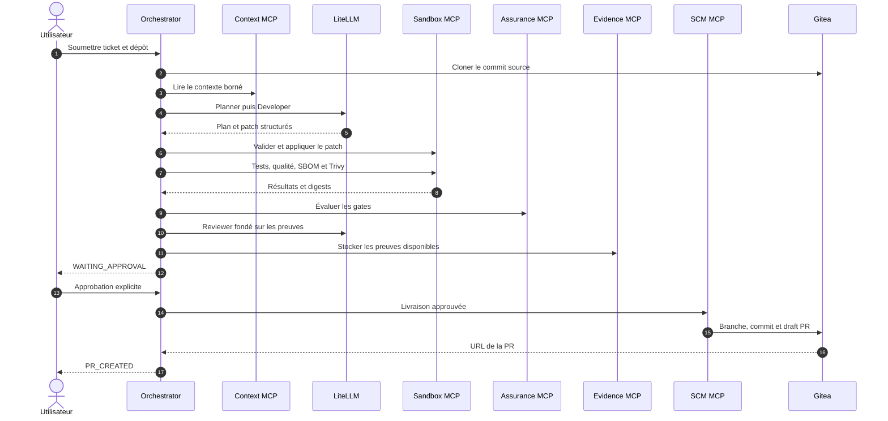
```mermaid
sequenceDiagram
  autonumber
  actor U as Utilisateur
  participant O as Orchestrator
  participant C as Context MCP
  participant L as LiteLLM
  participant S as Sandbox MCP
  participant A as Assurance MCP
  participant E as Evidence MCP
  participant M as SCM MCP
  participant G as Gitea

  U->>O: Soumettre ticket et dépôt
  O->>G: Cloner le commit source
  O->>C: Lire le contexte borné
  O->>L: Planner puis Developer
  L-->>O: Plan et patch structurés
  O->>S: Valider et appliquer le patch
  O->>S: Tests, qualité, SBOM et Trivy
  S-->>O: Résultats et digests
  O->>A: Évaluer les gates
  O->>L: Reviewer fondé sur les preuves
  O->>E: Stocker les preuves disponibles
  O-->>U: WAITING_APPROVAL
  U->>O: Approbation explicite
  O->>M: Livraison approuvée
  M->>G: Branche, commit et draft PR
  G-->>O: URL de la PR
  O-->>U: PR_CREATED
```

### Chaîne de contrôle

1. Le commit source est figé.
2. Le contexte est lu par un MCP read-only et borné.
3. Le modèle propose ; il ne choisit ni commande, ni image, ni réseau.
4. Le patch est normalisé et contrôlé avec Git.
5. Les tests et scans s’exécutent dans des profils sandbox immuables.
6. Les résultats déterministes précèdent la revue IA.
7. Une preuve absente, partielle ou incohérente bloque le workflow.
8. L’humain approuve avant toute création de branche ou PR.

---

## 7. Cycle de vie d’une tâche

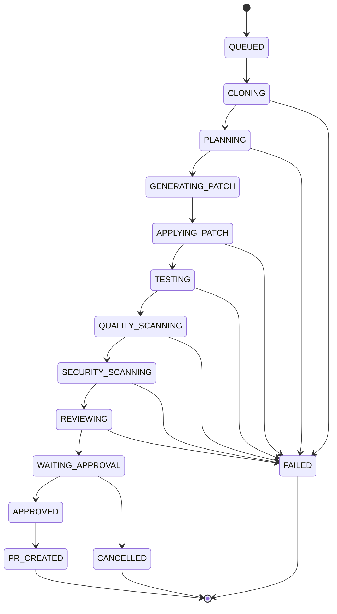
```mermaid
stateDiagram-v2
  [*] --> QUEUED
  QUEUED --> CLONING
  CLONING --> PLANNING
  PLANNING --> GENERATING_PATCH
  GENERATING_PATCH --> APPLYING_PATCH
  APPLYING_PATCH --> TESTING
  TESTING --> QUALITY_SCANNING
  QUALITY_SCANNING --> SECURITY_SCANNING
  SECURITY_SCANNING --> REVIEWING
  REVIEWING --> WAITING_APPROVAL
  WAITING_APPROVAL --> APPROVED
  APPROVED --> PR_CREATED
  WAITING_APPROVAL --> CANCELLED
  CLONING --> FAILED
  PLANNING --> FAILED
  APPLYING_PATCH --> FAILED
  TESTING --> FAILED
  QUALITY_SCANNING --> FAILED
  SECURITY_SCANNING --> FAILED
  REVIEWING --> FAILED
  PR_CREATED --> [*]
  CANCELLED --> [*]
  FAILED --> [*]
```

Limite actuelle : l’état API est porté par `InMemoryTaskMemory`. Un redémarrage de l’orchestrateur ne reconstruit
pas encore les tâches depuis Temporal, PostgreSQL et Evidence MCP.

---

## 8. Architecture logique multi-agent

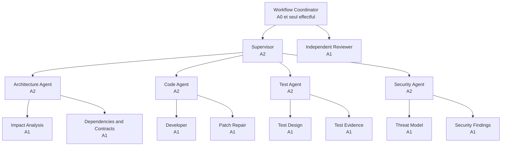
```mermaid
flowchart TB
  WF[Workflow Coordinator<br/>A0 et seul effectful]
  SUP[Supervisor<br/>A2]
  REV[Independent Reviewer<br/>A1]

  WF --> SUP
  WF --> REV

  SUP --> ARCH[Architecture Agent<br/>A2]
  SUP --> CODE[Code Agent<br/>A2]
  SUP --> TEST[Test Agent<br/>A2]
  SUP --> SEC[Security Agent<br/>A2]

  ARCH --> IMP[Impact Analysis<br/>A1]
  ARCH --> DEP[Dependencies and Contracts<br/>A1]
  CODE --> DEV[Developer<br/>A1]
  CODE --> FIX[Patch Repair<br/>A1]
  TEST --> DESIGN[Test Design<br/>A1]
  TEST --> TE[Test Evidence<br/>A1]
  SEC --> TM[Threat Model<br/>A1]
  SEC --> SF[Security Findings<br/>A1]
```

### Hiérarchie des agents, serveurs MCP et outils sous-jacents

Le diagramme suivant détaille la chaîne complète entre agents, outils MCP typés et backends techniques. Les
liens pleins depuis les agents représentent uniquement des lectures autorisées par l'hôte. Les actions à effet,
représentées en pointillés, restent déclenchées exclusivement par le `WorkflowCoordinator`.

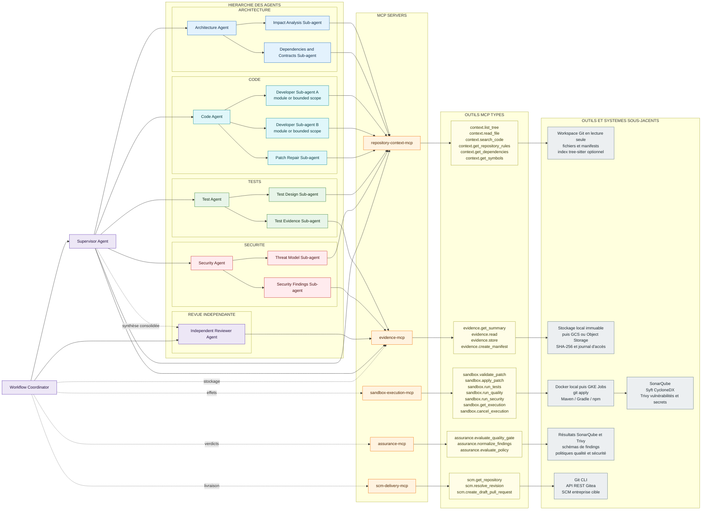
```mermaid
flowchart LR
  COORD[Workflow Coordinator]
  SUP[Supervisor Agent]

  COORD --> SUP

  subgraph AGENTS[HIERARCHIE DES AGENTS]
    direction TB

    subgraph A_ARCH[ARCHITECTURE]
      direction TB
      ARCH[Architecture Agent]
      IMPACT[Impact Analysis Sub-agent]
      CONTRACTS[Dependencies and Contracts Sub-agent]
      ARCH --> IMPACT
      ARCH --> CONTRACTS
    end

    subgraph A_CODE[CODE]
      direction TB
      CODE[Code Agent]
      DEV_A[Developer Sub-agent A<br/>module or bounded scope]
      DEV_B[Developer Sub-agent B<br/>module or bounded scope]
      REPAIR[Patch Repair Sub-agent]
      CODE --> DEV_A
      CODE --> DEV_B
      CODE --> REPAIR
    end

    subgraph A_TEST[TESTS]
      direction TB
      TEST[Test Agent]
      TEST_DESIGN[Test Design Sub-agent]
      TEST_EVIDENCE[Test Evidence Sub-agent]
      TEST --> TEST_DESIGN
      TEST --> TEST_EVIDENCE
    end

    subgraph A_SEC[SECURITE]
      direction TB
      SECURITY[Security Agent]
      THREAT[Threat Model Sub-agent]
      FINDINGS[Security Findings Sub-agent]
      SECURITY --> THREAT
      SECURITY --> FINDINGS
    end

    subgraph A_REVIEW[REVUE INDEPENDANTE]
      direction TB
      REVIEW[Independent Reviewer Agent]
    end
  end

  SUP --> ARCH
  SUP --> CODE
  SUP --> TEST
  SUP --> SECURITY
  SUP -. synthèse consolidée .-> REVIEW
  COORD --> REVIEW

  subgraph MCP[MCP SERVERS]
    direction TB
    CTX_MCP[repository-context-mcp]
    EVI_MCP[evidence-mcp]
    SBX_MCP[sandbox-execution-mcp]
    ASS_MCP[assurance-mcp]
    SCM_MCP[scm-delivery-mcp]
  end

  subgraph TOOLS[OUTILS MCP TYPES]
    direction TB
    CTX_TOOLS[context.list_tree<br/>context.read_file<br/>context.search_code<br/>context.get_repository_rules<br/>context.get_dependencies<br/>context.get_symbols]
    EVI_TOOLS[evidence.get_summary<br/>evidence.read<br/>evidence.store<br/>evidence.create_manifest]
    SBX_TOOLS[sandbox.validate_patch<br/>sandbox.apply_patch<br/>sandbox.run_tests<br/>sandbox.run_quality<br/>sandbox.run_security<br/>sandbox.get_execution<br/>sandbox.cancel_execution]
    ASS_TOOLS[assurance.evaluate_quality_gate<br/>assurance.normalize_findings<br/>assurance.evaluate_policy]
    SCM_TOOLS[scm.get_repository<br/>scm.resolve_revision<br/>scm.create_draft_pull_request]
  end

  subgraph BACKENDS[OUTILS ET SYSTEMES SOUS-JACENTS]
    direction TB
    CTX_BACKEND[Workspace Git en lecture seule<br/>fichiers et manifests<br/>index tree-sitter optionnel]
    EVI_BACKEND[Stockage local immuable<br/>puis GCS ou Object Storage<br/>SHA-256 et journal d'accès]
    SBX_BACKEND[Docker local puis GKE Jobs<br/>git apply<br/>Maven / Gradle / npm]
    ASS_BACKEND[Résultats SonarQube et Trivy<br/>schémas de findings<br/>politiques qualité et sécurité]
    SCM_BACKEND[Git CLI<br/>API REST Gitea<br/>SCM entreprise cible]
    SCANNERS[SonarQube<br/>Syft CycloneDX<br/>Trivy vulnérabilités et secrets]
  end

  IMPACT --> CTX_MCP
  CONTRACTS --> CTX_MCP
  DEV_A --> CTX_MCP
  DEV_B --> CTX_MCP
  REPAIR --> CTX_MCP
  TEST_DESIGN --> CTX_MCP
  THREAT --> CTX_MCP
  SUP --> CTX_MCP

  TEST_EVIDENCE --> EVI_MCP
  FINDINGS --> EVI_MCP
  REVIEW --> EVI_MCP
  SUP --> EVI_MCP

  COORD -. effets .-> SBX_MCP
  COORD -. verdicts .-> ASS_MCP
  COORD -. stockage .-> EVI_MCP
  COORD -. livraison .-> SCM_MCP

  CTX_MCP --> CTX_TOOLS --> CTX_BACKEND
  EVI_MCP --> EVI_TOOLS --> EVI_BACKEND
  SBX_MCP --> SBX_TOOLS --> SBX_BACKEND
  SBX_BACKEND --> SCANNERS
  ASS_MCP --> ASS_TOOLS --> ASS_BACKEND
  SCM_MCP --> SCM_TOOLS --> SCM_BACKEND

  classDef control fill:#ede7f6,stroke:#5e35b1,color:#24143f;
  classDef architecture fill:#e3f2fd,stroke:#1565c0,color:#0d2b45;
  classDef code fill:#e0f7fa,stroke:#00838f,color:#06383d;
  classDef tests fill:#e8f5e9,stroke:#2e7d32,color:#102a12;
  classDef security fill:#ffebee,stroke:#c62828,color:#4a1111;
  classDef mcp fill:#fff3e0,stroke:#ef6c00,color:#4d2400;
  classDef tool fill:#fffde7,stroke:#9e9d24,color:#363609;
  classDef backend fill:#eceff1,stroke:#546e7a,color:#1c282e;

  class COORD,SUP,REVIEW control;
  class ARCH,IMPACT,CONTRACTS architecture;
  class CODE,DEV_A,DEV_B,REPAIR code;
  class TEST,TEST_DESIGN,TEST_EVIDENCE tests;
  class SECURITY,THREAT,FINDINGS security;
  class CTX_MCP,EVI_MCP,SBX_MCP,ASS_MCP,SCM_MCP mcp;
  class CTX_TOOLS,EVI_TOOLS,SBX_TOOLS,ASS_TOOLS,SCM_TOOLS tool;
  class CTX_BACKEND,EVI_BACKEND,SBX_BACKEND,ASS_BACKEND,SCM_BACKEND,SCANNERS backend;
```

### Règles d’autorité

- `A0` : composant déterministe ;
- `A1` : analyse et demandes de lecture allow-listées ;
- `A2` : proposition de délégations bornées, validées par l’hôte ;
- aucun agent ne dispose d’une autonomie supérieure à `A2` ;
- seul le workflow peut appliquer un patch, lancer les gates, écrire une preuve autoritative ou créer une PR ;
- l’Independent Reviewer dépend du workflow et non du Supervisor afin de préserver son indépendance ;
- le rôle provient de l’identité du workflow, jamais d’une réponse du modèle.

### Réalité de déploiement

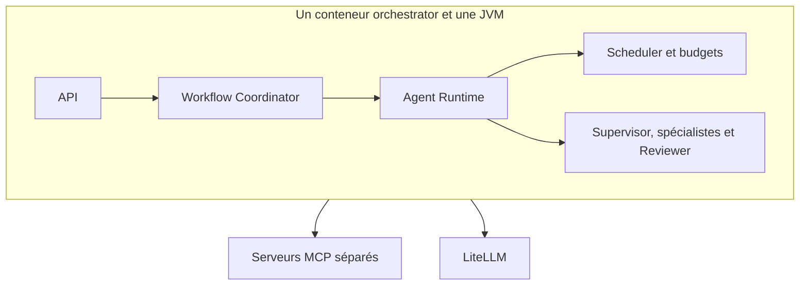
```mermaid
flowchart TB
  subgraph JVM[Un conteneur orchestrator et une JVM]
    API[API]
    COORD[Workflow Coordinator]
    RT[Agent Runtime]
    DAG[Scheduler et budgets]
    ROLES[Supervisor, spécialistes et Reviewer]

    API --> COORD --> RT
    RT --> DAG
    RT --> ROLES
  end

  JVM --> MCP[Serveurs MCP séparés]
  JVM --> LLM[LiteLLM]
```

Il n’existe pas un microservice par agent. Les rectangles de la hiérarchie représentent des responsabilités et des
contrats, pas des unités de déploiement.

---

## 9. DAG, parallélisme et consolidation

Le Supervisor propose un graphe orienté acyclique. L’hôte vérifie rôles, dépendances, scopes, contrats et budgets
avant toute exécution.

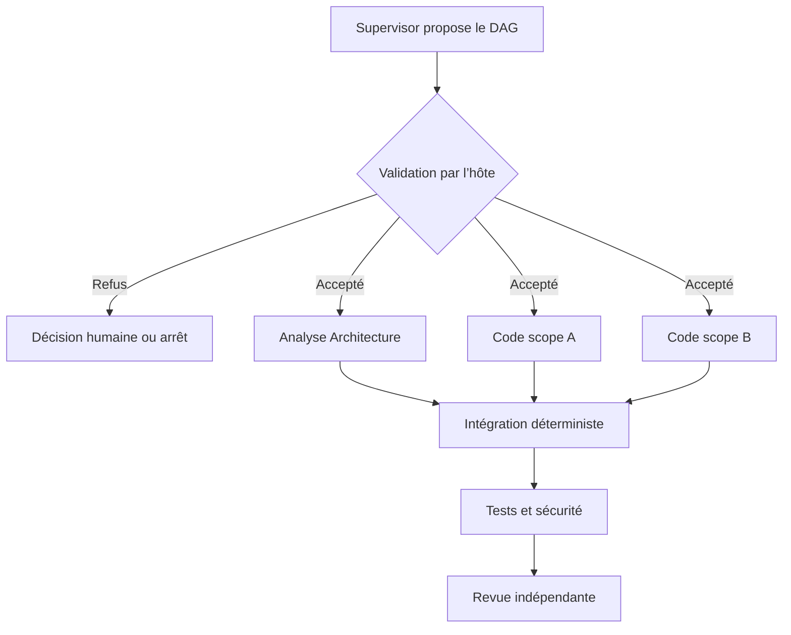
```mermaid
flowchart TB
  S[Supervisor propose le DAG] --> V{Validation par l’hôte}
  V -->|Refus| H[Décision humaine ou arrêt]
  V -->|Accepté| A[Analyse Architecture]
  V -->|Accepté| C1[Code scope A]
  V -->|Accepté| C2[Code scope B]
  A --> I[Intégration déterministe]
  C1 --> I
  C2 --> I
  I --> T[Tests et sécurité]
  T --> R[Revue indépendante]
```

Contraintes par défaut : profondeur maximale `2`, fan-out maximal `4`, et deux Developers parallèles uniquement
sur des scopes démontrés disjoints. Une collision, une contradiction non résolue ou un dépassement de budget
entraîne un replan borné, une décision humaine ou un retour au pipeline.

---

## 10. Frontières MCP

| Serveur | Nature | Capacités principales | Effet direct |
|---|---|---|:---:|
| Repository Context | Lecture | arbre, fichiers, recherche, règles, dépendances, symboles optionnels | Non |
| Sandbox Execution | Exécution | patch, tests, qualité, sécurité, suivi et annulation | Oui, via workflow |
| Assurance | Décision déterministe | quality gate, findings et politiques | Oui, via workflow |
| Evidence | Preuve | stockage, manifeste, résumé et lecture auditée | Oui, via workflow |
| SCM Delivery | Livraison | dépôt, révision et draft PR | Oui, via workflow |

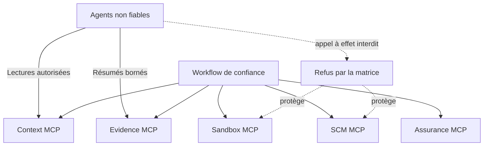
```mermaid
flowchart TB
  AG[Agents non fiables] -->|Lectures autorisées| CTX[Context MCP]
  AG -->|Résumés bornés| EVD[Evidence MCP]

  WF[Workflow de confiance] --> CTX
  WF --> SBX[Sandbox MCP]
  WF --> ASS[Assurance MCP]
  WF --> EVD
  WF --> SCM[SCM MCP]

  AG -. appel à effet interdit .-> DENY[Refus par la matrice]
  DENY -. protège .-> SBX
  DENY -. protège .-> SCM
```

Chaque appel contrôle protocole, nom et version du serveur, audience, outil, taille de réponse, contexte de tâche et
contrat JSON. Une panne MCP ne déclenche pas de fallback direct.

---

## 11. Exécution du code non fiable

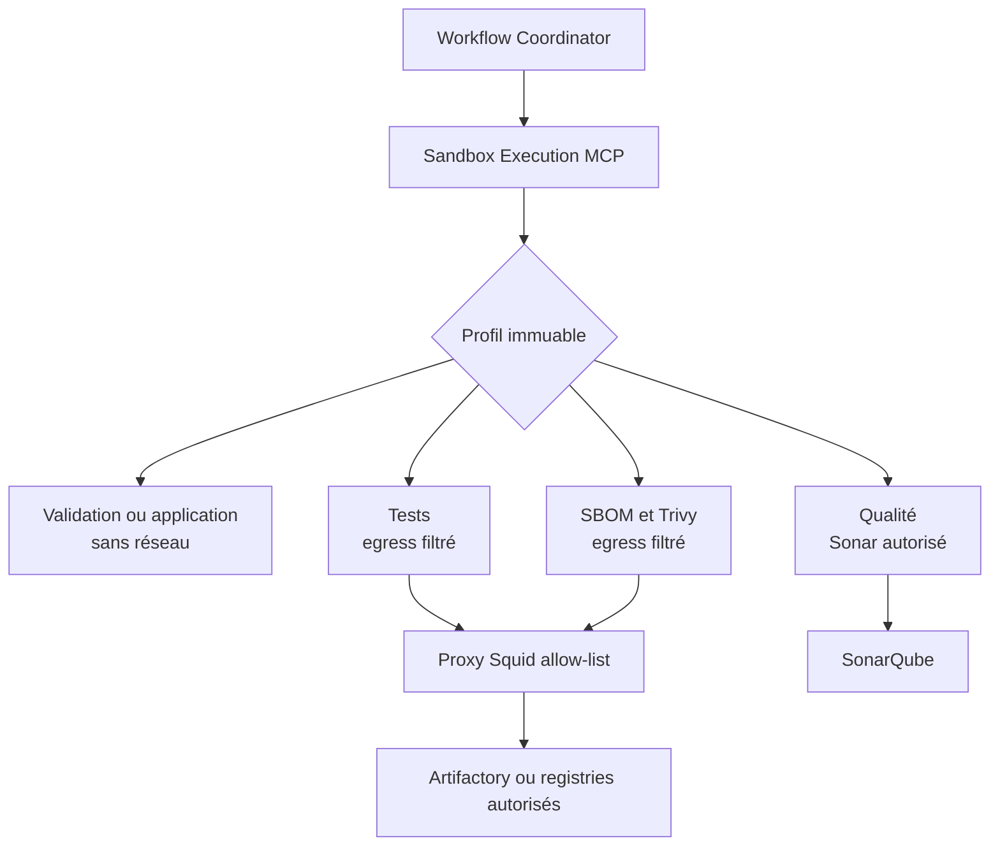
```mermaid
flowchart TB
  ORCH[Workflow Coordinator] --> MCP[Sandbox Execution MCP]
  MCP --> PROFILE{Profil immuable}
  PROFILE --> PATCH[Validation ou application<br/>sans réseau]
  PROFILE --> TEST[Tests<br/>egress filtré]
  PROFILE --> QUALITY[Qualité<br/>Sonar autorisé]
  PROFILE --> SECURITY[SBOM et Trivy<br/>egress filtré]

  TEST --> PROXY[Proxy Squid allow-list]
  QUALITY --> SONAR[SonarQube]
  SECURITY --> PROXY
  PROXY --> ART[Artifactory ou registries autorisés]
```

| Profil | Timeout | Réseau |
|---|---:|---|
| Validation du patch | 3 min | Aucun |
| Application du patch | 3 min | Aucun |
| Tests Maven, Gradle ou npm | 15 min | Artifactory + egress filtré |
| Qualité SonarQube | 15 min | Réseau qualité dédié |
| SBOM et scan Trivy | 10 min | Egress filtré |

Chaque job est plafonné à 2 CPU, 2 Gio et 512 PID, sans capability Linux et avec
`no-new-privileges`. L’appelant ne fournit jamais de commande shell, d’image, de volume, de réseau ou de variable
d’environnement arbitraire.

Le mode local s'appuie sur des runners Compose statiques sans accès au daemon Docker. Ils restent moins isolés que
les Jobs GKE/gVisor et sont donc réservés au développement local. Le backend partagé applique RBAC, Pod Security,
quotas, images par digest et politiques réseau dans un namespace dédié.

---

## 12. Modèle de confiance

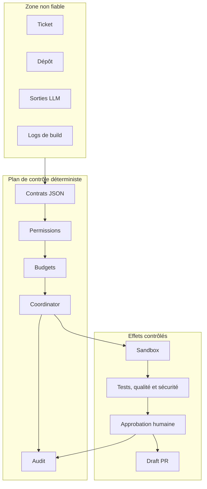
```mermaid
flowchart TB
  subgraph U[Zone non fiable]
    T[Ticket]
    R[Dépôt]
    L[Sorties LLM]
    LOG[Logs de build]
  end

  subgraph C[Plan de contrôle déterministe]
    SCHEMA[Contrats JSON]
    PERM[Permissions]
    BUDGET[Budgets]
    COORD[Coordinator]
    AUDIT[Audit]
  end

  subgraph E[Effets contrôlés]
    SBX[Sandbox]
    GATE[Tests, qualité et sécurité]
    APPROVE[Approbation humaine]
    PR[Draft PR]
  end

  U --> SCHEMA --> PERM --> BUDGET --> COORD
  COORD --> SBX --> GATE --> APPROVE --> PR
  COORD --> AUDIT
  APPROVE --> AUDIT
```

### Invariants

1. Le modèle ne devient jamais autorité parce que sa sortie est bien formée.
2. Les permissions sont deny-by-default et attachées au rôle réel.
3. Les actions à effet restent la responsabilité du workflow.
4. Un gate incomplet ou indéterminé est un échec.
5. Une approbation est liée au commit, au patch et aux preuves.
6. Une action à issue inconnue est réconciliée, jamais répétée à l’aveugle.
7. Le mode shadow n’influence pas le résultat du pipeline de référence.

---

## 13. Données, état et preuves

### Cible d’autorité

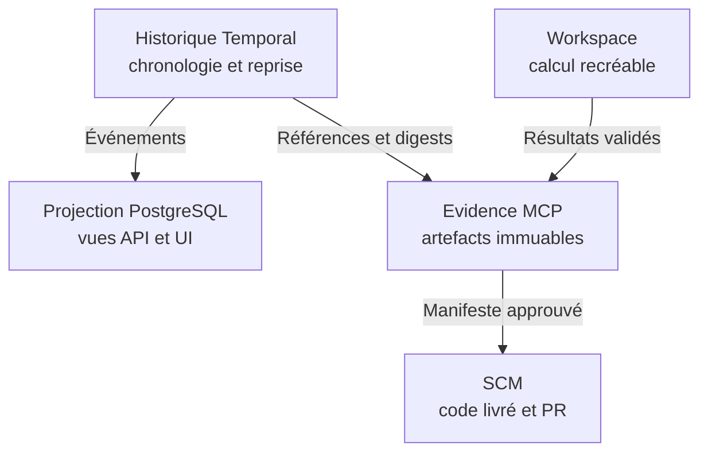
```mermaid
flowchart TB
  TEMP[Historique Temporal<br/>chronologie et reprise]
  PG[Projection PostgreSQL<br/>vues API et UI]
  EVD[Evidence MCP<br/>artefacts immuables]
  WS[Workspace<br/>calcul recréable]
  SCM[SCM<br/>code livré et PR]

  TEMP -->|Événements| PG
  TEMP -->|Références et digests| EVD
  WS -->|Résultats validés| EVD
  EVD -->|Manifeste approuvé| SCM
```

| Donnée | Autorité cible | Situation actuelle |
|---|---|---|
| Chronologie, timers, signaux et DAG | Temporal | Désactivé pour le parcours public |
| Vue API/UI | Projection PostgreSQL | Non câblée ; mémoire JVM active |
| Plans, patches, scans, reviews | Evidence MCP | Disponible, intégration à compléter |
| Travail temporaire | Workspace/worktree | Volume local ; jamais source d’autorité |
| Commit et PR | SCM | Gitea actif |

La cible applique une séparation CQRS pragmatique : historique Temporal pour la reprise, projection PostgreSQL
reconstruisible pour la lecture et stockage Evidence pour les artefacts. Le POC ne réalise pas encore cette chaîne
de bout en bout.

---

## 14. Réseaux et isolation

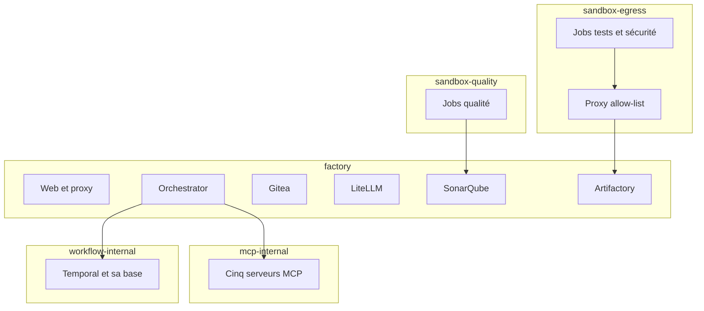
```mermaid
flowchart TB
  subgraph FACTORY[factory]
    WEB[Web et proxy]
    ORCH[Orchestrator]
    GIT[Gitea]
    LLM[LiteLLM]
    SONAR[SonarQube]
    ART[Artifactory]
  end

  subgraph MCPNET[mcp-internal]
    MCP[Cinq serveurs MCP]
  end

  subgraph WFNET[workflow-internal]
    TEMP[Temporal et sa base]
  end

  subgraph SNET[sandbox-egress]
    TESTS[Jobs tests et sécurité]
    PX[Proxy allow-list]
  end

  subgraph QNET[sandbox-quality]
    QUALITY[Jobs qualité]
  end

  ORCH --> MCP
  ORCH --> TEMP
  TESTS --> PX
  QUALITY --> SONAR
  PX --> ART
```

Les réseaux MCP, workflow et sandbox sont déclarés `internal: true`. Les jobs ne rejoignent pas le réseau de
contrôle MCP. Le profil qualité obtient SonarQube en plus des dépendances autorisées.

---

## 15. Observabilité et exploitabilité

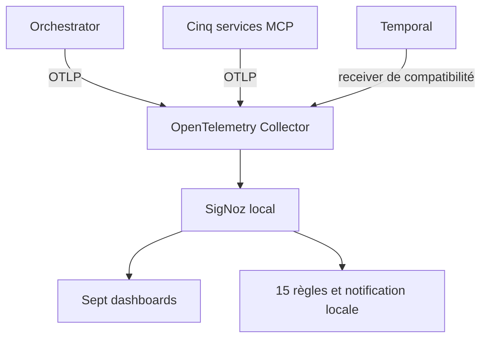
```mermaid
flowchart TB
  ORCH[Orchestrator] -->|OTLP| OTEL[OpenTelemetry Collector]
  MCP[Cinq services MCP] -->|OTLP| OTEL
  TEMP[Temporal] -->|receiver de compatibilité| OTEL
  OTEL --> SIGNOZ[SigNoz local]
  SIGNOZ --> DASH[Sept dashboards]
  SIGNOZ --> RULES[15 règles et notification locale]
```

### État courant

- métriques, traces et logs des six applications exportés par OTLP ;
- sept dashboards : Orchestrator, Supervisor, Agents, Temporal, MCP, Sandbox et Collector ;
- neuf alertes métier, six alertes techniques et notification locale de qualification ;
- stockage SigNoz persistant avec rétention bornée ;
- redaction des attributs sensibles et stdout de secours ;
- SLO MCP proposés, encore à approuver après une campagne suffisamment longue.

La solution est observable pour le développement, mais pas encore exploitable avec un engagement de service.

---

## 16. Budgets et garde-fous

| Niveau | Limite par défaut |
|---|---:|
| DAG | profondeur 2, fan-out 4, chemin critique 2 700 s |
| Délégation | 6 tours, 12 000 tokens, 900 s, 24 appels outil |
| Tâche hiérarchique | 60 tours, 80 000 tokens planifiés, 208 appels outil |
| Réponse MCP | 65 536 octets |
| Appels MCP simultanés | 32 globaux, 16/serveur, 4/tâche, 8/rôle |
| Jobs sandbox | 2 actifs, 32 en attente, 2 actifs par tâche |
| Patch | 1 Mio maximum |
| Sortie sandbox | 65 536 caractères conservés |

Le dépassement d’un budget arrête ou refuse l’opération. Il n’augmente jamais silencieusement la capacité. Les
budgets sont contrôlés par l’hôte, non par les agents.

---

## 17. Décisions d’architecture majeures

| Décision | Bénéfice | Contrepartie |
|---|---|---|
| Monolithe modulaire pour les rôles | Simplicité et débogage local | Isolation et scalabilité des rôles limitées |
| MCP par frontière de capacité | Contrats stables et moindre privilège | Plus de services et de compatibilité à gérer |
| Pipeline déterministe comme baseline | Comparaison et rollback sûrs | Deux chemins à maintenir pendant la transition |
| Approche evidence-first | Audit et décisions vérifiables | Gestion du cycle de vie et des clés indispensable |
| Human-in-the-loop avant SCM | Responsabilité explicite | Latence humaine dans le workflow |
| Sandbox à profils fixes | Réduction de la surface d’attaque | Moins de flexibilité pour les projets atypiques |
| Temporal comme cible durable | Reprise et coordination longue | Versionnement de workflow complexe |
| Contrats JSON fermés | Validation et compatibilité | Discipline de versionnement obligatoire |

---

## 18. Principaux risques et dettes

| Risque | Impact | Traitement attendu |
|---|---|---|
| Secret-like `.env.delete` suivi dans Git | Compromission potentielle | Rotation, suppression et purge contrôlée de l’historique |
| Socket Docker dans Sandbox MCP | Compromission de l’hôte | Remplacement par Jobs GKE isolés |
| Mémoire des tâches en JVM | Perte d’état au redémarrage | Temporal + projection durable câblés |
| MCP sans authentification forte | Usurpation latérale si exposition | mTLS, identité workload et autorisation |
| Pas de SSO/RBAC/multi-tenant | Accès non maîtrisé | IAP/SSO, RBAC/ABAC et quotas par identité |
| Secrets en fichiers locaux | Fuite et rotation fragile | Secret Manager et identités sans clé |
| Kill switch non monté | Confinement fin indisponible | Montage read-only, mise à jour atomique et test opérateur |
| Supervision incomplète | Incident non détecté | Persistance, scrapes complets et Alertmanager |
| Images partiellement non épinglées | Dérive de supply chain | Digests immuables, provenance et signature |
| Absence de HA/PRA validé | Interruption et perte locale | Architecture redondée et exercices de reprise |

Ces écarts bloquent un usage d’entreprise exposé. Le prototype doit rester local ou dans une zone de démonstration
isolée.

---

## 19. Cible d’industrialisation GCP

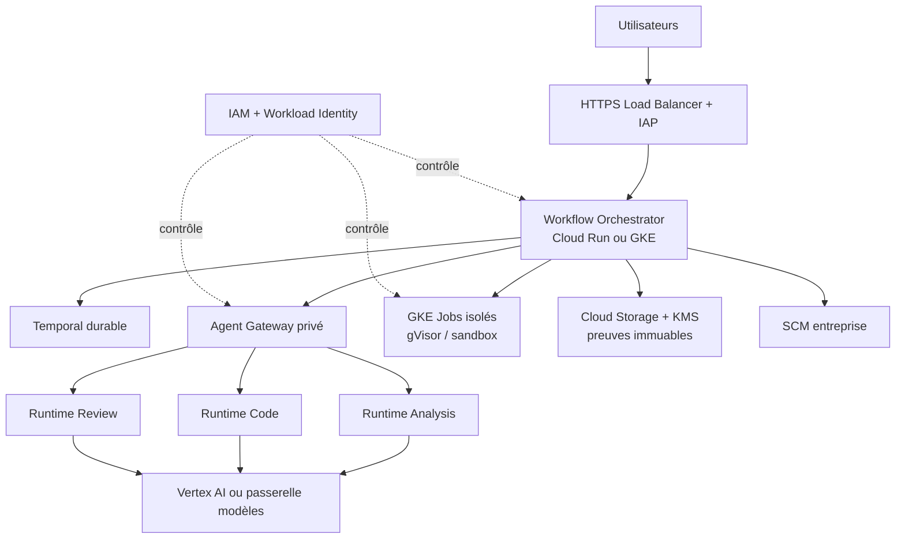
```mermaid
flowchart TB
  USER[Utilisateurs] --> EDGE[HTTPS Load Balancer + IAP]
  EDGE --> ORCH[Workflow Orchestrator<br/>Cloud Run ou GKE]
  ORCH --> TEMP[Temporal durable]
  ORCH --> GW[Agent Gateway privé]

  GW --> ANA[Runtime Analysis]
  GW --> CODE[Runtime Code]
  GW --> REV[Runtime Review]
  ANA --> MODEL[Vertex AI ou passerelle modèles]
  CODE --> MODEL
  REV --> MODEL

  ORCH --> JOBS[GKE Jobs isolés<br/>gVisor / sandbox]
  ORCH --> EVD[Cloud Storage + KMS<br/>preuves immuables]
  ORCH --> SCM[SCM entreprise]

  IAM[IAM + Workload Identity] -. contrôle .-> ORCH
  IAM -. contrôle .-> GW
  IAM -. contrôle .-> JOBS
```

### Granularité cible recommandée

| Module | Contenu |
|---|---|
| `workflow-orchestrator` | API, Temporal, Supervisor, DAG, budgets et effets |
| `agent-gateway` | Authentification, registre, routage, versions et quotas |
| `agent-runtime-analysis` | Architecture, Tests et analyses Sécurité read-only |
| `agent-runtime-code` | Developer et Patch Repair, sans application directe |
| `agent-runtime-review` | Independent Reviewer avec chaîne indépendante |
| `sandbox-jobs` | Compilations, tests et scans dans GKE |

L’extraction n’est justifiée que par une frontière réelle de sécurité, de disponibilité, de charge, de résidence
des données, de réutilisation ou de gouvernance. Un service par sous-agent serait une granularité excessive.

---

## 20. Trajectoire de transformation

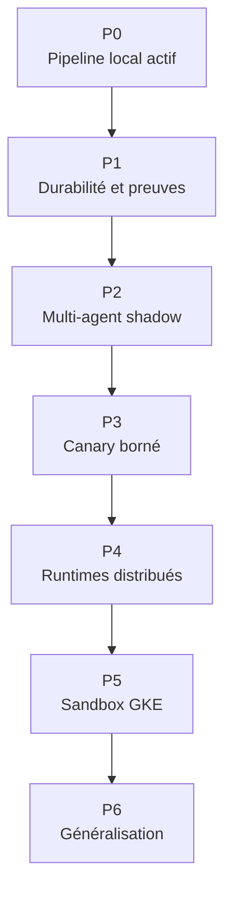
```mermaid
flowchart TB
  P0[P0<br/>Pipeline local actif]
  P1[P1<br/>Durabilité et preuves]
  P2[P2<br/>Multi-agent shadow]
  P3[P3<br/>Canary borné]
  P4[P4<br/>Runtimes distribués]
  P5[P5<br/>Sandbox GKE]
  P6[P6<br/>Généralisation]

  P0 --> P1 --> P2 --> P3 --> P4 --> P5 --> P6
```

### Paliers

1. **Sécuriser le POC** : rotation des secrets, sauvegarde SigNoz et kill switch exploitable.
2. **Rendre l’état durable** : Temporal actif, projection PostgreSQL reconstruisible, Evidence de bout en bout.
3. **Qualifier en shadow** : corpus apparié, télémétrie qualité/coût/latence/sécurité et aucun effet.
4. **Ouvrir un canary** : rôles et dépôts allow-listés, rollback testé et supervision active.
5. **Extraire par pool** : contrats d’invocation, identité et observabilité propres.
6. **Déporter la sandbox** : Jobs GKE, réseau deny-by-default et suppression du socket Docker.
7. **Généraliser** : SLO, HA, PRA, conformité et gouvernance des changements.

---

## 21. Promotion des modes

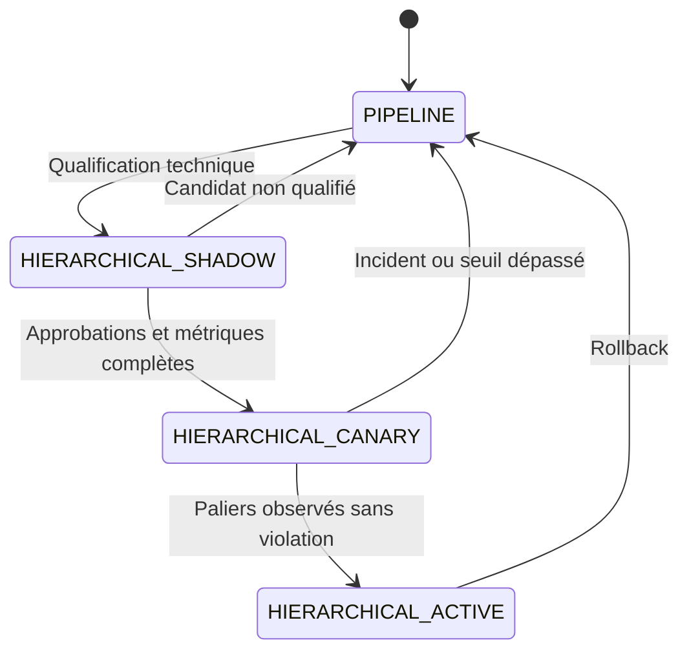
```mermaid
stateDiagram-v2
  [*] --> PIPELINE
  PIPELINE --> HIERARCHICAL_SHADOW: Qualification technique
  HIERARCHICAL_SHADOW --> HIERARCHICAL_CANARY: Approbations et métriques complètes
  HIERARCHICAL_CANARY --> HIERARCHICAL_ACTIVE: Paliers observés sans violation
  HIERARCHICAL_ACTIVE --> PIPELINE: Rollback
  HIERARCHICAL_CANARY --> PIPELINE: Incident ou seuil dépassé
  HIERARCHICAL_SHADOW --> PIPELINE: Candidat non qualifié
```

Le passage de palier est toujours explicite. Un changement de modèle, prompt, contrat, outil ou politique invalide
la qualification en cours. Toute violation d’isolation, preuve invalide, effet non autorisé ou gate déterministe
échoué impose le rollback.

---

## 22. Questions à soumettre au comité d’architecture

1. Le niveau de risque autorise-t-il encore une sandbox Docker avec accès au socket sur un hôte isolé ?
2. Quelle source d’autorité durable retient-on pour l’état, les événements et les preuves ?
3. Quels agents justifient réellement une extraction en runtime autonome ?
4. Quel service SCM, qualité et artefacts d’entreprise doit remplacer les briques locales ?
5. Quels dépôts, niveaux de sensibilité et classes de changement sont éligibles ?
6. Quel SLO et quel budget de coût par tâche sont acceptables ?
7. Quelle identité humaine ou workload peut approuver et déclencher chaque effet ?
8. Quelle politique de résidence, rétention, legal hold et purge appliquer aux preuves ?
9. Quel plan de rollback maintient une baseline compatible pendant la transition ?
10. Quelles preuves sont nécessaires avant de passer de shadow à canary puis active ?

---

## 23. Conclusion

Le prototype démontre une architecture cohérente pour une Software Factory IA gouvernée : le LLM propose, les
contrats bornent, les MCP séparent les capacités, la sandbox exécute, les gates décident et l’humain autorise
l’effet SCM.

Sa force principale est de ne pas confondre autonomie cognitive et autorité technique. Sa limite principale est
l’écart entre les capacités préparées et leur intégration opérationnelle : état encore volatil, sandbox locale à
fort privilège, identité insuffisante et supervision non complète.

La trajectoire recommandée consiste à fiabiliser d’abord le plan de contrôle et les preuves, qualifier ensuite le
multi-agent en shadow, puis distribuer seulement les runtimes dont la séparation apporte une valeur mesurable.

---

## Références

- [README du projet](../../README.md)
- [Rétrodocumentation](current-state.md)
- [Architecture multi-agent hiérarchique](../archive/releases/1.2.0-archi-04/cible-architecture-multi-agent-hierarchique.md)
- [État du prototype 1.2.0](../archive/releases/1.2.0-archi-04/ETAT-PROTO-1.2.0.md)
- [Catalogue des agents](../architecture/agents/CATALOGUE-AGENTS-V1.md)
- [Guide de maintenance et d’exploitation](../operations/maintenance.md)
- [Runbooks](../operations/runbooks/README.md)
- [Configuration Compose](../../infrastructure/compose.yaml)
