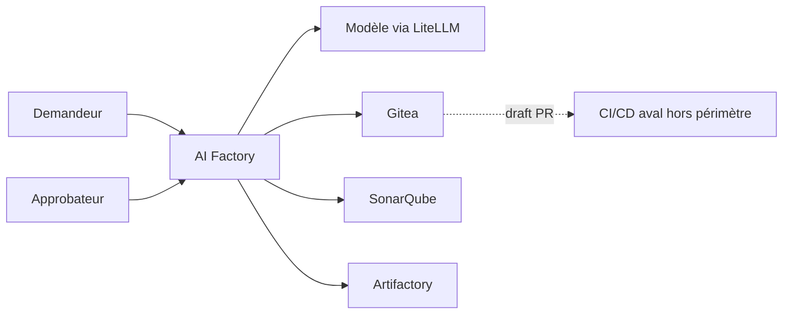
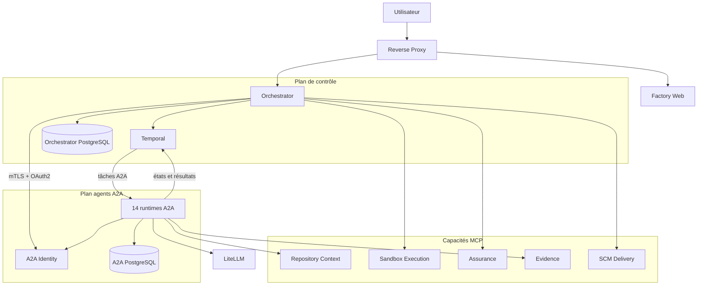
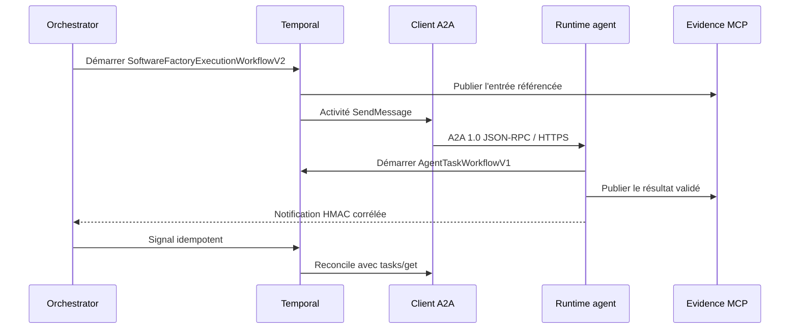
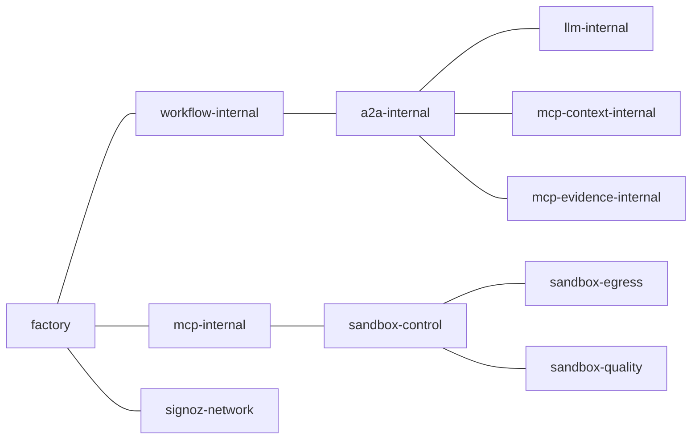
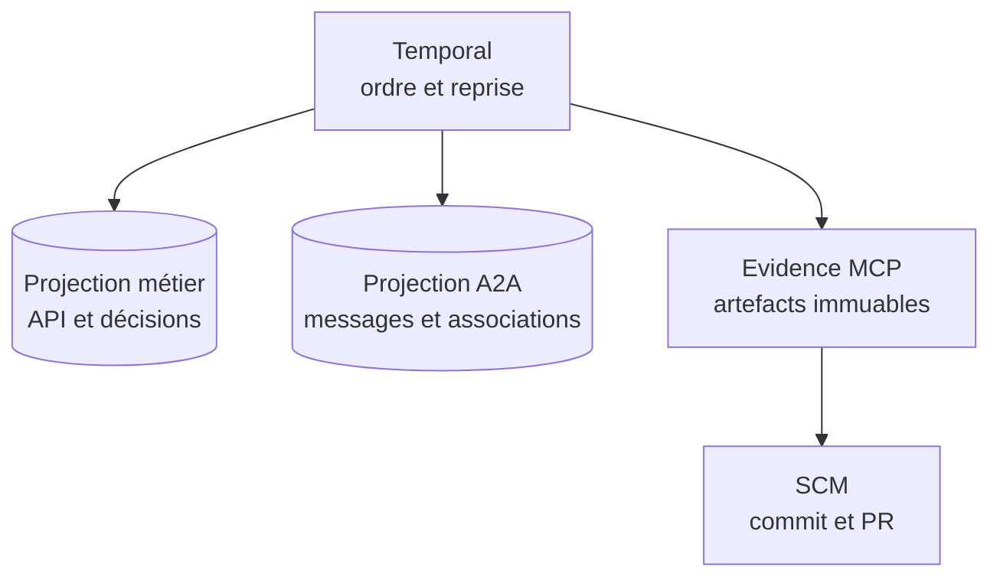
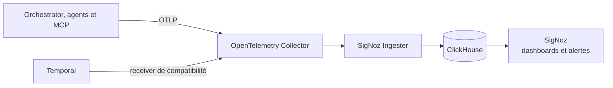

# Architecture de l'AI Factory locale

| Référence | Valeur |
|---|---|
| Branche | `features/multiagents` |
| État revu | 7 septembre 2026 |
| Déploiement livré | Docker Compose local |
| Frontière fonctionnelle | Ticket jusqu'à la Pull Request brouillon |

## Principes structurants

1. Temporal est l'unique plan de contrôle durable.
2. A2A 1.0 est l'unique protocole d'invocation des quatorze agents.
3. MCP est l'unique frontière d'accès aux outils.
4. Evidence MCP conserve les artefacts ; Temporal et A2A ne portent que des références digestées.
5. Seul le workflow déclenche les opérations à effet.
6. La livraison SCM requiert une approbation humaine liée au manifeste exact.
7. Toute dépendance critique indisponible ferme les admissions.

## Vue de contexte

La Factory prépare et livre une proposition révisable. Elle ne fusionne pas la Pull Request et ne déploie pas
l'application produite.

## Vue conteneurs locale

L'image du runtime est commune, mais le processus, le rôle, l'identité, la task queue et les réseaux sont distincts.
Cette séparation limite le blast radius et rend les permissions auditables par rôle.

## Coordination Temporal et transport A2A

La notification accélère la convergence ; elle n'est pas l'autorité. Après un timeout ou une réponse inconnue,
le workflow réconcilie la tâche A2A persistée avant tout retry.

## Frontières de confiance

| Frontière | Contrôles actifs |
|---|---|
| Utilisateur → API | validation des requêtes et admission globale ; SSO/RBAC encore à ajouter |
| Orchestrateur → agent | origine allow-listée, carte JWS, OAuth2, mTLS, audience et rôle |
| Agent → Temporal | namespace et task queue dédiés, Build ID activé |
| Agent → MCP | réseau et capacités bornés par rôle |
| Orchestrateur → MCP à effet | contrats fermés, idempotence, gates et timeouts |
| Sandbox → dépendances | profils statiques, proxy allow-listé, limites et aucun socket Docker |
| Workflow → SCM | manifeste approuvé, digest, tentative et identité humaine |

## Réseaux

Le diagramme montre les relations nécessaires, pas un réseau plat : les bridges internes restent séparés dans
Compose. Les rôles ne rejoignent que les réseaux MCP correspondant à leurs capacités.

## Données et preuves

Les quatre autorités sont complémentaires. La projection métier peut être reconstruite depuis l'historique et les
preuves ; elle n'autorise jamais à rejouer aveuglément un effet dont l'issue est inconnue.

## Exécution sandbox

Le Sandbox MCP n'accède plus au daemon Docker. Il écrit des demandes dans un état partagé et quatre runners Compose
statiques prennent en charge les profils dependency, readonly, write et quality. Les runners utilisent une image
épinglée, des limites CPU/mémoire/temps, un workspace borné et des réseaux minimaux.

La cible GKE utilise des Jobs éphémères et un contrôleur Kubernetes. Son activation en environnement partagé exige
une qualification sur cluster réel ; le backend local Compose reste la voie de développement macOS.

## Observabilité

Il n'existe plus de serveur Prometheus ou Grafana autonome. Le Collector reçoit les trois signaux et SigNoz assure
le stockage, l'exploration, les dashboards et les alertes. Les attributs sensibles sont redacted et les dimensions
métriques sont bornées.

## Démarrage et disponibilité

La construction et le démarrage respectent l'ordre suivant : configuration et PKI, build, socle Temporal/LLM/MCP,
flotte A2A par lots, orchestrateur, activation des Build IDs, services restants et bootstrap.

`make verify-ready` exige simultanément :

- les jobs de provisioning et d'activation terminés avec succès ;
- quatorze services et Agent Cards valides ;
- les sept pollers spécialisés de l'orchestrateur ;
- vingt-huit pollers workflow/activity A2A ;
- l'admission `normal_operation` ouverte.

## Cible GKE

La cible transpose les mêmes responsabilités : orchestrateur et runtimes séparés, Temporal durable, identité
workload, NetworkPolicies, secrets managés, sandbox GKE, stockage de preuves et télémétrie centralisée. Elle ne
réintroduit ni agent embarqué, ni fallback direct, ni socket Docker.

## Limites structurantes

- Docker Compose est mono-hôte et destiné au développement ou à la démonstration.
- L'API n'est pas encore protégée par un fournisseur OIDC et un RBAC d'entreprise.
- Les secrets locaux ne remplacent pas Secret Manager et les identités workload.
- La haute disponibilité, le PRA et la charge GKE restent à qualifier.
- La valeur métier doit encore être mesurée sur un corpus représentatif.

## Références

- [État courant](current-state.md)
- [Architecture A2A](../architecture/a2a/README.md)
- [Modèle de déploiement des agents](../architecture/agents/deployment-model.md)
- [Frontières de confiance MCP](../architecture/mcp/MCP-004-actifs-frontieres-confiance.md)
- [Guide de maintenance](../operations/maintenance.md)
- [Runbooks](../operations/runbooks/README.md)
