# Rétrodocumentation de l'AI Software Factory locale

> État observé dans le dépôt au 3 septembre 2026. Cette documentation décrit le comportement réellement câblé,
> puis le distingue des composants disponibles mais désactivés et des cibles d'architecture.

## Sommaire

- [1. Vue d'ensemble](#1-vue-densemble)
- [2. Périmètre fonctionnel](#2-périmètre-fonctionnel)
- [3. Architecture](#3-architecture)
- [4. Implémentation technique](#4-implémentation-technique)
- [5. Sécurité et modèle de confiance](#5-sécurité-et-modèle-de-confiance)
- [6. Quotas, budgets et garde-fous](#6-quotas-budgets-et-garde-fous)
- [7. Données et persistance](#7-données-et-persistance)
- [8. Packaging et déploiement](#8-packaging-et-déploiement)
- [9. Observabilité et exploitation](#9-observabilité-et-exploitation)
- [10. Tests et assurance qualité](#10-tests-et-assurance-qualité)
- [11. Bonnes pratiques et recommandations](#11-bonnes-pratiques-et-recommandations)
- [12. Limites connues et dette technique](#12-limites-connues-et-dette-technique)
- [13. Carte des sources](#13-carte-des-sources)
- [14. Glossaire](#14-glossaire)

## 1. Vue d'ensemble

### 1.1 Finalité

Le projet est une usine logicielle assistée par IA, exécutable localement avec Docker Compose. À partir d'un dépôt
Git et d'une exigence en langage naturel, elle cherche à produire une modification vérifiée et traçable, puis à
la proposer sous forme de pull request brouillon après une approbation humaine.

Ses objectifs fonctionnels sont les suivants :

- transformer une demande utilisateur en plan puis en patch ;
- conserver le dépôt comme source de vérité et travailler dans un clone isolé par tâche ;
- faire exécuter les opérations sensibles par des capacités bornées plutôt que par le modèle ;
- vérifier compilation/tests, qualité, vulnérabilités et revue avant livraison ;
- garder une intervention humaine obligatoire avant l'effet SCM ;
- produire des preuves, métriques et journaux exploitables ;
- préparer une évolution vers des workflows durables et une organisation multi-agent gouvernée.

### 1.2 Résultat métier

Le chemin nominal produit :

1. un plan (`.ai-plan.md`) ;
2. un patch appliqué au clone de travail ;
3. les résultats de tests (`.ai-factory/test.txt`) ;
4. une analyse Sonar lorsque le projet est Maven ;
5. un SBOM CycloneDX (`.ai-factory/sbom.cdx.json`) ;
6. un rapport Trivy (`.ai-factory/trivy.txt`) ;
7. une revue indépendante (`.ai-review.md`) ;
8. après approbation, une branche, un commit, un push et une pull request brouillon dans Gitea.

### 1.3 Légende de maturité

Cette distinction est indispensable pour lire le dépôt sans confondre code présent et fonctionnalité active.

| Niveau | Signification | Exemples |
|---|---|---|
| **Actif** | Câblé dans le parcours lancé par `POST /api/tasks` avec la configuration Compose par défaut | pipeline déterministe, MCP contexte/sandbox/assurance/SCM, mémoire en RAM |
| **Disponible** | Implémenté et testé en partie, mais désactivé, non généralisé ou non relié de bout en bout | Temporal, DAG multi-agent, Evidence MCP dans le chemin durable, projections SQL |
| **Cible** | Contrat, port ou conception préparatoire sans adaptateur de production complet | jobs GKE, stockage GCS immuable, déploiement distribué des agents |

### 1.4 Matrice de vérité d'exécution

| Capacité | État | Observation |
|---|---|---|
| Pipeline mono-processus | Actif | `DeterministicWorkflowCoordinator` coordonne la tâche avec un pool de deux threads |
| État des tâches | Actif, volatile | `InMemoryTaskMemory` repose sur un `ConcurrentHashMap` |
| Appels LLM | Actif, cloud uniquement | `TaskRequest.effectiveLlmMode()` force le mode `CLOUD`, via LiteLLM |
| Serveurs MCP | Actifs | Contexte, sandbox, SCM, assurance et evidence sont démarrés par Compose |
| Temporal | Disponible, désactivé par défaut | services Compose et classes de workflow présents ; `AI_FACTORY_TEMPORAL_ENABLED=false` |
| Agents hiérarchiques | Disponible, non qualifié | rôles vides et verdict `INCOMPLETE` par défaut |
| Evidence durable de bout en bout | Partiel | le serveur existe ; le pipeline de référence garde surtout fichiers et état en mémoire |
| Projection PostgreSQL métier | Disponible, non câblée | migrations présentes, aucun adaptateur `TaskMemory` PostgreSQL actif |
| Sandbox Compose | Active | quatre runners statiques non-root exécutent des profils fermés sans accès au daemon Docker |
| Sandbox GKE | Disponible, non qualifiée | contrôleur Kubernetes et politiques présents ; cluster, stockage et identités cibles à valider |
| GCS/KMS | Cible | génération de descripteurs immuables seulement, sans client Cloud Storage |

## 2. Périmètre fonctionnel

### 2.1 Acteurs

| Acteur | Responsabilité |
|---|---|
| Demandeur | fournit l'URL du dépôt, la branche de base et l'exigence |
| Opérateur/approbateur | suit l'exécution, arbitre les demandes humaines, annule ou approuve la livraison |
| Orchestrateur | porte l'état, enchaîne les étapes, applique les budgets et décide des transitions |
| Modèle IA | propose un plan, un patch, une analyse de tests et une revue ; il ne détient pas l'autorité d'effet |
| Services MCP | exposent des capacités typées et bornées : lecture, exécution, décision et livraison |
| Gitea | héberge les dépôts et reçoit la pull request brouillon |

### 2.2 Cas d'usage principal

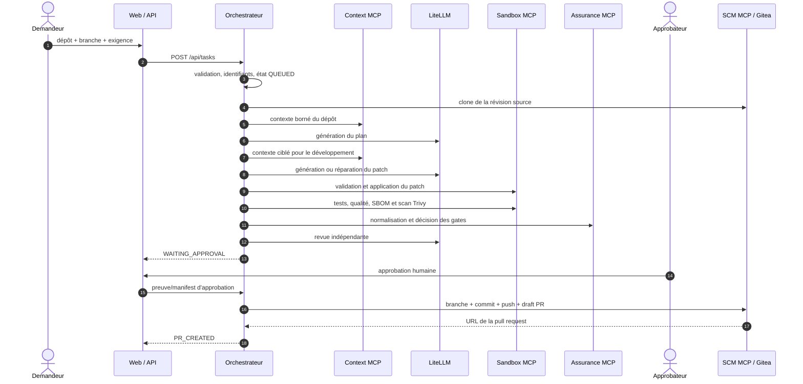

Le clone est créé sous `/workspace/tasks/<task-id>`. La révision source est mémorisée pour lier la proposition à
un commit précis. Le patch est normalisé et validé ; deux tentatives de réparation au maximum sont prévues avant
échec de la génération.

### 2.3 États d'une tâche

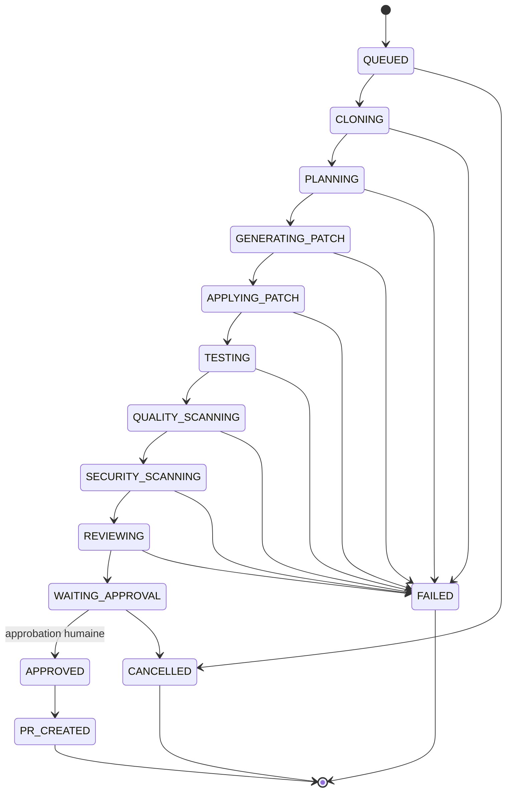

Les quatorze statuts exposés sont : `QUEUED`, `CLONING`, `PLANNING`, `GENERATING_PATCH`, `APPLYING_PATCH`,
`TESTING`, `QUALITY_SCANNING`, `SECURITY_SCANNING`, `REVIEWING`, `WAITING_APPROVAL`, `APPROVED`, `PR_CREATED`,
`CANCELLED` et `FAILED`.

### 2.4 API opérateur

| Méthode et route | Usage |
|---|---|
| `POST /api/tasks` | créer et lancer une tâche |
| `GET /api/tasks` | lister les tâches connues du processus |
| `GET /api/tasks/{id}` | obtenir l'état détaillé et les résultats |
| `POST /api/tasks/{id}/approve` | approuver le parcours de référence |
| `POST /api/tasks/{id}/approve-manifest` | approuver un effet lié à un manifest de preuves |
| `POST /api/tasks/{id}/cancel` | demander l'annulation |
| `POST /api/tasks/{id}/decisions/{requestId}` | répondre à une décision humaine du mode durable |
| `POST /api/tasks/{id}/delegations/{delegationId}/retry` | relancer une délégation |
| `POST /api/tasks/{id}/fallback` | rebasculer vers le pipeline déterministe |
| `GET /api/capabilities` | exposer les capacités et modes disponibles |

L'interface web interroge une tâche active toutes les trois secondes et la liste des exécutions toutes les cinq
secondes. Elle adapte l'action d'approbation à la présence d'un manifest dans l'effet en attente.

### 2.5 Règles fonctionnelles structurantes

- Un dépôt et une exigence non vide sont obligatoires.
- La branche par défaut est `main` si aucune branche n'est fournie.
- Le modèle cloud doit être autorisé et joignable avant le traitement.
- Un échec de test, de gate qualité, une vulnérabilité `HIGH`/`CRITICAL` ou un blocker de revue arrête le flux.
- Le modèle suggère ; l'hôte valide les contrats, les chemins, les budgets et les effets.
- Aucun push ni aucune pull request ne doit être créé sans approbation humaine.
- Le livrable SCM est une pull request **brouillon**, jamais une fusion automatique.

## 3. Architecture

### 3.1 Vue conteneurs

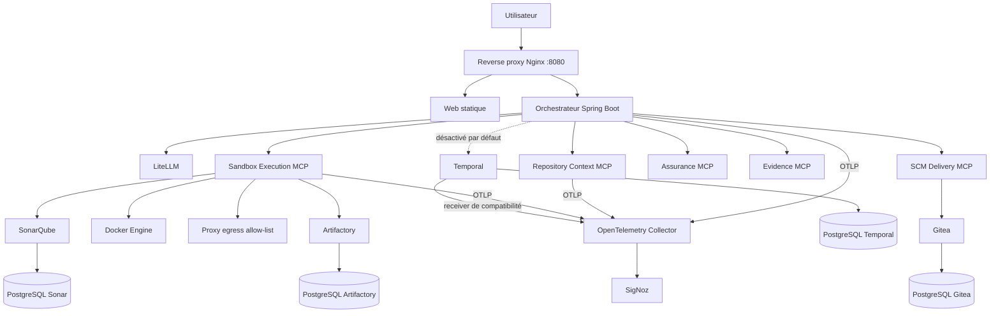

Les agents ne sont pas des conteneurs Compose séparés. Ce sont des rôles logiques chargés dans le processus
`orchestrator`. Les services séparés correspondent aux capacités techniques et aux frontières de confiance.

### 3.2 Responsabilités des composants

| Composant | Responsabilité | Exposition hôte par défaut |
|---|---|---|
| `reverse-proxy` | point d'entrée web et routage `/api` | `8080` |
| `factory-web` | interface statique HTML/CSS/JavaScript | aucune, derrière le proxy |
| `orchestrator` | workflow, état, LLM, politiques, orchestration MCP | `8088` |
| `litellm` | passerelle OpenAI-compatible vers le modèle cloud | aucune |
| `repository-context-mcp` | lecture bornée et non fiable du dépôt | aucune |
| `sandbox-execution-mcp` | création et suivi des jobs isolés | aucune |
| `assurance-mcp` | normalisation et décisions déterministes | aucune |
| `evidence-mcp` | stockage chiffré, immuable et manifest de preuves | aucune |
| `scm-delivery-mcp` | livraison Gitea après preuve d'approbation | aucune |
| `temporal` / `temporal-ui` | workflow durable préparé et diagnostic | UI sur `127.0.0.1:8233` |
| `gitea` | forge Git locale | `3000`, SSH `2222` |
| `sonarqube` | analyse qualité | `9000` |
| `artifactory` | miroir/dépôt de dépendances | `8082` |
| `otel-collector` / `SigNoz` | métriques, traces, logs, alertes et tableaux de bord | SigNoz `3301` uniquement |

### 3.3 Réseaux et frontières

| Réseau | Nature | Membres/usage principal |
|---|---|---|
| `factory` | routable entre services | web, orchestrateur, Gitea, LiteLLM, Sonar, Artifactory, observabilité |
| `mcp-internal` | `internal: true` | appels privés orchestrateur ↔ MCP |
| `workflow-internal` | `internal: true` | Temporal, sa base et l'orchestrateur |
| `sandbox-egress` | `internal: true` | jobs de test/sécurité et proxy Squid |
| `sandbox-quality` | `internal: true` | jobs qualité, Sonar et proxy |

Les jobs n'obtiennent pas directement le réseau de contrôle MCP. L'accès sortant passe par Squid, avec une liste
de destinations autorisées ; les profils qualité peuvent en plus joindre SonarQube.

### 3.4 Architecture logique multi-agent

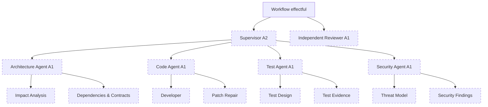

Le catalogue suit un modèle *default deny*. Le workflow est le seul rôle autorisé à déclencher des effets. Le
Supervisor peut déléguer de l'analyse, tandis que l'Independent Reviewer reste son pair afin de préserver son
indépendance. Ce mode est livré mais non activé par défaut : qualification `INCOMPLETE` et listes de rôles vides.

#### Réalité de déploiement actuelle

Dans la version locale, **un agent n'est pas un conteneur Docker, un processus ou une application Spring Boot
autonome**. C'est un rôle logiciel exécuté dans la même JVM que l'orchestrateur :

- [`AgentRuntime`](../../apps/orchestrator/src/main/java/com/example/aifactory/service/AgentRuntime.java) exécute les
  boucles d'outils et les appels LLM ;
- le [`catalog-v1.yaml`](../../resources/agents/catalog-v1.yaml) déclare les rôles, leurs relations, leur niveau
  d'autonomie et leurs permissions ;
- les prompts et contrats JSON définissent leurs entrées et sorties ;
- le scheduler de DAG, les budgets, l'arbitrage et les implémentations Temporal sont embarqués dans
  `orchestrator` ;
- les échanges entre rôles sont des appels internes et des objets typés, pas des appels réseau entre conteneurs.

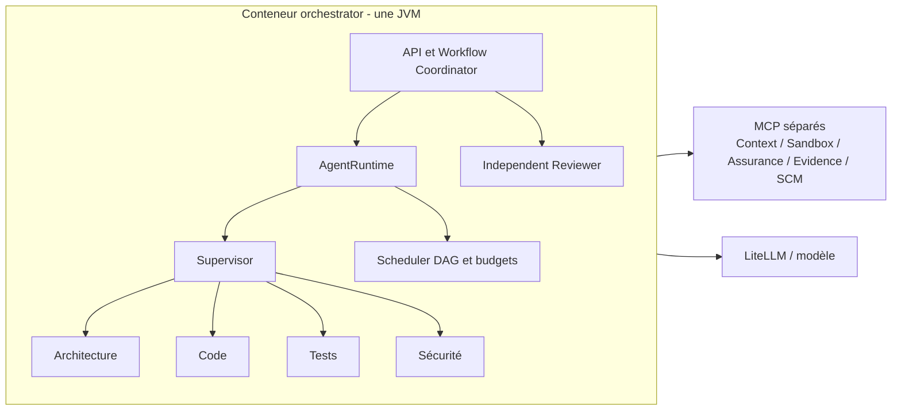

Il ne faut donc pas déduire du diagramme hiérarchique précédent qu'il existe un microservice par rectangle. Les
seuls conteneurs spécialisés sont actuellement les serveurs MCP et les composants de plateforme. Cette forme de
**monolithe modulaire** est pertinente pour le prototype : démarrage simple, appels locaux rapides, transactions
d'état faciles à suivre, débogage centralisé et faible coût d'exploitation. La liste effective des conteneurs est
portée par [`infrastructure/compose.yaml`](../../infrastructure/compose.yaml).

### 3.5 Pertinence de modules d'agents autonomes

Rendre certains agents autonomes signifie leur donner un contrat d'invocation versionné, un runtime déployable,
une identité, une configuration, des métriques et un cycle de publication propres. Ce choix devient pertinent
lorsqu'au moins une vraie frontière opérationnelle le justifie.

#### Arguments en faveur de l'extraction

| Motivation | Apport attendu |
|---|---|
| Réutilisation | un agent Architecture ou Sécurité peut servir plusieurs usines et d'autres produits |
| Scalabilité | les pools Code, Tests et Revue peuvent évoluer indépendamment selon leur charge et leur coût modèle |
| Isolation | une panne, une fuite mémoire ou une saturation d'un rôle ne bloque pas nécessairement l'API centrale |
| Sécurité | identité IAM, réseau, secrets et permissions distincts par classe d'agent |
| Gouvernance | versions, propriétaires, SLO, qualification et déploiement canary propres à chaque runtime |
| Choix de modèle | modèle, région et capacité de calcul adaptés à chaque spécialité |
| Indépendance de la revue | runtime et chaîne de publication séparés du runtime qui produit le patch |
| Résidence des données | placement régional et routage différents selon la sensibilité du dépôt |

#### Coûts et risques introduits

| Coût | Conséquence à maîtriser |
|---|---|
| Appels réseau | latence, timeouts, retries, backpressure et gestion des réponses partielles |
| État distribué | corrélation tâche/tentative, idempotence et reprise deviennent obligatoires |
| Compatibilité | contrat API et événements à maintenir en `N`/`N-1` |
| Exploitation | davantage d'images, identités, pipelines, alertes et astreintes |
| Cohérence | impossible de supposer une transaction mémoire commune entre agents |
| Coût cloud | instances minimales, cold starts, trafic et observabilité supplémentaires |
| Surface d'attaque | nouvelles interfaces réseau à authentifier et autoriser |
| Débogage | traces distribuées et propagation stricte des identifiants nécessaires |

La modularisation n'est donc pas un objectif en soi. Tant que l'usine n'a qu'un consommateur, une charge modérée,
une équipe unique et un cycle de livraison commun, garder les rôles embarqués est le choix le plus sobre. Il faut
extraire un rôle lorsqu'il a un besoin indépendant de sécurité, de disponibilité, de scalabilité, de réutilisation
ou de gouvernance.

#### Granularité recommandée

Il serait excessif de créer un service par sous-agent (`impact-analysis`, `test-design`, etc.). La bonne granularité
est un **pool de runtime partageant la même frontière de confiance et le même profil de charge** :

| Module cible | Contenu | Droits recommandés |
|---|---|---|
| `workflow-orchestrator` | API, Temporal, Supervisor, DAG, budgets, arbitrage et effets | seul composant autorisé à déclencher les MCP à effet |
| `agent-gateway` | authentification, registre, résolution de version, routage et quotas | invocation uniquement, aucune donnée métier durable |
| `agent-runtime-analysis` | Architecture, Tests et analyses Sécurité en lecture seule | contexte et preuves filtrées, aucun secret SCM |
| `agent-runtime-code` | Developer et Patch Repair | lecture bornée ; retourne un patch typé sans l'appliquer |
| `agent-runtime-review` | Independent Reviewer | lecture des preuves finales, chaîne de déploiement séparée |
| runtimes partagés externes | agents GCP consommés par plusieurs produits | API privée et contrat stable, sans accès direct aux effets de l'usine |

Le rôle Sécurité peut quitter le pool d'analyse si sa séparation réglementaire, son SLA ou ses outils spécialisés le
justifient. Les sous-agents courts restent des configurations du runtime correspondant.

### 3.6 Cible GCP proposée

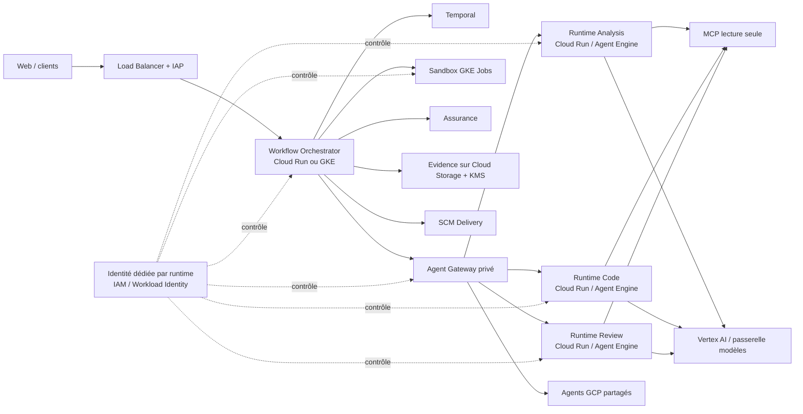

Mapping recommandé :

- **Cloud Run services** pour le gateway et les runtimes HTTP stateless, intermittents et à durée bornée. Les
  services restent privés, authentifiés par IAM, et reçoivent chacun un compte de service dédié à privilèges
  minimaux. Cloud Run prend en charge les identités de service et le contrôle de l'invocation ; son trafic peut être
  contraint par ingress/VPC ([service identity](https://docs.cloud.google.com/run/docs/securing/service-identity),
  [sécurité Cloud Run](https://docs.cloud.google.com/run/docs/securing/security)).
- **Vertex AI Agent Engine** si l'équipe souhaite confier le runtime et le passage à l'échelle des agents à un
  service managé intégré à Vertex AI. Il faut néanmoins conserver les contrats, budgets, permissions et décisions
  d'effet du côté de l'usine ([présentation d'Agent Engine](https://cloud.google.com/vertex-ai/generative-ai/docs/reasoning-engine/overview)).
- **GKE Jobs** pour les compilations, tests et scans longs ou non fiables, ainsi que pour les besoins de sidecars,
  de volumes et de politiques réseau fines. Chaque classe de job utilise une identité sans clé statique via
  Workload Identity Federation et une politique réseau deny-by-default
  ([Workload Identity Federation for GKE](https://docs.cloud.google.com/kubernetes-engine/docs/concepts/workload-identity),
  [NetworkPolicy GKE](https://docs.cloud.google.com/kubernetes-engine/docs/how-to/network-policy)).
- **Temporal** reste le coordinateur durable : les runtimes d'agents sont des activités distantes remplaçables, et
  non les propriétaires du workflow ou des décisions à effet.

Le point de sécurité essentiel ne change pas avec le cloud : un agent distant produit une réponse typée et des
références de preuves. Il ne reçoit ni jeton SCM, ni droit d'appliquer un patch, ni permission d'approuver sa propre
production. `workflow-orchestrator` reste le seul détenteur des capacités d'effet.

#### Trajectoire de migration

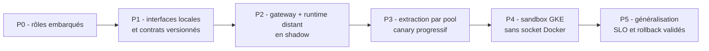

1. Stabiliser une interface `AgentExecutor` indépendante du transport et les enveloppes tâche/tentative/budget.
2. Introduire un `agent-gateway` avec authentification mutuelle, idempotence, deadlines et propagation de traces.
3. Déployer d'abord un runtime distant en **shadow mode** et comparer coût, qualité, sécurité et latence au mode
   embarqué.
4. Extraire ensuite le pool qui apporte le plus de valeur, généralement la revue indépendante ou le code à forte
   charge, sans modifier les droits d'effet.
5. Qualifier sur le cluster cible le backend GKE désormais disponible ; la socket Docker locale est supprimée.
6. Activer par canary, avec kill switch et retour immédiat au pipeline embarqué.

La décision de sortie doit être mesurée : taux de succès, p95/p99, coût par tâche, incidents, régressions de
sécurité et capacité de rollback. Si l'extraction ne crée pas un bénéfice net démontré, le monolithe modulaire reste
la cible appropriée.

### 3.7 DAG de délégation

Un **DAG** (*Directed Acyclic Graph*, graphe orienté acyclique) représente les dépendances entre travaux sans
boucle : une délégation ne peut pas finir par dépendre d'elle-même. Le planificateur impose une profondeur maximale
de 2 et un fan-out maximal de 4. Le DAG sert à exécuter en parallèle des analyses indépendantes, tout en conservant
un ordre déterministe pour les dépendances et l'arbitrage.

## 4. Implémentation technique

### 4.1 Socle logiciel

| Zone | Technologies |
|---|---|
| Orchestrateur | Java 25, Spring Boot 4.1.1, Spring AI 2.0.1, WebFlux, Actuator, Micrometer, Temporal SDK 1.38.0 |
| MCP | cinq applications Java/Spring Boot indépendantes, transport Streamable HTTP sur `/mcp` |
| Frontend | HTML, CSS et JavaScript statiques servis par Nginx |
| Contrats | JSON Schema pour requêtes, résultats, événements, preuves et décisions |
| Exécution | Docker Engine local, image sandbox Maven/Java/Node/Syft/Trivy |
| Données de plateforme | PostgreSQL pour Temporal, Gitea, SonarQube et Artifactory |
| Observabilité | OpenTelemetry, OTLP, Collector et SigNoz |

Le dépôt ne contient pas de projet Maven parent : l'orchestrateur et chaque serveur MCP ont leur propre `pom.xml`
et leur propre cycle de construction.

### 4.2 Coordination active

`DeterministicWorkflowCoordinator` est l'implémentation active de `WorkflowCoordinator`. Il lance le parcours dans
un `ExecutorService` fixe de deux threads. `InMemoryTaskMemory` sauvegarde chaque `TaskState` dans le processus.
L'approbation reprend la tâche et délègue l'effet final à `ScmDeliveryGateway`.

Cette architecture est simple et lisible pour un prototype, mais elle n'offre ni reprise après redémarrage de
l'orchestrateur, ni verrouillage distribué, ni montée en charge horizontale sûre.

### 4.3 Capacités MCP

| Serveur | Outils principaux | Caractéristiques |
|---|---|---|
| Repository Context | `list_tree`, `read_file`, `search_code`, `get_repository_rules`, `get_dependencies`, `get_symbols` optionnel | lecture seule, chemins bornés, règles du dépôt traitées comme non fiables |
| Sandbox Execution | `validate_patch`, `apply_patch`, `run_tests`, `run_quality`, `run_security`, `get_execution`, `cancel_execution` | profils fixes, état de job persistant, sorties digérées et expurgées |
| Assurance | `evaluate_quality_gate`, `normalize_findings`, `evaluate_policy` | décisions déterministes, fermeture en cas d'ambiguïté |
| Evidence | `store`, `create_manifest`, `get_summary`, `read` | chiffrement AES-GCM, adressage logique et contrôle d'accès |
| SCM Delivery | `create_draft_pull_request`, `get_repository`, `resolve_revision` | registre de dépôts autorisés, approbation HMAC et idempotence |

La négociation MCP vérifie au démarrage le protocole, le nom, la version et l'ensemble exact des outils autorisés.
Chaque réponse est validée par JSON Schema. Les appels de lecture peuvent être retentés trois fois ; les appels à
effet deux fois au maximum et seulement avec les garanties d'idempotence attendues.

### 4.4 Contexte et génération

Les limites par défaut du serveur de contexte sont de 1 MiB par fichier, 1 000 fichiers inspectés par recherche et
1 000 entrées par arbre. La recherche est littérale. L'extraction de symboles Tree-sitter est optionnelle et
désactivée par défaut ; elle prévoit Java, JavaScript, TypeScript, Kotlin, Python et Go.

Les instructions de dépôt, le ticket, les réponses LLM et les sorties d'outils sont des entrées non fiables. Les
prompts demandent des sorties structurées, puis l'hôte normalise et contrôle le patch. Le modèle ne choisit ni un
profil d'exécution arbitraire, ni un réseau, ni une commande libre.

### 4.5 Exécution sandbox

| Profil | Durée maximale | Réseau/usage |
|---|---:|---|
| validation du patch | 3 min | sans réseau |
| application du patch | 3 min | sans réseau |
| tests Maven/Gradle/npm | 15 min | Artifactory et egress filtré |
| qualité Sonar | 15 min | réseau qualité, Maven uniquement |
| SBOM + Trivy | 10 min | egress filtré |

Chaque conteneur de job est plafonné à 2 CPU, 2 Gio de mémoire et 512 PID, avec suppression de toutes les
capabilities Linux et `no-new-privileges`. Le profil est choisi côté serveur à partir de l'opération demandée.

`SandboxRuntime` abstrait l'exécuteur. `ComposeSandboxRuntime` distribue localement les profils vers quatre runners
statiques sans socket Docker. `GkeSandboxRuntime` utilise l'implémentation Kubernetes de `GkeJobController` ; son
activation opérationnelle nécessite encore le cluster, le PVC, les secrets et les identités de la plateforme cible.

### 4.6 Modes durable et hiérarchique

Les classes de workflow Temporal, les files de tâches spécialisées, le DAG, les délégations, les décisions humaines,
les contradictions, les budgets et l'Evidence MCP existent dans le code. Ils ne remplacent pas le coordinateur
déterministe dans le parcours public par défaut. Leur activation exige au minimum :

- une qualification complète des rôles ;
- une persistance métier réellement branchée ;
- la validation de la reprise et de l'idempotence de bout en bout ;
- des tests de bascule et de rollback ;
- une configuration Temporal sécurisée pour l'environnement visé.

## 5. Sécurité et modèle de confiance

### 5.1 Principes

Le projet applique plusieurs principes solides : moindre privilège, séparation lecture/effet, validation des contrats,
fermeture en cas de doute, immutabilité des preuves, approbation humaine et réseaux spécialisés.

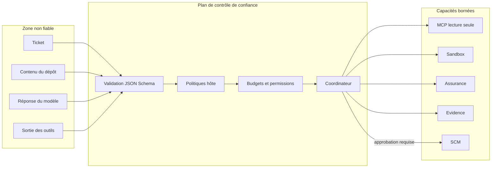

Les permissions, profils, budgets et transitions appartiennent au code hôte. Une instruction contenue dans le dépôt
ne peut donc pas augmenter l'autonomie d'un agent ni lui donner un outil supplémentaire.

### 5.2 Contrôles présents

| Domaine | Contrôles observés |
|---|---|
| Entrées | validation des requêtes, allow-list des dépôts SCM, restrictions de branches |
| Fichiers | confinement sous la racine de tâche, refus des traversées de chemins et contrôle des liens symboliques |
| MCP | négociation stricte, allow-list exacte d'outils, schémas de réponse, taille et délai maximum |
| Agents | catalogue versionné, `default deny`, autonomie A0/A1/A2, périmètres et budgets non modifiables par le modèle |
| Sandbox | profils fixes, ressources plafonnées, réseau segmenté, proxy egress, capabilities supprimées |
| Qualité | gates déterministes, vulnérabilités `HIGH`/`CRITICAL` bloquantes, blocker de revue bloquant |
| Effet SCM | approbation humaine, preuve HMAC-SHA256, liaison tâche/tentative/dépôt/SHA/patch/preuves, durée maximale 24 h |
| Preuves | écriture immuable, digest SHA-256, chiffrement AES-GCM et données d'authentification associées |
| Secrets | fichiers `.env`/`.vault` ignorés, génération locale, BuildKit secrets, fichiers temporaires en mode `0600` |
| Télémétrie | capture des prompts, résultats, preuves et contenu GenAI désactivée par défaut |
| Audit | événements de sécurité chaînés par hash/HMAC dans le processus |

### 5.3 Autorité de décision

La précédence prévue est :

1. gate déterministe ;
2. politique versionnée ;
3. preuve vérifiée ;
4. consensus de spécialistes ;
5. conclusion du Supervisor.

Une source d'autorité inférieure ne peut pas annuler une décision supérieure. Un conflit de même niveau reste ouvert
et doit être arbitré ; l'absence de preuve ou l'ambiguïté ne vaut pas acceptation.

### 5.4 Analyse des risques résiduels

| Risque | Constat | Impact | Traitement recommandé |
|---|---|---|---|
| Runner Compose persistant | séparation de processus plus faible que gVisor/microVM | persistance possible entre deux jobs si le nettoyage est défaillant | usage local uniquement, profils séparés, filesystem read-only et reconstruction régulière |
| API sans identité | aucune authentification, RBAC ni limitation de débit devant `/api` | création/approbation/annulation accessibles à tout client joignant le port | OIDC/SSO au proxy, RBAC, CSRF pour l'UI et rate limiting |
| Secrets de développement | plusieurs valeurs Compose ont des défauts simples | compromission immédiate hors poste isolé | secrets uniques, Secret Manager/Vault, rotation et interdiction de valeurs par défaut |
| Réseaux/ports | Gitea, Sonar, Artifactory, SigNoz et orchestrateur sont publiés | surface d'attaque locale ou LAN selon le bind | binder sur loopback en local, publier uniquement le reverse proxy en environnement partagé |
| MCP interne sans authentification forte | la segmentation réseau porte l'essentiel de la confiance | usurpation possible si le réseau est compromis | mTLS et identité de workload par service |
| Audit local | clé aléatoire et journal non durable/WORM | perte au redémarrage et preuve difficile à opposer | export append-only signé vers un stockage externe |
| État volatile | tâches en RAM | perte de suivi et approbations incohérentes après redémarrage | brancher la projection PostgreSQL et Temporal avant production |
| Chaîne d'approvisionnement | certaines images sont taguées sans digest ; téléchargements Syft/Trivy non vérifiés explicitement | substitution ou dérive d'image | pin par digest, vérification SHA/signature, génération de provenance |
| Analyse partielle | qualité Sonar seulement pour Maven | couverture différente pour Gradle/npm | profils Sonar Gradle/npm ou gates alternatives documentées |

### 5.5 Retrait de `/var/run/docker.sock`

Le montage a été retiré de tous les services. En local, `ComposeSandboxRuntime` délègue uniquement un profil enregistré
à des runners statiques séparés par capacité ; aucun appelant ne choisit commande, image, volume, réseau ou secret.
En cible partagée, le contrôleur Kubernetes crée des Jobs GKE par digest avec identité, ressources et NetworkPolicy
bornées. Un garde-fou CI refuse la réintroduction de la socket et de l'ancien runtime.

### 5.6 Classification et rétention prévues

La politique versionnée classe les artefacts `INTERNAL` ou `CONFIDENTIAL`. Les durées prévues sont notamment :

| Artefact | Rétention | Classification |
|---|---:|---|
| plan, patch, intégration, tests | 90 jours | interne |
| évaluation et résultats Sonar | 180 jours | interne |
| SBOM | 365 jours | interne |
| Trivy, revue, approbation, manifest | 365 jours | confidentiel |
| audit | 730 jours | selon politique d'audit |

La purge est conçue en mode *fail closed* et un legal hold doit empêcher la suppression. Cette politique est une
cible gouvernée : elle n'implique pas que chaque volume local possède aujourd'hui un job de purge opérationnel.

## 6. Quotas, budgets et garde-fous

### 6.1 Limites MCP et LLM

| Limite | Valeur par défaut |
|---|---:|
| requêtes MCP simultanées globales | 32 |
| requêtes MCP simultanées par serveur | 16 |
| requêtes MCP simultanées par tâche | 4 |
| requêtes MCP simultanées par rôle | 8 |
| délai d'une requête MCP standard | 20 s |
| taille maximale d'une réponse MCP | 65 536 octets |
| retries de lecture MCP | 3 |
| retries d'effet MCP | 2 |
| sortie LLM maximale | 8 192 tokens |
| délai d'une complétion LLM | 10 min |
| cache du probe LLM | 30 s |

### 6.2 Limites sandbox

| Limite | Valeur par défaut |
|---|---:|
| jobs simultanés | 2 |
| jobs en attente | 32 |
| jobs actifs par tâche | 2 |
| états de jobs conservés | 500 |
| rétention d'un état de job | 7 jours |
| sortie capturée | 65 536 caractères |
| patch | 1 MiB |
| heartbeat | 15 s |
| ressources d'un job | 2 CPU, 2 Gio, 512 PID |

L'état des jobs est écrit atomiquement dans un volume. Après redémarrage, un job auparavant `RUNNING` devient
indéterminé/échoué : le système ne prétend pas avoir validé un résultat dont il ne peut plus prouver l'achèvement.

### 6.3 Budgets hiérarchiques

| Périmètre | Tours | Tokens | Coût | Appels/outils | Temps |
|---|---:|---:|---:|---:|---:|
| délégation | 6 | 12 000 | 12 000 000 µ-unités | 24 outils | 900 s |
| tâche globale | 60 | 80 000 budgétés | 80 000 000 µ-unités | 208 MCP | — |
| réserve hôte | 6 | 15 000 (10k entrée, 5k sortie) | 10 000 000 µ-unités | 32 | — |
| plafond physique observé | 60 | 120k entrée + 40k sortie | 80 000 000 µ-unités | 208 MCP | — |
| DAG | — | — | 70 000 000 µ-unités | profondeur 2, fan-out 4 | chemin critique 2 700 s |

Les budgets de rôle et de périmètre Architecture/Code/Tests/Sécurité ne peuvent qu'abaisser ces plafonds. Le modèle
ne peut pas s'octroyer une rallonge. L'épuisement déclenche un arrêt, une réduction du plan, un fallback ou une
demande humaine selon la politique.

### 6.4 Coupe-circuit

Un kill switch versionné peut désactiver globalement un serveur, un outil, un rôle, un mode ou une combinaison
rôle/mode. Un fichier illisible ou invalide provoque un refus, pas une autorisation implicite. La détection d'appels
répétés, la limite de tours et la limite d'outils empêchent les boucles d'agent non bornées.

## 7. Données et persistance

### 7.1 Cartographie actuelle

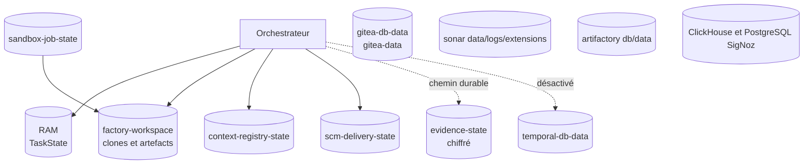

| Donnée | Support | Durabilité réelle |
|---|---|---|
| état et historique d'une tâche active | mémoire de l'orchestrateur | perdu au redémarrage |
| clone, patch et fichiers `.ai-*` | volume `factory-workspace` | persistant tant que le volume existe |
| registre des workspaces de contexte | `context-registry-state` | persistant |
| état des jobs sandbox | `sandbox-job-state` | persistant, reprise conservatrice |
| idempotence et audit de livraison | `scm-delivery-state` | persistant |
| blobs et manifests Evidence | `evidence-state` | persistant, chiffré et immuable |
| historique Temporal | PostgreSQL Temporal | persistant, mais non utilisé par défaut pour le pipeline public |
| forge, qualité, artefacts, dashboards | volumes dédiés | persistant par produit |

### 7.2 Modèle relationnel préparé

Les migrations `V001` à `V008` définissent une projection métier plus riche, sans qu'elle soit encore branchée à
l'exécution de référence.

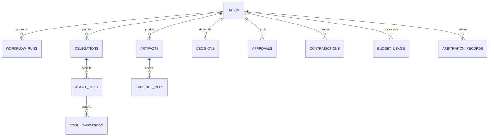

Le schéma prévoit notamment :

- une lignée composite tâche/tentative/commit source ;
- une version optimiste et une fonction de transitions légales ;
- des catégories d'information (`VERIFIED_EVIDENCE`, `UNTRUSTED_INPUT`, `AGENT_CONCLUSION`, `POLICY_DECISION`) ;
- des projections UI limitées aux métadonnées et filtrées par rôle ;
- des imports legacy terminaux et immuables ;
- des arbitrages append-only avec entrées et preuves associées.

### 7.3 Evidence

Le stockage local refuse l'écrasement, calcule un SHA-256 et chiffre en AES-GCM. L'identité logique de la preuve,
la tâche, la tentative, le type et le digest participent aux données authentifiées. Les URI suivent le schéma
`evidence://...`. La lecture est contrôlée et auditée.

`GcsEvidenceBackend` ne réalise aucun appel GCS : il valide et construit un descripteur d'objet immuable avec CMEK,
rétention verrouillée et précondition `generation-match-0`. Il s'agit donc d'un port de conception, pas d'un backend
cloud opérationnel.

### 7.4 Gouvernance et cycle de vie

Les données les plus sensibles sont le code source, les patches, les rapports de vulnérabilités, les prompts/résultats
capturés, les approbations et les secrets SCM/LLM. Pour un environnement partagé, il faut compléter l'existant par :

- chiffrement des volumes et sauvegardes testées ;
- séparation par tenant/projet et contrôle d'accès à la ligne/objet ;
- politique de purge réellement exécutée pour workspace, états de jobs et preuves ;
- restauration testée de la projection métier, de Temporal et des preuves ;
- résidence, minimisation et masquage des données envoyées au modèle cloud ;
- journal d'accès durable, exporté et non modifiable.

## 8. Packaging et déploiement

### 8.1 Chaîne de construction locale

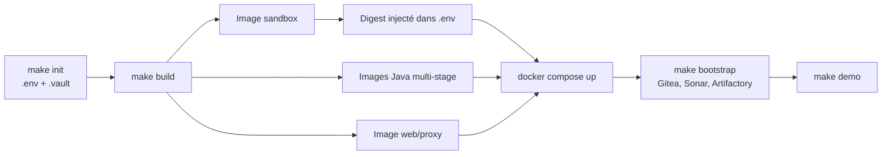

Le `Makefile` est le point d'entrée opérateur. Il couvre l'initialisation, la construction, le démarrage, le
bootstrap, la création des tokens, les exemples, les tests, le passage MCP shadow/actif, le reporting, le packaging,
le statut, les logs, le redémarrage, l'arrêt et le nettoyage.

Attention : `make all` inclut un nettoyage des volumes et doit être traité comme destructif pour les données locales.

### 8.2 Images

- Les applications Java utilisent des Dockerfiles multi-stage.
- Les dépendances Maven sont préchargées et peuvent passer par Artifactory avec un secret BuildKit.
- Les serveurs MCP s'exécutent avec des utilisateurs non-root dédiés (`10001` à `10005`), système de fichiers en
  lecture seule, `tmpfs`, capabilities supprimées et `no-new-privileges`.
- Le frontend est statique et servi par Nginx, sans runtime Node en production.
- L'image sandbox rassemble Maven 3.9.16/Java 25, Node, Git, Syft et Trivy.
- Le build calcule et inscrit le digest réel de l'image sandbox dans `.env`, ce qui évite une dérive de tag à
  l'exécution.

Deux écarts sont visibles : l'image de l'orchestrateur ne déclare pas d'utilisateur non-root et installe encore le
client Docker alors que le Compose ne lui monte plus la socket. Les builds d'images Maven utilisent `-DskipTests` ;
la qualité dépend donc de l'exécution explicite de `make test` en amont.

### 8.3 Topologie de déploiement locale

Compose vise un poste de développement : services d'infrastructure co-localisés, volumes Docker nommés et plusieurs
ports de diagnostic exposés. Les limites CPU/mémoire Compose ne sont pas uniformément définies sur tous les services.
La configuration convient à une démonstration isolée, pas à une exposition directe sur un réseau d'entreprise.

### 8.4 Cible de production recommandée

| Besoin | Cible cohérente |
|---|---|
| API/UI | reverse proxy authentifié + orchestrateur stateless répliqué |
| Workflow long | Temporal managé ou cluster durci, TLS et files de tâches séparées |
| Sandbox | GKE Jobs, microVM ou service d'exécution dédié sans socket hôte |
| Agents partagés | gateway privé et runtimes séparés par frontière de sécurité/charge, pas forcément par sous-agent |
| Preuves | stockage objet immuable, CMEK/KMS, rétention verrouillée et précondition de création |
| État métier | PostgreSQL HA avec migrations, sauvegarde/restauration et verrouillage optimiste |
| Secrets | Secret Manager/Vault et identité de workload, aucun secret statique partagé |
| Réseau | ingress unique, egress deny-by-default, mTLS service-à-service |

La granularité de déploiement doit suivre les frontières d'autorité. Le coordinateur conserve les effets ; les
runtimes d'analyse/code/revue produisent des conclusions typées et des références de preuves.

## 9. Observabilité et exploitation

### 9.1 Collecte

Les six applications Spring exportent métriques, traces et logs par OTLP vers un Collector interne. Temporal ne
dispose pas encore d'un export OTLP retenu : le Collector collecte donc son endpoint métrique par un receiver de
compatibilité, sans serveur Prometheus autonome. SigNoz stocke et présente les trois signaux.

Sept dashboards versionnés couvrent Temporal, MCP, orchestrateur, agents, sandbox, Supervisor et le Collector.
Les neuf alertes SigNoz sont provisionnées de façon idempotente et routées localement vers un sink interne borné.

### 9.2 Alertes présentes

- boucle ou dépassement de tours d'un agent ;
- budget épuisé ou pic de coût ;
- backlog de la file de tâches ;
- heartbeat sandbox invalide ;
- erreur de contrat ;
- preuve altérée.

Les alertes couvrent bien les risques spécifiques à l'agentique : boucles, coûts, contrats et intégrité. Elles doivent
être complétées par des SLO de service, des alertes sur les MCP manquants, la saturation des volumes, les expirations
de certificats/secrets et le taux de reprise après incident.

### 9.3 Runbooks

Le dépôt fournit des procédures pour : agent défaillant, incident canary/kill switch, MCP compromis, rollback
multi-agent, saturation, indisponibilité Temporal. Avant production, chaque runbook doit être relié à une alerte,
un propriétaire, un canal d'escalade et un exercice périodique.

## 10. Tests et assurance qualité

### 10.1 Couverture présente

Le dépôt contient 158 classes `*Test.java` : 139 pour l'orchestrateur et 19 réparties entre les cinq serveurs MCP.
Le volume est significatif, mais le comptage ne préjuge ni de leur succès courant ni de la couverture de code.

Les tests adressent notamment :

- contrats et compatibilité de schémas ;
- permissions, budgets, routage et DAG ;
- idempotence et reprise Temporal ;
- confinement de chemins et liens symboliques ;
- sandbox, heartbeats, redaction et annulation ;
- approbation SCM et liaison aux preuves ;
- chiffrement/immutabilité Evidence ;
- politiques, gates et décisions fail closed.

### 10.2 Gates du produit

Les tests de la tâche cible supportent Maven, Gradle et npm. La qualité Sonar est limitée à Maven. Syft génère le
SBOM CycloneDX et Trivy analyse les vulnérabilités ; les sévérités hautes et critiques bloquent. Une revue LLM finale
complète ces contrôles, mais ne se substitue jamais aux gates déterministes.

### 10.3 Lacune d'intégration continue

Aucun workflow CI n'a été trouvé sous `.github/workflows`. Les tests sont donc disponibles via le `Makefile`, sans
preuve qu'ils soient imposés automatiquement avant fusion ou construction d'image. La priorité est d'ajouter une CI
qui exécute tests, validation de schémas/politiques, scan de dépendances/images, `git diff --check`, génération SBOM
et vérification de provenance.

## 11. Bonnes pratiques et recommandations

### 11.1 Bonnes pratiques déjà visibles

- séparation nette entre raisonnement IA et opérations à effet ;
- contrats JSON versionnés et validation stricte aux frontières ;
- principes `default deny`, moindre privilège et *fail closed* ;
- approbation humaine cryptographiquement liée aux éléments approuvés ;
- idempotence explicite de la livraison SCM ;
- isolation réseau par profil de sandbox ;
- limites de temps, taille, concurrence, coût, tours et outils ;
- preuves adressées par digest, chiffrées et immuables ;
- Independent Reviewer hors de la hiérarchie du Supervisor ;
- qualification, canary, kill switch et rollback prévus avant activation multi-agent ;
- captures de contenu sensible désactivées par défaut ;
- documentation d'exploitation et décisions d'architecture versionnées avec le code.

### 11.2 Priorités recommandées

| Priorité | Action | Critère de sortie |
|---:|---|---|
| P0 | protéger l'API par OIDC/SSO, RBAC, CSRF et rate limiting | aucune mutation anonyme possible |
| P0 | supprimer l'accès direct à la socket Docker | jobs exécutés par un backend distant isolé avec tests d'évasion |
| P0 | rendre l'état métier durable | redémarrage et réplication sans perte, transitions atomiques |
| P0 | instaurer une CI obligatoire | tests, contrats, scans, SBOM et provenance bloquent la fusion |
| P1 | sécuriser secrets et identités de service | rotation, coffre externe, mTLS/workload identity |
| P1 | fermer les expositions réseau | seul l'ingress requis est public ; egress deny-by-default |
| P1 | rendre l'audit externe et immuable | événements vérifiables après perte du processus |
| P1 | collecter les métriques de tous les MCP | dashboards/SLO sur contexte, sandbox, SCM, assurance et evidence |
| P1 | pinner et signer toutes les images/outils | digest, signature et provenance vérifiés au déploiement |
| P2 | généraliser qualité Gradle/npm | gates équivalentes sur les trois écosystèmes supportés |
| P2 | automatiser rétention et restauration | purge/legal hold et exercices de restore démontrés |
| P2 | qualifier progressivement le mode hiérarchique | seuils atteints, canary concluant, rollback testé |

### 11.3 Règles de contribution conseillées

Pour toute évolution :

1. modifier d'abord le contrat ou la politique versionnée ;
2. préserver la compatibilité `N`/`N-1` pendant 28 jours ;
3. traiter un changement cassant avec une nouvelle version majeure ;
4. ajouter les tests de succès, refus, timeout, reprise et idempotence ;
5. ne jamais journaliser secrets, code ou prompts par défaut ;
6. borner toute nouvelle boucle, taille, concurrence et durée ;
7. réserver les effets au workflow et exiger une clé d'idempotence ;
8. fournir métriques, alerte et runbook pour une nouvelle capacité critique ;
9. documenter le rollback et le comportement en cas de dépendance indisponible ;
10. prouver la suppression/rétention avant de collecter une nouvelle catégorie de données.

## 12. Limites connues et dette technique

### 12.1 Bloquants avant usage entreprise

- pas d'authentification ni de contrôle d'autorisation sur l'API ;
- socket Docker accessible au contrôleur de sandbox local ;
- état principal en mémoire et workflow durable désactivé ;
- secrets et mots de passe de développement incompatibles avec un environnement partagé ;
- audit de sécurité non persistant ;
- chaîne de construction non imposée par une CI ;
- restauration métier/Evidence/Temporal non démontrée de bout en bout ;
- absence de sandbox Kubernetes ou microVM opérationnelle ;
- isolation multi-tenant et politique de résidence des données non implémentées.

### 12.2 Écarts fonctionnels/techniques

- le mode LLM effectif est toujours cloud, même si le type de requête expose plusieurs modes ;
- Temporal démarre mais ne porte pas le chemin nominal par défaut ;
- Evidence MCP démarre mais le pipeline déterministe conserve principalement ses preuves dans le workspace et
  `TaskState` ;
- les migrations PostgreSQL décrivent une cible, sans adaptateur de persistance actif ;
- l'analyse Sonar n'est généralisée ni à Gradle ni à npm ;
- la conservation SigNoz locale et les notifications externes restent à qualifier sur une campagne longue ;
- l'image orchestrateur reste root et embarque un client Docker devenu inutile dans sa topologie actuelle ;
- `AI_FACTORY_SANDBOX_STATE_ROOT` est déclaré deux fois dans le service Compose sandbox ;
- plusieurs images utilisent un tag mutable ou non fixé par digest ;
- aucune purge explicite du workspace par tâche n'est démontrée ;
- les limites de ressources Compose sont incomplètes selon les services.

### 12.3 Critères de promotion du multi-agent

La politique de qualification requiert au moins 36 cas appariés, trois écosystèmes et une tolérance zéro sur les
régressions de sécurité prévues. Le routage doit rester sur `PIPELINE` lorsque la qualification, les budgets ou les
preuves manquent. Les risques R3/R4 vont en triage humain ; R4 est refusé. Un rollback vers `PIPELINE` doit être sûr,
et un état inconnu doit désactiver la hiérarchie et geler les effets.

## 13. Carte des sources

| Sujet | Source principale |
|---|---|
| démarrage et usage | [`README.md`](../../README.md), [`Makefile`](../../Makefile) |
| topologie et variables | [`infrastructure/compose.yaml`](../../infrastructure/compose.yaml), [`.env.example`](../../.env.example), [`.vault.example`](../../.vault.example) |
| API et orchestration | [`apps/orchestrator`](../../apps/orchestrator) |
| interface opérateur | [`apps/web`](../../apps/web) |
| serveurs MCP | [`apps/mcp`](../../apps/mcp) |
| prompts | [`resources/prompts`](../../resources/prompts) |
| catalogue et permissions des agents | [`resources/agents`](../../resources/agents) |
| contrats MCP | [`resources/mcp/schemas`](../../resources/mcp/schemas) |
| contrats multi-agents | [`resources/multiagents/schemas`](../../resources/multiagents/schemas) |
| politiques | [`resources/mcp/policies`](../../resources/mcp/policies), [`resources/multiagents/policies`](../../resources/multiagents/policies) |
| migrations métier | [`resources/multiagents/database`](../../resources/multiagents/database) |
| métriques et dashboards | [`infrastructure/observability`](../../infrastructure/observability) |
| procédures d'incident | [`docs/operations/runbooks`](../operations/runbooks) |
| ADR | [`docs/architecture/adr`](../architecture/adr) |

## 14. Glossaire

| Terme | Définition |
|---|---|
| DAG | graphe orienté acyclique représentant des dépendances sans boucle |
| MCP | protocole d'exposition d'outils et de ressources à un agent, avec contrats et capacités explicites |
| Gate | décision déterministe qui autorise ou bloque le passage à l'étape suivante |
| SBOM | inventaire des composants logiciels et dépendances d'un livrable |
| Evidence | artefact ou assertion vérifiable, lié à un digest et à une lignée d'exécution |
| Manifest | liste signée/logiquement liée des preuves sur lesquelles porte une approbation |
| Effet | opération qui modifie un système externe ou un état durable, par exemple un push Git |
| Shadow mode | exécution d'évaluation sans autoriser son résultat à piloter le chemin actif |
| Fail closed | refuser ou bloquer lorsque la configuration, la preuve ou la décision est absente/ambiguë |
| Idempotence | propriété permettant de rejouer une opération sans créer plusieurs effets équivalents |
| A0/A1/A2 | niveaux d'autonomie : workflow déterministe, analyse en lecture seule, délégation bornée |

---

Cette rétrodocumentation décrit l'état du dépôt, pas une certification de production. Toute promotion doit être
fondée sur des tests exécutés, des scans datés, une revue de menace et des preuves de restauration propres à
l'environnement cible.
