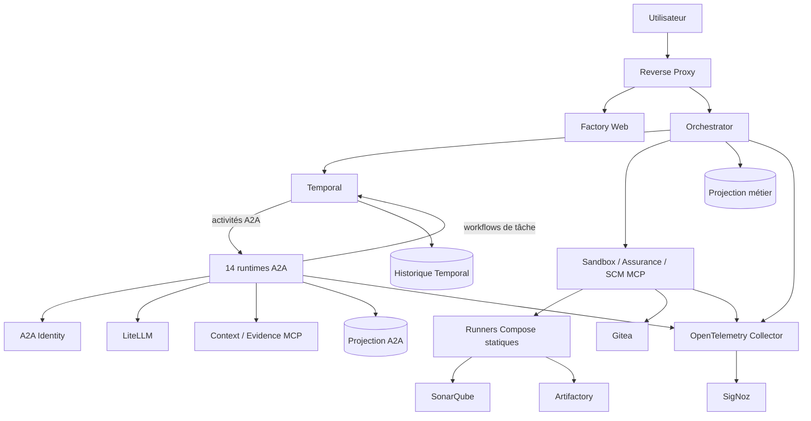
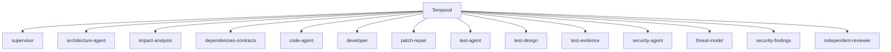
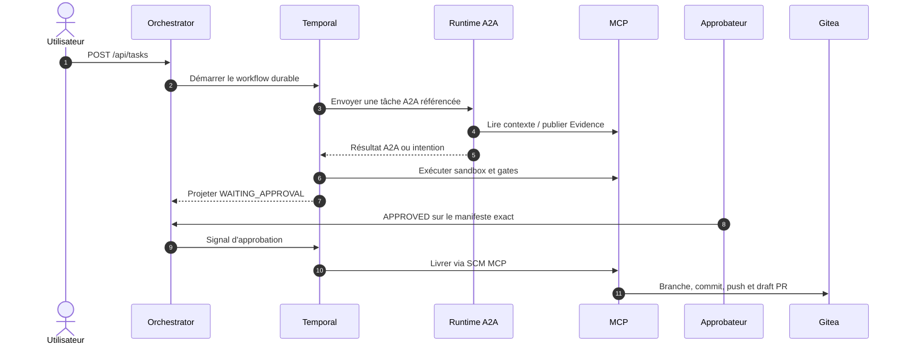
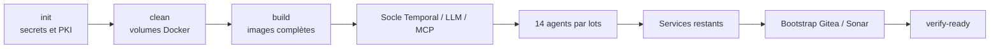

# État courant de l'AI Factory locale

> Revue documentaire du 7 septembre 2026 sur la branche `features/multiagents`. Le code, les contrats et la
> configuration Compose restent les sources de vérité exécutables.

## 1. Résumé

Le parcours public `POST /api/tasks` utilise obligatoirement Temporal. Chaque invocation d'agent traverse A2A 1.0
vers l'un des quatorze runtimes isolés ; aucune implémentation locale ou sélection de transport ne subsiste. Les
accès aux outils passent par cinq serveurs MCP et l'exécution locale du code utilise des runners Compose statiques
sans socket Docker.

La sortie métier est une Pull Request brouillon Gitea, créée seulement après les gates déterministes et une
approbation humaine valide.

## 2. Matrice actif / cible

| Capacité | État | Source de vérité |
|---|---|---|
| API et interface web | Active | `orchestrator`, `factory-web`, `reverse-proxy` |
| Workflow durable | Actif, obligatoire | `TemporalWorkflowCoordinator`, Temporal et sept task queues |
| Agents | Actifs, obligatoires | 14 services `a2a-*`, image runtime commune |
| Transport agents | A2A 1.0 uniquement | JSON-RPC sur HTTPS, mTLS, OAuth2 et cartes JWS |
| Projection métier | Active | PostgreSQL `orchestrator-db` |
| État protocolaire A2A | Actif | PostgreSQL `a2a-task-db` et `AgentTaskWorkflowV1` |
| Outils | Actifs via MCP | contexte, sandbox, assurance, evidence et SCM |
| Sandbox macOS | Active | runners Compose statiques sans `/var/run/docker.sock` |
| Observabilité | Active localement | OTLP, Collector OpenTelemetry et SigNoz |
| GKE | Préparé, non qualifié localement | manifests et contrôleur GKE présents |
| Identité d'entreprise / HA | Cible | aucun SSO/RBAC ou cluster HA livré par Compose |

## 3. Architecture locale

Les composants partagent des réseaux explicites. `a2a-internal`, `workflow-internal`, les réseaux MCP et les
réseaux sandbox sont internes. Seuls les points d'accès de développement nécessaires sont publiés sur l'hôte.

## 4. Responsabilités et autorités

| Domaine | Autorité |
|---|---|
| Ordre, timers, retries, annulations et signaux | historique Temporal |
| Vue API et décisions humaines | projection PostgreSQL de l'orchestrateur |
| Cycle d'une tâche agent | `AgentTaskWorkflowV1` et projection A2A |
| Artefacts, rapports, patchs et preuves | Evidence MCP |
| Code livré, commit et PR | SCM/Gitea |
| Accès aux capacités | politiques et serveurs MCP |
| Identité d'un agent | certificat mTLS, client OAuth2 et Agent Card signée |

A2A ne remplace pas Temporal : il constitue le plan de données des interactions avec les agents. MCP ne remplace
pas A2A : il constitue la frontière d'outil. Les contenus volumineux ne sont placés ni dans les messages A2A ni
dans l'historique Temporal.

## 5. Flotte A2A

Chaque rôle publie un poller workflow et un poller activity sur `a2a-agent-<role>-v1`, soit vingt-huit ensembles de
pollers. Tous partagent le même artefact logiciel mais pas leur identité, leurs secrets ou leurs réseaux autorisés.
Le workflow racine demeure seul habilité à décider la délégation suivante.

## 6. Parcours d'une tâche

Une panne A2A, Temporal, identité ou carte ferme les admissions. Le système ne contourne jamais cette indisponibilité
par une invocation d'agent en mémoire.

## 7. Construction et démarrage

`make all` est le parcours canonique d'une usine neuve :

La cible est destructive pour les volumes Docker, mais conserve `.env`, `.vault`, `.local/a2a-pki` et
`.local/a2a-secrets`. `init` valide les secrets avant `clean`, de sorte qu'une configuration invalide échoue avant
toute suppression.

Commandes principales :

| Commande | Effet |
|---|---|
| `make config` | Valide Compose, les 14 rôles et les frontières réseau/MCP |
| `make build` | Construit toutes les images nécessaires à la fabrique A2A |
| `make up` | Construit, démarre et vérifie la stack complète sans supprimer les volumes |
| `make all` | Supprime les volumes Docker, reconstruit, démarre et bootstrappe |
| `make verify-ready` | Vérifie provisioning, cartes, services, 7 + 28 pollers et admissions |
| `make restart` | Recrée l'orchestrateur, réactive son Build ID et revalide Temporal/A2A |
| `make down` | Arrête tous les profils A2A en conservant les volumes |
| `make clean` | Arrête tous les profils et supprime tous les volumes Docker |

## 8. Données persistantes

Les volumes importants comprennent :

- `orchestrator-db-data` pour la projection métier ;
- `temporal-db-data` pour les historiques ;
- `a2a-task-db-data` pour les associations et transitions A2A ;
- `evidence-state` pour les preuves ;
- `factory-workspace` et les états MCP pour les effets idempotents ;
- les volumes Gitea, SonarQube, Artifactory et SigNoz.

`make down` les conserve. `make clean` les supprime tous. Le reset ciblé
`CONFIRM_A2A_RESET=DELETE_A2A_LOCAL_STATE make a2a-reset-state` ne supprime que la projection A2A.

## 9. Observabilité

Les applications Spring exportent métriques, traces et logs par OTLP. Temporal est collecté par le receiver de
compatibilité du Collector ; aucun serveur Prometheus autonome n'est déployé. SigNoz fournit les dashboards,
alertes et explorateurs locaux sur `http://localhost:3301`.

La capture des prompts, résultats, preuves et contenus GenAI est désactivée par défaut. Les identifiants de tâche
sont réservés aux traces et logs afin de borner la cardinalité métrique.

## 10. Sécurité locale

Contrôles actifs :

- services non privilégiés, filesystems en lecture seule et capacités Linux supprimées lorsque possible ;
- mTLS, OAuth2, JWT et Agent Cards JWS pour A2A ;
- réseaux privés par rôle et par capacité MCP ;
- runners sandbox statiques sans accès au daemon Docker ;
- secrets locaux exclus de Git et jamais affichés par `make urls` ;
- admissions fail-closed et approbation humaine liée aux digests exacts.

Le Compose local n'apporte toutefois ni SSO/RBAC utilisateur, ni gestionnaire de secrets d'entreprise, ni
multi-tenancy forte, ni haute disponibilité.

## 11. Limites restantes

- qualification de la topologie GKE sur un cluster réel ;
- Workload Identity, Secret Manager, politique réseau et stockage managé ;
- CI distante obligatoire, signatures et provenance de toutes les images ;
- PRA et haute disponibilité avec objectifs contractuels ;
- campagne métier suffisamment large pour mesurer qualité, coût et productivité ;
- authentification et autorisation humaines adaptées à un usage partagé.

## 12. Références

- [README principal](../../README.md)
- [Architecture détaillée](architecture-overview.md)
- [Architecture A2A](../architecture/a2a/README.md)
- [Modèle de déploiement des agents](../architecture/agents/deployment-model.md)
- [Guide macOS](../development/a2a-macos.md)
- [Guide de maintenance](../operations/maintenance.md)
- [Plan de migration A2A terminé](../delivery/migrations/migration-agents-a2a-temporal.md)
