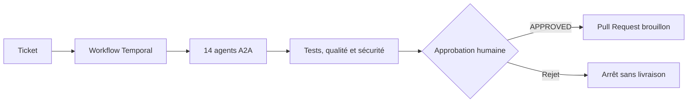
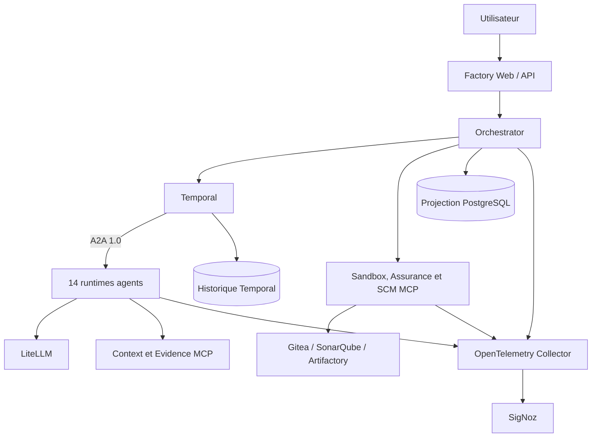
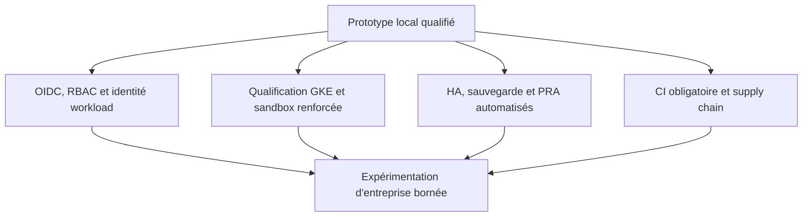

# AI Factory — synthèse exécutive

| Élément | Référence |
|---|---|
| Public | Direction, Produit, Architecture, Engineering, Sécurité et Exploitation |
| Branche | `features/multiagents` |
| État revu | 7 septembre 2026 |
| Périmètre livré | Docker Compose local, du ticket à la Pull Request brouillon |
| Cible suivante | Qualification de la même architecture sur GKE |

> **Message clé.** Temporal et A2A ne sont plus des capacités préparatoires. Temporal est l'unique moteur de
> workflow et les quatorze rôles sont invoqués exclusivement par A2A 1.0. La plateforme reste un prototype local :
> sa généralisation exige encore identité d'entreprise, CI obligatoire, haute disponibilité et qualification GKE.

## Valeur démontrée

L'usine transforme un ticket structuré en proposition de changement testée, analysée et soumise à une décision
humaine avant toute écriture SCM.

Le prototype démontre :

- une reprise durable par Temporal et une projection PostgreSQL utilisée par l'API ;
- une spécialisation en quatorze rôles isolés, avec Agent Cards signées et task queues dédiées ;
- des frontières MCP distinctes pour le contexte, la sandbox, l'assurance, les preuves et le SCM ;
- une sandbox Compose locale sans montage de `/var/run/docker.sock` ;
- une chaîne OpenTelemetry vers SigNoz pour métriques, traces et logs ;
- une approbation humaine obligatoire avant la branche, le commit, le push et la PR.

L'usine ne fusionne pas la PR et ne déploie pas l'application produite.

## Architecture active

Les agents ne s'appellent pas directement. Ils retournent des résultats ou intentions au workflow ; Temporal
conserve l'ordre global, les retries, timers, annulations et décisions. A2A transporte les messages et références
d'artefacts, MCP donne accès aux outils, Evidence conserve les contenus volumineux.

## Maturité actuelle

| Dimension | État | Lecture |
|---|---|---|
| Parcours ticket → PR | Actif | Gates déterministes et approbation humaine |
| Temporal | Actif et obligatoire | Sept files du plan de contrôle, sans moteur local de secours |
| Agents A2A | Actifs et obligatoires | Quatorze services et vingt-huit pollers workflow/activity |
| Persistance | Active | Historique Temporal, projection métier, projection A2A et Evidence |
| Sandbox locale | Active | Runners Compose statiques sans socket Docker |
| Observabilité | Active localement | OpenTelemetry Collector, SigNoz, dashboards et alertes |
| Sécurité d'entreprise | Incomplète | Pas encore de SSO/RBAC, Secret Manager ni multi-tenant |
| Déploiement GKE | Préparé | Manifests présents ; validation sur cluster réel à réaliser |
| Haute disponibilité/PRA | Non qualifié | Le Compose local reste mono-hôte |

## Risques résiduels prioritaires

Les principaux écarts avant usage partagé sont :

- authentification humaine et autorisation fine absentes ;
- secrets encore stockés dans des fichiers locaux ;
- déploiement mono-hôte sans haute disponibilité ;
- sandbox GKE et Workload Identity non validées sur un cluster réel ;
- CI et contrôles supply-chain non imposés par une plateforme distante ;
- coûts, qualité et gains de productivité à confirmer sur un corpus représentatif.

## Décision recommandée

Conserver l'architecture Temporal/A2A actuelle comme baseline unique et financer une expérimentation bornée sur GKE.
La promotion doit dépendre de preuves mesurées : absence de violation de sécurité, reprise démontrée, qualité des
patchs, coût par tâche, stabilité des task queues et rollback testé.

Il n'existe plus de trajectoire de retour vers des agents en mémoire. Un rollback redéploie une release antérieure
déjà compatible A2A et conserve Temporal comme autorité.

## Références

- [État courant détaillé](current-state.md)
- [Architecture](architecture-overview.md)
- [Architecture A2A](../architecture/a2a/README.md)
- [Exploitation locale macOS](../development/a2a-macos.md)
- [Guide de maintenance](../operations/maintenance.md)
- [Plan A2A/Temporal réalisé](../delivery/migrations/migration-agents-a2a-temporal.md)
