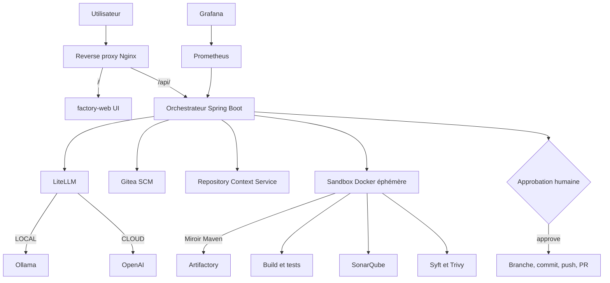
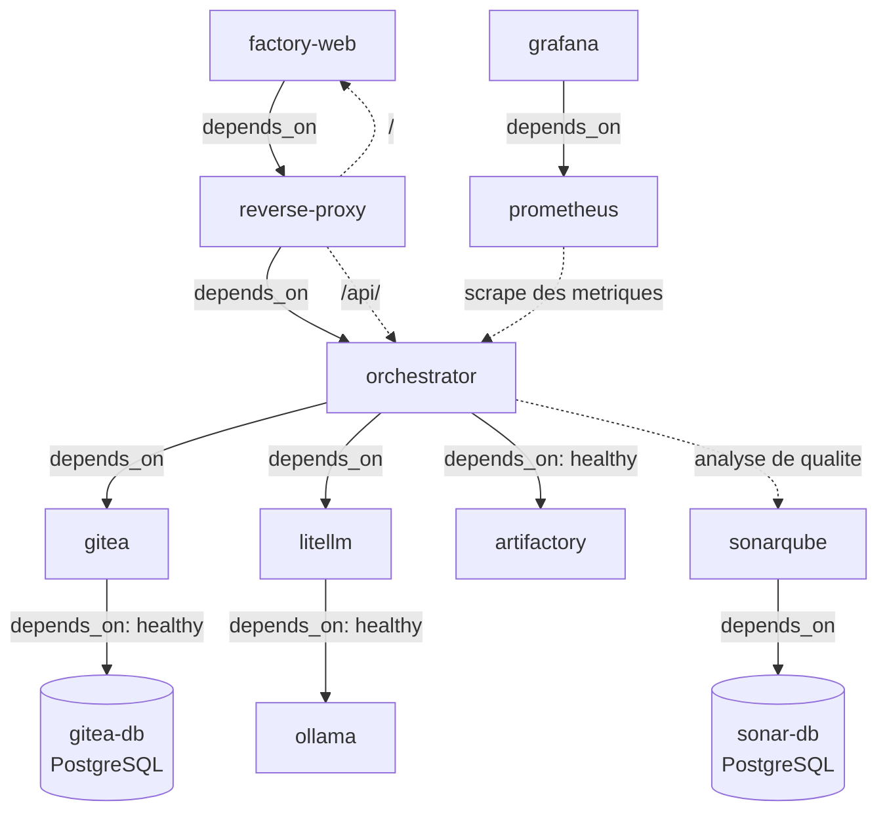
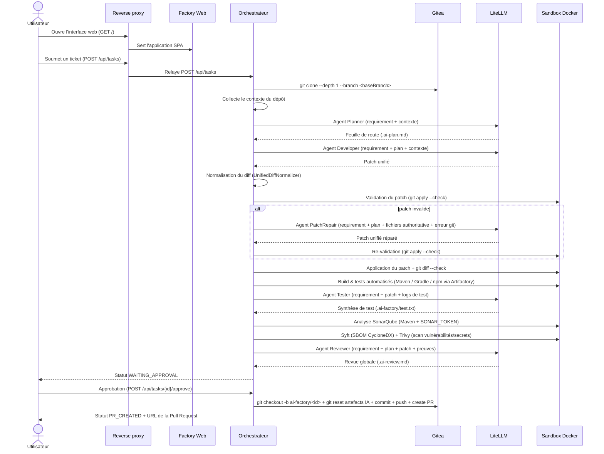

# Architecture du prototype

## Positionnement

Le dépôt implémente un prototype local centré sur quatre idées :

- un point d'entrée HTTP unique pour la demande de changement (`reverse-proxy`) ;
- une génération de patch par rôles LLM distincts (`Planner`, `Developer`, `PatchRepair`, `Tester`, `Reviewer`) ;
- une exécution isolée en sandbox Docker éphémère avec contrôles déterministes (tests, SonarQube, Syft, Trivy) ;
- une validation humaine obligatoire avant toute création de pull request sur Gitea.

L'architecture n'est pas une plateforme d'entreprise complète. Elle reproduit surtout les mécanismes de contrôle, d'isolation et d'orchestration agentique.

## Architecture logique



## Services Docker Compose

| Service | Rôle |
|---|---|
| `gitea-db` | Base PostgreSQL 16 de Gitea |
| `gitea` | Gestionnaire de dépôts Git, API REST, branches et Pull Requests (v1.23) |
| `ollama` | Moteur d'exécution local du modèle LLM (`qwen2.5-coder:7b`) |
| `litellm` | Passerelle OpenAI-compatible, alias de modèles et routage local/cloud |
| `orchestrator` | Moteur principal du workflow (Spring Boot 3.5 / Java 21) |
| `factory-web` | Interface utilisateur SPA HTML/JS/CSS, servie par Nginx |
| `reverse-proxy` | Point d'entrée HTTP unique (port 8080) : `/` vers `factory-web`, `/api/` vers `orchestrator` |
| `sonar-db` | Base PostgreSQL 16 de SonarQube |
| `sonarqube` | Analyse de la qualité de code pour les projets Maven (`SONAR_TOKEN`) |
| `artifactory` | Miroir Maven (`maven-virtual`) utilisé par le build dans la sandbox |
| `prometheus` | Collecte des métriques Micrometer (`/actuator/prometheus`) |
| `grafana` | Visualisation des métriques système et métier des tâches (port 3001) |

## Architecture de conteneurs

Tous les services sont reliés au réseau Docker `ai-factory-network`. Le reverse proxy est le point d'accès frontal.



Le sandbox n'est pas un service permanent dans Compose : l'orchestrateur instancie un conteneur éphémère `ai-factory-sandbox:local` à la demande via le socket `/var/run/docker.sock`. Ce conteneur réutilise le volume nommé `factory-workspace` pour accéder aux fichiers du dépôt et le volume `ai-factory-m2` pour le cache de dépendances Maven.

## Flux réel d'une tâche



## Pipeline détaillé

### 1. Saisie et enregistrement

- `factory-web` construit un besoin structuré à partir du formulaire de ticket (résumé, objectif métier, périmètre, comportement attendu, critères d'acceptation).
- `POST /api/tasks` crée une tâche en mémoire avec une référence ticket de type `AF-%04d` (ex: `AF-0001`) et lance le pipeline asynchrone.
- Par défaut, `baseBranch` vaut `main` et `llmMode` vaut `LOCAL`.

### 2. Contextualisation

- L'orchestrateur clone le dépôt dans `/workspace/tasks/<taskId>`.
- Le volume Docker `factory-workspace` partage ce dossier avec la sandbox.
- `RepositoryContextService` extrait l'arborescence, les fichiers de configuration de build (`pom.xml`, `build.gradle`, `package.json`) et le contenu des sources.

### 3. Génération du patch

- L'agent `Planner` analyse le besoin et produit `.ai-plan.md`.
- L'agent `Developer` génère un `unified diff` strict.
- `UnifiedDiffNormalizer` nettoie les fences Markdown et normalise les préfixes de chemins (`a/` et `b/`).

### 4. Validation et réparation du patch

- `SandboxService.checkPatch` valide le diff sans réseau via `git apply --check changes.patch`.
- En cas d'erreur de validation, le patch initial est conservé dans `changes.invalid.patch`.
- L'agent `PatchRepair` reçoit le besoin, le plan, les contenus réels des fichiers impactés et le message d'erreur `git apply`.
- Le diff réparé est re-validé. Si cette seconde validation échoue, la tâche passe en `FAILED`.

### 5. Exécution déterministe en sandbox

- Le diff est appliqué (`git apply changes.patch`).
- Contrôle de conformité (`git diff --check` et `git diff --stat`).
- Exécution automatique du build et des tests selon le dépôt :
  - Maven wrapper : `./mvnw -B -s /opt/ai-factory/maven-settings.xml test`
  - Maven système : `mvn -B -s /opt/ai-factory/maven-settings.xml test`
  - Gradle : `./gradlew test`
  - Node.js : `npm test -- --runInBand`
- L'agent `Tester` analyse les journaux bruts pour produire une synthèse d'évaluation.

### 6. Analyse de qualité SonarQube

- Pour les projets Maven, l'analyse qualimétrique est exécutée avec le plugin `sonar-maven-plugin:sonar`.
- L'analyse utilise `SONAR_TOKEN` et l'URL interne `http://sonarqube:9000`.
- Si `SONAR_TOKEN` n'est pas configuré, l'étape est marquée comme ignorée sans bloquer le pipeline.
- Les résultats sont enregistrés dans `.ai-factory/sonar.txt`.

### 7. SBOM et sécurité

- **Syft** : Génération d'un SBOM au format CycloneDX JSON (`.ai-factory/sbom.cdx.json`).
- **Trivy** : Scan de vulnérabilités et de secrets en mode filesystem sans mise à jour externe de la base (`.ai-factory/trivy.txt`).

### 8. Revue et livraison

- L'agent `Reviewer` synthétise le plan, le patch, la revue de test, le rapport SonarQube et le rapport Trivy dans `.ai-review.md`.
- La tâche bascule en `WAITING_APPROVAL`.
- L'utilisateur approuve la tâche via `POST /api/tasks/{id}/approve`.
- L'orchestrateur crée la branche `ai-factory/<taskId>`, exclut du commit les artefacts de travail IA (`.ai-plan.md`, `changes.patch`, `.ai-review.md`, `.ai-factory/`), committe, pousse les sources modifiées sur Gitea, puis ouvre une Pull Request via l'API REST de Gitea.

## API exposée

### `POST /api/tasks`

Crée une tâche et retourne `202 Accepted`.

Exemple de requête :
```json
{
  "repositoryUrl": "http://gitea:3000/aiadmin/customer-api.git",
  "baseBranch": "main",
  "requirement": "Add GET /customers/{id}. Return HTTP 404 when the customer does not exist. Add automated tests.",
  "llmMode": "LOCAL"
}
```

### `GET /api/tasks`

Liste les tâches gérées en mémoire par l'orchestrateur.

### `GET /api/tasks/{id}`

Retourne l'état complet d'une tâche (`TaskView`) :

```json
{
  "id": "a1b2c3d4",
  "ticketNumber": "AF-0001",
  "status": "WAITING_APPROVAL",
  "repositoryUrl": "http://gitea:3000/aiadmin/customer-api.git",
  "baseBranch": "main",
  "requirement": "Add GET /customers/{id}...",
  "llmMode": "LOCAL",
  "workspace": "/workspace/tasks/a1b2c3d4",
  "plan": "...",
  "patch": "...",
  "testSummary": "...",
  "qualitySummary": "...",
  "securitySummary": "...",
  "review": "...",
  "pullRequestUrl": null,
  "error": null,
  "steps": [
    { "step": "CLONING", "status": "OK", "summary": "Cloning repository", "timestamp": "2026-08-26T10:00:00Z" }
  ],
  "createdAt": "2026-08-26T10:00:00Z",
  "updatedAt": "2026-08-26T10:03:00Z"
}
```

### `POST /api/tasks/{id}/approve`

Approuve une tâche en attente et déclenche la livraison vers Gitea (`202 Accepted`).

### `GET /api/capabilities`

Retourne les fonctionnalités système activées (ex: mode cloud disponible) :
```json
{
  "cloudEnabled": false
}
```

## Métriques et observabilité

- L'orchestrateur expose un endpoint Prometheus sur `/actuator/prometheus` (sur le port interne 8080).
- Compteurs Micrometer enregistrés :
  - `ai_factory_tasks_submitted`
  - `ai_factory_tasks_completed`
  - `ai_factory_tasks_failed`
- Grafana propose un tableau de bord pré-configuré (`orchestrator.json`).

## Données et persistance

- L'état des tâches est conservé en mémoire dans l'orchestrateur.
- Un redémarrage réinitialise l'historique API.
- Les conteneurs Gitea, PostgreSQL, SonarQube, Artifactory, Ollama et Grafana disposent de volumes Docker persistants.
- Les espaces de travail sous `/workspace/tasks` restent présents sur le volume `factory-workspace`.

## Écarts avec une cible industrielle

- Pas de scheduler distribué ni de file de messages (type RabbitMQ / Kafka) ;
- Pas de persistance des tâches dans une base de données de contrôle ;
- Accès au socket Docker (`/var/run/docker.sock`) par l'orchestrateur ;
- Absence de RBAC / SSO centralisé pour l'API de l'orchestrateur.
