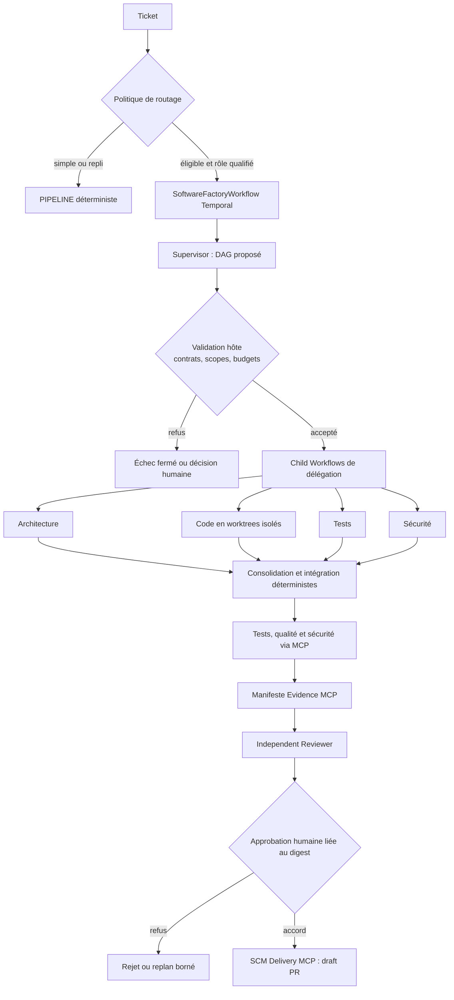
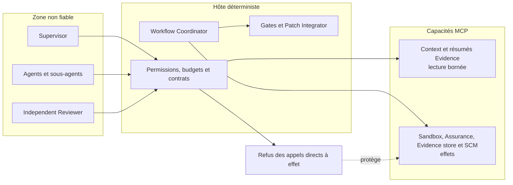

# État du prototype 1.2.0 — architecture 04

## Statut

Le prototype implémente les briques de l'architecture multi-agent hiérarchique gouvernée : workflow durable,
DAG de délégations, catalogue de rôles, contrats fermés, mémoire de tâche, preuves immuables, permissions,
budgets, intégration déterministe et revue indépendante.

Cette disponibilité technique ne vaut pas autorisation de généralisation. `PIPELINE` demeure la baseline et le
chemin de rollback. L'activation de `HIERARCHICAL_CANARY` puis `HIERARCHICAL_ACTIVE` reste conditionnée à une
campagne comparative complète, aux approbations Produit, Architecture, Sécurité et Exploitation, puis à un
canary observé sur l'environnement cible.

## Composants et responsabilités

| Couche | Composants | Responsabilité |
|---|---|---|
| Expérience | Factory Web, API REST | Soumission, suivi du DAG, preuves, contradictions et décisions |
| Control plane | Spring Boot, `WorkflowCoordinator`, Temporal | Cycle de vie, politiques, effets, retries, signaux et reprise |
| Coordination | Supervisor, `DelegationScheduler` | Décomposition et consolidation sous validation de l'hôte |
| Spécialistes | Architecture, Code, Tests, Sécurité | Propositions bornées et résultats contractuels sans effet direct |
| Revue | Independent Reviewer | Avis indépendant lancé par le workflow racine |
| État | Temporal, Task Memory PostgreSQL, Evidence MCP | Historique durable, projection et artefacts vérifiables |
| Capacités | Context, Sandbox, Assurance, Evidence et SCM MCP | Outils typés, politiques deny-by-default et idempotence |
| Exécution | Docker local, cible GKE Jobs | Worktrees isolés, tests, qualité, SBOM et scans |
| Observabilité | OpenTelemetry, Prometheus, Grafana | Traces parent/enfant, budgets, SLO, audit et alertes |

## Workflow cible implémenté

## Frontières d'autorité

Les sorties de modèle, le ticket, le dépôt et les résultats externes sont traités comme non fiables. Une sortie
n'est utilisable qu'après validation de son contrat, de son contexte (`task_id`, `run_id`, commit, rôle, scope)
et de ses références de preuve. Seul le workflow porte l'identité autorisée pour les actions à effet.

## Modes d'exécution

| Mode | Usage | Autorité du résultat hiérarchique |
|---|---|---|
| `PIPELINE` | Baseline et rollback | Autorité opérationnelle |
| `HIERARCHICAL_SHADOW` | Mesure comparative | Observation seulement |
| `HIERARCHICAL_CANARY` | Sous-ensemble explicitement autorisé | Limitée par politique et kill switch |
| `HIERARCHICAL_ACTIVE` | Cible après qualification | Autorité contrôlée, gates inchangés |

## État de la bascule

Les lots de construction, de sécurité, d'observabilité et de tests sont majoritairement réalisés et suivis dans
le [plan de bascule](BASCULE-ARCHI-04-MULTI-AGENTS.md). Restent notamment des preuves externes non simulables :

- campagne cloud réelle et télémétrie fournisseur complète ;
- validation formelle des responsables ;
- arrêt et reprise de toute la stack aux phases critiques ;
- canary, fenêtres d'observation, rollback et généralisation en environnement cible.

Le détail des agents, sous-agents, MCP et outils figure dans
[l'architecture cible](cible-architecture-multi-agent-hierarchique.md). Les invariants de sécurité restent ceux
de la baseline : gates déterministes, preuve liée au digest, approbation humaine et livraison par le workflow.
