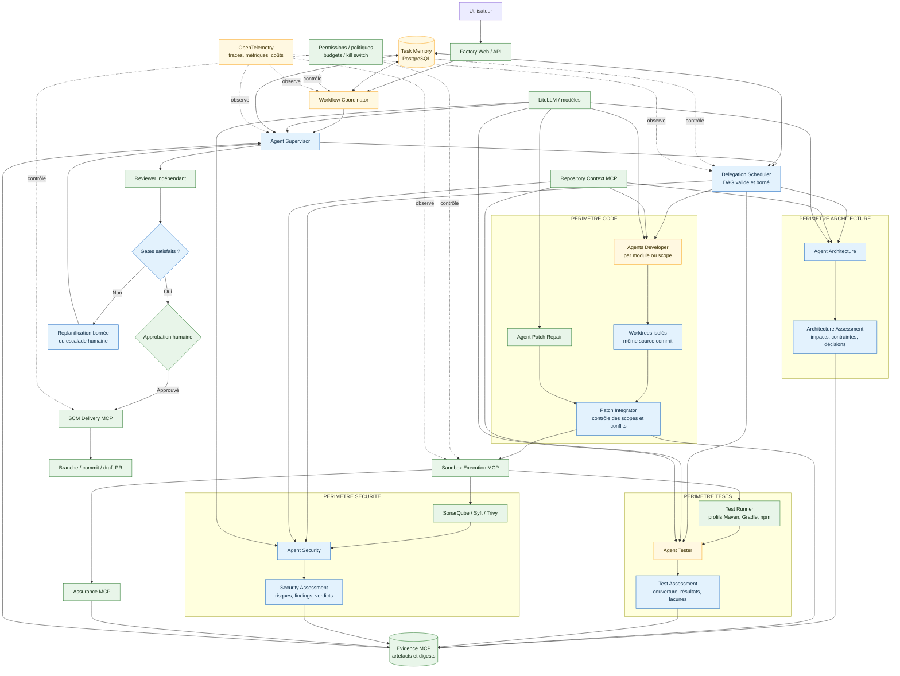
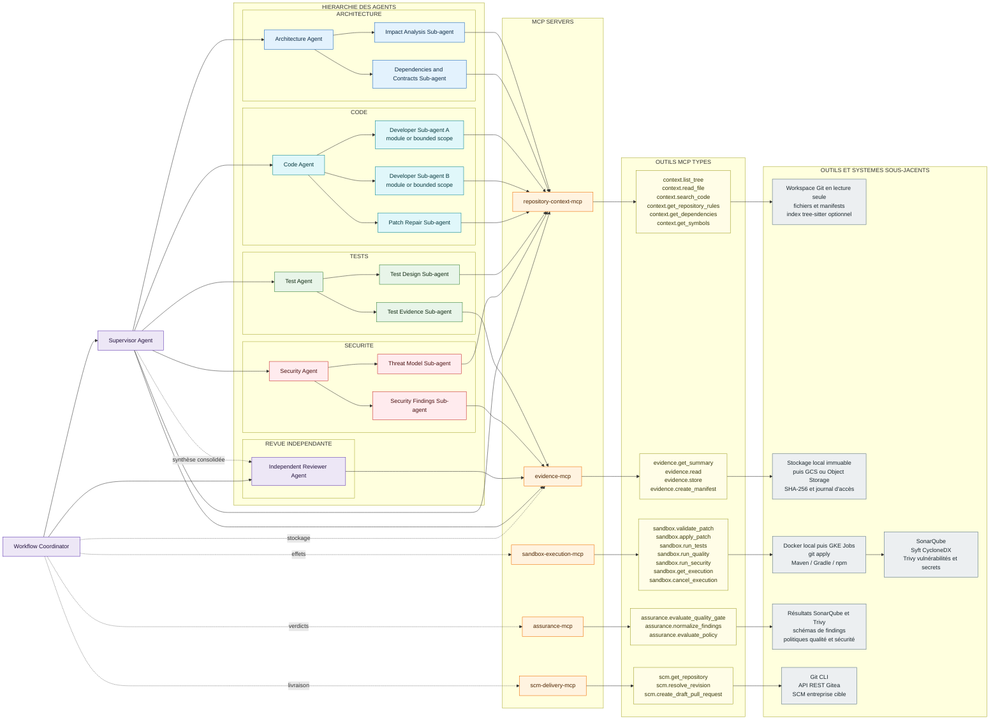

# Architecture cible multi-agent hiérarchique

> Statut : architecture cible et capacités disponibles, non description du chemin actif. Dans Compose, les agents
> restent des rôles internes au conteneur `orchestrator`; Temporal et le mode hiérarchique sont désactivés par
> défaut. Voir la [rétrodocumentation](../RETRODOCUMENTATION.md) pour l'état d'intégration courant.

## Objet

Cette cible fait évoluer le prototype d'un pipeline IA séquentiel vers une architecture **multi-agent
hiérarchique gouvernée**. Un agent superviseur décompose le besoin, délègue des sous-tâches spécialisées et
consolide leurs résultats. Le workflow déterministe conserve la maîtrise des actions à effet, des budgets, des
portes de qualité et de l'approbation humaine.

Les quatre périmètres spécialisés sont :

- **Architecture** : analyse d'impact, contraintes, dépendances et stratégie de changement ;
- **Code** : production et intégration de propositions de patch ;
- **Tests** : conception des tests et analyse des preuves d'exécution ;
- **Sécurité** : analyse de risques, SBOM, vulnérabilités, secrets et conformité aux politiques.

## Vue d'ensemble

**Légende de conception :** vert = composant ou capacité déjà présent ; orange = composant existant à faire
évoluer ; bleu = composant logique introduit par l'architecture 04. Cette couleur n'indique pas qu'un composant est
actif dans le parcours public. Les agents restent des rôles exécutés par l'orchestrateur via LiteLLM : ils ne
doivent pas nécessairement devenir des microservices.

## Hiérarchie des agents, serveurs MCP et outils sous-jacents

Le diagramme suivant détaille la chaîne complète entre agents, outils MCP typés et backends techniques. Les
liens pleins depuis les agents représentent uniquement des lectures autorisées par l'hôte. Les actions à effet,
représentées en pointillés, restent déclenchées exclusivement par le `WorkflowCoordinator`.

### Matrice agents, MCP et backends

| Agent ou acteur | Serveurs MCP utilisés | Outils MCP principaux | Outils ou systèmes sous-jacents |
|---|---|---|---|
| Supervisor | Repository Context, Evidence | `context.list_tree`, `context.search_code`, `context.get_repository_rules`, `evidence.get_summary` | Workspace Git borné et métadonnées de preuves. |
| Architecture et sous-agents | Repository Context | `context.list_tree`, `context.read_file`, `context.search_code`, `context.get_repository_rules`, `context.get_dependencies`, `context.get_symbols` | Fichiers source, manifests Maven/Gradle/npm et index tree-sitter optionnel. |
| Code et sous-agents Developer | Repository Context | Outils `context.*` autorisés au scope attribué | Workspace Git en lecture seule ; le patch est un résultat d'agent, pas une écriture directe. |
| Patch Repair | Repository Context | `context.read_file`, `context.get_symbols` | Fichiers réellement concernés par le diff invalide. |
| Tests - conception | Repository Context | `context.search_code`, `context.read_file`, `context.get_dependencies`, `context.get_symbols` | Sources, tests existants et manifests de build. |
| Tests - analyse des preuves | Evidence | `evidence.get_summary` ; extraits bornés transmis par le workflow | Rapports Maven, Gradle ou npm produits par la sandbox. |
| Sécurité - threat model | Repository Context | `context.search_code`, `context.read_file`, `context.get_dependencies`, `context.get_symbols` | Sources, règles du dépôt et dépendances déclarées. |
| Sécurité - analyse des findings | Evidence | `evidence.get_summary` ; findings normalisés transmis par le workflow | Rapports SonarQube, SBOM CycloneDX et résultats Trivy. |
| Reviewer indépendant | Repository Context, Evidence | Outils `context.*`, `evidence.get_summary`, `evidence.read` | Patch consolidé, contexte ciblé et preuves finales auditées. |
| WorkflowCoordinator | Tous les serveurs | `sandbox.*`, `assurance.*`, `evidence.store`, `evidence.create_manifest`, `scm.*` | Docker/GKE, Git, Maven/Gradle/npm, SonarQube, Syft, Trivy, stockage de preuves et Gitea. |

`context.get_symbols` demeure optionnel et dépend de l'activation de l'index tree-sitter. Les permissions des
nouveaux rôles Supervisor, Architecture et Security décrites ici appartiennent à la cible : elles devront être
ajoutées à la matrice deny-by-default et qualifiées avant activation.

## Composants de coordination et services partagés

| Composant | Statut cible | Responsabilité |
|---|---|---|
| `WorkflowCoordinator` | Port actif ; implémentation Temporal disponible | Porte l'état global, valide les transitions et reste le seul acteur autorisé à déclencher des effets. |
| `SupervisorAgent` | Implémenté, non activé par défaut | Décompose le besoin, sélectionne les spécialistes, consolide leurs résultats et propose une décision. |
| `DelegationScheduler` | Implémenté, non activé par défaut | Valide et exécute le DAG, respecte dépendances, concurrence, priorités, budgets et conditions d'arrêt. |
| `TaskMemory` | Adaptateur mémoire actif ; projection PostgreSQL cible | Persiste à terme tâches, délégations, exécutions d'agents, décisions, consommations et références d'artefacts. |
| `Repository Context MCP` | Existant | Fournit à chaque rôle un contexte minimal, borné, en lecture seule et lié au commit source. |
| `Evidence MCP` | Existant ; intégration pipeline partielle | Conserve les artefacts vérifiables, leurs métadonnées, leur digest et leur classification. |
| `Sandbox Execution MCP` | Existant | Applique les patches et exécute les profils techniques autorisés dans un environnement isolé. |
| `Assurance MCP` | Existant | Convertit les résultats déterministes en verdicts structurés ; une preuve absente reste bloquante. |
| `SCM Delivery MCP` | Existant | Crée branche, commit et draft PR uniquement après politiques, preuves et approbation humaine. |
| `Policy Enforcement` | Existant à étendre | Applique permissions par rôle, scopes, quotas, budgets, approbations et kill switch. |
| `Observability` | Corrélation/métriques présentes ; OTLP à ajouter | Corrèle tâche, délégation, agent, appel d'outil, artefact, tokens, coût, latence et décision. |

## Périmètre Architecture

### Composants

- `ArchitectureAgent` ;
- contrat `architecture-assessment-v1` ;
- accès en lecture à `Repository Context MCP` ;
- publication des conclusions dans `TaskMemory` et `Evidence MCP`.

### Responsabilités

- identifier les modules, couches et domaines impactés ;
- relever les règles du dépôt et les dépendances structurantes ;
- qualifier les impacts API, données, compatibilité et exploitation ;
- proposer une découpe en scopes de code indépendants ;
- expliciter les décisions humaines et les risques d'architecture ;
- produire les contraintes que les agents Code, Tests et Sécurité devront respecter.

### Hors périmètre

L'agent Architecture ne produit pas de patch, ne modifie pas le dépôt et ne peut pas valider une gate à la
place d'une preuve déterministe.

## Périmètre Code

### Composants

- un ou plusieurs `DeveloperAgent`, sélectionnés par module ou scope ;
- `PatchRepairAgent` pour une réparation bornée ;
- worktrees ou snapshots isolés par délégation ;
- `PatchIntegrator` déterministe ;
- contrats `code-task-v1`, `patch-proposal-v1` et `integration-result-v1`.

### Responsabilités

- produire des patches minimaux conformes au besoin et aux contraintes Architecture ;
- ajouter ou adapter les tests directement associés au comportement modifié ;
- respecter le scope de fichiers attribué par le superviseur ;
- attacher chaque proposition au commit source immuable ;
- détecter les recouvrements de fichiers avant toute exécution parallèle ;
- intégrer les patches dans l'ordre du DAG et refuser les conflits silencieux.

### Règles de parallélisme

Deux agents Code ne travaillent en parallèle que si leurs scopes sont disjoints. Chaque agent utilise un
worktree isolé. Le `PatchIntegrator`, et non un agent, contrôle l'application des patches dans le workspace
d'intégration. Un conflit déclenche une réparation ciblée, une replanification bornée ou une escalade humaine.

## Périmètre Tests

### Composants

- `TesterAgent` ;
- profils de test de `Sandbox Execution MCP` ;
- runners Maven, Gradle et npm ;
- contrats `test-strategy-v1`, `test-result-v1` et `test-assessment-v1`.

### Responsabilités

- dériver une stratégie de test depuis le besoin, le plan et les changements proposés ;
- vérifier la couverture des critères d'acceptation et des chemins d'erreur ;
- demander uniquement des profils de tests allow-listés au workflow ;
- analyser les sorties déterministes sans déclarer de succès sans preuve ;
- distinguer échec, non-exécution, non-applicabilité et résultat indéterminé ;
- publier lacunes de couverture, résultats et preuves associées.

### Hors périmètre

L'agent Tester ne peut ni fabriquer un résultat, ni ignorer un test en échec, ni contourner les timeouts ou les
limites de la sandbox.

## Périmètre Sécurité

### Composants

- `SecurityAgent` ;
- SonarQube, Syft et Trivy exécutés par les profils de sandbox ;
- `Assurance MCP` pour les verdicts structurés ;
- politiques de permissions et d'acceptation du risque ;
- contrats `security-assessment-v1`, `finding-v1` et `policy-decision-v1`.

### Responsabilités

- établir un threat model ciblé sur le changement ;
- analyser les modifications relatives aux secrets, données personnelles, authentification, autorisation,
  entrées non fiables et dépendances ;
- rapprocher les findings statiques, le SBOM et les vulnérabilités du périmètre modifié ;
- qualifier sévérité, exploitabilité, preuve et correction recommandée ;
- signaler les risques nécessitant une approbation ou une expertise humaine ;
- conserver une séparation entre analyse IA et verdict de politique déterministe.

### Hors périmètre

L'agent Security ne peut pas déclasser un finding, accepter un risque ou remplacer un scan manquant sans règle
explicite et traçable. Un échec de gate Sécurité ne peut pas être annulé par le superviseur.

## Contrats d'échange minimaux

Chaque délégation devrait contenir au minimum :

| Champ | Usage |
|---|---|
| `task_id`, `run_id`, `delegation_id`, `parent_run_id` | Corrélation hiérarchique. |
| `role`, `objective`, `scope` | Identité hôte, mission et périmètre autorisé. |
| `source_commit`, `context_refs` | Référentiel immuable et contexte minimal. |
| `dependencies` | Prérequis dans le DAG. |
| `expected_output_schema` | Contrat de résultat obligatoire. |
| `success_criteria`, `required_evidence` | Conditions de terminaison vérifiables. |
| `budget` | Tours, appels d'outils, tokens, coût et durée. |
| `risk_level`, `human_decisions` | Gouvernance et escalade. |

Les agents échangent uniquement par ces contrats et par des références d'artefacts. Une conversation libre
agent-à-agent n'est pas une source d'autorité et n'est pas utilisée comme mémoire de tâche.

## Séquence cible

1. Le `WorkflowCoordinator` enregistre la tâche et fige le commit source.
2. Le `SupervisorAgent` produit un DAG de délégations.
3. L'hôte valide rôles, scopes, dépendances, budget, profondeur et concurrence.
4. Les analyses Architecture, Tests et Sécurité en lecture seule peuvent être parallélisées.
5. Le superviseur consolide leurs contraintes et déclenche les délégations Code nécessaires.
6. Les propositions de patch sont produites dans des worktrees isolés puis intégrées déterministiquement.
7. Le workflow exécute validation du patch, tests, qualité, SBOM et scans de sécurité.
8. Les agents Tester et Security analysent les preuves ; le superviseur consolide les résultats.
9. Toute contradiction déclenche une correction ciblée, un replan borné ou une escalade humaine.
10. Un Reviewer indépendant effectue la revue finale.
11. L'approbation humaine reste obligatoire avant la création de la draft PR.

## Invariants de sécurité et de gouvernance

- le rôle `workflow` reste le seul autorisé à déclencher une action à effet ;
- le superviseur ne peut déléguer qu'à un rôle présent dans le catalogue allow-listé ;
- aucun agent ne reçoit de shell générique, secret, socket Docker ou jeton SCM ;
- chaque délégation est limitée en profondeur, fan-out, durée, tokens, coût et appels d'outils ;
- un agent ne peut pas augmenter son propre budget ou élargir son scope ;
- une preuve déterministe prime toujours sur une conclusion de modèle ;
- les gates qualité et sécurité échouent fermés ;
- les prompts, modèles, contrats, politiques et artefacts sont versionnés et traçables ;
- l'annulation d'une tâche se propage à toutes ses délégations actives ;
- l'approbation humaine porte sur le patch consolidé et les preuves finales, jamais sur une version intermédiaire.

## Trajectoire de mise en oeuvre

1. **Shadow** : produire le DAG et les analyses spécialisées sans modifier les décisions du pipeline actuel.
2. **Délégation en lecture seule** : permettre au superviseur de choisir Architecture, Tests et Sécurité, sous
   budgets et permissions.
3. **Consolidation active** : utiliser leurs sorties structurées pour préparer le plan et la revue finale.
4. **Code parallèle borné** : autoriser plusieurs agents Developer uniquement sur des scopes disjoints.
5. **Qualification** : comparer qualité, succès des tests, coût, latence et sécurité à la baseline avant
   activation générale.

Pour les demandes simples et mono-domaine, le superviseur peut sélectionner un chemin court avec un seul agent
Code. L'architecture reste hiérarchique sans multiplier systématiquement coût et latence.
