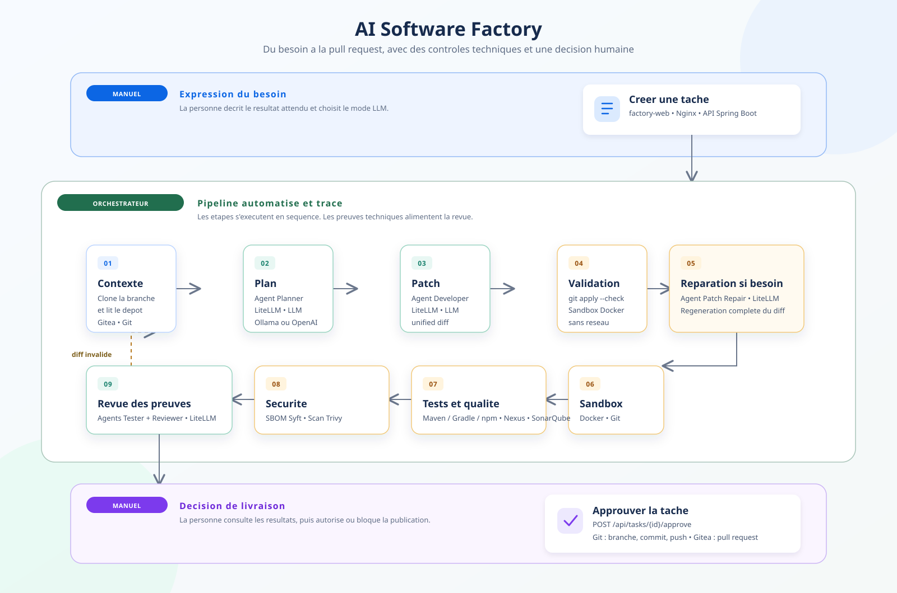

# Fonctionnement de l'usine logicielle

Le pipeline transforme un besoin en pull request, avec des controles
deterministes et une approbation humaine avant toute publication.

| Etape | Objectif | Outils utilises |
|---|---|---|
| 1. Besoin | Saisir le ticket et le mode LLM | `factory-web` |
| 2. Tache | Exposer l'API et lancer le workflow | Nginx, Spring Boot |
| 3. Contexte | Cloner le depot cible et en extraire le contexte | Gitea, Git, orchestrateur |
| 4. Plan | Definir les modifications a effectuer | Agent Planner, LiteLLM, Ollama ou OpenAI |
| 5. Patch | Produire un `unified diff` | Agent Developer, LiteLLM, Ollama ou OpenAI |
| 6. Validation | Verifier que le diff est applicable | `git apply --check`, sandbox Docker sans reseau |
| Reparation | Regenerer un diff complet si necessaire | Agent Patch Repair, LiteLLM |
| 7. Sandbox | Appliquer le patch dans un environnement temporaire | Docker, Git |
| 8. Tests et qualite | Executer les tests et l'analyse de qualite | Maven, Gradle ou npm, Nexus, SonarQube |
| 9. Securite | Produire le SBOM et rechercher vulnerabilites et secrets | Syft, Trivy |
| 10. Revue | Interpreter les preuves techniques | Agents Tester et Reviewer, LiteLLM, Ollama ou OpenAI |
| 11. Decision | Autoriser explicitement la livraison | API Spring Boot, intervention humaine |
| 12. Livraison | Creer la branche, le commit, le push et la PR | Git, Gitea |

Le modele est joignable localement avec Ollama ou, si active, dans le cloud via
OpenAI. LiteLLM reste le point de passage unique des appels de modeles.
